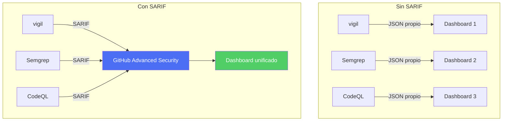
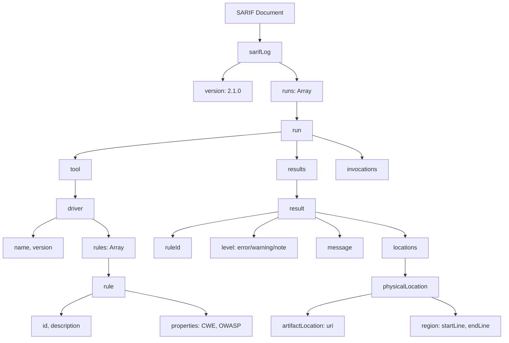
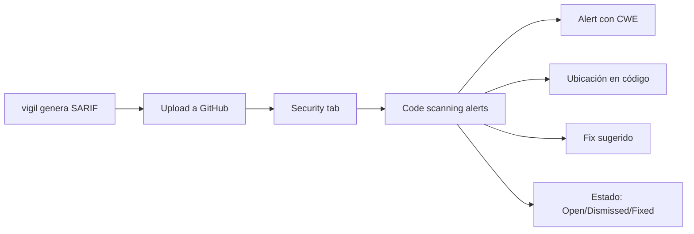

# SARIF 2.1.0: Formato Estándar de Resultados de Análisis Estático

> [!abstract] Resumen
> *SARIF* (*Static Analysis Results Interchange Format*) versión 2.1.0 es el ==estándar OASIS para representar resultados de herramientas de análisis estático== en formato JSON. [[vigil-overview|vigil]] produce output SARIF con mapeos CWE y OWASP, integrándose con ==GitHub Advanced Security, VS Code SARIF Viewer y pipelines CI/CD==. Este documento detalla la estructura del schema, cómo vigil genera SARIF, y cómo agregar resultados de múltiples herramientas.
> ^resumen

---

## ¿Qué es SARIF?

### Definición

*SARIF* es un formato JSON estandarizado por OASIS[^1] para ==intercambiar resultados de análisis estático entre herramientas, plataformas y sistemas==. Permite que los resultados de vigil, Semgrep, CodeQL y otras herramientas se integren en un formato unificado.

> [!info] ¿Por qué un estándar?
> Antes de SARIF, cada herramienta tenía su propio formato de output. Esto hacía difícil:
> - Comparar resultados entre herramientas
> - Agregar resultados en un dashboard unificado
> - Integrar múltiples herramientas en CI/CD
> - Rastrear la evolución de hallazgos



---

## Estructura del schema SARIF 2.1.0

### Anatomía de un documento SARIF



### Elementos principales

| Elemento | Descripción | Obligatorio |
|----------|-------------|-------------|
| `$schema` | URL del JSON Schema | ==Sí== |
| `version` | Siempre "2.1.0" | ==Sí== |
| `runs` | Array de ejecuciones de herramientas | ==Sí== |
| `runs[].tool` | Información de la herramienta | ==Sí== |
| `runs[].tool.driver` | Herramienta principal | ==Sí== |
| `runs[].tool.driver.rules` | Reglas definidas | ==Sí== |
| `runs[].results` | Hallazgos | ==Sí== |
| `runs[].invocations` | Metadata de ejecución | No |
| `runs[].artifacts` | Archivos analizados | No |

---

## Output SARIF de vigil

### Ejemplo completo

> [!example]- Output SARIF completo de vigil
> ```json
> {
>   "$schema": "https://raw.githubusercontent.com/oasis-tcs/sarif-spec/main/sarif-2.1/schema/sarif-schema-2.1.0.json",
>   "version": "2.1.0",
>   "runs": [
>     {
>       "tool": {
>         "driver": {
>           "name": "vigil",
>           "version": "1.0.0",
>           "semanticVersion": "1.0.0",
>           "informationUri": "https://github.com/org/vigil",
>           "rules": [
>             {
>               "id": "VIGIL-SEC-001",
>               "name": "hardcoded_api_key",
>               "shortDescription": {
>                 "text": "Hardcoded API key detected"
>               },
>               "fullDescription": {
>                 "text": "An API key with a known provider prefix was found hardcoded in the source code. This exposes the credential to anyone with access to the repository."
>               },
>               "helpUri": "https://vigil.dev/rules/VIGIL-SEC-001",
>               "properties": {
>                 "tags": ["security", "secrets", "CWE-798"],
>                 "cwe": "CWE-798",
>                 "owasp": "LLM06",
>                 "severity": "critical"
>               }
>             },
>             {
>               "id": "VIGIL-AUTH-001",
>               "name": "cors_wildcard",
>               "shortDescription": {
>                 "text": "CORS wildcard origin detected"
>               },
>               "fullDescription": {
>                 "text": "Access-Control-Allow-Origin is set to '*', allowing any website to access API responses."
>               },
>               "properties": {
>                 "tags": ["security", "cors", "CWE-942"],
>                 "cwe": "CWE-942",
>                 "owasp": "A05:2021",
>                 "severity": "high"
>               }
>             },
>             {
>               "id": "VIGIL-DEP-001",
>               "name": "slopsquatting_detection",
>               "shortDescription": {
>                 "text": "Package not found in official registry"
>               },
>               "properties": {
>                 "tags": ["security", "supply-chain", "CWE-1357"],
>                 "cwe": "CWE-1357",
>                 "owasp": "LLM05",
>                 "severity": "critical"
>               }
>             }
>           ]
>         }
>       },
>       "results": [
>         {
>           "ruleId": "VIGIL-SEC-001",
>           "ruleIndex": 0,
>           "level": "error",
>           "message": {
>             "text": "Hardcoded OpenAI API key detected: 'sk-proj-...'"
>           },
>           "locations": [
>             {
>               "physicalLocation": {
>                 "artifactLocation": {
>                   "uri": "src/config.py",
>                   "uriBaseId": "%SRCROOT%"
>                 },
>                 "region": {
>                   "startLine": 15,
>                   "startColumn": 1,
>                   "endLine": 15,
>                   "endColumn": 45
>                 }
>               }
>             }
>           ],
>           "fixes": [
>             {
>               "description": {
>                 "text": "Replace hardcoded key with environment variable"
>               },
>               "artifactChanges": [
>                 {
>                   "artifactLocation": {
>                     "uri": "src/config.py"
>                   },
>                   "replacements": [
>                     {
>                       "deletedRegion": {
>                         "startLine": 15,
>                         "endLine": 15
>                       },
>                       "insertedContent": {
>                         "text": "OPENAI_API_KEY = os.environ.get('OPENAI_API_KEY')"
>                       }
>                     }
>                   ]
>                 }
>               ]
>             }
>           ]
>         }
>       ],
>       "invocations": [
>         {
>           "executionSuccessful": true,
>           "startTimeUtc": "2025-06-01T10:00:00Z",
>           "endTimeUtc": "2025-06-01T10:00:01Z"
>         }
>       ]
>     }
>   ]
> }
> ```

### Mapeo de severidades vigil a SARIF

| Severidad vigil | SARIF level | Significado |
|----------------|-------------|-------------|
| ==CRITICAL== | `error` | Debe corregirse antes de merge |
| ==HIGH== | `error` | Debe corregirse antes de merge |
| MEDIUM | `warning` | Debería corregirse |
| LOW | `note` | Informativo, buena práctica |

---

## Integración con GitHub Advanced Security

### Upload de SARIF a GitHub

> [!tip] Integración nativa con GitHub
> GitHub Advanced Security consume archivos SARIF y los muestra en la pestaña "Security" del repositorio, con tracking de hallazgos, estados, y tendencias.

> [!example]- GitHub Actions para upload de SARIF
> ```yaml
> name: vigil Security Scan
> on:
>   push:
>     branches: [main]
>   pull_request:
>
> jobs:
>   vigil-scan:
>     runs-on: ubuntu-latest
>     permissions:
>       security-events: write
>     steps:
>       - uses: actions/checkout@v4
>
>       - name: Run vigil
>         run: |
>           vigil scan \
>             --format sarif \
>             --output-file results.sarif \
>             src/
>
>       - name: Upload SARIF to GitHub
>         uses: github/codeql-action/upload-sarif@v3
>         if: always()
>         with:
>           sarif_file: results.sarif
>           category: vigil
>           wait-for-processing: true
> ```

### Visualización en GitHub



---

## VS Code SARIF Viewer

> [!info] Visualización local de resultados
> La extensión *SARIF Viewer* de VS Code permite visualizar archivos SARIF directamente en el editor, con:
> - Navegación a ubicación exacta del hallazgo
> - Vista de todas las reglas activadas
> - Filtrado por severidad y categoría
> - Integración con el explorador de archivos

---

## Agregación de resultados de múltiples herramientas

### El problema de la agregación

Cuando se usan múltiples herramientas (vigil + Semgrep + CodeQL), cada una produce su propio SARIF. La agregación permite una ==vista unificada de todos los hallazgos==.

> [!example]- Script de agregación SARIF
> ```python
> import json
> from pathlib import Path
>
> def merge_sarif_files(sarif_files: list[str], output: str):
>     """Merge múltiples archivos SARIF en uno solo."""
>     merged = {
>         "$schema": "https://raw.githubusercontent.com/oasis-tcs/sarif-spec/main/sarif-2.1/schema/sarif-schema-2.1.0.json",
>         "version": "2.1.0",
>         "runs": []
>     }
>
>     for sarif_file in sarif_files:
>         with open(sarif_file) as f:
>             data = json.load(f)
>             merged["runs"].extend(data.get("runs", []))
>
>     with open(output, "w") as f:
>         json.dump(merged, f, indent=2)
>
>     # Estadísticas
>     total_results = sum(
>         len(run.get("results", []))
>         for run in merged["runs"]
>     )
>     tools = [
>         run["tool"]["driver"]["name"]
>         for run in merged["runs"]
>     ]
>     print(f"Merged {len(sarif_files)} files from {tools}")
>     print(f"Total findings: {total_results}")
>
> # Uso
> merge_sarif_files(
>     ["vigil.sarif", "semgrep.sarif", "codeql.sarif"],
>     "merged-security.sarif"
> )
> ```

> [!warning] Deduplicación
> Diferentes herramientas pueden detectar el mismo hallazgo (ej: vigil y Semgrep ambos detectan CORS wildcard). La deduplicación requiere comparar:
> - Archivo y línea
> - CWE mapping
> - Tipo de hallazgo
> Para evitar ==falsos duplicados en dashboards==.

---

## Formatos adicionales de vigil

Además de SARIF, [[vigil-overview|vigil]] también produce:

### JUnit XML

> [!info] JUnit XML para CI/CD
> Compatible con Jenkins, GitLab CI, y otros sistemas que consumen JUnit reports.

### JSON nativo

> [!info] JSON para procesamiento programático
> Formato más ligero para scripting y integración custom.

| Formato | Uso principal | Herramientas compatibles |
|---------|-------------|------------------------|
| ==SARIF 2.1.0== | GitHub, VS Code, estándar | ==GitHub Advanced Security, VS Code, SARIF SDK== |
| JUnit XML | CI/CD test reports | Jenkins, GitLab CI, Azure DevOps |
| JSON nativo | Scripting, APIs | Cualquier procesador JSON |

---

## Relación con el ecosistema

- **[[intake-overview]]**: intake puede consumir reportes SARIF previos para ajustar las especificaciones del proyecto, incluyendo requisitos de seguridad basados en hallazgos históricos detectados por vigil.
- **[[architect-overview]]**: architect puede integrar resultados SARIF en sus decisiones de guardrails, bloqueando operaciones en archivos que tienen hallazgos de seguridad abiertos o aumentando el nivel de confirmación requerido.
- **[[vigil-overview]]**: vigil es el principal productor de SARIF documentado en esta nota, generando reports con CWE mappings, OWASP references, ubicación precisa de hallazgos y sugerencias de fix para sus 26 reglas.
- **[[licit-overview]]**: licit consume reportes SARIF como evidencia de compliance, verificando que los escaneos de seguridad se ejecutan periódicamente y que los hallazgos críticos se resuelven dentro de los SLAs requeridos por el EU AI Act.

---

## Enlaces y referencias

> [!quote]- Bibliografía
> - [^1]: OASIS. (2024). "SARIF v2.1.0 Specification." https://docs.oasis-open.org/sarif/sarif/v2.1.0/
> - GitHub. (2024). "SARIF support for code scanning." https://docs.github.com/en/code-security/code-scanning/integrating-with-code-scanning/sarif-support-for-code-scanning
> - Microsoft. (2024). "SARIF Tutorials." https://github.com/microsoft/sarif-tutorials
> - Microsoft. (2024). "SARIF SDK." https://github.com/microsoft/sarif-sdk

[^1]: SARIF 2.1.0 fue ratificado como estándar OASIS en 2020 y se ha convertido en el formato de facto para resultados de SAST.
