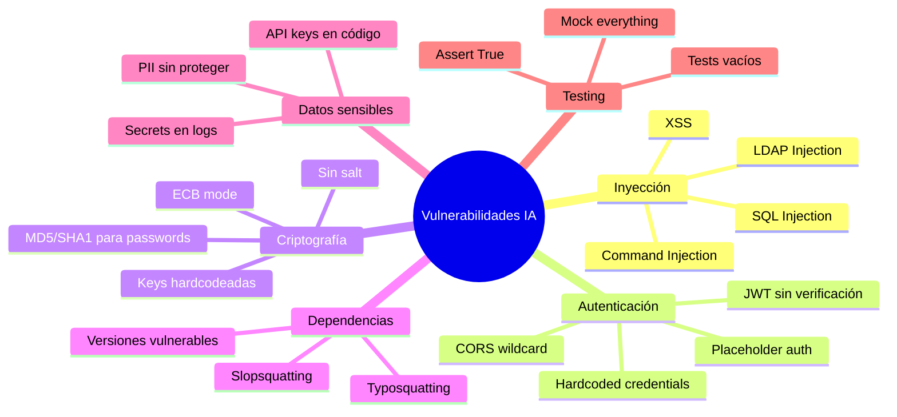
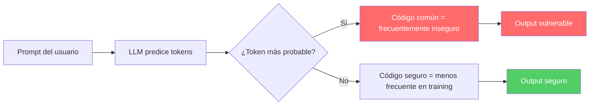
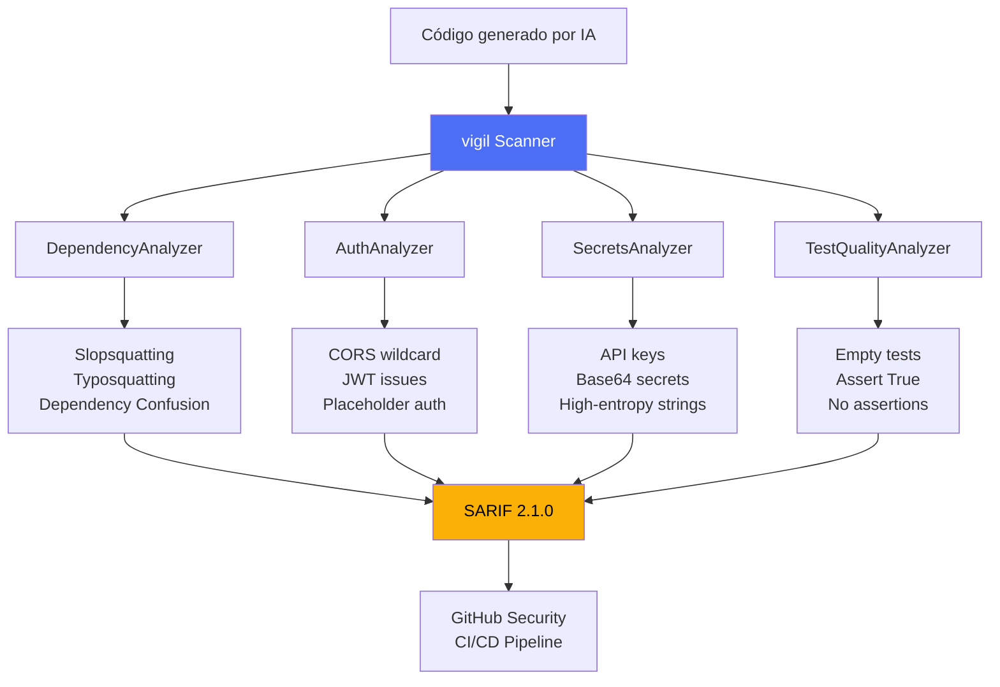

# Seguridad del Código Generado por IA

> [!abstract] Resumen
> Los modelos de lenguaje grande (*Large Language Models*) generan código con ==vulnerabilidades de seguridad en aproximadamente el 40% de los escenarios relevantes==, según estudios de Stanford (2021). Este documento analiza las categorías de vulnerabilidades más comunes, las razones subyacentes por las que los LLMs producen código inseguro, y la necesidad de herramientas de escaneo determinista como [[vigil-overview|vigil]] para mitigar estos riesgos de forma reproducible y auditable.
> ^resumen

---

## El problema fundamental

La adopción masiva de asistentes de código basados en IA ha transformado el desarrollo de software. Herramientas como *GitHub Copilot*, *Amazon CodeWhisperer*, *Cursor* y *Claude Code* generan millones de líneas de código diariamente. Sin embargo, esta productividad viene con un coste oculto: ==la introducción sistemática de vulnerabilidades de seguridad==.

> [!danger] Dato crítico
> El estudio de Pearce et al. (Stanford, 2021)[^1] demostró que GitHub Copilot generó código vulnerable en el ==40% de los escenarios de seguridad evaluados==. Esto incluye inyecciones SQL, XSS, path traversal, y uso inadecuado de criptografía.

### Estudios clave sobre seguridad de código generado

| Estudio | Año | Modelo evaluado | Tasa de vulnerabilidades | Hallazgos clave |
|---------|-----|-----------------|--------------------------|-----------------|
| Pearce et al. (Stanford) | 2021 | Copilot (Codex) | ==~40%== | CWE-79, CWE-89, CWE-22 frecuentes |
| Sandoval et al. | 2023 | Copilot | ~30% | Usuarios con IA no producen código significativamente más inseguro |
| Khoury et al. | 2023 | ChatGPT | 5/21 programas vulnerables | Código funcional pero inseguro |
| Perry et al. | 2023 | Codex | Usuarios con IA más vulnerables | Falsa sensación de seguridad |
| He & Vechev | 2023 | Copilot, CodeGen | ==25-40%== | Vulnerabilidades en múltiples lenguajes |

> [!warning] Falsa sensación de seguridad
> El estudio de Perry et al. reveló que los desarrolladores que usaron asistentes de IA ==creyeron que su código era más seguro== que quienes no los usaron, a pesar de producir código con más vulnerabilidades. Este sesgo cognitivo amplifica el riesgo.

---

## Categorías de vulnerabilidades comunes

### Taxonomía de vulnerabilidades en código generado por IA



### 1. Inyecciones (CWE-89, CWE-79, CWE-78)

Los LLMs tienden a generar consultas SQL mediante concatenación de strings en lugar de consultas parametrizadas:

> [!example]- Código vulnerable generado por LLM
> ```python
> # Lo que el LLM genera frecuentemente
> def get_user(username):
>     query = f"SELECT * FROM users WHERE username = '{username}'"
>     cursor.execute(query)  # SQL Injection - CWE-89
>     return cursor.fetchone()
>
> # Lo que debería generar
> def get_user(username):
>     query = "SELECT * FROM users WHERE username = %s"
>     cursor.execute(query, (username,))
>     return cursor.fetchone()
> ```

### 2. Gestión de secretos (CWE-798)

Los LLMs frecuentemente incluyen credenciales directamente en el código, un problema que [[secrets-management-ia]] aborda en profundidad y que [[vigil-overview|vigil]] detecta mediante su *SecretsAnalyzer*:

> [!example]- Patrones de secretos detectados por vigil
> ```python
> # Patrón 1: API keys hardcodeadas
> api_key = "sk-proj-abc123def456"  # vigil: CRITICAL
>
> # Patrón 2: Placeholder secrets
> API_KEY = "your-api-key-here"  # vigil: HIGH
>
> # Patrón 3: Base64 encoded secrets
> token = "c2VjcmV0LWtleS12YWx1ZQ=="  # vigil: MEDIUM
>
> # Patrón 4: High-entropy strings
> secret = "aK8#mP2$xQ9&wL5"  # vigil: MEDIUM
> ```

### 3. Autenticación y autorización deficientes (CWE-287, CWE-862)

El [[cors-seguridad-ia|problema de CORS]] es emblemático: los LLMs configuran `Access-Control-Allow-Origin: *` por defecto.

### 4. Dependencias inventadas

El fenómeno de [[slopsquatting]] es exclusivo del código generado por IA: los LLMs inventan nombres de paquetes que no existen, creando una superficie de ataque para [[supply-chain-attacks-ia|ataques de cadena de suministro]].

---

## Por qué los LLMs producen código inseguro

> [!info] Raíces del problema
> La generación de código inseguro no es un bug sino una consecuencia directa de cómo funcionan los modelos de lenguaje.

### 1. Datos de entrenamiento contaminados

Los LLMs se entrenan con código público que incluye:
- Tutoriales simplificados sin consideraciones de seguridad
- Código legacy con prácticas obsoletas
- Respuestas de Stack Overflow optimizadas para brevedad, no seguridad
- Repositorios con vulnerabilidades conocidas

### 2. Optimización por probabilidad, no por seguridad

Los modelos predicen el token más probable dada la secuencia anterior. El código inseguro es estadísticamente ==más frecuente== en los datos de entrenamiento que el código seguro[^2]:



### 3. Ausencia de contexto de seguridad

El LLM no comprende:
- El modelo de amenazas de la aplicación
- El entorno de despliegue (interno vs público)
- Los requisitos regulatorios ([[licit-overview|licit]] aborda esto)
- Las políticas de seguridad organizacionales

### 4. Pattern matching sin semántica

> [!quote] Observación fundamental
> Un LLM no entiende que `eval(user_input)` es peligroso. Solo sabe que `eval()` aparece frecuentemente después de ciertos patrones de código. La seguridad requiere razonamiento semántico que los modelos actuales no poseen de forma fiable.

---

## La necesidad de escaneo determinista

### Por qué no basta con "pedir código seguro"

| Enfoque | Fiabilidad | Reproducibilidad | Velocidad | Auditable |
|---------|------------|-------------------|-----------|-----------|
| Pedir al LLM "código seguro" | Baja | No | Rápido | No |
| Review manual | Media-Alta | Variable | Lento | Sí |
| Linting genérico | Media | ==Sí== | ==Rápido== | ==Sí== |
| **vigil (determinista)** | ==Alta== | ==Sí== | ==Rápido== | ==Sí== |

### El enfoque de vigil

[[vigil-overview|vigil]] implementa un enfoque puramente determinista con 26 reglas distribuidas en 4 analizadores:

> [!success] Ventajas del análisis determinista
> - **Sin falsos negativos por alucinación**: las reglas detectan lo que están diseñadas para detectar, siempre
> - **Reproducible**: el mismo código produce exactamente los mismos resultados
> - **Auditable**: cada detección mapea a un CWE y OWASP específico
> - **Rápido**: no requiere inferencia de modelo, solo análisis de patrones



### Integración en el flujo de desarrollo

> [!tip] Pipeline recomendado
> 1. El desarrollador genera código con un asistente IA
> 2. [[vigil-overview|vigil]] escanea automáticamente el código generado
> 3. Los hallazgos se reportan en formato [[sarif-format|SARIF 2.1.0]]
> 4. El CI/CD bloquea el merge si hay hallazgos de severidad *critical* o *high*
> 5. [[architect-overview|architect]] aplica guardrails adicionales en tiempo de ejecución

---

## Estadísticas de vulnerabilidades por categoría

> [!example]- Distribución típica de hallazgos de vigil en proyecto generado por IA
> ```
> === vigil Scan Results ===
> Total files scanned: 147
> Total findings: 89
>
> By Severity:
>   CRITICAL: 12 (13.5%)
>   HIGH:     28 (31.5%)
>   MEDIUM:   34 (38.2%)
>   LOW:      15 (16.9%)
>
> By Analyzer:
>   SecretsAnalyzer:      31 (34.8%)
>   AuthAnalyzer:         24 (27.0%)
>   DependencyAnalyzer:   19 (21.3%)
>   TestQualityAnalyzer:  15 (16.9%)
>
> Top CWEs:
>   CWE-798 (Hardcoded Credentials):  23
>   CWE-942 (Permissive CORS):        14
>   CWE-1357 (Slopsquatting):         11
>   CWE-1321 (Empty Tests):            9
> ```

---

## Mejores prácticas

> [!success] Checklist de seguridad para código generado por IA
> 1. **Nunca confiar** en el código generado sin revisión
> 2. **Escanear siempre** con herramientas como [[vigil-overview|vigil]] y [[ai-security-tools|otras herramientas complementarias]]
> 3. **Validar dependencias** contra registros oficiales (ver [[slopsquatting]])
> 4. **Eliminar secretos** antes de commit (ver [[secrets-management-ia]])
> 5. **Verificar tests** que no sean vacíos (ver [[tests-vacios-cobertura-falsa]])
> 6. **Revisar configuraciones** de autenticación (ver [[cors-seguridad-ia]])
> 7. **Aplicar guardrails** deterministas en el pipeline (ver [[guardrails-deterministas]])

---

## Relación con el ecosistema

Este documento es la puerta de entrada al módulo de seguridad del ecosistema de agentes IA:

- **[[intake-overview]]**: La validación de entrada que realiza intake es la primera línea de defensa, asegurando que las especificaciones del usuario no contengan instrucciones maliciosas que podrían generar código intencionalmente vulnerable.
- **[[architect-overview]]**: Las 22 capas de seguridad de architect actúan como guardrails en tiempo de ejecución, complementando el análisis estático de vigil con protección dinámica mediante `validate_path`, command blocklist y confirmation modes.
- **[[vigil-overview]]**: vigil es el componente central de esta nota. Sus 26 reglas deterministas escanean el código generado por IA buscando las vulnerabilidades documentadas aquí, produciendo reportes en [[sarif-format|SARIF 2.1.0]] con mapeos CWE y OWASP.
- **[[licit-overview]]**: licit asegura que el código generado cumple con regulaciones como el EU AI Act y evalúa conformidad con [[owasp-agentic-top10|OWASP Agentic Top 10]], cerrando el ciclo de seguridad con cumplimiento normativo.

---

## Enlaces y referencias

> [!quote]- Bibliografía
> - [^1]: Pearce, H., Ahmad, B., Tan, B., Dolan-Gavitt, B., & Karri, R. (2022). "Asleep at the Keyboard? Assessing the Security of GitHub Copilot's Code Contributions." IEEE S&P 2022.
> - [^2]: Sandoval, G., Pearce, H., Nys, T., Karri, R., Garg, S., & Dolan-Gavitt, B. (2023). "Lost at C: A User Study on the Security Implications of Large Language Model Code Assistants." USENIX Security 2023.
> - Perry, N., Srivastava, M., Kumar, D., & Boneh, D. (2023). "Do Users Write More Insecure Code with AI Assistants?" ACM CCS 2023.
> - He, J. & Vechev, M. (2023). "Large Language Models for Code: Security Hardening and Adversarial Testing." ICSE 2023.
> - OWASP. (2025). "OWASP Top 10 for LLM Applications." https://owasp.org/www-project-top-10-for-large-language-model-applications/
> - Khoury, R., Avila, A.R., Brunelle, J., & Camara, B.M. (2023). "How Secure is Code Generated by ChatGPT?" IEEE Access.

[^1]: Pearce et al. "Asleep at the Keyboard?" IEEE S&P 2022.
[^2]: La distribución de código en repositorios públicos favorece patrones inseguros por la prevalencia de tutoriales y código de ejemplo sin hardening.
