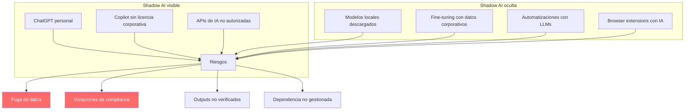
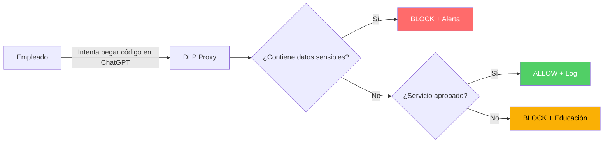

# Shadow AI: Uso No Autorizado de IA en Empresas

> [!abstract] Resumen
> La *Shadow AI* (IA en la sombra) es el ==uso no autorizado o no gobernado de herramientas de IA dentro de una organización==. Análoga al "Shadow IT" de décadas anteriores, presenta riesgos amplificados: fuga de datos confidenciales a proveedores de IA, violaciones de compliance, outputs no verificados en producción, y pérdida de control sobre propiedad intelectual. Este documento cubre detección, políticas, frameworks de governance y la conexión con [[licit-overview|licit]] para tracking de compliance.
> ^resumen

---

## Definición y escala del problema

### ¿Qué es Shadow AI?

La *Shadow AI* se define como el ==uso de herramientas, servicios o modelos de IA sin la aprobación, conocimiento o governance de los equipos de TI, seguridad o compliance== de la organización.

> [!danger] Estadísticas alarmantes
> - ==75% de los empleados== usan herramientas de IA generativa en el trabajo (Microsoft, 2024)[^1]
> - ==52% no revelan== su uso a sus managers
> - ==46% usan IA personal== (no corporativa) para tareas de trabajo
> - El ==78% de las empresas== carecen de políticas formales de uso de IA



---

## Riesgos específicos

### 1. Fuga de datos confidenciales

> [!danger] El riesgo más crítico
> Cuando un empleado pega código propietario, datos de clientes, o información estratégica en ChatGPT:
> - Los datos ==se envían a servidores externos==
> - Pueden ser usados para ==entrenar futuros modelos==[^2]
> - No hay control sobre retención o eliminación
> - Viola políticas de clasificación de datos

### Ejemplos documentados

| Incidente | Empresa | Datos filtrados | Impacto |
|-----------|---------|----------------|---------|
| Samsung (2023) | Samsung | ==Código fuente propietario de chips== | Prohibición interna de ChatGPT |
| JPMorgan | JPMorgan | Datos financieros de clientes | Restricciones de uso |
| Amazon | Amazon | Código interno, datos de clientes | Advertencia interna |
| Apple | Apple | Código de proyectos confidenciales | Restricción de uso |

> [!example] Caso Samsung (2023)
> Tres ingenieros de Samsung introdujeron código fuente propietario en ChatGPT en un periodo de 20 días:
> 1. Un ingeniero pegó código para debuggear un error de fabricación
> 2. Otro optimizó código de testing con datos reales
> 3. Un tercero usó ChatGPT para resumir una reunión interna grabada
>
> Resultado: Samsung ==prohibió todas las herramientas de IA generativa== y desarrolló su propia solución interna.

### 2. Violaciones de compliance

> [!warning] Riesgos regulatorios
> - **GDPR**: enviar PII a LLMs externos viola principios de procesamiento
> - **HIPAA**: datos médicos en ChatGPT = violación
> - **SOX**: outputs de IA no auditados en reportes financieros
> - **EU AI Act**: uso de IA de alto riesgo sin evaluación ([[licit-overview|licit]])
> - **PCI-DSS**: datos de tarjetas en herramientas de IA

### 3. Outputs no verificados

> [!failure] Riesgo de calidad
> Código, documentos y decisiones basados en outputs de IA sin verificación:
> - Código con vulnerabilidades ([[seguridad-codigo-generado-ia]])
> - Tests vacíos que dan falsa confianza ([[tests-vacios-cobertura-falsa]])
> - Documentación legal con alucinaciones
> - Análisis financieros con datos inventados

### 4. Dependencia no gestionada

> [!info] Riesgo operacional
> - Procesos que dependen de APIs de IA sin contrato ni SLA
> - Cambios en el modelo que rompen workflows
> - Costes no controlados de API
> - Pérdida de capacidad si el servicio se interrumpe

---

## Detección de Shadow AI

### Monitorización de red

> [!tip] Señales de uso no autorizado de IA
>
> | Señal | Método de detección | Herramienta |
> |-------|---------------------|-------------|
> | Tráfico a APIs de OpenAI, Anthropic | ==DNS/proxy monitoring== | Firewall, proxy |
> | Uso de extensiones de IA en navegador | Endpoint management | MDM, EDR |
> | Modelos descargados localmente | File system monitoring | DLP |
> | Tokens de API en código | ==vigil SecretsAnalyzer== | [[vigil-overview\|vigil]] |
> | Grandes uploads a servicios de IA | Network bandwidth analysis | NetFlow |

### Auditoría de API usage

> [!example]- Script de detección de API keys de IA
> ```python
> # Patrones de API keys de servicios de IA
> AI_API_PATTERNS = {
>     "OpenAI": r"sk-[a-zA-Z0-9]{20,}",
>     "Anthropic": r"sk-ant-[a-zA-Z0-9-]{40,}",
>     "Cohere": r"[a-zA-Z0-9]{40}",
>     "HuggingFace": r"hf_[a-zA-Z0-9]{34}",
>     "Replicate": r"r8_[a-zA-Z0-9]{40}",
>     "Google AI": r"AIza[a-zA-Z0-9_-]{35}",
> }
>
> # Dominios de IA a monitorizar
> AI_DOMAINS = [
>     "api.openai.com",
>     "api.anthropic.com",
>     "api.cohere.ai",
>     "api-inference.huggingface.co",
>     "api.replicate.com",
>     "generativelanguage.googleapis.com",
>     "api.together.xyz",
>     "api.groq.com",
> ]
>
> # vigil puede detectar estos tokens en código
> # con su SecretsAnalyzer
> ```

### Data Loss Prevention (DLP)



---

## Políticas y governance

### Framework de governance de IA

> [!success] Pilares de governance
>
> 1. **Inventario**: catálogo de todas las herramientas de IA en uso
> 2. **Clasificación**: nivel de riesgo de cada herramienta
> 3. **Aprobación**: proceso de evaluación y aprobación
> 4. **Monitorización**: detección continua de uso no autorizado
> 5. **Educación**: formación de empleados
> 6. **Respuesta**: proceso para incidentes de Shadow AI

### Política de uso aceptable

> [!tip] Elementos de una política de uso de IA
> - **Herramientas aprobadas**: lista blanca de servicios autorizados
> - **Clasificación de datos**: qué datos pueden y no pueden enviarse a IA
> - **Requisitos de revisión**: todo output de IA debe ser revisado por humano
> - **Registro de uso**: logs de interacciones con herramientas de IA
> - **Capacitación**: formación obligatoria antes de usar herramientas de IA
> - **Consecuencias**: acciones disciplinarias por violación

### Tabla de clasificación de datos

| Clasificación | Puede enviarse a IA corporativa | Puede enviarse a IA pública | Ejemplo |
|--------------|-------------------------------|---------------------------|---------|
| Público | ==Sí== | ==Sí== | Documentación pública |
| Interno | ==Sí== | ==No== | Procesos internos |
| Confidencial | ==Con aprobación== | ==No== | Código propietario |
| Restringido | ==No== | ==No== | PII, datos financieros |

---

## Herramientas aprobadas vs prohibidas

### Evaluación de herramientas

> [!info] Criterios de evaluación
> - ¿El proveedor entrena con datos de usuarios?
> - ¿Dónde se procesan los datos geográficamente?
> - ¿Existe un DPA (Data Processing Agreement)?
> - ¿Se ofrece retención cero de datos?
> - ¿Hay SOC 2 / ISO 27001?
> - ¿Cumple con GDPR?

| Servicio | Data retention | Entrena con datos | DPA disponible | SOC 2 | Recomendación |
|----------|---------------|-------------------|----------------|-------|---------------|
| OpenAI API | ==0 días (API)== | No (API) | Sí | Sí | ==Aprobado con controles== |
| ChatGPT Free | 30 días | ==Sí (por defecto)== | No | N/A | ==Prohibido== |
| ChatGPT Enterprise | 0 días | No | Sí | Sí | Aprobado |
| Claude API | 0 días | No | Sí | Sí | ==Aprobado con controles== |
| GitHub Copilot Business | 0 días | No | Sí | Sí | Aprobado |
| Modelos self-hosted | N/A | N/A | N/A | N/A | ==Ideal (control total)== |

---

## Conexión con licit

[[licit-overview|licit]] contribuye a la governance de Shadow AI mediante:

> [!success] Capacidades de licit para governance
> - **Inventario de IA**: registro de todas las herramientas y modelos en uso
> - **Evaluación de riesgo**: scoring según EU AI Act y OWASP Agentic Top 10
> - **Provenance tracking**: rastreo de origen de cada output de IA
> - **Compliance monitoring**: verificación continua de cumplimiento
> - **Audit trail**: registro inmutable de uso de IA para auditoría

---

## Relación con el ecosistema

- **[[intake-overview]]**: intake puede verificar que las especificaciones de entrada provienen de canales autorizados y no de herramientas de IA no gobernadas, asegurando que solo inputs verificados entren al pipeline de desarrollo.
- **[[architect-overview]]**: architect implementa controles que limitan el uso de herramientas de IA no autorizadas: command blocklist puede bloquear llamadas a APIs de IA no aprobadas, y sensitive_files protege datos que no deben salir del sistema.
- **[[vigil-overview]]**: vigil detecta tokens de API de servicios de IA en código (SecretsAnalyzer), lo que puede indicar uso no autorizado de servicios de IA. También identifica patrones de código generado por IA que podrían indicar Shadow AI.
- **[[licit-overview]]**: licit es el componente central de governance de IA, evaluando compliance con EU AI Act, manteniendo inventario de herramientas de IA, tracking de provenance y generando reportes de auditoría para reguladores.

---

## Enlaces y referencias

> [!quote]- Bibliografía
> - [^1]: Microsoft. (2024). "2024 Work Trend Index: AI at Work Is Here. Now Comes the Hard Part." Microsoft Research.
> - [^2]: OpenAI. (2024). "API Data Usage Policies." https://openai.com/policies/api-data-usage-policies
> - Gartner. (2024). "Top Strategic Technology Trends 2024: AI Trust, Risk and Security Management." Gartner Research.
> - Samsung. (2023). "Samsung Bans ChatGPT After Internal Data Leak." Bloomberg.
> - NIST. (2024). "AI Risk Management Framework." NIST AI 100-1.

[^1]: La encuesta de Microsoft de 2024 revela que la adopción de IA supera significativamente la capacidad de governance de las organizaciones.
[^2]: OpenAI no entrena con datos de la API de pago por defecto, pero ChatGPT gratuito sí retiene datos y puede usarlos para mejorar el modelo.
