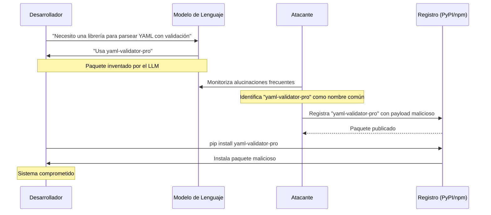
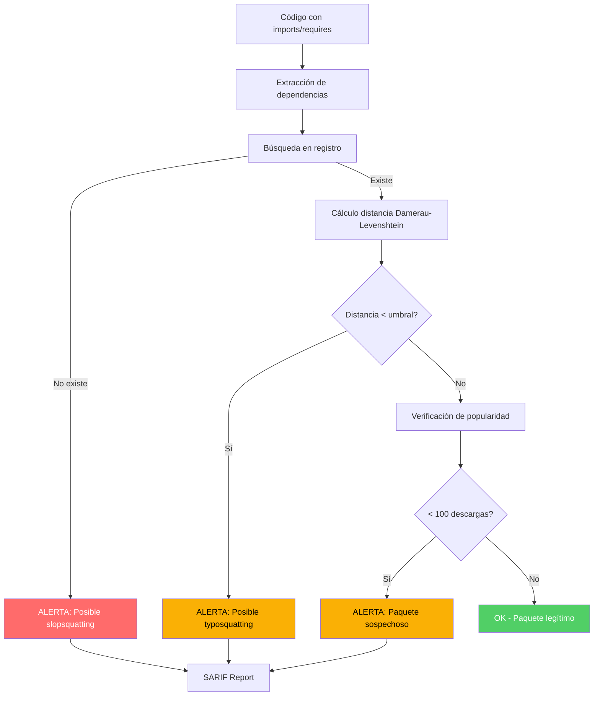

# Slopsquatting: Dependencias Alucinadas como Vector de Ataque

> [!abstract] Resumen
> El *slopsquatting* es un vector de ataque exclusivo de la era de la IA generativa donde ==los LLMs inventan nombres de paquetes que no existen en registros oficiales==. Los atacantes monitorizan estas alucinaciones y registran los nombres inventados con código malicioso. El *DependencyAnalyzer* de [[vigil-overview|vigil]] combate este ataque mediante ==distancia Damerau-Levenshtein a paquetes conocidos y verificación en tiempo real contra registros== (PyPI, npm). Este documento detalla el ataque, su detección y mitigación.
> ^resumen

---

## Definición y origen del término

El término *slopsquatting* fue acuñado en 2024 combinando "slop" (jerga para salida de baja calidad de LLMs) con "squatting" (la práctica de registrar nombres de dominio o paquetes de forma oportunista). Es un subtipo de [[supply-chain-attacks-ia|ataque de cadena de suministro]] específico del contexto de IA generativa.

> [!info] Diferencia con typosquatting
> Mientras que el *typosquatting* explota errores de escritura humanos (ej: `requets` en lugar de `requests`), el slopsquatting ==explota la tendencia de los LLMs a inventar nombres de paquetes plausibles pero inexistentes==. El atacante no necesita esperar un error humano; el LLM genera el nombre malicioso de forma proactiva.

---

## Cómo funciona el ataque

### Anatomía del slopsquatting



### Fase 1: La alucinación

Los LLMs generan nombres de paquetes inexistentes por varias razones:

1. **Interpolación de patrones**: El modelo combina nombres reales para crear uno plausible
2. **Datos de entrenamiento obsoletos**: Referencia paquetes que fueron eliminados
3. **Confabulación**: Genera nombres que "suenan correctos" para el contexto
4. **Confusión entre ecosistemas**: Mezcla nombres de npm con PyPI

> [!example]- Ejemplos reales de alucinaciones de paquetes
> ```python
> # Paquetes inventados por LLMs documentados en investigación
> # (Lanyado, 2024 - Vulcan Cyber Research)
>
> # Python (PyPI)
> "flask-rest-jsonapi"      # Confundido con flask-restful
> "python-mathutils"        # No existe, mathutils sí
> "django-allauth-social"   # Mezcla de django-allauth
> "yaml-validator-pro"      # Completamente inventado
> "requests-async-pool"     # Combinación de requests + asyncio
>
> # JavaScript (npm)
> "react-query-cache"       # Confundido con react-query
> "express-rate-limiter"    # Existe express-rate-limit
> "node-fetch-retry"        # Inventado, fetch-retry existe
> "vue-state-manager"       # Combinación plausible
>
> # Go
> "github.com/utils/httphelper"  # Ruta inventada
> ```

### Fase 2: La weaponización

> [!danger] Técnicas de weaponización
> Los atacantes registran los paquetes alucinados con payloads que se ejecutan durante la instalación:
>
> - **Setup.py malicioso** (Python): código en `setup()` que se ejecuta con `pip install`
> - **Postinstall scripts** (npm): scripts en `package.json` que ejecutan en instalación
> - **Exfiltración de datos**: envío de variables de entorno, SSH keys, tokens a C2
> - **Backdoors persistentes**: instalación de reverse shells o keyloggers
> - **Cryptominers**: uso de recursos de CPU para minería

### Fase 3: La distribución

El paquete malicioso se publica en registros legítimos y espera a que:
- Un desarrollador siga las instrucciones del LLM
- Otro LLM recomiende el mismo paquete (ahora "existe")
- Sistemas de CI/CD instalen dependencias automáticamente

---

## Escala del problema

> [!warning] Investigación de Lanyado (2024)
> Un estudio de Vulcan Cyber[^1] encontró que:
> - El ==20% de los paquetes recomendados por ChatGPT para tareas de programación no existían==
> - De esos, el ==43% se repetían en múltiples sesiones==, indicando alucinaciones persistentes
> - Los nombres seguían patrones predecibles que facilitan la weaponización

| Modelo | % Paquetes inexistentes | Repetibilidad | Ecosistema más afectado |
|--------|-------------------------|---------------|------------------------|
| GPT-4 | ~5% | Alta | npm |
| GPT-3.5 | ==~20%== | Muy alta | PyPI |
| CodeLlama | ~15% | Media | PyPI |
| Claude | ~3% | Baja | npm |
| Copilot | ~8% | Media | Ambos |

---

## Detección con vigil

### DependencyAnalyzer: arquitectura de detección

El *DependencyAnalyzer* de [[vigil-overview|vigil]] implementa una estrategia de detección en múltiples capas:



### Distancia Damerau-Levenshtein

> [!tip] Damerau-Levenshtein vs Levenshtein
> La distancia *Damerau-Levenshtein* extiende la distancia de Levenshtein añadiendo ==transposiciones== como operación primitiva (intercambiar dos caracteres adyacentes). Esto es crucial porque muchos typosquats son transposiciones: `reqeusts` vs `requests`.

Las operaciones consideradas son:
1. **Inserción**: `request` -> `requests` (distancia 1)
2. **Eliminación**: `requests` -> `request` (distancia 1)
3. **Sustitución**: `requests` -> `requasts` (distancia 1)
4. **Transposición**: `requests` -> `reqeusts` (distancia 1)

> [!example]- Implementación del cálculo de distancia
> ```python
> def damerau_levenshtein_distance(s1: str, s2: str) -> int:
>     """
>     Calcula la distancia Damerau-Levenshtein entre dos strings.
>     Usado por vigil DependencyAnalyzer para detección de
>     slopsquatting y typosquatting.
>     """
>     len_s1 = len(s1)
>     len_s2 = len(s2)
>     d = [[0] * (len_s2 + 1) for _ in range(len_s1 + 1)]
>
>     for i in range(len_s1 + 1):
>         d[i][0] = i
>     for j in range(len_s2 + 1):
>         d[0][j] = j
>
>     for i in range(1, len_s1 + 1):
>         for j in range(1, len_s2 + 1):
>             cost = 0 if s1[i-1] == s2[j-1] else 1
>             d[i][j] = min(
>                 d[i-1][j] + 1,      # eliminación
>                 d[i][j-1] + 1,      # inserción
>                 d[i-1][j-1] + cost  # sustitución
>             )
>             # Transposición
>             if (i > 1 and j > 1
>                 and s1[i-1] == s2[j-2]
>                 and s1[i-2] == s2[j-1]):
>                 d[i][j] = min(d[i][j], d[i-2][j-2] + cost)
>
>     return d[len_s1][len_s2]
> ```

### Verificación contra registros

vigil verifica la existencia de paquetes contra registros oficiales:

| Registro | API endpoint | Método | Timeout |
|----------|-------------|--------|---------|
| ==PyPI== | `https://pypi.org/pypi/{name}/json` | GET | 5s |
| ==npm== | `https://registry.npmjs.org/{name}` | GET | 5s |
| RubyGems | `https://rubygems.org/api/v1/gems/{name}.json` | GET | 5s |
| crates.io | `https://crates.io/api/v1/crates/{name}` | GET | 5s |

### Umbrales de detección

> [!info] Configuración de umbrales en vigil
> ```yaml
> dependency_analyzer:
>   slopsquatting:
>     max_damerau_levenshtein_distance: 2
>     min_package_downloads: 100
>     registry_check_timeout: 5000
>     known_packages_db: "~/.vigil/known_packages.json"
>   severity_mapping:
>     package_not_found: "critical"
>     low_downloads: "high"
>     name_similar_to_known: "medium"
> ```

---

## Ejemplos reales documentados

> [!example] Caso 1: python-httplib3
> Un LLM recomendó `python-httplib3` para hacer peticiones HTTP. El paquete no existía en PyPI. Un investigador lo registró con un payload que enviaba `os.environ` a un servidor externo. En 48 horas recibió credenciales de AWS de 15 sistemas diferentes.

> [!example] Caso 2: react-oauth-google
> ChatGPT recomendó `react-oauth-google` (el paquete real es `@react-oauth/google` con scope). Un paquete malicioso sin scope fue registrado y acumuló ==3,000 descargas== antes de ser reportado[^2].

> [!failure] Caso 3: node-postgres-pure
> Un LLM recomendó `node-postgres-pure` como alternativa ligera a `pg`. El paquete fue registrado con un postinstall script que instalaba un cryptominer. Permaneció en npm durante ==2 semanas== antes de ser eliminado.

---

## Mitigación

### Estrategias de defensa en profundidad


> [!success] Mejores prácticas
> 1. **Escanear con vigil** antes de `pip install` o `npm install`
> 2. **Usar lockfiles** (`pip freeze`, `package-lock.json`) y revisarlos en code review
> 3. **Registry mirrors privados** con allowlists de paquetes aprobados
> 4. **Verificar manualmente** cualquier paquete sugerido por un LLM
> 5. **Monitorizar descargas** de paquetes internos para detectar dependency confusion
> 6. **Socket.dev** o servicios similares para alertas de paquetes nuevos sospechosos

### Integración con CI/CD

> [!tip] Pipeline de protección
> ```yaml
> # .github/workflows/dependency-check.yml
> - name: Scan dependencies with vigil
>   run: |
>     vigil scan --analyzer dependency \
>       --registry-check \
>       --fail-on critical,high \
>       --output sarif \
>       --output-file results.sarif
>
> - name: Upload SARIF
>   uses: github/codeql-action/upload-sarif@v3
>   with:
>     sarif_file: results.sarif
> ```

---

## Relación con el ecosistema

- **[[intake-overview]]**: intake puede validar las dependencias declaradas en una especificación antes de que se genere código, alertando tempranamente sobre paquetes desconocidos y evitando que el agente genere código con dependencias alucinadas.
- **[[architect-overview]]**: architect complementa la detección de slopsquatting en tiempo de ejecución, pudiendo bloquear comandos `pip install` o `npm install` de paquetes no verificados mediante su command blocklist y confirmation modes.
- **[[vigil-overview]]**: vigil es la herramienta principal de detección de slopsquatting. Su DependencyAnalyzer implementa la verificación de registros y el cálculo de distancia Damerau-Levenshtein documentados en esta nota.
- **[[licit-overview]]**: licit registra la procedencia (*provenance*) de cada dependencia usada, permitiendo auditoría posterior y firma criptográfica del grafo de dependencias, esencial para cumplimiento del EU AI Act.

---

## Enlaces y referencias

> [!quote]- Bibliografía
> - [^1]: Lanyado, B. (2024). "Can you trust ChatGPT's package recommendations?" Vulcan Cyber Research. https://vulcan.io/blog/ai-hallucinations-package-risk
> - [^2]: Thompson, S. (2024). "Slopsquatting: How AI Hallucinations Become Supply Chain Attacks." Socket.dev Blog.
> - Ohm, M., Plate, H., Sykosch, A., & Meier, M. (2020). "Backstabber's Knife Collection: A Review of Open Source Software Supply Chain Attacks." DIMVA 2020.
> - Ladisa, P., Plate, H., Martinez, M., & Barber, O. (2023). "SoK: Taxonomy of Attacks on Open-Source Software Supply Chains." IEEE S&P 2023.
> - OWASP. (2025). "OWASP Top 10 for LLM Applications - LLM05: Supply Chain Vulnerabilities."

[^1]: Lanyado, B. (2024). Vulcan Cyber Research. Estudio sobre alucinaciones de paquetes en ChatGPT.
[^2]: Thompson, S. (2024). Socket.dev. Documentación de paquetes maliciosos registrados a partir de alucinaciones de LLMs.
