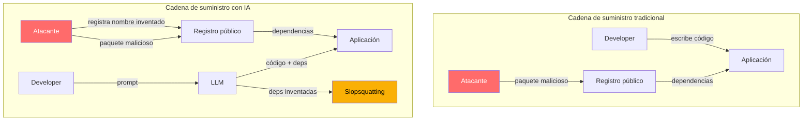
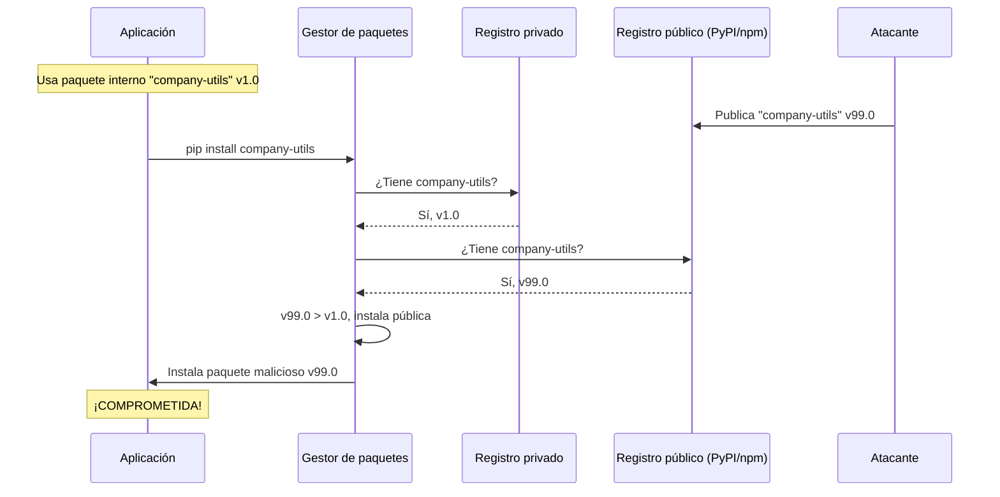
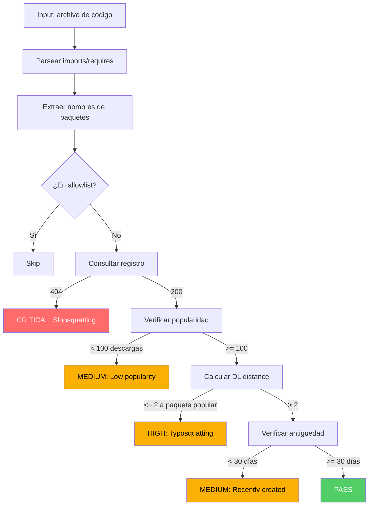

# Ataques a la Cadena de Suministro en el Contexto de IA

> [!abstract] Resumen
> Los ataques a la cadena de suministro de software (*software supply chain attacks*) se han amplificado con la adopción de IA generativa. Este documento cubre ==typosquatting, dependency confusion, star-jacking y paquetes maliciosos dirigidos a desarrolladores de IA==. El *DependencyAnalyzer* de [[vigil-overview|vigil]] aborda estos vectores mediante verificación de registros y scoring de similitud de nombres. La cadena de suministro de modelos se trata en [[ai-model-supply-chain]].
> ^resumen

---

## Panorama de amenazas

La cadena de suministro de software moderno depende de miles de dependencias de código abierto. Un proyecto Python promedio tiene ==40-60 dependencias transitivas==, y un proyecto Node.js puede superar las 1,000[^1]. Cada dependencia es un vector de ataque potencial.

> [!danger] El multiplicador IA
> Los LLMs amplifican el riesgo de supply chain de tres formas:
> 1. **Generan dependencias**: recomiendan paquetes sin verificar su legitimidad
> 2. **Inventan dependencias**: crean [[slopsquatting|paquetes alucinados]] que no existen
> 3. **No verifican versiones**: sugieren versiones con vulnerabilidades conocidas



---

## Typosquatting

### Definición y mecánica

El *typosquatting* consiste en registrar paquetes con nombres ==intencionalmente similares a paquetes populares==, explotando errores de escritura. A diferencia del [[slopsquatting]], aquí el atacante espera errores humanos, no alucinaciones de IA.

### Técnicas de typosquatting

| Técnica | Paquete real | Typosquat | Distancia D-L |
|---------|-------------|-----------|---------------|
| Omisión de carácter | `requests` | `reqests` | 1 |
| Carácter extra | `flask` | `flaask` | 1 |
| Transposición | `django` | `djagno` | 1 |
| Sustitución homoglifa | `numpy` | `numpý` | 1 |
| Separador diferente | `python-dateutil` | `python_dateutil` | ==1== |
| Prefijo/sufijo | `colors` | `colors-js` | 3 |
| Scope ausente | `@babel/core` | `babel-core` | N/A |

> [!warning] Typosquatting potenciado por IA
> Los LLMs cometen "typos" sistemáticos diferentes a los humanos. Mientras un humano escribe `reqeusts`, un LLM puede generar `requests-lib` o `python-requests` consistentemente. ==Estos errores de IA son más predecibles== y por tanto más explotables.

### Casos documentados

> [!example] Caso: crossenv (npm, 2017)
> El paquete `crossenv` fue registrado imitando a `cross-env` (4M descargas/semana). El paquete malicioso robaba variables de entorno y las enviaba a un servidor externo. Fue descargado ==700 veces== antes de ser removido[^2].

> [!example] Caso: jeIlyfish (PyPI, 2023)
> `jeIlyfish` (con I mayúscula en lugar de L minúscula) imitó a `jellyfish`. El paquete contenía un backdoor que exfiltraba credenciales SSH. Visualmente indistinguible en muchas fuentes.

---

## Dependency Confusion

### El ataque

*Dependency confusion* (confusión de dependencias) explota la forma en que los gestores de paquetes resuelven nombres cuando existen ==registros públicos y privados simultáneamente==.



> [!danger] Impacto demostrado
> Alex Birsan demostró este ataque en 2021 contra ==Apple, Microsoft, PayPal, Shopify, Netflix, Tesla y Uber==, obteniendo ejecución de código en sistemas internos. Recibió $130,000+ en bug bounties[^3].

### Mitigación de dependency confusion

> [!success] Estrategias de defensa
> 1. **Namespace scoping**: usar `@company/package-name` en npm
> 2. **Pin de versiones**: especificar versiones exactas, no rangos
> 3. **Registry priority**: configurar el registro privado como prioritario
> 4. **Reserved names**: registrar nombres internos en registros públicos (sin código)
> 5. **Lockfiles**: verificar lockfiles en CI/CD

> [!tip] Configuración segura de pip
> ```ini
> # pip.conf
> [global]
> index-url = https://internal.company.com/pypi/simple
> extra-index-url = https://pypi.org/simple
>
> # MEJOR: usar --index-url sin --extra-index-url
> # para evitar fallback al registro público
> ```

---

## Star-jacking

### Definición

*Star-jacking* es una técnica donde el atacante ==apunta los metadatos de su paquete malicioso al repositorio GitHub de un proyecto legítimo==, heredando sus estrellas y credibilidad aparente.

> [!info] Mecánica del ataque
> - El atacante publica un paquete malicioso en npm/PyPI
> - En el campo `repository` del `package.json` o `setup.py`, apunta al repo de un proyecto popular
> - Las herramientas de análisis muestran las estrellas del proyecto legítimo
> - El desarrollador ve "10,000 stars" y confía en el paquete

### Detección

vigil no detecta star-jacking directamente, pero herramientas como Socket.dev y Snyk verifican la coherencia entre el paquete publicado y el repositorio declarado. La integración con [[ai-security-tools|herramientas complementarias]] es esencial.

---

## Paquetes maliciosos dirigidos a desarrolladores de IA

### Tendencias 2024-2025

> [!warning] Ecosistema de ML como target
> Los desarrolladores de IA/ML son objetivos atractivos porque:
> - Trabajan con datos sensibles y modelos valiosos
> - Instalan paquetes frecuentemente para experimentación
> - Los entornos de notebook tienen acceso amplio al sistema
> - GPU servers suelen tener más privilegios

| Paquete malicioso | Registro | Target | Payload | Descargas antes de remoción |
|-------------------|----------|--------|---------|---------------------------|
| `pytorch-nightly` | PyPI | Usuarios PyTorch | Cryptominer | ==3,800== |
| `tf-utils` | PyPI | Usuarios TensorFlow | Exfiltración | 1,200 |
| `openai-api` | PyPI | Usuarios OpenAI | Robo de API keys | 2,500 |
| `langchain-utils` | PyPI | Usuarios LangChain | Backdoor | ==890== |
| `transformers-hub` | PyPI | Usuarios HuggingFace | Data exfil | 450 |

---

## Detección con vigil DependencyAnalyzer

### Reglas de detección

El *DependencyAnalyzer* de [[vigil-overview|vigil]] implementa las siguientes reglas de detección:

> [!example]- Reglas del DependencyAnalyzer
> ```python
> # Reglas de detección de supply chain attacks en vigil
>
> DEPENDENCY_RULES = {
>     "VIGIL-DEP-001": {
>         "name": "slopsquatting_detection",
>         "description": "Paquete no encontrado en registro oficial",
>         "severity": "critical",
>         "cwe": "CWE-1357",
>         "check": "registry_existence_check"
>     },
>     "VIGIL-DEP-002": {
>         "name": "typosquatting_detection",
>         "description": "Nombre similar a paquete popular (DL distance <= 2)",
>         "severity": "high",
>         "cwe": "CWE-1357",
>         "check": "damerau_levenshtein_check"
>     },
>     "VIGIL-DEP-003": {
>         "name": "dependency_confusion",
>         "description": "Paquete existe en público y privado con versiones divergentes",
>         "severity": "critical",
>         "cwe": "CWE-427",
>         "check": "dual_registry_check"
>     },
>     "VIGIL-DEP-004": {
>         "name": "low_popularity",
>         "description": "Paquete con menos de 100 descargas semanales",
>         "severity": "medium",
>         "cwe": "CWE-829",
>         "check": "download_count_check"
>     },
>     "VIGIL-DEP-005": {
>         "name": "recently_created",
>         "description": "Paquete creado hace menos de 30 días",
>         "severity": "medium",
>         "cwe": "CWE-829",
>         "check": "creation_date_check"
>     }
> }
> ```

### Flujo de análisis



### Output SARIF

> [!example]- Ejemplo de output SARIF para detección de typosquatting
> ```json
> {
>   "$schema": "https://raw.githubusercontent.com/oasis-tcs/sarif-spec/main/sarif-2.1/schema/sarif-schema-2.1.0.json",
>   "version": "2.1.0",
>   "runs": [{
>     "tool": {
>       "driver": {
>         "name": "vigil",
>         "version": "1.0.0",
>         "rules": [{
>           "id": "VIGIL-DEP-002",
>           "shortDescription": {
>             "text": "Possible typosquatting detected"
>           },
>           "properties": {
>             "cwe": "CWE-1357",
>             "owasp": "LLM05"
>           }
>         }]
>       }
>     },
>     "results": [{
>       "ruleId": "VIGIL-DEP-002",
>       "level": "error",
>       "message": {
>         "text": "Package 'reqests' is similar to popular package 'requests' (DL distance: 1)"
>       },
>       "locations": [{
>         "physicalLocation": {
>           "artifactLocation": { "uri": "app/main.py" },
>           "region": { "startLine": 3, "startColumn": 1 }
>         }
>       }]
>     }]
>   }]
> }
> ```

---

## Estrategias de mitigación organizacional

### Programa de gestión de dependencias

> [!tip] Framework de seguridad de dependencias
> 1. **Inventario**: mantener un SBOM (*Software Bill of Materials*) actualizado
> 2. **Evaluación**: scoring de riesgo para cada dependencia
> 3. **Monitorización**: alertas automáticas de nuevas vulnerabilidades
> 4. **Respuesta**: proceso definido para parchear o reemplazar dependencias
> 5. **Governance**: políticas de aprobación para nuevas dependencias

### Herramientas complementarias a vigil

| Herramienta | Foco | Supply chain | AI-specific |
|-------------|------|-------------|-------------|
| ==vigil== | IA generativa | Slopsquatting, typosquatting | ==Sí== |
| Socket.dev | npm/PyPI | Behavioral analysis | No |
| Snyk | Multi-lenguaje | CVE scanning | No |
| Dependabot | GitHub | Auto-update | No |
| Renovate | Multi-plataforma | Auto-update | No |
| pip-audit | Python | CVE scanning | No |

---

## Relación con el ecosistema

- **[[intake-overview]]**: intake valida las dependencias declaradas en las especificaciones de entrada, pudiendo rechazar specs que incluyan paquetes no aprobados o sospechosos antes de que el agente comience la generación de código.
- **[[architect-overview]]**: architect puede bloquear la instalación de paquetes no autorizados mediante su command blocklist, interceptando comandos `pip install` y `npm install` que intenten instalar dependencias no verificadas.
- **[[vigil-overview]]**: vigil es la herramienta central de detección documentada en esta nota. Su DependencyAnalyzer verifica cada dependencia contra registros oficiales y calcula similitud con paquetes conocidos para detectar typosquatting y slopsquatting.
- **[[licit-overview]]**: licit complementa la detección de vigil con tracking de procedencia (*provenance tracking*) y firma criptográfica del SBOM, asegurando trazabilidad completa de la cadena de suministro para auditoría y cumplimiento regulatorio.

---

## Enlaces y referencias

> [!quote]- Bibliografía
> - [^1]: Synopsys. (2024). "Open Source Security and Risk Analysis Report." OSSRA 2024.
> - [^2]: Bertus, O. (2017). "Hunting for Malicious npm Packages." Medium.
> - [^3]: Birsan, A. (2021). "Dependency Confusion: How I Hacked Into Apple, Microsoft and Dozens of Other Companies." Medium.
> - Ladisa, P. et al. (2023). "SoK: Taxonomy of Attacks on Open-Source Software Supply Chains." IEEE S&P 2023.
> - Ohm, M. et al. (2020). "Backstabber's Knife Collection." DIMVA 2020.
> - Zahan, N. et al. (2022). "What are Weak Links in the npm Supply Chain?" ICSE-SEIP 2022.

[^1]: Synopsys OSSRA 2024. Análisis de más de 1,700 codebases comerciales.
[^2]: El incidente crossenv fue uno de los primeros casos de typosquatting documentados en npm.
[^3]: Birsan demostró dependency confusion en 35+ empresas Fortune 500.
