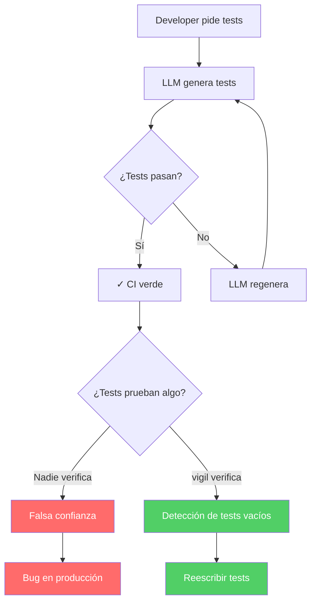

# Tests Vacíos y Cobertura Falsa en Código Generado por IA

> [!abstract] Resumen
> Los LLMs generan tests que ==aparentan cobertura pero no verifican nada==: cuerpos vacíos, `assert True`, `pass`, sin aserciones reales, y tests donde todo está mockeado. El *TestQualityAnalyzer* de [[vigil-overview|vigil]] detecta estos patrones anti-testing con 8 reglas específicas. Este documento detalla por qué los LLMs generan tests falsos, el impacto en la calidad del software, cada regla del TestQualityAnalyzer, y cómo corregir los patrones detectados.
> ^resumen

---

## El problema de los tests vacíos

### Por qué los LLMs generan tests falsos

> [!danger] El ciclo perverso de los tests generados por IA
> 1. El desarrollador pide al LLM "genera tests para esta función"
> 2. El LLM genera tests que ==se ejecutan sin errores==
> 3. El CI/CD muestra ==100% tests passing==
> 4. La cobertura de código muestra ==90%+==
> 5. **Nadie verifica que los tests realmente prueban algo**
> 6. Bugs en producción que los "tests" nunca habrían detectado



### Razones técnicas

> [!info] Por qué los LLMs optimizan por "tests que pasan"
> - **Datos de entrenamiento**: el código público está lleno de tests placeholder
> - **Incentivo incorrecto**: el LLM optimiza por "no hay errores", no por "detecta bugs"
> - **Falta de contexto**: el LLM no sabe qué comportamiento es crítico de verificar
> - **Complejidad de mocking**: es más fácil mockear todo que configurar fixtures reales
> - **Patrón de completar**: el LLM "completa" la estructura de test sin contenido significativo

---

## Patrones anti-testing detectados por vigil

### 1. Empty Test Body (VIGIL-TEST-001)

> [!danger] Test con cuerpo vacío
> ```python
> # ❌ Test vacío - VIGIL-TEST-001: CRITICAL
> def test_user_creation():
>     pass
>
> def test_payment_processing():
>     ...  # Ellipsis = vacío
>
> class TestAuth:
>     def test_login(self):
>         pass  # No prueba absolutamente nada
> ```

### 2. Assert True / Assert Pass (VIGIL-TEST-002)

> [!danger] Aserción que siempre pasa
> ```python
> # ❌ Assert trivial - VIGIL-TEST-002: HIGH
> def test_database_connection():
>     db = connect_to_database()
>     assert True  # Siempre pasa, no verifica nada
>
> def test_api_response():
>     response = client.get("/api/users")
>     assert True  # No verifica status code ni body
>
> def test_calculation():
>     result = calculate_tax(100)
>     assert 1 == 1  # Tautología
> ```

### 3. No Assertions (VIGIL-TEST-003)

> [!warning] Test sin aserciones
> ```python
> # ❌ Sin aserciones - VIGIL-TEST-003: HIGH
> def test_user_workflow():
>     user = User("test@example.com")
>     user.activate()
>     user.update_profile(name="Test")
>     user.deactivate()
>     # Ejecuta código pero nunca verifica resultados
>
> def test_data_processing():
>     data = load_data("test.csv")
>     processed = pipeline.process(data)
>     output = pipeline.format(processed)
>     # ¿El output es correcto? Nadie lo sabe
> ```

### 4. Mocked Everything (VIGIL-TEST-004)

> [!warning] Todo mockeado - no se prueba código real
> ```python
> # ❌ Mocked everything - VIGIL-TEST-004: MEDIUM
> @patch("app.services.database.connect")
> @patch("app.services.cache.get")
> @patch("app.services.email.send")
> @patch("app.services.payment.process")
> @patch("app.services.auth.verify")
> def test_create_order(mock_auth, mock_payment, mock_email, mock_cache, mock_db):
>     mock_db.return_value = MagicMock()
>     mock_cache.return_value = None
>     mock_email.return_value = True
>     mock_payment.return_value = {"status": "ok"}
>     mock_auth.return_value = True
>
>     result = create_order({"item": "test"})
>     assert result is not None  # ¿Qué se está probando exactamente?
>     # NADA real. Todo está mockeado.
> ```

### 5. Shallow Coverage (VIGIL-TEST-005)

> [!info] Cobertura superficial
> ```python
> # ❌ Shallow coverage - VIGIL-TEST-005: MEDIUM
> def test_validate_email():
>     assert validate_email("test@example.com") == True
>     # Solo prueba el happy path
>     # No prueba: emails inválidos, edge cases, Unicode, longitud máxima
>
> def test_divide():
>     assert divide(10, 2) == 5
>     # No prueba: división por cero, números negativos, overflow, floats
> ```

### 6. Test Naming Patterns (VIGIL-TEST-006)

> [!info] Nombres genéricos de tests
> ```python
> # ❌ Naming sospechoso - VIGIL-TEST-006: LOW
> def test_1():
>     pass
>
> def test_it_works():
>     assert True
>
> def test_something():
>     pass
>
> def test_todo():
>     # TODO: implement this test
>     pass
> ```

### 7. Missing Error Tests (VIGIL-TEST-007)

> [!warning] Sin tests de errores
> ```python
> # ❌ Missing error tests - VIGIL-TEST-007: MEDIUM
> # Solo tests de happy path, sin pytest.raises o try/except
> class TestPaymentProcessor:
>     def test_process_valid_payment(self):
>         result = processor.process(valid_card, 100)
>         assert result.status == "success"
>
>     def test_process_another_valid_payment(self):
>         result = processor.process(another_valid_card, 200)
>         assert result.status == "success"
>
>     # ¿Qué pasa con tarjeta inválida? ¿Monto negativo?
>     # ¿Timeout de gateway? ¿Fondos insuficientes?
>     # NINGÚN test de error
> ```

### 8. No Edge Cases (VIGIL-TEST-008)

> [!info] Sin edge cases
> Solo se prueban valores "normales", nunca:
> - Strings vacíos, None, listas vacías
> - Valores límite (0, MAX_INT, -1)
> - Caracteres especiales, Unicode
> - Concurrencia, timeouts

---

## Tabla de reglas del TestQualityAnalyzer

| ID | Nombre | Patrón detectado | Severidad | CWE |
|----|--------|------------------|-----------|-----|
| VIGIL-TEST-001 | Empty test body | `pass`, `...`, cuerpo vacío | ==CRITICAL== | CWE-1164 |
| VIGIL-TEST-002 | Assert True | `assert True`, `assert 1==1` | ==HIGH== | CWE-1164 |
| VIGIL-TEST-003 | No assertions | Test sin ningún `assert` | HIGH | CWE-1164 |
| VIGIL-TEST-004 | Mocked everything | 3+ `@patch` sin aserciones significativas | MEDIUM | CWE-1164 |
| VIGIL-TEST-005 | Shallow coverage | Solo happy path, <3 test cases | MEDIUM | CWE-1164 |
| VIGIL-TEST-006 | Generic naming | `test_1`, `test_something`, `test_todo` | LOW | CWE-1164 |
| VIGIL-TEST-007 | Missing error tests | Sin `pytest.raises`, `assertRaises` | MEDIUM | CWE-1164 |
| VIGIL-TEST-008 | No edge cases | Sin tests de valores límite | LOW | CWE-1164 |

---

## Impacto real de los tests vacíos

> [!failure] Caso de estudio: Bug en producción
> Un equipo usó Copilot para generar tests de una función de procesamiento de pagos. Los tests mostraban:
> - ✓ 15 tests passing
> - ✓ 92% code coverage
> - ✓ CI verde
>
> Pero ==12 de los 15 tests eran assert True o sin aserciones==. En producción, un bug causó cobros duplicados que no fueron detectados por los "tests". Pérdida: $45,000.

> [!example]- Análisis de vigil sobre los tests del caso
> ```
> === vigil TestQualityAnalyzer Results ===
>
> tests/test_payments.py:
>   Line 12: VIGIL-TEST-002 (HIGH) - assert True in test_process_payment
>   Line 25: VIGIL-TEST-003 (HIGH) - No assertions in test_refund_flow
>   Line 38: VIGIL-TEST-002 (HIGH) - assert True in test_subscription
>   Line 51: VIGIL-TEST-001 (CRITICAL) - Empty test body in test_webhook
>   Line 58: VIGIL-TEST-004 (MEDIUM) - All dependencies mocked in test_checkout
>   Line 73: VIGIL-TEST-002 (HIGH) - assert True in test_cancel
>   Line 85: VIGIL-TEST-003 (HIGH) - No assertions in test_retry
>   Line 92: VIGIL-TEST-001 (CRITICAL) - Empty test body in test_timeout
>   Line 98: VIGIL-TEST-002 (HIGH) - assert True in test_currency
>   Line 105: VIGIL-TEST-003 (HIGH) - No assertions in test_discount
>   Line 115: VIGIL-TEST-007 (MEDIUM) - No error tests in TestPaymentProcessor
>   Line 120: VIGIL-TEST-002 (HIGH) - assert True in test_batch
>
> Summary: 12 findings (2 CRITICAL, 7 HIGH, 3 MEDIUM)
> Tests with actual value: 3 of 15 (20%)
> Effective test quality: POOR
> ```

---

## Cómo corregir tests vacíos

### De test vacío a test real

> [!success] Transformación de tests
> ```python
> # ❌ ANTES: test vacío generado por LLM
> def test_validate_email():
>     assert True
>
> # ✓ DESPUÉS: test con valor real
> @pytest.mark.parametrize("email,expected", [
>     ("user@example.com", True),
>     ("user@subdomain.example.com", True),
>     ("", False),
>     ("not-an-email", False),
>     ("@missing-local.com", False),
>     ("user@", False),
>     ("user@.com", False),
>     ("user@example", False),  # No TLD
>     ("a" * 256 + "@example.com", False),  # Too long
>     ("user@exam ple.com", False),  # Space
>     ("user+tag@example.com", True),  # Plus addressing
> ])
> def test_validate_email(email, expected):
>     assert validate_email(email) == expected
> ```

### Checklist de calidad de tests

> [!tip] Criterios de un test valioso
> - [ ] Tiene al menos una aserción que verifica un resultado específico
> - [ ] Prueba el happy path Y al menos un error path
> - [ ] No está enteramente mockeado
> - [ ] El nombre describe qué comportamiento se verifica
> - [ ] Incluye edge cases (null, empty, overflow, special chars)
> - [ ] Fallaría si la función bajo test se rompiera
> - [ ] No es una tautología (`assert True`, `assert 1 == 1`)

---

## Integración con CI/CD

> [!tip] Gate de calidad de tests en pipeline
> ```yaml
> # .github/workflows/test-quality.yml
> - name: Check test quality with vigil
>   run: |
>     vigil scan --analyzer test-quality \
>       --fail-on critical,high \
>       --min-assertion-ratio 0.8 \
>       --output sarif \
>       --output-file test-quality.sarif
>
> - name: Upload results
>   uses: github/codeql-action/upload-sarif@v3
>   with:
>     sarif_file: test-quality.sarif
> ```

---

## Relación con el ecosistema

- **[[intake-overview]]**: intake puede incluir en las especificaciones de proyecto requisitos de calidad de tests, asegurando que cuando el agente genere tests, las specs incluyan criterios de aceptación que impidan tests vacíos.
- **[[architect-overview]]**: architect puede implementar check_code_rules que rechacen archivos de test con patrones detectados por vigil, actuando como guardrail en tiempo de ejecución que impide la persistencia de tests vacíos en el proyecto.
- **[[vigil-overview]]**: vigil es la herramienta central documentada en esta nota. Su TestQualityAnalyzer con 8 reglas detecta tests vacíos, assert True, sin aserciones, mocked-everything y otros patrones anti-testing específicos de código generado por IA.
- **[[licit-overview]]**: licit puede auditar la calidad de tests como parte de la evaluación de compliance, verificando que los proyectos cumplen con estándares de calidad mínimos requeridos por el EU AI Act para sistemas de alto riesgo.

---

## Enlaces y referencias

> [!quote]- Bibliografía
> - Lemieux, C. et al. (2023). "CodaMOSA: Escaping Coverage Plateaus in Test Generation with Pre-trained Large Language Models." ICSE 2023.
> - Yuan, Z. et al. (2023). "No More Manual Tests? Evaluating and Improving ChatGPT for Unit Test Generation." arXiv.
> - Dakhel, A.M. et al. (2023). "GitHub Copilot AI pair programmer: Asset or Liability?" JSS.
> - Schäfer, M. et al. (2023). "An Empirical Evaluation of Using Large Language Models for Automated Unit Test Generation." IEEE TSE.
> - Beck, K. (2003). "Test Driven Development: By Example." Addison-Wesley.

[^1]: CWE-1164 (Irrelevant Code) aplica a tests que no prueban nada, ya que son código irrelevante que ocupa espacio sin aportar valor de verificación.
