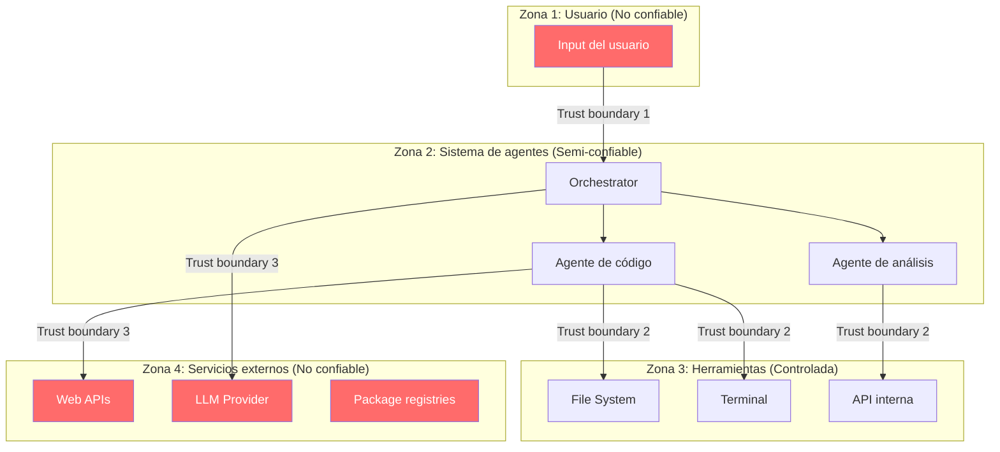
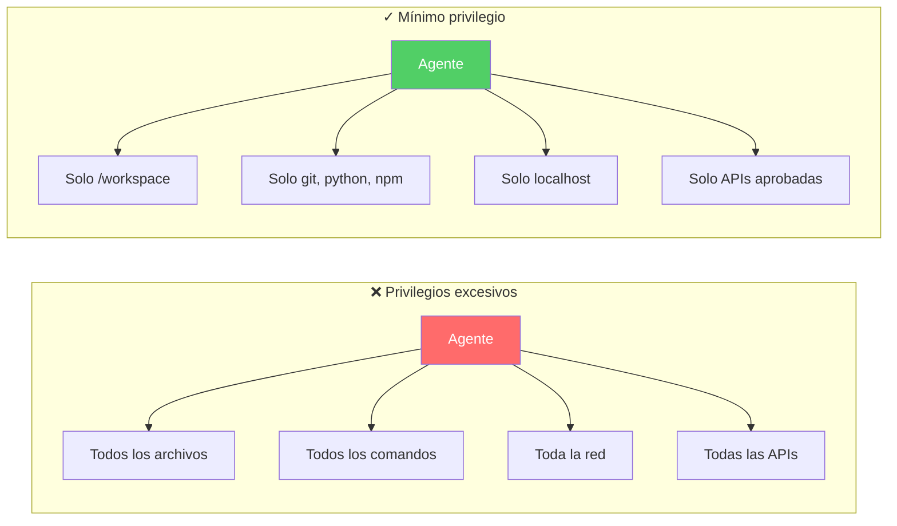
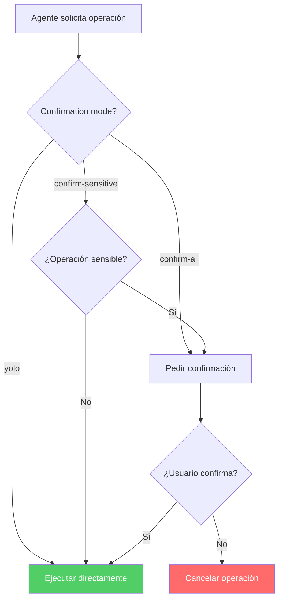
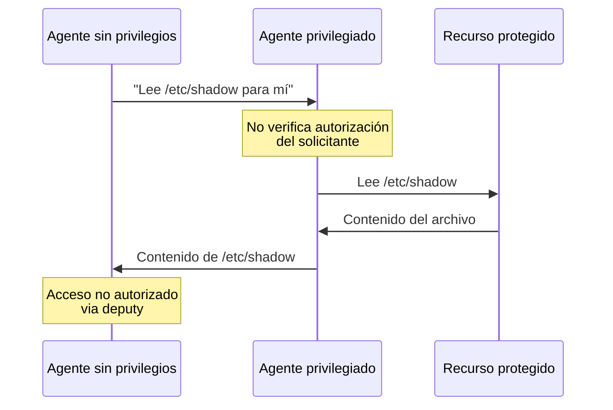

# Trust Boundaries y Mínimo Privilegio para Agentes IA

> [!abstract] Resumen
> La seguridad basada en *trust boundaries* (límites de confianza) y ==mínimo privilegio (*least privilege*)== es fundamental para agentes IA con acceso a herramientas. Este documento define zonas de confianza (usuario, agente, herramientas, servicios externos), detalla la implementación de [[architect-overview|architect]] (`allowed_tools`, confirmation modes, blocklist), analiza riesgos de escalación de privilegios en sistemas multi-agente y propone una arquitectura ==zero-trust== para agentes. La seguridad basada en capacidades (*capability-based security*) se presenta como modelo ideal.
> ^resumen

---

## Fundamentos: Trust Boundaries

### Definición

Un *trust boundary* (límite de confianza) es una ==frontera donde el nivel de confianza cambia== entre componentes de un sistema. Cada vez que datos o control cruzan un trust boundary, se requiere verificación.

> [!info] Principio fundamental
> "Never trust, always verify" - Cada componente debe verificar los datos y solicitudes que recibe, ==independientemente de quién los envíe==.

### Zonas de confianza en sistemas de agentes



### Niveles de confianza

| Zona | Nivel de confianza | Datos | Verificación requerida |
|------|-------------------|-------|----------------------|
| Usuario | ==No confiable== | Input, archivos subidos | Sanitización completa |
| Agente | Semi-confiable | Razonamiento, decisiones | Guardrails, confirmación |
| Herramientas | Controlada | Operaciones, resultados | Permisos, sandboxing |
| Servicios externos | ==No confiable== | Respuestas API, paquetes | Validación, verificación |

---

## Principio de mínimo privilegio

### Definición

El principio de mínimo privilegio (*Least Privilege*) establece que ==cada componente debe tener solo los permisos mínimos necesarios para cumplir su función==.

> [!danger] Violaciones comunes en sistemas de agentes
> - Agentes con acceso a todo el filesystem
> - Agentes que pueden ejecutar cualquier comando
> - Agentes con acceso a red sin restricciones
> - Agentes que pueden modificar su propia configuración
> - Agentes con acceso a credenciales no necesarias

### Aplicación a agentes



---

## Implementación en architect

### allowed_tools: herramientas por agente

[[architect-overview|architect]] implementa listas de herramientas permitidas por agente:

> [!success] Configuración de allowed_tools
> ```yaml
> agents:
>   code_agent:
>     allowed_tools:
>       - file_read
>       - file_write
>       - terminal_execute
>       - git_operations
>     denied_tools:
>       - web_browse
>       - send_email
>       - database_admin
>
>   review_agent:
>     allowed_tools:
>       - file_read      # Solo lectura
>       - git_diff
>       - vigil_scan     # Puede escanear código
>     denied_tools:
>       - file_write     # No puede escribir
>       - terminal_execute  # No puede ejecutar
> ```

### Confirmation modes

> [!tip] Modos de confirmación de architect
>
> | Modo | Comportamiento | Cuándo usar |
> |------|---------------|-------------|
> | `yolo` | Ejecuta todo sin confirmar | ==Solo dev local, nunca producción== |
> | `confirm-sensitive` | Confirma operaciones sensibles | ==Recomendado para desarrollo== |
> | `confirm-all` | Confirma todas las operaciones | Alta seguridad, auditoría |



### Command blocklist

> [!danger] Comandos siempre bloqueados
> Independientemente del confirmation mode, estos comandos están ==siempre bloqueados==:
> ```
> rm -rf          # Destrucción masiva
> sudo            # Escalación de privilegios
> chmod 777       # Permisos inseguros
> curl|bash       # Ejecución remota
> curl|sh         # Ejecución remota
> wget|sh         # Ejecución remota
> > /dev/sda      # Destrucción de disco
> ```

---

## Seguridad basada en capacidades

### Capability-based security

El modelo de seguridad basado en *capabilities* (capacidades) es ideal para agentes IA:

> [!info] Principios de capability-based security
> 1. **Unforgeable token**: cada capacidad es un token que no puede ser falsificado
> 2. **Transferable with restrictions**: las capacidades pueden delegarse con restricciones
> 3. **No ambient authority**: no hay permisos implícitos, solo los explícitamente otorgados
> 4. **Confinement**: un agente no puede acceder a nada fuera de sus capacidades

> [!example]- Modelo de capabilities para un agente
> ```python
> from dataclasses import dataclass
> from typing import Set, Optional
> from pathlib import Path
>
> @dataclass
> class AgentCapability:
>     """Capacidad otorgada a un agente."""
>     name: str
>     resource: str
>     operations: Set[str]
>     constraints: dict
>     expires_at: Optional[float] = None
>
> # Ejemplo: agente de desarrollo
> dev_agent_caps = [
>     AgentCapability(
>         name="workspace_access",
>         resource="/workspace/project-x",
>         operations={"read", "write", "create"},
>         constraints={
>             "max_file_size": "10MB",
>             "excluded_patterns": ["*.env", "*.pem", "*.key"],
>             "max_files_per_session": 50,
>         }
>     ),
>     AgentCapability(
>         name="terminal_access",
>         resource="terminal",
>         operations={"execute"},
>         constraints={
>             "allowed_commands": ["python", "pip", "git", "npm"],
>             "blocked_commands": ["rm -rf", "sudo", "chmod 777"],
>             "max_execution_time": 30,
>         }
>     ),
>     AgentCapability(
>         name="git_access",
>         resource="git",
>         operations={"status", "diff", "add", "commit"},
>         constraints={
>             "no_force_push": True,
>             "no_branch_delete": True,
>             "commit_requires_review": True,
>         }
>     ),
> ]
> ```

---

## Escalación de privilegios en multi-agent

### Riesgos

> [!danger] Vectores de escalación en sistemas multi-agente
> 1. **Delegation chain**: Agente A delega a B, B delega a C → C acumula permisos
> 2. **Tool chaining**: leer .env → usar credenciales → acceder a API admin
> 3. **Context poisoning**: un agente inserta instrucciones en contexto de otro
> 4. **Confused deputy**: un agente con privilegios ejecuta acciones en nombre de otro no autorizado

### Confused deputy problem



> [!warning] Mitigación del confused deputy
> - Cada solicitud inter-agente debe incluir identidad del solicitante original
> - El agente privilegiado debe verificar que el solicitante tiene permiso
> - [[licit-overview|licit]] registra la cadena de delegación completa
> - [[zero-trust-ai|Zero trust]] entre agentes: nunca confiar, siempre verificar

---

## Diseño de permisos por rol

### Roles típicos de agentes

| Rol | File read | File write | Execute | Network | Confirmación |
|-----|-----------|------------|---------|---------|-------------|
| ==Code generator== | Workspace | Workspace | python, npm | ==No== | confirm-sensitive |
| ==Code reviewer== | Todo el proyecto | ==No== | vigil | No | confirm-all |
| Test runner | Tests + src | Test results | pytest | ==No== | confirm-sensitive |
| Documentation | Docs | Docs | No | No | confirm-sensitive |
| Deployment | Config | ==No== | kubectl, docker | ==Sí (restringida)== | ==confirm-all== |

> [!question] ¿Cómo definir permisos para un nuevo agente?
> 1. Listar todas las tareas que el agente debe realizar
> 2. Para cada tarea, identificar herramientas y recursos mínimos
> 3. Crear capabilities con constraints específicos
> 4. Usar `confirm-all` inicialmente, relajar a `confirm-sensitive` tras validación
> 5. Auditar con [[licit-overview|licit]] periódicamente

---

## Zero Trust para agentes

Detalle completo en [[zero-trust-ai]], pero los principios fundamentales son:

> [!tip] Principios Zero Trust aplicados a agentes
> 1. **Verificar siempre**: autenticar cada solicitud, incluso entre agentes del mismo sistema
> 2. **Mínimo privilegio**: otorgar solo las capacidades necesarias para la tarea actual
> 3. **Asumir compromiso**: diseñar como si cualquier agente pudiera estar comprometido
> 4. **Microsegmentación**: cada agente tiene su propio boundary de seguridad
> 5. **Monitorización continua**: detectar anomalías en tiempo real

---

## Relación con el ecosistema

- **[[intake-overview]]**: intake opera en el trust boundary entre el usuario y el sistema de agentes, validando y sanitizando inputs antes de que crucen al dominio de los agentes, asegurando que solo especificaciones legítimas entren al sistema.
- **[[architect-overview]]**: architect implementa los trust boundaries internos documentados en esta nota: allowed_tools por agente, confirmation modes para operaciones sensibles, command blocklist para comandos peligrosos, y validate_path para contención de filesystem.
- **[[vigil-overview]]**: vigil opera en el trust boundary de salida, verificando que el código generado por agentes (que son semi-confiables) no contenga vulnerabilidades antes de que cruce al dominio del proyecto del usuario (zona confiable).
- **[[licit-overview]]**: licit audita todos los cruces de trust boundaries, registrando quién solicitó qué, con qué capacidades, y si se respetaron los límites de confianza, generando evidencia para compliance y post-mortem.

---

## Enlaces y referencias

> [!quote]- Bibliografía
> - Saltzer, J.H. & Schroeder, M.D. (1975). "The Protection of Information in Computer Systems." Proceedings of the IEEE.
> - Dennis, J.B. & Van Horn, E.C. (1966). "Programming Semantics for Multiprogrammed Computations." Communications of the ACM.
> - Rose, S. et al. (2020). "Zero Trust Architecture." NIST SP 800-207.
> - Microsoft. (2024). "Zero Trust Security Model." https://www.microsoft.com/en-us/security/business/zero-trust
> - Wang, L. et al. (2024). "A Survey on Large Language Model based Autonomous Agents." Frontiers of CS.

[^1]: El principio de mínimo privilegio fue formulado por Saltzer y Schroeder en 1975 y sigue siendo el fundamento de la seguridad de sistemas modernos.
