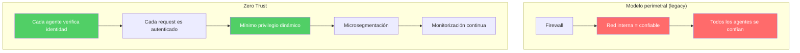
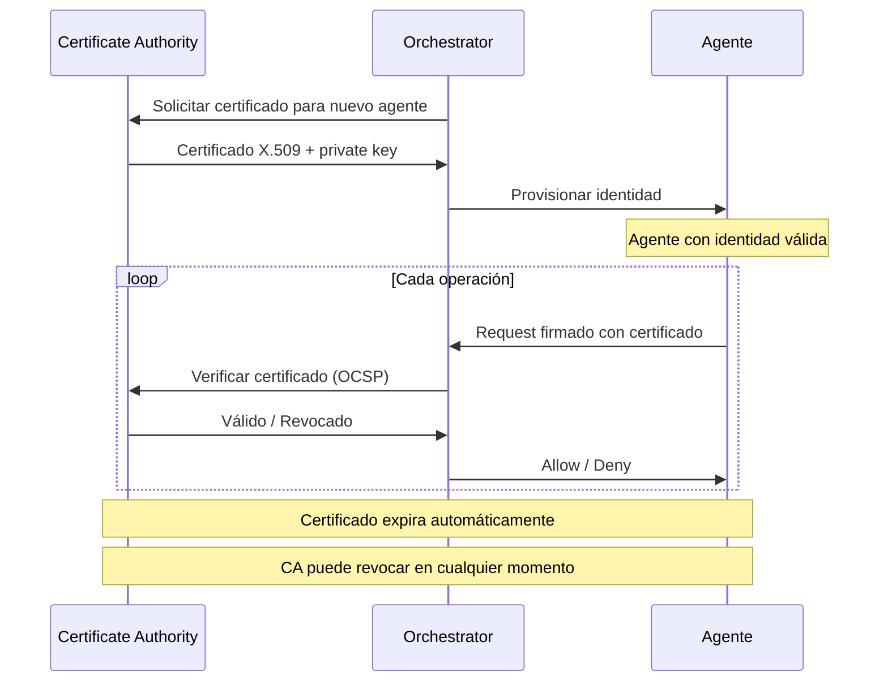
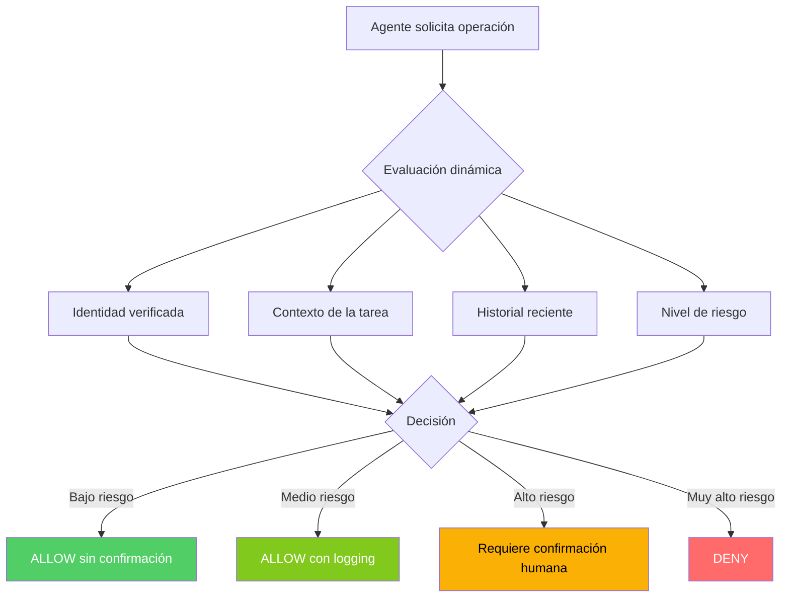
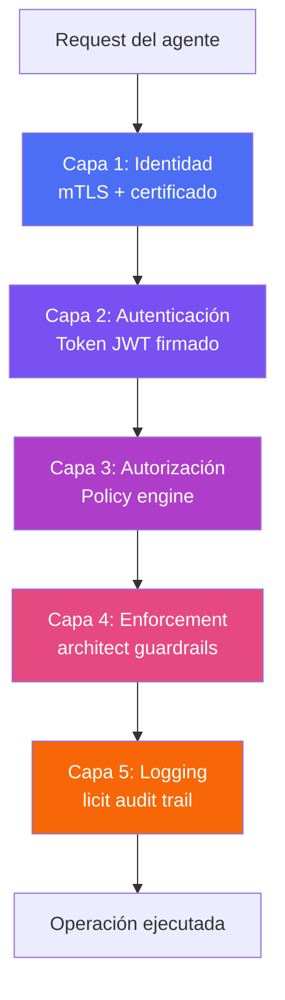

# Arquitectura Zero Trust para Agentes de IA

> [!abstract] Resumen
> La arquitectura *Zero Trust* aplicada a agentes de IA implementa el principio ==nunca confiar, siempre verificar== en cada interacción entre componentes del sistema. Este documento detalla: verificación de identidad para agentes, *mutual TLS* (mTLS) entre componentes, ==privilegio mínimo dinámico== que se adapta al contexto, microsegmentación de capacidades de agentes, políticas de red, y autenticación/autorización en cada capa. Se conecta con los confirmation modes de [[architect-overview|architect]] y los guardrails del ecosistema.
> ^resumen

---

## Principios de Zero Trust

### De la seguridad perimetral a Zero Trust



### Los 5 principios para agentes IA

| Principio | Descripción | Implementación |
|-----------|-------------|----------------|
| ==Nunca confiar== | Ningún agente es confiable por defecto | Verificar cada request |
| ==Siempre verificar== | Autenticar y autorizar cada operación | mTLS, tokens firmados |
| ==Mínimo privilegio== | Solo los permisos necesarios | Dynamic capabilities |
| ==Asumir compromiso== | Diseñar como si algún agente ya estuviera comprometido | Blast radius containment |
| ==Verificar explícitamente== | Basar decisiones en datos en tiempo real | Continuous evaluation |

> [!danger] ¿Por qué Zero Trust es esencial para agentes?
> Un agente puede ser comprometido via [[prompt-injection-seguridad|prompt injection]] sin que el sistema lo detecte inmediatamente. En un modelo de confianza tradicional, el agente comprometido podría acceder a todos los recursos internos. Con Zero Trust, ==cada request del agente comprometido se verifica individualmente==, limitando el daño.

---

## Verificación de identidad para agentes

### Identidad criptográfica

> [!info] Cada agente necesita una identidad verificable
> ```python
> from dataclasses import dataclass
> from cryptography.x509 import Certificate
>
> @dataclass
> class AgentIdentity:
>     agent_id: str              # UUID único
>     agent_type: str            # "code_generator", "reviewer", etc.
>     certificate: Certificate   # X.509 cert para mTLS
>     capabilities: list[str]    # Capacidades otorgadas
>     trust_level: str           # "high", "medium", "low"
>     created_at: float          # Timestamp de creación
>     expires_at: float          # Expiración de la identidad
>     issuer: str                # CA que emitió la identidad
> ```

### Ciclo de vida de identidad



---

## Mutual TLS entre componentes

### ¿Qué es mTLS?

*Mutual TLS* es una extensión de TLS donde ==ambas partes (cliente y servidor) se autentican mutuamente== presentando certificados. En TLS estándar, solo el servidor se autentica.

> [!tip] mTLS para comunicación entre agentes
>
> | Propiedad | TLS estándar | ==mTLS== |
> |-----------|-------------|---------|
> | Server auth | Sí | Sí |
> | Client auth | No | ==Sí== |
> | Encriptación | Sí | Sí |
> | Man-in-the-middle | Parcialmente protegido | ==Protegido== |
> | Impersonation | Posible | ==Imposible sin cert== |

> [!example]- Configuración de mTLS para agentes
> ```python
> import ssl
>
> # Configuración del servidor (orchestrator)
> server_context = ssl.SSLContext(ssl.PROTOCOL_TLS_SERVER)
> server_context.load_cert_chain(
>     certfile="orchestrator.crt",
>     keyfile="orchestrator.key"
> )
> server_context.load_verify_locations("ca.crt")
> server_context.verify_mode = ssl.CERT_REQUIRED  # Requiere cert del cliente
>
> # Configuración del cliente (agente)
> client_context = ssl.SSLContext(ssl.PROTOCOL_TLS_CLIENT)
> client_context.load_cert_chain(
>     certfile="agent-001.crt",
>     keyfile="agent-001.key"
> )
> client_context.load_verify_locations("ca.crt")
> ```

---

## Privilegio mínimo dinámico

### Definición

A diferencia del privilegio mínimo estático (permisos fijos), el privilegio mínimo ==dinámico ajusta los permisos de un agente en tiempo real== basándose en el contexto de la solicitud.



### Factores de evaluación dinámica

| Factor | Ejemplo bajo riesgo | Ejemplo alto riesgo |
|--------|---------------------|---------------------|
| Operación | Leer archivo README | ==Ejecutar comando== |
| Path | `/workspace/src/` | ==`/etc/`, `/root/`== |
| Hora | Horario laboral | 3:00 AM |
| Frecuencia | 5 operaciones en 1 hora | ==500 operaciones en 1 minuto== |
| Historial | Sin incidentes | Comandos bloqueados recientes |
| Tipo de agente | Code reviewer (read-only) | ==Code generator (read-write)== |

### Conexión con architect

[[architect-overview|architect]] implementa privilegio dinámico mediante sus confirmation modes:

> [!success] Confirmation modes como Zero Trust
> - `confirm-all`: cada operación verificada (Zero Trust estricto)
> - `confirm-sensitive`: operaciones sensibles verificadas (==Zero Trust adaptativo==)
> - `yolo`: sin verificación (no es Zero Trust, solo para desarrollo local)
>
> Los guardrails de architect (`check_command`, `check_file_access`, `validate_path`) actúan como ==políticas de enforcement== de Zero Trust.

---

## Microsegmentación de capacidades

### Definición

La microsegmentación divide las capacidades de los agentes en ==unidades granulares que se otorgan y revocan independientemente==.

> [!info] Ejemplo de microsegmentación
> En lugar de otorgar "acceso al filesystem", se otorgan:
> - `fs:read:/workspace/src/**`
> - `fs:write:/workspace/src/generated/**`
> - `fs:read:/workspace/tests/**`
> - ~~`fs:read:/workspace/.env`~~ (DENEGADO)
> - ~~`fs:write:/workspace/config/**`~~ (DENEGADO)

### Políticas de microsegmentación

> [!example]- Policy-as-code para agente
> ```yaml
> # agent-policy.yaml
> agent_id: "agent-code-gen-001"
> agent_type: "code_generator"
> trust_level: "medium"
>
> capabilities:
>   filesystem:
>     read:
>       allow:
>         - "/workspace/src/**"
>         - "/workspace/docs/**"
>       deny:
>         - "**/.env*"
>         - "**/*.pem"
>         - "**/*.key"
>         - "**/credentials*"
>
>     write:
>       allow:
>         - "/workspace/src/generated/**"
>       deny:
>         - "/workspace/src/core/**"
>
>   commands:
>     allow:
>       - "python"
>       - "pip install --dry-run"
>       - "git status"
>       - "git diff"
>     deny:
>       - "sudo *"
>       - "rm -rf *"
>       - "chmod 777 *"
>       - "curl|bash"
>
>   network:
>     allow:
>       - "pypi.org:443"
>       - "registry.npmjs.org:443"
>     deny:
>       - "*"  # Deny all by default
>
>   tools:
>     allow:
>       - "file_read"
>       - "file_write"
>       - "terminal_execute"
>       - "vigil_scan"
>     deny:
>       - "web_browse"
>       - "send_email"
>       - "database_admin"
> ```

---

## Autenticación y autorización en cada capa

### Stack de seguridad Zero Trust



### Tokens de sesión firmados

> [!tip] JWT con scope limitado
> ```json
> {
>   "header": {
>     "alg": "ES256",
>     "typ": "JWT"
>   },
>   "payload": {
>     "sub": "agent-code-gen-001",
>     "type": "code_generator",
>     "iss": "orchestrator",
>     "iat": 1717200000,
>     "exp": 1717203600,
>     "scope": ["fs:read:workspace", "fs:write:generated", "cmd:python"],
>     "task_id": "task-abc-123",
>     "max_operations": 100,
>     "trust_level": "medium"
>   }
> }
> ```

---

## Monitorización continua

### Detección de anomalías

> [!warning] Señales de agente comprometido
> - Acceso a archivos fuera del patrón normal
> - Frecuencia de operaciones anormalmente alta
> - Intentos de acceder a archivos sensibles
> - Comandos bloqueados repetidos
> - Patrones de [[data-exfiltration-agents|exfiltración de datos]]
> - Cambio abrupto en tipo de operaciones

> [!question] ¿Cómo detectar un agente comprometido via prompt injection?
> Un agente comprometido por prompt injection puede mantener comportamiento "normal" excepto por señales sutiles:
> - Tool calls a URLs externas no habituales
> - Acceso a archivos que no son relevantes para la tarea
> - Generación de código con patrones de [[seguridad-codigo-generado-ia|vulnerabilidades conocidas]]
> - Intentos de acceder al system prompt ([[prompt-leaking]])

---

## Relación con el ecosistema

- **[[intake-overview]]**: intake implementa Zero Trust en la frontera exterior del sistema, verificando y autenticando cada especificación de entrada antes de permitir su procesamiento, sin asumir que ninguna entrada es benigna.
- **[[architect-overview]]**: architect es el enforcement layer principal de Zero Trust, implementando verificación en cada operación (check_command, check_file_access, validate_path), confirmation modes como políticas de confianza, y command blocklist como deny-by-default.
- **[[vigil-overview]]**: vigil actúa como capa de verificación post-operación en el modelo Zero Trust, escaneando outputs de agentes para detectar código vulnerable que podría indicar un agente comprometido operando dentro de sus permisos pero generando output malicioso.
- **[[licit-overview]]**: licit implementa la capa de logging y auditoría de Zero Trust, registrando cada operación, decisión de autorización y resultado para permitir investigación forense y verificación de compliance.

---

## Enlaces y referencias

> [!quote]- Bibliografía
> - Rose, S., Borchert, O., Mitchell, S., & Connelly, S. (2020). "Zero Trust Architecture." NIST SP 800-207.
> - Microsoft. (2024). "Zero Trust Deployment Guide." https://learn.microsoft.com/en-us/security/zero-trust/
> - Google. (2024). "BeyondCorp: A New Approach to Enterprise Security." Google Research.
> - Gilman, E. & Barth, D. (2017). "Zero Trust Networks." O'Reilly Media.
> - CISA. (2024). "Zero Trust Maturity Model." https://www.cisa.gov/zero-trust-maturity-model

[^1]: NIST SP 800-207 define Zero Trust como un paradigma de seguridad que elimina la confianza implícita y requiere verificación continua.
