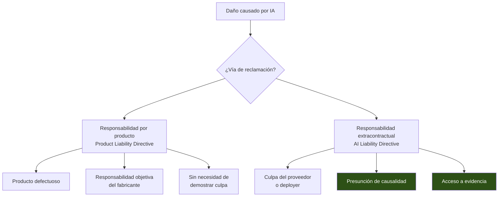
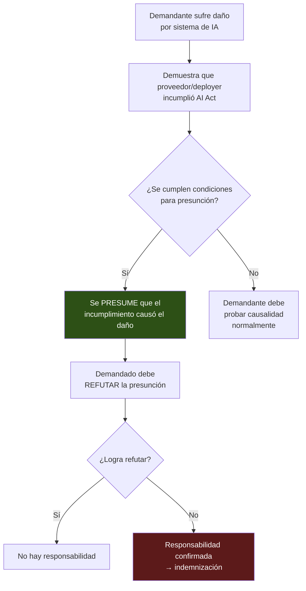
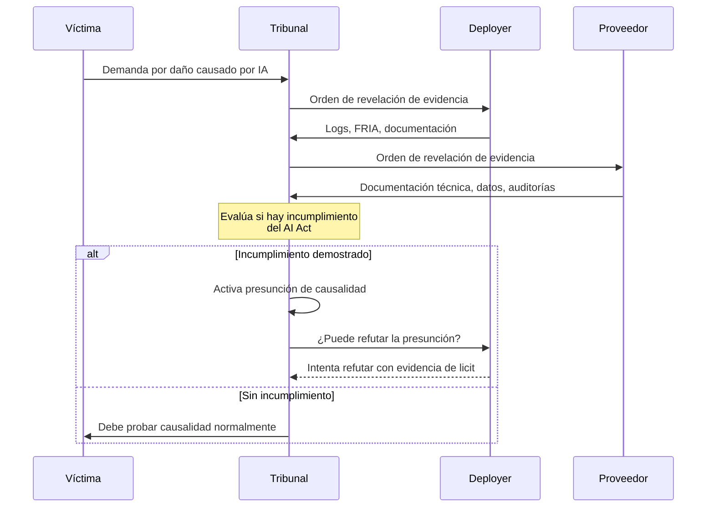
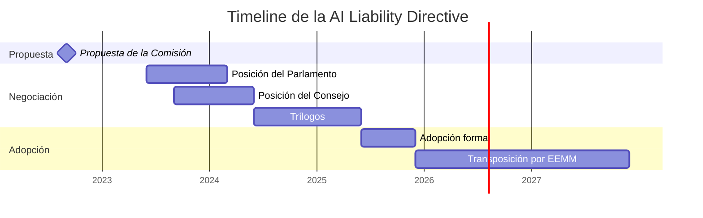

# EU AI Liability Directive

> [!abstract] Resumen ejecutivo
> La *AI Liability Directive* (AILD) propuesta por la Comisión Europea complementa el [[eu-ai-act-completo|EU AI Act]] con un régimen de ==responsabilidad civil extracontractual específico para daños causados por IA==. Introduce dos mecanismos revolucionarios: la ==presunción de causalidad== (si se demuestra incumplimiento del AI Act, se presume que el daño fue causado por la IA) y el ==derecho de acceso a evidencia== (obligación de los proveedores y *deployers* de revelar documentación técnica). La evidencia generada por [[licit-overview|licit]] es directamente relevante tanto para demandantes como para demandados.
> ^resumen

---

## Contexto legislativo

La Comisión Europea presentó la propuesta de AILD en septiembre de 2022[^1] como parte de un paquete legislativo que incluye la revisión de la *Product Liability Directive* (PLD). Juntas, estas directivas abordan dos vías de responsabilidad:



> [!warning] Estado legislativo
> La AILD es una ==propuesta== de directiva que sigue en trámite legislativo. Los Estados miembros deben transponer la directiva una vez aprobada. El texto final puede diferir del propuesto. Verificar el estado actual antes de tomar decisiones de compliance.

---

## El problema de la responsabilidad civil e IA

> [!question] ¿Por qué es necesaria una directiva específica?
> El régimen general de responsabilidad civil no está diseñado para IA porque:
> 1. **Opacidad**: Muchos sistemas de IA son ==cajas negras== — el demandante no puede demostrar *cómo* la IA causó el daño
> 2. **Complejidad técnica**: Probar la ==cadena causal== entre un defecto del modelo y el daño es extremadamente difícil
> 3. **Asimetría de información**: El proveedor tiene toda la información técnica; el afectado, ninguna
> 4. **Autonomía**: La IA toma decisiones que ==no fueron programadas explícitamente==
> 5. **Multi-actores**: La cadena proveedor → *deployer* → usuario complica la atribución

### Ejemplo del problema

> [!example]- Escenario: daño por scoring crediticio discriminatorio
> ```
> Situación:
> - María solicita un préstamo y es rechazada
> - Sospecha que el sistema de scoring IA la discriminó por su género
>
> Sin la AILD (régimen general):
> ├── María debe demostrar:
> │   ├── Que el sistema tiene un defecto (sesgo de género)
> │   ├── Que el defecto causó su rechazo (causalidad)
> │   ├── Que sufrió un daño (pérdida económica)
> │   └── Que el banco fue negligente (culpa)
> ├── Problema: María no tiene acceso al modelo,
> │   los datos de entrenamiento ni las métricas de equidad
> └── Resultado: Casi imposible ganar el caso
>
> Con la AILD:
> ├── María solicita acceso a evidencia → banco debe revelar
> │   documentación técnica relevante
> ├── Si se demuestra que el banco incumplió el AI Act
> │   (ej: no evaluó sesgos Art. 10):
> │   └── Se PRESUME que el incumplimiento causó el daño
> ├── El banco debe demostrar que el incumplimiento
> │   NO causó el rechazo (inversión de carga de prueba)
> └── Resultado: Caso viable para María
> ```

---

## Mecanismo 1: Presunción de causalidad

> [!danger] Innovación jurídica fundamental
> La presunción de causalidad es el ==mecanismo más disruptivo== de la AILD. Funciona así:



### Condiciones para la presunción

| Condición | Descripción |
|---|---|
| 1. Culpa | El demandado ==incumplió una obligación== relevante (del AI Act u otra norma) |
| 2. Razonabilidad | Es ==razonablemente probable== que el incumplimiento influyó en el resultado |
| 3. Relación | El resultado está dentro del ==tipo de riesgo== que la obligación pretendía prevenir |

> [!tip] Implicaciones para proveedores y deployers
> La presunción de causalidad convierte el ==cumplimiento del EU AI Act en una defensa jurídica==. Si un proveedor puede demostrar que cumplió todas sus obligaciones (Arts. 9-15), la presunción no se activa. [[licit-overview|licit]] genera la evidencia de cumplimiento necesaria para esta defensa.

---

## Mecanismo 2: Derecho de acceso a evidencia

> [!success] Disclosure of evidence — equilibrar la asimetría
> El demandante puede solicitar a un tribunal que ordene al proveedor o *deployer* la ==revelación de evidencia== relevante:

| Evidencia accesible | Proveedor | *Deployer* |
|---|---|---|
| Documentación técnica (Anexo IV) | ==Sí== | — |
| Logs del sistema | Sí | ==Sí== |
| Datos de entrenamiento (metadatos) | ==Sí== | — |
| Resultados de evaluaciones de conformidad | ==Sí== | — |
| FRIA | — | ==Sí== |
| Informes de incidentes | ==Sí== | ==Sí== |
| Resultados de auditorías | ==Sí== | ==Sí== |

> [!warning] Límites del acceso a evidencia
> El acceso no es ilimitado. El tribunal debe:
> - Evaluar la ==proporcionalidad== de la solicitud
> - Proteger ==secretos comerciales y confidencialidad== industrial
> - Limitar la solicitud a la evidencia ==necesaria y relevante==
> - Imponer obligaciones de confidencialidad al demandante

### Implicación para licit

> [!info] Evidence bundles como evidencia procesal
> Los *evidence bundles* de [[licit-overview|licit]] con firma criptográfica (*Merkle tree* + HMAC) pueden servir como ==evidencia procesal== en litigios bajo la AILD:
> - **Para el demandado**: Demostrar cumplimiento del AI Act (refutar presunción)
> - **Para el demandante**: Revelar incumplimientos documentados
> - **Para el tribunal**: Verificar integridad de la evidencia con `licit verify`

---

## Product Liability Directive revisada

La PLD revisada complementa la AILD con ==responsabilidad objetiva== (*strict liability*) para productos con IA:

| Aspecto | PLD actual | PLD revisada |
|---|---|---|
| Cobertura | Productos tangibles | ==Productos tangibles + software + IA== |
| Tipo de responsabilidad | Objetiva | ==Objetiva== (sin necesidad de culpa) |
| Defecto | Producto no ofrece seguridad esperada | Ídem + ==falta de actualizaciones== |
| Carga de la prueba | Demandante prueba defecto | Aligerada + ==presunción de defecto== |
| Componentes | Fabricante del producto final | ==También fabricante de componentes== (IA) |

> [!danger] Implicación para proveedores de IA
> Bajo la PLD revisada, un proveedor de un modelo de IA que se integre como componente en un producto es ==responsable objetivamente== si el modelo es defectuoso y causa daño, incluso sin culpa. Esto es responsabilidad sin culpa — *strict liability*.

---

## Impacto en la cadena de valor



> [!warning] Responsabilidad en cascada
> Si el *deployer* es condenado, puede ==repetir contra el proveedor== si el daño fue causado por un defecto en el sistema de IA suministrado. Esto crea una ==cadena de responsabilidad== que requiere contratos claros ([[contratos-sla-ia]]) y evidencia de cumplimiento en cada eslabón.

---

## Estrategia de defensa con licit

### Para proveedores

```bash
# Generar evidencia de cumplimiento preventiva
licit assess --full --project ./mi-sistema --bundle --sign

# Documentación técnica completa
licit annex-iv --project ./mi-sistema --output ./defense-evidence/

# Verificar integridad de evidencia histórica
licit verify --bundle ./evidence/2025-Q1-bundle.json
```

### Para *deployers*

```bash
# FRIA documentada
licit fria --project ./mi-despliegue --output ./defense-evidence/

# Evidencia de supervisión humana
# → architect sessions proporcionan audit trails

# Evidencia de conservación de logs
# → architect traces con retención configurada
```

> [!success] La mejor defensa es el cumplimiento proactivo
> Organizaciones que ==documentan su cumplimiento continuamente== con [[licit-overview|licit]] y [[architect-overview|architect]] están mejor posicionadas para defenderse ante reclamaciones bajo la AILD. La evidencia generada ==antes del incidente== es más creíble que la producida después.

---

## Conexión con seguros

La AILD tiene un impacto directo en el mercado de [[seguros-ia|seguros de IA]]:

> [!tip] Implicaciones para aseguradoras
> - La presunción de causalidad ==aumenta la probabilidad== de condenas → primas más altas
> - Evidencia de cumplimiento del AI Act → ==descuentos en primas==
> - Los *evidence bundles* de [[licit-overview|licit]] como requisito para pólizas
> - Necesidad de nuevos productos de seguros específicos para IA

---

## Timeline y estado



> [!question] ¿Cuándo será aplicable?
> La AILD es una ==directiva== (no un reglamento), por lo que cada Estado miembro deberá ==transponerla a su derecho nacional==. El plazo de transposición será probablemente de 2 años desde su adopción. Verificar el estado actual del proceso legislativo.

---

## Relación con el ecosistema

La AILD hace que la generación de evidencia de compliance sea una necesidad de negocio, no solo regulatoria:

- **[[intake-overview|intake]]**: Los requisitos de responsabilidad civil se capturan como *intake items* que informan las medidas preventivas. Los requisitos de documentación procesal se integran en el ciclo de desarrollo.

- **[[architect-overview|architect]]**: Los *audit trails* de [[architect-overview|architect]] son ==evidencia directa en litigios==. Las sesiones registran quién tomó qué decisión, cuándo y con qué información. Esta trazabilidad puede ser la diferencia entre ganar y perder un caso.

- **[[vigil-overview|vigil]]**: Los escaneos de seguridad de [[vigil-overview|vigil]] documentan el estado de robustez y ciberseguridad del sistema. Demostrar que se realizaron escaneos regulares y se corrigieron vulnerabilidades es evidencia de cumplimiento del Art. 15.

- **[[licit-overview|licit]]**: Los *evidence bundles* firmados criptográficamente son ==la pieza central de defensa== bajo la AILD. `licit verify` permite a terceros (tribunales, peritos, aseguradoras) verificar la integridad y autenticidad de la evidencia de cumplimiento.

---

## Enlaces y referencias

> [!quote]- Bibliografía y fuentes
> - [^1]: European Commission, "Proposal for a Directive on adapting non-contractual civil liability rules to artificial intelligence", COM(2022) 496 final, septiembre 2022.
> - Hacker, P. (2023). "The European AI Liability Directives — Critique of a Half-Hearted Approach". *arXiv:2211.13960*.
> - Bertolini, A. (2024). "Artificial Intelligence and Civil Liability". European Parliament.
> - [[eu-ai-act-completo]] — EU AI Act — requisitos cuyo incumplimiento activa la presunción
> - [[eu-ai-act-proveedores-vs-deployers]] — Roles y responsabilidades
> - [[contratos-sla-ia]] — Cláusulas contractuales de responsabilidad
> - [[seguros-ia]] — Seguros para IA
> - [[auditoria-ia]] — Auditoría como evidencia de cumplimiento

[^1]: COM(2022) 496 final — Propuesta de la Comisión Europea de septiembre de 2022.
