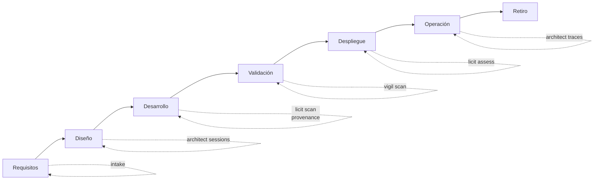
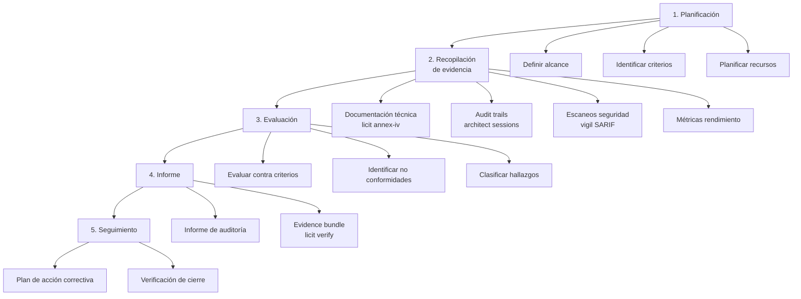

# Auditoría de Sistemas de IA

> [!abstract] Resumen ejecutivo
> La auditoría de sistemas de IA es un ==proceso sistemático e independiente de evaluación== que verifica el cumplimiento normativo, la calidad técnica y el comportamiento ético de un sistema de IA. Existen cuatro tipos principales: auditoría técnica, de procesos, de compliance y algorítmica. El [[eu-ai-act-completo|EU AI Act]] requiere evaluaciones de conformidad (Art. 43) y auditorías internas. El ecosistema proporciona herramientas especializadas: [[licit-overview|licit]] para evidencia de compliance, [[architect-overview|architect]] para *audit trails* técnicos, y [[vigil-overview|vigil]] para auditoría de seguridad.
> ^resumen

---

## Tipos de auditoría de IA

```mermaid
graph TD
    A[Auditoría de IA] --> B[Auditoría técnica]
    A --> C[Auditoría de procesos]
    A --> D[Auditoría de compliance]
    A --> E[Auditoría algorítmica]

    B --> B1[Rendimiento del modelo]
    B --> B2[Robustez y seguridad]
    B --> B3[Explicabilidad]
    B --> B4[Drift y degradación]

    C --> C1[Desarrollo y ciclo de vida]
    C --> C2[Gobernanza de datos]
    C --> C3[Gestión de riesgos]
    C --> C4[Supervisión humana]

    D --> D1[EU AI Act]
    D --> D2[GDPR]
    D --> D3[Regulación sectorial]
    D --> D4[Estándares ISO]

    E --> E1[Equidad y sesgos]
    E --> E2[Discriminación]
    E --> E3[Impacto social]
    E --> E4[Transparencia]

    style B fill:#1a3a5c,color:#fff
    style C fill:#2d5016,color:#fff
    style D fill:#4a1a5c,color:#fff
    style E fill:#8b4513,color:#fff
```



---

## Auditoría técnica

### Evaluación de rendimiento del modelo

> [!info] Métricas clave para auditoría técnica
> | Métrica | Tipo de modelo | Umbral típico | Herramienta |
> |---|---|---|---|
> | Precisión (*Accuracy*) | Clasificación | ==Depende del contexto== | Frameworks ML |
> | F1-Score | Clasificación desbalanceada | >0.80 | Frameworks ML |
> | AUC-ROC | Clasificación binaria | >0.85 | Frameworks ML |
> | RMSE | Regresión | Específico del dominio | Frameworks ML |
> | Latencia p99 | Todos | ==<200ms producción== | [[architect-overview\|architect]] traces |
> | Throughput | Todos | Según SLA | [[architect-overview\|architect]] metrics |

### Evaluación de robustez

> [!warning] Tests de robustez obligatorios
> Para sistemas de [[eu-ai-act-alto-riesgo|alto riesgo]] (Art. 15), la auditoría debe incluir:
> - **Adversarial testing**: Ataques adversariales para evaluar resistencia
> - **Data perturbation**: Evaluar comportamiento ante datos ruidosos o incompletos
> - **Distribution shift**: Evaluar rendimiento ante cambios de distribución
> - **Stress testing**: Evaluar comportamiento bajo carga extrema
> - **Failure mode analysis**: Identificar modos de fallo del sistema

```bash
# Escaneo de seguridad con vigil
vigil scan --project ./mi-sistema --output ./audit/vigil-sarif.json

# El resultado SARIF se incorpora a la auditoría
licit assess --vigil-sarif ./audit/vigil-sarif.json
```

### Evaluación de explicabilidad

| Método | Tipo | Scope | Herramienta |
|---|---|---|---|
| ==SHAP== | Post-hoc | Global + local | shap library |
| LIME | Post-hoc | Local | lime library |
| Feature importance | Intrínseca | Global | Frameworks ML |
| Attention maps | Intrínseca | Local | Modelos transformer |
| Counterfactual | Post-hoc | Local | DiCE, Alibi |

---

## Auditoría de procesos

### Ciclo de vida del sistema



> [!tip] Evidencia por fase
> | Fase | Evidencia de auditoría | Herramienta |
> |---|---|---|
> | Requisitos | Documentos de requisitos normalizados | [[intake-overview\|intake]] |
> | Diseño | Decisiones de diseño, ADRs | [[architect-overview\|architect]] sessions |
> | Desarrollo | ==Procedencia del código==, revisiones | [[licit-overview\|licit]] scan |
> | Validación | Resultados de pruebas, métricas | Frameworks ML + [[vigil-overview\|vigil]] |
> | Despliegue | Evaluación de conformidad | [[licit-overview\|licit]] assess |
> | Operación | ==Audit trails, logs, métricas== | [[architect-overview\|architect]] traces |
> | Retiro | Documentación de retiro | Manual |

### Gobernanza de datos

La auditoría de procesos de datos verifica:

- [ ] Documentación del origen de todos los datasets ([[data-governance-ia]])
- [ ] Base legal GDPR para cada dataset con datos personales
- [ ] Proceso de curación documentado y reproducible
- [ ] Análisis de sesgos realizado y documentado
- [ ] Proceso de actualización de datos definido
- [ ] Política de retención de datos implementada

---

## Auditoría de compliance

### EU AI Act — Evaluación de conformidad (Art. 43)

> [!danger] Requisitos de conformidad
> La evaluación de conformidad es ==obligatoria para todos los sistemas de alto riesgo== antes de su comercialización o puesta en servicio. Puede ser:
> - **Auto-evaluación**: Para la mayoría de sistemas del [[eu-ai-act-alto-riesgo|Anexo III]] (excepto biometría)
> - **Evaluación por organismo notificado**: Para biometría y productos regulados del Anexo I

```bash
# Auto-evaluación de conformidad con licit
licit assess --full --project ./mi-sistema \
  --architect-sessions ./sessions/ \
  --vigil-sarif ./reports/ \
  --output ./audit/conformity/

# Resultado:
# ═══════════════════════════════════════════
# EVALUACIÓN DE CONFORMIDAD - EU AI ACT
# ═══════════════════════════════════════════
# Art. 9  Gestión de riesgos:     ✓ CONFORME
# Art. 10 Gobernanza de datos:    ✗ NO CONFORME
#   → Falta: análisis de sesgos documentado
# Art. 11 Documentación técnica:  ⚠ PARCIAL
#   → Falta: Sección 2c.4 del Anexo IV
# Art. 12 Logging:                ✓ CONFORME
# Art. 13 Transparencia:          ✓ CONFORME
# Art. 14 Supervisión humana:     ✓ CONFORME
# Art. 15 Precisión/robustez:     ✓ CONFORME
#
# Score global: 82% (5/7 conforme, 1 parcial, 1 no conforme)
```

### Checklist de auditoría de compliance

> [!example]- Checklist completo de auditoría EU AI Act
> ```markdown
> ## Checklist de Auditoría EU AI Act
>
> ### Clasificación de riesgo
> - [ ] Sistema clasificado según nivel de riesgo
> - [ ] Justificación documentada si excepción Art. 6(3)
> - [ ] Clasificación revisada ante cambios
>
> ### Art. 9 - Gestión de riesgos
> - [ ] Sistema de gestión de riesgos implementado
> - [ ] Riesgos identificados y documentados
> - [ ] Probabilidad e impacto evaluados
> - [ ] Medidas de mitigación implementadas
> - [ ] Riesgo residual documentado y aceptado
> - [ ] Revisión periódica programada
>
> ### Art. 10 - Gobernanza de datos
> - [ ] Origen de datos documentado
> - [ ] Calidad de datos evaluada
> - [ ] Representatividad analizada
> - [ ] Sesgos detectados y mitigados
> - [ ] Base legal GDPR documentada
> - [ ] DPIA completada si necesario
>
> ### Art. 11 - Documentación técnica
> - [ ] Documentación Anexo IV completa
> - [ ] Actualizada con versión actual del sistema
> - [ ] Accesible para autoridades
>
> ### Art. 12 - Logging
> - [ ] Capacidad de logging implementada
> - [ ] Logs conservados mínimo 6 meses
> - [ ] Trazabilidad de decisiones verificada
>
> ### Art. 13 - Transparencia
> - [ ] Instrucciones de uso proporcionadas
> - [ ] Limitaciones documentadas
> - [ ] Información sobre supervisión humana
>
> ### Art. 14 - Supervisión humana
> - [ ] Mecanismos de supervisión implementados
> - [ ] Capacidad de anulación verificada
> - [ ] Botón de parada funcional
> - [ ] Personal formado
>
> ### Art. 15 - Precisión/robustez/ciberseguridad
> - [ ] Métricas de precisión documentadas
> - [ ] Tests de robustez ejecutados
> - [ ] Evaluación de ciberseguridad realizada
> - [ ] Resiliencia ante fallos verificada
> ```

---

## Auditoría algorítmica

### Evaluación de equidad y sesgos

> [!danger] La auditoría algorítmica es esencial
> La auditoría algorítmica evalúa si el sistema produce ==resultados discriminatorios== contra grupos protegidos. Es un requisito implícito del Art. 10 (gobernanza de datos) y explícito en la [[eu-ai-act-fria|FRIA]] (Art. 27).

| Métrica de equidad | Fórmula simplificada | Umbral |
|---|---|---|
| ==Disparate Impact Ratio== | P(positivo\|grupo_min) / P(positivo\|grupo_may) | >0.80 |
| Equal Opportunity | TPR_grupo_min ≈ TPR_grupo_may | <0.05 diferencia |
| Predictive Parity | Precision_min ≈ Precision_may | <0.05 diferencia |
| Calibration | P(Y=1\|score=s) ≈ s, para todos los grupos | <0.10 diferencia |

> [!warning] Imposibilidad de equidad simultánea
> El ==teorema de imposibilidad de Chouldechova-Kleinberg== demuestra que es matemáticamente imposible satisfacer simultáneamente todas las métricas de equidad cuando las tasas base difieren entre grupos. La auditoría debe documentar ==qué métricas se priorizaron y por qué==.

---

## Proceso de auditoría



### 1. Planificación

> [!info] Elementos del plan de auditoría
> - **Alcance**: Qué sistema(s), qué aspectos, qué período
> - **Criterios**: EU AI Act, ISO 42001, GDPR, políticas internas
> - **Equipo**: Auditores cualificados (ver [[iso-standards-ia|ISO/IEC 42006]])
> - **Calendario**: Fechas, hitos, entregables
> - **Recursos**: Acceso a sistemas, documentación, personal

### 2. Recopilación de evidencia

> [!success] Fuentes de evidencia automatizadas
> | Fuente | Herramienta | Tipo de evidencia |
> |---|---|---|
> | Documentación técnica | `licit annex-iv` | ==Completitud vs Anexo IV== |
> | Evaluación de compliance | `licit assess` | Score de cumplimiento |
> | Procedencia del código | `licit scan` | Distribución humano/IA |
> | FRIA | `licit fria` | Evaluación de impacto |
> | OWASP Agentic | `licit owasp` | Evaluación de seguridad agéntica |
> | Audit trails | [[architect-overview\|architect]] sessions | Trazabilidad de decisiones |
> | Traces operativos | [[architect-overview\|architect]] traces | Rendimiento y comportamiento |
> | Costes | [[architect-overview\|architect]] cost tracking | Eficiencia operativa |
> | Seguridad | [[vigil-overview\|vigil]] SARIF | ==Vulnerabilidades detectadas== |

### 3. Evaluación

Clasificación de hallazgos:

| Clasificación | Descripción | Acción requerida |
|---|---|---|
| ==No conformidad mayor== | Incumplimiento significativo de requisito obligatorio | Acción correctiva inmediata |
| No conformidad menor | Incumplimiento parcial o de bajo impacto | Acción correctiva planificada |
| Observación | Área de mejora potencial | Recomendación |
| Buena práctica | Implementación ejemplar | Reconocimiento |

### 4. Informe

> [!tip] Estructura del informe de auditoría
> ```markdown
> 1. Resumen ejecutivo
> 2. Alcance y criterios de auditoría
> 3. Metodología
> 4. Hallazgos
>    4.1 No conformidades mayores
>    4.2 No conformidades menores
>    4.3 Observaciones
>    4.4 Buenas prácticas
> 5. Conclusiones y score global
> 6. Plan de acciones correctivas
> 7. Anexos (evidencia detallada)
> ```

---

## Auditoría interna vs. externa

| Aspecto | Auditoría interna | Auditoría externa |
|---|---|---|
| Quién | ==Equipo de auditoría interna== | Organismo notificado / auditor externo |
| Cuándo | Periódica (trimestral/anual) | Puntual o por requerimiento |
| Obligatoria | Sí (ISO 42001, Art. 17 AI Act) | Solo para biometría (Art. 43) |
| Independencia | Funcional | ==Total== |
| Coste | Interno | Variable (€10K-€100K+) |
| Certificación | No emite certificado | ==Puede emitir certificado== |

---

## Evidence bundles como soporte de auditoría

> [!success] Integridad criptográfica de la evidencia
> Los *evidence bundles* de [[licit-overview|licit]] garantizan la integridad de la evidencia mediante:
> - **Merkle tree**: Estructura de hash que permite verificar la integridad de ==cada pieza de evidencia== independientemente
> - **HMAC**: Firma criptográfica que verifica la autenticidad del bundle completo
> - **Timestamps**: Sellado temporal que demuestra ==cuándo se generó la evidencia==
> - `licit verify`: Comando de verificación que cualquier auditor puede ejecutar

```bash
# Verificar integridad de un evidence bundle
licit verify --bundle ./audit/evidence-bundle-2025-Q1.json

# Resultado:
# ✓ Firma HMAC válida
# ✓ Merkle tree íntegro (47/47 hojas verificadas)
# ✓ Timestamp: 2025-03-31T23:59:59Z
# ✓ Contenido: 12 documentos, 8 escaneos, 3 evaluaciones
# → Bundle VERIFICADO
```

---

## Relación con el ecosistema

La auditoría de IA es el punto donde convergen todas las herramientas del ecosistema:

- **[[intake-overview|intake]]**: Los requisitos capturados por [[intake-overview|intake]] son los ==criterios de auditoría==. Cada requisito normalizado se convierte en un criterio verificable contra el que se evalúa el sistema durante la auditoría.

- **[[architect-overview|architect]]**: Proporciona los ==audit trails más detallados== del ecosistema. Las sesiones registran decisiones de diseño, los *traces* capturan el comportamiento operativo, y el *cost tracking* documenta la eficiencia. Todo es evidencia auditable.

- **[[vigil-overview|vigil]]**: Los escaneos de seguridad de [[vigil-overview|vigil]] son ==evidencia directa para la auditoría técnica== (robustez, ciberseguridad). Los resultados SARIF se incorporan al *evidence bundle* y se evalúan contra los criterios del Art. 15.

- **[[licit-overview|licit]]**: Es la ==herramienta de auditoría de compliance por excelencia==. `licit assess` realiza la evaluación de conformidad, `licit annex-iv` verifica la documentación técnica, `licit owasp` evalúa seguridad agéntica, y `licit verify` permite a auditores externos verificar la integridad de toda la evidencia.

---

## Enlaces y referencias

> [!quote]- Bibliografía y fuentes
> - [^1]: Reglamento (UE) 2024/1689, Artículo 43 — Evaluación de conformidad.
> - Raji, I.D. et al. (2020). "Closing the AI Accountability Gap: Defining an End-to-End Framework for Internal Algorithmic Auditing". *FAT* 2020*.
> - Mökander, J. & Floridi, L. (2023). "Operationalising AI governance through ethics-based auditing". *AI and Ethics*.
> - ISO/IEC 42006: Requisitos para organismos que auditan sistemas de IA.
> - [[eu-ai-act-completo]] — Requisitos de evaluación de conformidad
> - [[iso-standards-ia]] — ISO 42001 y 42006
> - [[gobernanza-ia-empresarial]] — Auditoría interna en gobernanza
> - [[compliance-cicd]] — Auditoría automatizada en CI/CD

[^1]: Art. 43 del Reglamento (UE) 2024/1689 sobre evaluación de conformidad.
