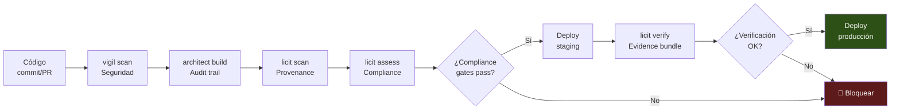

# Compliance Automatizado en Pipelines CI/CD

> [!abstract] Resumen ejecutivo
> *Compliance as Code* integra verificaciones de cumplimiento regulatorio ==directamente en los pipelines CI/CD==, automatizando controles que tradicionalmente eran manuales y puntuales. La arquitectura del pipeline sigue el flujo: código → [[vigil-overview|vigil]] scan → [[architect-overview|architect]] build → [[licit-overview|licit]] assess → deploy. Cada herramienta actúa como una ==*compliance gate*== que puede bloquear o permitir el avance. El comando `licit verify` valida *evidence bundles* como condición de despliegue, y los *exit codes* permiten distinguir entre checks bloqueantes y no bloqueantes.
> ^resumen

---

## ¿Por qué compliance en CI/CD?

> [!question] El problema del compliance manual
> | Aspecto | Compliance manual | Compliance automatizado |
> |---|---|---|
> | Frecuencia | Trimestral/anual | ==Cada commit/merge== |
> | Cobertura | Muestreo | ==100%== |
> | Consistencia | Variable según auditor | Determinista |
> | Velocidad | Semanas/meses | ==Minutos== |
> | Coste por evaluación | Alto | Bajo (después de setup) |
> | Documentación | Manual, propensa a errores | ==Automática y trazable== |
> | Integración con desarrollo | Separada | ==Integrada== |

> [!tip] Shift-left compliance
> Igual que *shift-left testing* mueve las pruebas al inicio del ciclo de desarrollo, ==*shift-left compliance*== integra verificaciones regulatorias desde el primer commit, detectando incumplimientos cuando son baratos de corregir.

---

## Arquitectura del pipeline



### Detalle por etapa

| Etapa | Herramienta | Qué verifica | Exit code |
|---|---|---|---|
| 1. Seguridad | [[vigil-overview\|vigil]] scan | Vulnerabilidades, SARIF | ==0=pass, 1=fail== |
| 2. Audit trail | [[architect-overview\|architect]] build | Sesión registrada, traces | 0=ok |
| 3. Provenance | `licit scan` | ==Procedencia del código== | 0=ok, 1=warning |
| 4. Compliance | `licit assess` | EU AI Act, OWASP, ISO | ==0=pass, 1=fail, 2=partial== |
| 5. Verification | `licit verify` | Integridad de evidencia | 0=verified, 1=invalid |

---

## Compliance gates

### ¿Qué es una compliance gate?

> [!info] Definición
> Una *compliance gate* es un ==punto de control automatizado== en el pipeline que evalúa una condición de cumplimiento y decide si el pipeline puede continuar o debe detenerse. Cada gate produce un resultado binario (pass/fail) o ternario (pass/warning/fail).

### Configuración de gates

> [!example]- Ejemplo de configuración de compliance gates
> ```yaml
> # .licit/pipeline-config.yaml
> compliance_gates:
>
>   # Gate 1: Seguridad (vigil)
>   security_scan:
>     tool: "vigil"
>     stage: "pre-build"
>     blocking: true
>     config:
>       severity_threshold: "high"   # Bloquear en high/critical
>       sarif_output: "./reports/vigil-scan.sarif"
>     on_failure:
>       action: "block"
>       notification: ["security-team@company.com"]
>
>   # Gate 2: Provenance (licit scan)
>   code_provenance:
>     tool: "licit scan"
>     stage: "post-build"
>     blocking: false                # Solo warning
>     config:
>       max_ai_generated_ratio: 0.40  # Max 40% código IA sin revisión
>       require_co_authored_by: true
>     on_failure:
>       action: "warn"
>       notification: ["tech-lead@company.com"]
>
>   # Gate 3: Compliance assessment (licit assess)
>   compliance_check:
>     tool: "licit assess"
>     stage: "pre-deploy"
>     blocking: true
>     config:
>       frameworks: ["eu-ai-act"]
>       min_score: 80               # Mínimo 80% compliance
>       required_articles: [9, 10, 11, 12, 13, 14, 15]
>       architect_sessions: "./sessions/"
>       vigil_sarif: "./reports/vigil-scan.sarif"
>     on_failure:
>       action: "block"
>       notification: ["compliance-team@company.com"]
>
>   # Gate 4: Evidence verification (licit verify)
>   evidence_verification:
>     tool: "licit verify"
>     stage: "pre-production"
>     blocking: true
>     config:
>       bundle_path: "./evidence/latest-bundle.json"
>       require_signature: true
>       max_age_hours: 24           # Bundle no más viejo de 24h
>     on_failure:
>       action: "block"
>       notification: ["compliance-team@company.com"]
> ```

---

## Bloqueantes vs. no bloqueantes

> [!warning] Decidir qué bloquea y qué advierte
> No todas las verificaciones deben detener el pipeline. La clasificación correcta es crítica:

| Check | Bloqueante | Justificación |
|---|---|---|
| Vulnerabilidad crítica (vigil) | ==Sí== | Riesgo de seguridad inmediato |
| Vulnerabilidad media (vigil) | No | Se registra para corrección planificada |
| Compliance score <80% | ==Sí== | No se puede desplegar sin cumplimiento mínimo |
| Compliance score 80-90% | No | Warning, se puede mejorar |
| >40% código IA sin revisión | ==Sí== | Riesgo de calidad y trazabilidad |
| Falta FRIA actualizada | ==Sí== para alto riesgo | Obligación legal EU AI Act |
| Evidence bundle inválido | ==Sí== | Sin evidencia verificable, no desplegar |
| Documentación Anexo IV incompleta | ==Sí== para producción | Obligación legal |

---

## Implementación en CI/CD

### GitHub Actions

> [!example]- Pipeline completo en GitHub Actions
> ```yaml
> name: Compliance Pipeline
> on:
>   push:
>     branches: [main, develop]
>   pull_request:
>     branches: [main]
>
> jobs:
>   security-scan:
>     runs-on: ubuntu-latest
>     steps:
>       - uses: actions/checkout@v4
>       - name: Run vigil security scan
>         run: |
>           vigil scan --project . \
>             --output ./reports/vigil-scan.sarif \
>             --severity-threshold high
>       - name: Upload SARIF
>         uses: actions/upload-artifact@v4
>         with:
>           name: vigil-sarif
>           path: ./reports/vigil-scan.sarif
>
>   provenance-check:
>     runs-on: ubuntu-latest
>     needs: security-scan
>     steps:
>       - uses: actions/checkout@v4
>         with:
>           fetch-depth: 0
>       - name: Run licit provenance scan
>         run: |
>           licit scan --project . \
>             --output ./reports/provenance.json
>         continue-on-error: true  # Non-blocking
>
>   compliance-assessment:
>     runs-on: ubuntu-latest
>     needs: [security-scan, provenance-check]
>     steps:
>       - uses: actions/checkout@v4
>       - uses: actions/download-artifact@v4
>         with:
>           name: vigil-sarif
>       - name: Run licit compliance assessment
>         run: |
>           licit assess --full \
>             --framework eu-ai-act \
>             --vigil-sarif ./reports/vigil-scan.sarif \
>             --architect-sessions ./sessions/ \
>             --min-score 80 \
>             --output ./reports/compliance.json \
>             --bundle --sign
>       - name: Upload evidence bundle
>         uses: actions/upload-artifact@v4
>         with:
>           name: evidence-bundle
>           path: ./reports/
>
>   deploy-staging:
>     runs-on: ubuntu-latest
>     needs: compliance-assessment
>     if: github.ref == 'refs/heads/main'
>     steps:
>       - name: Deploy to staging
>         run: echo "Deploying to staging..."
>
>   verify-and-deploy-prod:
>     runs-on: ubuntu-latest
>     needs: deploy-staging
>     environment: production
>     steps:
>       - uses: actions/download-artifact@v4
>         with:
>           name: evidence-bundle
>       - name: Verify evidence bundle
>         run: |
>           licit verify --bundle ./reports/evidence-bundle.json
>       - name: Deploy to production
>         run: echo "Deploying to production..."
> ```

### GitLab CI

```yaml
stages:
  - security
  - provenance
  - compliance
  - deploy-staging
  - verify
  - deploy-prod

vigil-scan:
  stage: security
  script:
    - vigil scan --project . --output reports/vigil.sarif
  artifacts:
    paths: [reports/vigil.sarif]

licit-scan:
  stage: provenance
  script:
    - licit scan --project . --output reports/provenance.json
  allow_failure: true

licit-assess:
  stage: compliance
  script:
    - licit assess --full --framework eu-ai-act
      --vigil-sarif reports/vigil.sarif
      --min-score 80 --bundle --sign
  artifacts:
    paths: [reports/]

licit-verify:
  stage: verify
  script:
    - licit verify --bundle reports/evidence-bundle.json
  only: [main]
```

---

## Exit codes y manejo de errores

> [!info] Convención de exit codes
> | Exit code | Significado | Acción del pipeline |
> |---|---|---|
> | ==0== | Todo correcto, compliance total | Continuar |
> | ==1== | Fallo crítico, no cumple | ==Bloquear pipeline== |
> | ==2== | Cumplimiento parcial (warning) | Continuar con notificación |
> | 3 | Error de configuración | Revisar config, re-ejecutar |
> | 4 | Dependencia no disponible | Reintentar |

```bash
# Manejo de exit codes en script
licit assess --framework eu-ai-act --project .
EXIT_CODE=$?

case $EXIT_CODE in
  0) echo "✓ Compliance total" ;;
  1) echo "✗ Compliance fallo - bloqueando deploy" && exit 1 ;;
  2) echo "⚠ Compliance parcial - notificando" ;;
  *) echo "Error de ejecución" && exit 1 ;;
esac
```

---

## Compliance como código

> [!success] Principios de Compliance as Code
> 1. **Versionado**: Las reglas de compliance se almacenan en el repo (`.licit/`)
> 2. **Reproducible**: Cualquier evaluación es ==reproducible== con el mismo código y config
> 3. **Revisable**: Las reglas pasan por ==code review== como cualquier código
> 4. **Testeable**: Las reglas se prueban antes de aplicarse
> 5. **Auditable**: Historial git de cambios en reglas de compliance
> 6. **Automatizado**: Ejecución sin intervención humana

```
.licit/
├── config.yaml              # Configuración global
├── gates/
│   ├── security.yaml        # Configuración de gate de seguridad
│   ├── provenance.yaml      # Configuración de gate de provenance
│   └── compliance.yaml      # Configuración de gate de compliance
├── frameworks/
│   ├── eu-ai-act.yaml       # Reglas EU AI Act
│   ├── owasp-agentic.yaml   # Reglas OWASP Agentic
│   └── iso-42001.yaml       # Reglas ISO 42001
└── policies/
    ├── acceptable-use.yaml  # Política de uso aceptable
    └── data-governance.yaml # Política de datos
```

---

## Generación automática de documentación

> [!tip] Documentación viva
> El pipeline puede ==generar documentación de compliance automáticamente== en cada release:

```bash
# Generar documentación Anexo IV actualizada
licit annex-iv --project . --output docs/compliance/

# Generar informe de compliance
licit report --format markdown --output docs/compliance/report.md

# Generar dashboard de métricas
licit report --metrics --format json --output docs/compliance/metrics.json
```

Esto asegura que la documentación técnica del [[eu-ai-act-anexo-iv|Anexo IV]] está siempre ==sincronizada con el estado actual del código==.

---

## Métricas del pipeline de compliance

| Métrica | Objetivo | Cómo medirla |
|---|---|---|
| % de deploys con compliance check | ==100%== | CI/CD analytics |
| Tiempo medio de compliance gate | <5 minutos | Pipeline metrics |
| % de builds bloqueados por compliance | <10% | CI/CD analytics |
| Tiempo de resolución de bloques | <4 horas | Issue tracking |
| Cobertura de frameworks evaluados | EU AI Act + OWASP | `licit report` |
| ==Tendencia de compliance score== | Creciente | `licit report --metrics` |
| Evidence bundles generados por sprint | >1 por release | `licit report` |

---

## Manejo de falsos positivos

> [!warning] Excepciones documentadas
> Inevitablemente, habrá falsos positivos que no deben bloquear el pipeline. El manejo correcto es:
> 1. **Nunca deshabilitar el gate** — en su lugar, crear ==excepciones documentadas==
> 2. Cada excepción requiere ==justificación escrita== y aprobación
> 3. Las excepciones tienen ==fecha de expiración==
> 4. Las excepciones se almacenan en el repo (`.licit/exceptions/`)
> 5. Las excepciones pasan por code review

```yaml
# .licit/exceptions/SEC-2025-001.yaml
exception:
  id: "SEC-2025-001"
  rule: "vigil/CVE-2024-12345"
  reason: "Falso positivo - dependencia no utilizada en runtime"
  approved_by: "security-lead@company.com"
  approved_date: "2025-05-15"
  expires: "2025-08-15"
  review_required: true
```

---

## Relación con el ecosistema

El pipeline de compliance es donde todas las herramientas operan en concierto:

- **[[intake-overview|intake]]**: Los requisitos normalizados por [[intake-overview|intake]] se codifican como reglas de compliance en `.licit/frameworks/`. Cada requisito se convierte en una ==verificación automatizada== en el pipeline.

- **[[architect-overview|architect]]**: Registra cada ejecución del pipeline como una sesión, proporcionando ==trazabilidad completa== de qué se evaluó, cuándo y con qué resultado. Los *traces* del pipeline son parte del *evidence bundle*.

- **[[vigil-overview|vigil]]**: Es la ==primera gate del pipeline==. Los escaneos de seguridad SARIF son prerequisito para la evaluación de compliance de [[licit-overview|licit]]. Sin escaneo de seguridad, no hay evidencia para el Art. 15 (robustez y ciberseguridad).

- **[[licit-overview|licit]]**: Es el ==orquestador central del pipeline de compliance==. `licit scan` evalúa provenance, `licit assess` evalúa cumplimiento, `licit verify` valida evidence bundles, y `licit report` genera documentación. Los *exit codes* de [[licit-overview|licit]] controlan el flujo del pipeline.

---

## Enlaces y referencias

> [!quote]- Bibliografía y fuentes
> - [^1]: Forsgren, N. et al. (2018). "Accelerate: The Science of Lean Software and DevOps". IT Revolution.
> - HashiCorp, "Policy as Code with Sentinel", 2024.
> - Open Policy Agent (OPA), "Policy-based control for cloud native environments", CNCF.
> - [[eu-ai-act-completo]] — Requisitos que el pipeline evalúa
> - [[auditoria-ia]] — Pipeline como auditoría continua
> - [[trazabilidad-codigo-ia]] — Provenance en el pipeline
> - [[owasp-agentic-compliance]] — Seguridad agéntica en CI/CD
> - [[gobernanza-ia-empresarial]] — Pipeline como herramienta de gobernanza

[^1]: Forsgren et al. demuestran que la automatización de controles de calidad y seguridad en CI/CD mejora tanto la velocidad como la estabilidad del software.
