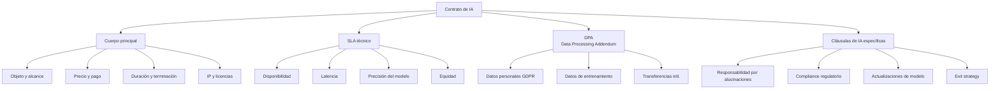
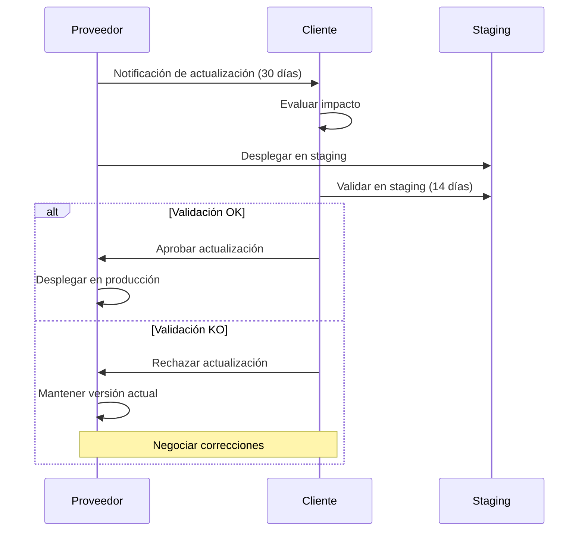

# Contratos y SLAs para Sistemas de IA

> [!abstract] Resumen ejecutivo
> Los contratos para sistemas de IA requieren ==cláusulas específicas que no existen en contratos de software tradicional==: garantías de rendimiento del modelo, umbrales de precisión, cláusulas de sesgo y equidad, responsabilidad por alucinaciones, derechos sobre datos de entrenamiento y retrenamiento, y obligaciones regulatorias bajo el [[eu-ai-act-completo|EU AI Act]]. Un SLA de IA debe cubrir no solo disponibilidad y latencia, sino también ==precisión, equidad, transparencia y actualizaciones del modelo==. [[licit-overview|licit]] genera evidencia verificable que puede servir como referencia objetiva para determinar el cumplimiento de SLAs.
> ^resumen

---

## ¿Por qué contratos específicos para IA?

> [!warning] Diferencias respecto a contratos de software tradicional
> Los sistemas de IA tienen características que los contratos tradicionales no cubren:
> - El rendimiento es ==probabilístico, no determinista==
> - El modelo puede ==degradarse con el tiempo== (*model drift*)
> - Las ==alucinaciones== no tienen equivalente en software tradicional
> - La responsabilidad por ==sesgos discriminatorios== es única de la IA
> - Las actualizaciones del modelo pueden ==cambiar el comportamiento== sin cambiar el código
> - Los datos de entrenamiento generan derechos y obligaciones especiales

---

## Estructura del contrato de IA



---

## Garantías de rendimiento

### Métricas de rendimiento del modelo

> [!tip] Qué medir en un SLA de IA
> A diferencia del software tradicional donde la funcionalidad es binaria (funciona o no), los modelos de IA tienen un ==espectro continuo de rendimiento== que debe acotarse contractualmente:

| Métrica | Tipo | Ejemplo de SLA | Medición |
|---|---|---|---|
| ==Precisión== (*Accuracy*) | Rendimiento | ≥92% en dataset de validación | Evaluación trimestral |
| F1-Score | Rendimiento | ≥0.88 por clase | Evaluación trimestral |
| ==Latencia p99== | Operativa | <200ms | Monitorización continua |
| Disponibilidad | Operativa | ==99.9%== (8.76h downtime/año) | Monitorización continua |
| Throughput | Operativa | ≥1000 req/min | Monitorización continua |
| ==Disparate Impact Ratio== | Equidad | ≥0.80 para todos los grupos protegidos | Auditoría trimestral |
| Tasa de alucinaciones | Calidad | <5% en evaluación estándar | Evaluación mensual |
| Drift del modelo | Estabilidad | Degradación <5% sobre baseline | Monitorización semanal |

> [!danger] Cuidado con garantías absolutas
> Nunca se debe garantizar ==100% de precisión o 0% de alucinaciones== en un sistema de IA. Las garantías deben ser:
> - Expresadas como ==umbrales estadísticos== (≥X% en condiciones Y)
> - Medidas sobre ==datasets acordados== de validación
> - Sujetas a ==condiciones de uso== definidas
> - ==Actualizadas== cuando cambian las condiciones del mercado

### Ejemplo de SLA técnico

> [!example]- SLA detallado para sistema de scoring crediticio
> ```markdown
> ## Acuerdo de Nivel de Servicio — CreditScore AI v2.3
>
> ### 1. Disponibilidad
> | Nivel | Disponibilidad | Downtime máx./mes | Penalización |
> |-------|---------------|-------------------|-------------|
> | Gold  | 99.95%        | 21.9 minutos      | 10% cuota   |
> | Silver| 99.9%         | 43.8 minutos      | 5% cuota    |
> | Bronze| 99.5%         | 3.65 horas        | Sin crédito |
>
> Mantenimiento programado: excluido (notificación 72h)
> Force majeure: excluido
>
> ### 2. Rendimiento del modelo
> | Métrica           | Umbral SLA | Medición      | Penalización |
> |-------------------|-----------|---------------|-------------|
> | AUC-ROC           | ≥0.89     | Trimestral    | Re-entrenamiento |
> | F1-Score (default)| ≥0.85     | Trimestral    | Re-entrenamiento |
> | Precision         | ≥0.88     | Trimestral    | Re-entrenamiento |
> | Recall            | ≥0.82     | Trimestral    | Re-entrenamiento |
>
> Dataset de validación: V-2025-Q1 (10,000 muestras)
> Actualización de dataset: semestral con acuerdo de ambas partes
>
> ### 3. Equidad
> | Métrica              | Umbral | Grupos          | Medición    |
> |----------------------|--------|-----------------|-------------|
> | Disparate Impact     | ≥0.80  | Género, edad    | Trimestral  |
> | Equal Opportunity    | <0.05  | Género, edad    | Trimestral  |
>
> Incumplimiento: acción correctiva en 30 días
> Incumplimiento reiterado: derecho de terminación
>
> ### 4. Latencia
> | Percentil | Umbral   |
> |-----------|----------|
> | p50       | <50ms    |
> | p95       | <150ms   |
> | p99       | <300ms   |
>
> ### 5. Actualizaciones del modelo
> - Notificación previa: mínimo 30 días
> - Período de pruebas: mínimo 14 días en staging
> - Rollback: capacidad de volver a versión anterior en <1h
> - Frecuencia máxima: 1 actualización mayor por trimestre
> ```

---

## Responsabilidad por alucinaciones

> [!danger] La cláusula más novedosa en contratos de IA
> Las alucinaciones (*hallucinations*) son respuestas incorrectas generadas con confianza aparente. No tienen precedente en contratos de software donde los errores son reproducibles.

| Tipo de alucinación | Riesgo | Cláusula recomendada |
|---|---|---|
| Factual (datos incorrectos) | ==Alto en finanzas y salud== | Limitación de responsabilidad + filtros |
| Fabricación (citas inventadas) | Alto en legal | Disclaimer + verificación humana obligatoria |
| Contradictoria (inconsistente) | Medio | Tasa máxima de contradicciones en SLA |
| Extrapolación (fuera de dominio) | Alto | ==Detección de fuera de dominio== obligatoria |

> [!example]- Cláusula modelo de responsabilidad por alucinaciones
> ```markdown
> ## Cláusula 8.4 — Responsabilidad por outputs incorrectos
>
> 8.4.1 El Proveedor reconoce que el Sistema puede generar
>       outputs incorrectos, incompletos o fabricados
>       ("alucinaciones") como característica inherente de
>       los modelos de lenguaje.
>
> 8.4.2 El Proveedor se compromete a:
>       a) Mantener la tasa de outputs incorrectos por debajo
>          del umbral acordado en el SLA (Anexo A)
>       b) Implementar filtros de detección de outputs
>          de baja confianza
>       c) Señalar al usuario cuando la confianza del
>          sistema sea inferior al umbral configurado
>
> 8.4.3 El Cliente acepta que:
>       a) El Sistema NO sustituye el juicio profesional humano
>       b) Es responsabilidad del Cliente implementar
>          supervisión humana sobre las decisiones finales
>       c) El uso del Sistema sin supervisión humana para
>          decisiones de alto impacto viola este contrato
>
> 8.4.4 Limitación de responsabilidad:
>       La responsabilidad del Proveedor por daños causados
>       por outputs incorrectos se limita a [X] veces la
>       cuota mensual, salvo en caso de dolo o negligencia
>       grave del Proveedor.
>
> 8.4.5 Indemnización cruzada:
>       a) El Proveedor indemniza al Cliente por reclamaciones
>          de terceros derivadas de defectos del modelo
>       b) El Cliente indemniza al Proveedor por reclamaciones
>          derivadas de uso sin supervisión humana
> ```

---

## Cláusulas de compliance regulatorio

> [!warning] Obligaciones regulatorias en el contrato
> El contrato debe asignar claramente las obligaciones del [[eu-ai-act-completo|EU AI Act]] entre [[eu-ai-act-proveedores-vs-deployers|proveedor y *deployer*]]:

| Obligación | Responsable contractual | Art. AI Act |
|---|---|---|
| Documentación técnica | ==Proveedor== | Art. 11 |
| Evaluación de conformidad | ==Proveedor== | Art. 43 |
| Proporcionar instrucciones de uso | ==Proveedor== | Art. 13 |
| Diseñar supervisión humana | Proveedor | Art. 14 |
| ==Implementar supervisión humana== | ==Cliente (*deployer*)== | Art. 14, 26 |
| Conservar logs | ==Cliente== | Art. 26(5) |
| Realizar FRIA | ==Cliente== | Art. 27 |
| Cooperar con autoridades | Ambos | Arts. 21, 26(9) |
| Notificar incidentes | ==Proveedor== (72h) | Art. 73 |
| Informar a afectados | ==Cliente== | Art. 26(7) |

> [!tip] Cláusula de cooperación regulatoria
> ```
> Las Partes cooperarán de buena fe para cumplir todas las
> obligaciones regulatorias aplicables, incluyendo pero no
> limitado al EU AI Act (Reglamento 2024/1689). El Proveedor
> proporcionará toda la información y documentación necesaria
> para que el Cliente pueda cumplir sus obligaciones como
> deployer, incluyendo FRIA y conservación de logs.
> ```

---

## Data Processing Addendum (DPA)

> [!info] Requisitos del DPA para IA
> Además de los requisitos estándar del GDPR Art. 28, el DPA para IA debe cubrir:

| Aspecto | Contenido específico IA |
|---|---|
| Datos de entrenamiento | ¿Se usarán datos del cliente para ==re-entrenamiento==? |
| Datos de inferencia | ¿Se conservan los inputs/outputs? ¿Por cuánto tiempo? |
| Retroalimentación | ¿El feedback del usuario se usa para ==mejorar el modelo==? |
| Transferencias | ¿Dónde se procesan los datos? (API cloud vs. on-premise) |
| ==Opt-out== | Derecho del cliente a excluir sus datos del entrenamiento |
| Anonimización | ¿Los datos se anonimizan antes del entrenamiento? |
| Subprocesadores | ¿Qué infraestructura cloud se usa? |

---

## Actualizaciones del modelo

> [!warning] Gestión de cambios de modelo
> A diferencia del software donde una actualización corrige bugs, una ==actualización de modelo puede cambiar el comportamiento de forma impredecible==. El contrato debe regular:



> [!success] Cláusula de pinning de versión
> El cliente debe tener derecho a ==mantener una versión específica del modelo== (*version pinning*) durante un período razonable (6-12 meses), incluso si el proveedor lanza versiones más nuevas.

---

## Estrategia de salida (*Exit strategy*)

> [!danger] Evitar vendor lock-in
> | Aspecto | Cláusula requerida |
> |---|---|
> | Portabilidad de datos | ==Exportación completa== de datos en formato estándar |
> | Período de transición | Mínimo 6 meses de soporte durante migración |
> | Fine-tuned models | ¿El cliente puede llevarse el modelo fine-tuned? |
> | Código integrado | ¿Qué pasa con integraciones y adaptaciones? |
> | Continuidad de servicio | Servicio garantizado durante período de transición |
> | Destrucción de datos | ==Certificación de destrucción== de datos del cliente |

---

## Evidencia de cumplimiento de SLA con licit

[[licit-overview|licit]] genera evidencia verificable para determinar si se cumplen los SLAs:

```bash
# Generar informe de cumplimiento de SLA
licit report --sla-compliance \
  --sla-definition ./contratos/sla-creditscoring.yaml \
  --architect-sessions ./sessions/ \
  --period 2025-Q1

# Verificar métricas de rendimiento del modelo
licit assess --model-metrics \
  --threshold-file ./contratos/sla-thresholds.yaml

# Evidence bundle de cumplimiento de SLA
licit report --sla-evidence --bundle --sign
```

> [!success] El evidence bundle como árbitro
> En caso de disputa sobre cumplimiento del SLA, los *evidence bundles* de [[licit-overview|licit]] con ==firma criptográfica== proporcionan evidencia verificable e inmutable que ambas partes pueden utilizar. `licit verify` permite a un tercero (mediador, árbitro) confirmar la integridad de la evidencia.

---

## Relación con el ecosistema

Los contratos de IA deben reflejar las capacidades de todo el ecosistema:

- **[[intake-overview|intake]]**: Los requisitos contractuales del cliente se capturan como *intake items* que definen los umbrales de SLA. [[intake-overview|intake]] normaliza estos requisitos y los distribuye a los equipos responsables de cumplirlos.

- **[[architect-overview|architect]]**: Proporciona las ==métricas operativas== (latencia, disponibilidad, costes por operación) que determinan el cumplimiento del SLA técnico. Los *OpenTelemetry traces* de [[architect-overview|architect]] son la fuente de verdad para métricas de rendimiento.

- **[[vigil-overview|vigil]]**: Los escaneos de [[vigil-overview|vigil]] proporcionan evidencia de cumplimiento de cláusulas de seguridad y robustez en el contrato. Los resultados SARIF documentan el estado de seguridad que el contrato requiere mantener.

- **[[licit-overview|licit]]**: Genera ==informes de cumplimiento de SLA== con evidencia verificable. Los *evidence bundles* firmados criptográficamente sirven como referencia objetiva en caso de disputa contractual. `licit assess` verifica cumplimiento de obligaciones regulatorias asignadas contractualmente.

---

## Enlaces y referencias

> [!quote]- Bibliografía y fuentes
> - [^1]: Reglamento (UE) 2024/1689, Artículos 11, 13, 14, 21, 26, 27, 43, 73 — Obligaciones que deben reflejarse contractualmente.
> - Baker McKenzie, "AI Contract Playbook", 2024.
> - World Commerce & Contracting, "AI Contracting Guidelines", 2024.
> - [[ai-liability-directive]] — Responsabilidad civil por IA
> - [[eu-ai-act-proveedores-vs-deployers]] — Distribución de obligaciones
> - [[seguros-ia]] — Seguros como complemento contractual
> - [[gobernanza-ia-empresarial]] — Política de proveedores
> - [[ip-codigo-generado-ia]] — Cláusulas de propiedad intelectual

[^1]: Múltiples artículos del Reglamento (UE) 2024/1689 contienen obligaciones que deben distribuirse contractualmente entre proveedor y *deployer*.
