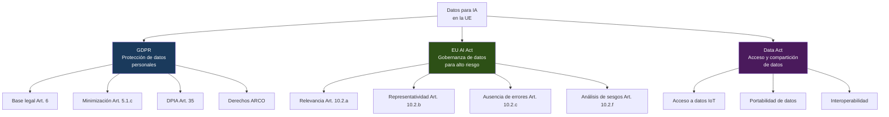
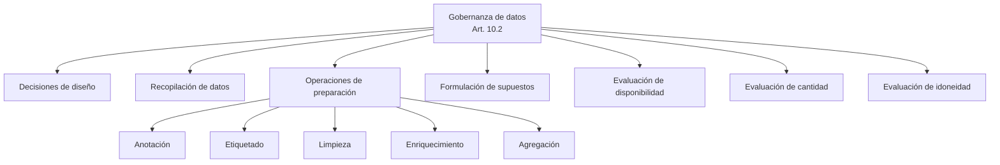
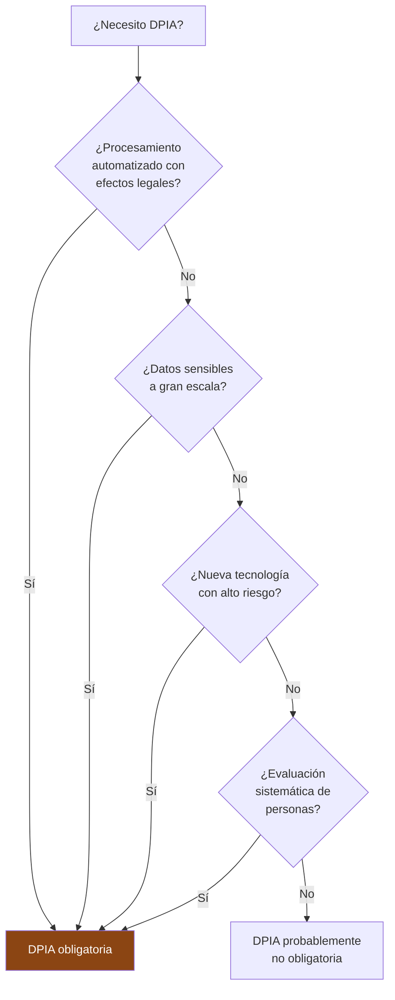
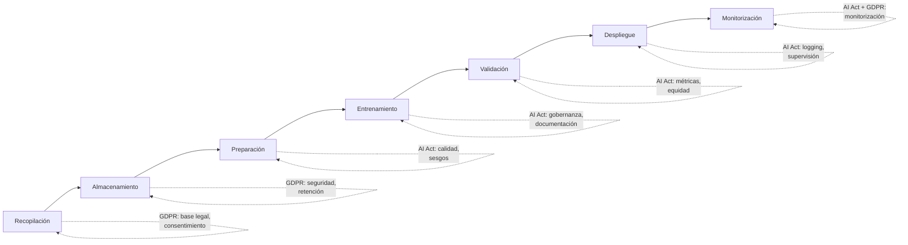

# Gobernanza de Datos para Sistemas de IA

> [!abstract] Resumen ejecutivo
> La gobernanza de datos para IA abarca la intersección entre ==GDPR, EU AI Act y Data Act== en el contexto del desarrollo y despliegue de sistemas de IA. El Art. 10 del EU AI Act establece requisitos específicos de gobernanza de datos para sistemas de alto riesgo: relevancia, representatividad, ausencia de errores, completitud y evaluación de sesgos. El GDPR impone restricciones adicionales sobre el uso de datos personales en entrenamiento. [[licit-overview|licit]] documenta la gobernanza de datos como parte de la documentación técnica del [[eu-ai-act-anexo-iv|Anexo IV]].
> ^resumen

---

## La triple regulación de datos para IA en la UE



---

## GDPR y entrenamiento de IA

### Base legal para el procesamiento

> [!danger] La pregunta fundamental
> ¿Bajo ==qué base legal== del Art. 6 GDPR se pueden usar datos personales para entrenar un sistema de IA?

| Base legal | Viabilidad para entrenamiento IA | Consideraciones |
|---|---|---|
| Consentimiento (Art. 6.1.a) | Posible pero ==difícil a escala== | Debe ser libre, informado, específico, granular |
| Contrato (Art. 6.1.b) | Limitada | Solo si entrenamiento es necesario para servicio contratado |
| Obligación legal (Art. 6.1.c) | Rara vez | Solo si ley obliga a entrenar el modelo |
| Interés vital (Art. 6.1.d) | Muy rara vez | Solo en situaciones de emergencia |
| Interés público (Art. 6.1.e) | ==Posible para sector público== | Requiere base en derecho nacional |
| ==Interés legítimo (Art. 6.1.f)== | ==Más utilizada== | Requiere test de ponderación (LIA) |

> [!warning] Interés legítimo — no es carta blanca
> El interés legítimo requiere un ==test de ponderación== (*Legitimate Interest Assessment*, LIA) que demuestre que:
> 1. El interés es ==legítimo, concreto y actual==
> 2. El procesamiento es ==necesario== para ese interés
> 3. Los ==derechos del interesado no prevalecen== sobre el interés
>
> Para entrenamiento de IA, este test debe considerar específicamente: volumen de datos, sensibilidad, expectativas razonables de los interesados, y medidas de mitigación.

### Datos especiales (Art. 9 GDPR)

> [!danger] Datos especialmente protegidos
> El procesamiento de categorías especiales de datos para IA requiere ==una de las excepciones del Art. 9.2==:
> - Origen racial o étnico
> - Opiniones políticas
> - Convicciones religiosas
> - Datos de salud
> - Datos biométricos
> - Orientación sexual
> - Afiliación sindical
>
> **Paradoja de la equidad**: Para evaluar si un modelo es ==discriminatorio==, puede ser necesario procesar datos de categorías protegidas (raza, género). El [[eu-ai-act-completo|EU AI Act]] Art. 10(5) permite excepcionalmente este procesamiento para detectar y corregir sesgos.

### Principios del GDPR aplicados a IA

| Principio GDPR | Aplicación a IA | Desafío |
|---|---|---|
| ==Minimización== (Art. 5.1.c) | Usar solo datos necesarios | Los modelos grandes mejoran con más datos |
| Limitación de finalidad (Art. 5.1.b) | Entrenamiento = finalidad específica | ¿Se puede re-usar un modelo para otra finalidad? |
| Exactitud (Art. 5.1.d) | Datos de entrenamiento ==correctos y actualizados== | Datasets históricos contienen sesgos |
| Limitación de almacenamiento (Art. 5.1.e) | No conservar más de lo necesario | ¿Cuándo "expiran" los datos de entrenamiento? |
| Integridad y confidencialidad (Art. 5.1.f) | ==Seguridad== en todo el pipeline | Ataques de extracción de datos de modelos |

---

## EU AI Act — Art. 10: Gobernanza de datos

El Artículo 10 del [[eu-ai-act-completo|EU AI Act]] establece requisitos específicos de gobernanza de datos para sistemas de ==alto riesgo==[^1]:

### Requisitos de los conjuntos de datos

> [!info] Art. 10(2) — Requisitos de calidad de datos
> Los conjuntos de datos de entrenamiento, validación y prueba deben:
>
> | Requisito | Art. | Descripción |
> |---|---|---|
> | ==Relevancia== | 10.2.a | Apropiados para el propósito previsto |
> | Representatividad | 10.2.b | Reflejar el contexto de despliegue |
> | ==Ausencia de errores== | 10.2.c | Lo más libres de errores posible |
> | Completitud | 10.2.d | Cobertura adecuada |
> | Propiedades estadísticas | 10.2.e | Apropiadas para el contexto |
> | ==Análisis de sesgos== | 10.2.f | Detectar y abordar posibles sesgos |
> | Brechas y deficiencias | 10.2.g | Identificar y abordar |

### Prácticas de gobernanza de datos (Art. 10.2)



---

## Documentación de datos para Anexo IV

La Sección 2c del [[eu-ai-act-anexo-iv|Anexo IV]] requiere documentación exhaustiva de los datos:

> [!example]- Plantilla de documentación de datos para Anexo IV
> ```markdown
> ## Sección 2c: Datos de entrenamiento, validación y prueba
>
> ### 2c.1 Origen de los datos
> | Dataset | Fuente | Volumen | Período | Licencia |
> |---------|--------|---------|---------|----------|
> | credit_history | Bureau Nacional | 2.3M registros | 2020-2024 | Contractual |
> | demographics | INE | 500K registros | Censo 2021 | Público |
> | transactions | Interno | 15M transacciones | 2022-2024 | Propio |
>
> ### 2c.2 Proceso de curación
> - Limpieza: eliminación de duplicados (3.2% eliminados)
> - Imputación: mediana para numéricos, moda para categóricos
> - Outliers: winsorización al percentil 1-99
> - Encoding: target encoding para categóricos (>20 categorías)
>
> ### 2c.3 Análisis de representatividad
> | Variable | Distribución datos | Distribución población | Gap |
> |----------|-------------------|----------------------|-----|
> | Género   | M:54%, F:46%      | M:49%, F:51%         | 5%  |
> | Edad     | μ=42, σ=15        | μ=44, σ=18           | 2y  |
> | Región   | Urbano:78%        | Urbano:80%           | 2%  |
>
> ### 2c.4 Análisis de sesgos
> - Disparate impact ratio (género): 0.87 (>0.80 ✓)
> - Equalidad de oportunidades (edad >65): 0.82 (>0.80 ✓)
> - Predictive parity (nacionalidad): 0.91 (>0.80 ✓)
>
> ### 2c.5 Base legal GDPR
> - Base legal: Interés legítimo (Art. 6.1.f)
> - LIA completada: 2024-11-15 (ref: LIA-2024-012)
> - DPIA completada: 2024-12-01 (ref: DPIA-2024-008)
>
> ### 2c.6 Datos de categorías especiales
> - No se procesan datos de Art. 9 GDPR directamente
> - Variables proxy analizadas y eliminadas (código postal
>   con alta correlación con origen étnico: eliminado)
> ```

---

## DPIA para sistemas de IA

> [!warning] ¿Cuándo es obligatoria la DPIA?
> El Art. 35 del GDPR requiere una DPIA cuando el procesamiento tiene ==alta probabilidad de resultar en un alto riesgo== para los derechos de las personas. Las directrices del EDPB indican que se requiere DPIA cuando:
> - Se usa ==perfilado automatizado== con efectos legales o similares
> - Se procesan ==datos sensibles a gran escala==
> - Se usa ==monitorización sistemática== de áreas públicas
> - Se emplean ==nuevas tecnologías== (incluida IA)



> [!tip] DPIA + FRIA = cobertura completa
> La DPIA (GDPR) y la [[eu-ai-act-fria|FRIA]] (EU AI Act) son complementarias:
> - DPIA: protección de datos personales
> - FRIA: todos los derechos fundamentales
>
> [[licit-overview|licit]] permite vincular ambas evaluaciones para evitar duplicación.

---

## Calidad de datos — Framework práctico

> [!success] Dimensiones de calidad de datos para IA
> | Dimensión | Métrica | Umbral recomendado | Herramienta |
> |---|---|---|---|
> | Completitud | % campos no nulos | ==>95%== | Scripts de validación |
> | Exactitud | % valores correctos | >98% | Validación cruzada |
> | Consistencia | % registros sin contradicciones | ==>99%== | Rules engine |
> | Actualidad | Antigüedad media de datos | <12 meses | Pipeline de actualización |
> | Representatividad | Disparate impact ratio | ==>0.80== | Análisis estadístico |
> | Trazabilidad | % datos con origen documentado | ==100%== | [[licit-overview\|licit]] scan |

---

## Data Act y sus implicaciones

> [!info] Data Act (Reglamento 2023/2854)
> El *Data Act* de la UE, en vigor desde septiembre de 2023 con aplicación desde septiembre de 2025, impacta en el acceso a datos para IA:
> - Derecho de los usuarios a acceder a datos generados por ==productos IoT==
> - Obligación de compartir datos con terceros bajo condiciones equitativas
> - Protección contra transferencias internacionales no autorizadas
> - Derecho de los usuarios a ==portar sus datos== a otros servicios
> - Cláusulas abusivas en contratos de datos

---

## Derechos de los interesados en contexto IA

| Derecho GDPR | Aplicación a IA | ==Desafío== |
|---|---|---|
| Acceso (Art. 15) | Acceso a datos usados en la decisión | ¿Incluye datos de entrenamiento? |
| Rectificación (Art. 16) | Corregir datos erróneos | Re-entrenamiento necesario si dato corregido |
| Supresión (Art. 17) | Eliminar datos del interesado | =="Desaprender" datos== del modelo es técnicamente difícil |
| Oposición (Art. 21) | Oponerse al procesamiento | Puede requerir exclusión del modelo |
| No ser objeto de decisión automatizada (Art. 22) | ==Decisiones sin intervención humana== | Supervisión humana significativa |
| Explicación (Art. 22.3) | Lógica de la decisión automatizada | Explicabilidad del modelo |

> [!danger] El derecho al olvido en IA
> El derecho de supresión (Art. 17 GDPR) presenta un desafío técnico fundamental: ==¿cómo eliminar la influencia de un dato específico de un modelo ya entrenado?== Las técnicas de *machine unlearning* están en investigación activa pero no son maduras. La mejor práctica es:
> 1. Eliminar el dato del dataset de entrenamiento
> 2. Documentar la solicitud de supresión
> 3. Re-entrenar el modelo en el próximo ciclo programado
> 4. Verificar que la influencia se ha eliminado

---

## Gobernanza de datos en el pipeline de ML



---

## Relación con el ecosistema

La gobernanza de datos es transversal a todo el ecosistema:

- **[[intake-overview|intake]]**: Los requisitos de gobernanza de datos (GDPR, AI Act Art. 10, Data Act) se capturan como *intake items* verificables. Cada requisito de calidad de datos puede trazarse a través del pipeline de desarrollo.

- **[[architect-overview|architect]]**: Registra las operaciones de procesamiento de datos en los *audit trails*. Las sesiones de [[architect-overview|architect]] documentan ==qué datos se procesaron, cuándo y por quién==, proporcionando trazabilidad para el principio de *accountability* del GDPR.

- **[[vigil-overview|vigil]]**: Los escaneos de [[vigil-overview|vigil]] pueden detectar ==exposición de datos personales== en logs, configuraciones o outputs del sistema. Los resultados SARIF señalan riesgos de privacidad que deben mitigarse.

- **[[licit-overview|licit]]**: Documenta la gobernanza de datos como parte de la Sección 2c del [[eu-ai-act-anexo-iv|Anexo IV]]. `licit scan` analiza la procedencia de los datos (no solo del código), y `licit assess` verifica cumplimiento del Art. 10. Los *evidence bundles* incluyen metadatos de gobernanza de datos.

---

## Enlaces y referencias

> [!quote]- Bibliografía y fuentes
> - [^1]: Reglamento (UE) 2024/1689, Artículo 10 — Datos y gobernanza de datos.
> - EDPB, "Guidelines on Data Protection Impact Assessment", WP 248 rev.01.
> - ICO, "Guidance on AI and data protection", 2023.
> - [[eu-ai-act-completo]] — Requisitos del AI Act
> - [[eu-ai-act-anexo-iv]] — Documentación de datos en Anexo IV
> - [[eu-ai-act-fria]] — FRIA y protección de datos
> - [[gobernanza-ia-empresarial]] — Marco de gobernanza
> - [[auditoria-ia]] — Auditoría de datos

[^1]: Art. 10 del Reglamento (UE) 2024/1689 sobre datos y gobernanza de datos para sistemas de alto riesgo.
