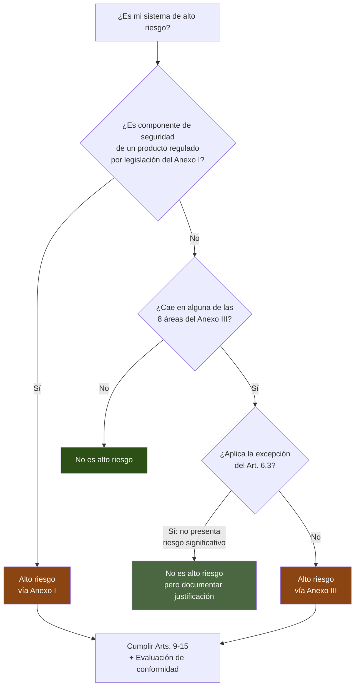
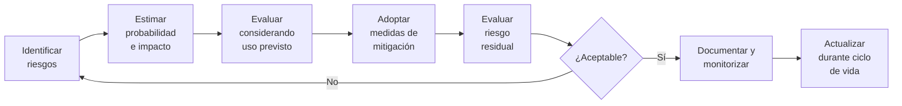
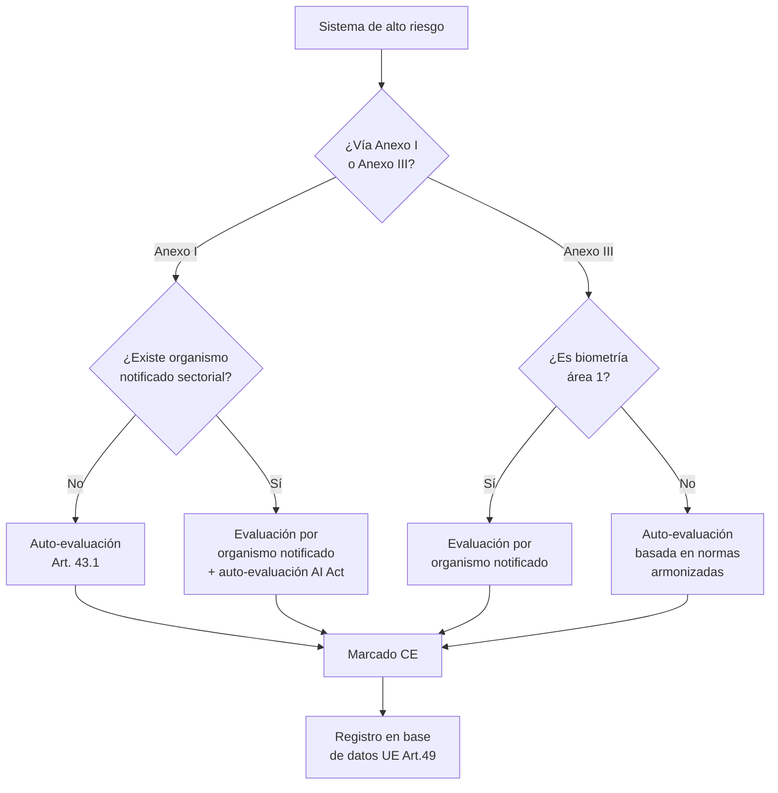

# EU AI Act — Sistemas de Alto Riesgo

> [!abstract] Resumen ejecutivo
> Los sistemas de IA de alto riesgo son el ==núcleo regulatorio del EU AI Act== (Título III, Arts. 6-49). Se clasifican mediante dos vías: Anexo I (productos ya regulados bajo legislación armonizada de la UE) y ==Anexo III (8 áreas de uso específicas)==. Estos sistemas deben cumplir 7 requisitos técnicos obligatorios (Arts. 9-15), someterse a evaluación de conformidad (Art. 43) y registrarse en la base de datos de la UE. [[licit-overview|licit]] evalúa automáticamente el cumplimiento de estos requisitos.
> ^resumen

---

## Determinación de alto riesgo

Un sistema de IA se clasifica como de alto riesgo según dos mecanismos distintos[^1]:



### Vía Anexo I — Productos regulados

Sistemas de IA que son ==componentes de seguridad== de productos cubiertos por legislación armonizada de la UE:

| Legislación | Productos | Ejemplo de IA |
|---|---|---|
| Reglamento (UE) 2017/745 | ==Dispositivos médicos== | IA diagnóstica |
| Directiva 2006/42/CE | Maquinaria | Control autónomo de robots |
| Reglamento (UE) 2019/881 | Juguetes | Juguetes inteligentes con IA |
| Directiva 2014/53/UE | Equipos radioeléctricos | Dispositivos IoT con IA |
| Reglamento (UE) 2018/858 | Vehículos | Conducción autónoma |
| Reglamento (UE) 2018/1139 | Aviación civil | Sistemas de navegación IA |

> [!info] Doble evaluación de conformidad
> Los sistemas IA que caen bajo el Anexo I deben someterse ==tanto== a la evaluación de conformidad del *AI Act* como a la de la legislación sectorial correspondiente. Ambas evaluaciones pueden integrarse en un proceso único.

---

### Vía Anexo III — 8 áreas de uso

El Anexo III enumera las áreas donde los sistemas de IA se consideran de alto riesgo por defecto[^2]:

#### Área 1: Biometría

> [!danger] Sistemas biométricos de alto riesgo
> - Sistemas de ==identificación biométrica remota== (excepto verificación)
> - Sistemas de categorización biométrica por características sensibles
> - Sistemas de reconocimiento de emociones
>
> **Excluidos**: Verificación biométrica 1:1 (ej: desbloqueo facial de un dispositivo personal)

#### Área 2: Infraestructuras críticas

- Componentes de seguridad en gestión de ==tráfico rodado, aéreo, ferroviario o marítimo==
- Componentes de seguridad en suministro de agua, gas, calefacción, electricidad
- Infraestructura digital crítica

#### Área 3: Educación y formación profesional

- Sistemas que determinan ==acceso o admisión== a instituciones educativas
- Sistemas de evaluación de resultados de aprendizaje
- Sistemas que determinan el nivel educativo apropiado
- Sistemas de monitorización de comportamiento prohibido en exámenes

#### Área 4: Empleo y gestión de trabajadores

> [!warning] Alto impacto en derechos laborales
> - Contratación: sistemas de ==filtrado de CVs==, evaluación de candidatos
> - Decisiones sobre promoción, terminación, asignación de tareas
> - Monitorización y evaluación del rendimiento laboral
>
> Esta área es especialmente sensible por su impacto en el derecho al trabajo (Art. 15 Carta UE) y la no discriminación (Art. 21).

#### Área 5: Acceso a servicios esenciales

| Subárea | Ejemplos | Impacto |
|---|---|---|
| 5a. Servicios públicos esenciales | Elegibilidad para ==prestaciones sociales== | Exclusión social |
| 5b. Solvencia crediticia | ==Scoring crediticio== | Acceso a financiación |
| 5c. Seguros | Primas de seguros de vida y salud | Exclusión aseguradora |
| 5d. Servicios de emergencia | Priorización de ==respuesta de emergencias== | Riesgo vital |

#### Área 6: Aplicación de la ley

- ==Policía predictiva== individual (no general)
- *Polígrafos* y detección de emociones
- Evaluación de fiabilidad de pruebas
- Elaboración de perfiles de personas
- Análisis de pruebas en investigaciones

#### Área 7: Migración, asilo y control de fronteras

- ==Polígrafos== y detección de emociones en fronteras
- Evaluación de riesgos de seguridad o inmigración irregular
- Examen de solicitudes de asilo, visados, permisos de residencia
- Identificación de personas en contexto migratorio

#### Área 8: Administración de justicia y procesos democráticos

- Sistemas de IA para ==investigación e interpretación== de hechos y derecho
- Sistemas de IA que influyen en ==resultados electorales o comportamiento electoral==

> [!question] ¿Cómo determino si mi sistema cae en el Anexo III?
> La evaluación requiere análisis del ==propósito previsto== del sistema, no de su tecnología subyacente. Un mismo modelo de ML puede ser de alto riesgo para una aplicación (scoring crediticio) y de riesgo mínimo para otra (recomendación de películas). [[licit-overview|licit]] incluye un asistente de clasificación con `licit assess --classify`.

---

## Excepción del Art. 6(3)

> [!tip] Filtro de significatividad
> No todo sistema que caiga en una categoría del Anexo III es automáticamente de alto riesgo. El Art. 6(3) permite excluir sistemas que cumplan ==todas== estas condiciones:
> 1. Realiza una tarea procedimental ==estrecha==
> 2. Mejora el resultado de una actividad humana previamente completada
> 3. No sustituye la evaluación humana (solo la asiste)
> 4. Es preparatorio de una evaluación relevante para los fines del Anexo III
>
> **Importante**: Esta excepción ==no aplica== si el sistema realiza *profiling* en el sentido del GDPR.

> [!example]- Ejemplo de aplicación de la excepción del Art. 6(3)
> ```
> Sistema: Herramienta de formateo automático de CVs
> Área Anexo III: 4 (Empleo)
>
> Análisis Art. 6(3):
> ✓ Tarea estrecha: Solo formatea, no evalúa contenido
> ✓ Mejora actividad humana: El humano ya redactó el CV
> ✓ No sustituye evaluación: No decide sobre contratación
> ✓ Preparatorio: Prepara el documento para revisión humana
> ✗ No realiza profiling
>
> Conclusión: EXCLUIDO de alto riesgo por Art. 6(3)
>
> Pero documentar esta justificación es obligatorio.
> → licit assess --classify genera la documentación
> ```

---

## 7 Requisitos técnicos obligatorios

Los sistemas de alto riesgo deben cumplir estos requisitos (Arts. 9-15):

### Art. 9 — Sistema de gestión de riesgos



> [!success] El sistema de gestión de riesgos debe ser:
> - ==Continuo e iterativo== durante todo el ciclo de vida
> - Documentado y actualizado periódicamente
> - Considerando uso previsto Y ==mal uso razonablemente previsible==
> - Integrado con los procesos de calidad del proveedor

### Art. 10 — Gobernanza de datos

Requisitos para conjuntos de datos de entrenamiento, validación y prueba:

| Requisito | Descripción | Evidencia |
|---|---|---|
| Relevancia | Datos ==apropiados para el propósito== | Análisis de relevancia |
| Representatividad | Reflejar el contexto de despliegue | Análisis demográfico |
| Ausencia de errores | Datos lo más ==libres de errores== posible | Informe de calidad |
| Completitud | Cobertura adecuada de características | Análisis de cobertura |
| Sesgo | Detectar y ==mitigar sesgos== | Auditoría de equidad |
| Brechas | Identificar y abordar brechas en datos | Gap analysis |

> [!warning] Datos personales en entrenamiento
> Si se utilizan datos personales para entrenamiento, deben cumplirse los requisitos del GDPR. Ver [[data-governance-ia]] para detalles sobre la intersección AI Act-GDPR.

### Art. 11 — Documentación técnica

Documentación conforme al ==Anexo IV==. Ver [[eu-ai-act-anexo-iv]] para el detalle completo de los 15 elementos requeridos. `licit annex-iv` automatiza su generación.

### Art. 12 — Registro automático (*Logging*)

> [!info] Requisitos de logging
> El sistema debe incluir capacidades de registro que permitan:
> - Trazabilidad de ==cada decisión o recomendación==
> - Identificación del momento de cada operación
> - Datos de entrada que generaron cada resultado
> - Identificación de las personas involucradas en la supervisión
>
> [[architect-overview|architect]] cumple este requisito mediante *OpenTelemetry traces* y sesiones de auditoría.

### Art. 13 — Transparencia

El sistema debe ser ==suficientemente transparente== para que los *deployers* puedan:
- Interpretar los resultados del sistema
- Usar el sistema adecuadamente
- Entender las limitaciones del sistema

### Art. 14 — Supervisión humana

> [!danger] Supervisión humana — requisito no negociable
> Los sistemas de alto riesgo ==deben diseñarse== para permitir supervisión humana efectiva:
> - Capacidad de entender las capacidades y limitaciones del sistema
> - Capacidad de ==monitorizar== el funcionamiento en tiempo real
> - Capacidad de ==interpretar== los resultados
> - Capacidad de ==anular o revertir== las decisiones del sistema
> - Capacidad de ==detener== el sistema (botón de parada)
>
> No basta con un "humano en el bucle" nominal — la supervisión debe ser ==efectiva y significativa==.

### Art. 15 — Precisión, robustez y ciberseguridad

| Aspecto | Requisito | Evaluación con herramientas |
|---|---|---|
| Precisión | Niveles ==apropiados para el propósito== | Métricas ML estándar |
| Robustez | Resistencia a ==errores y perturbaciones== | [[vigil-overview\|vigil]] escaneos |
| Ciberseguridad | Protección contra ==ataques adversariales== | [[vigil-overview\|vigil]] SARIF |
| Resiliencia | Funcionamiento ante ==fallos parciales== | Tests de resiliencia |

---

## Evaluación de conformidad (Art. 43)



> [!tip] Auto-evaluación con licit
> Para la mayoría de sistemas del Anexo III (excepto biometría), la evaluación puede ser una ==auto-evaluación== basada en normas armonizadas. `licit assess` proporciona un marco estructurado para esta auto-evaluación, generando evidencia trazable con firma criptográfica.

---

## Registro en la base de datos de la UE (Art. 49)

Tanto proveedores como *deployers* deben registrar los sistemas de alto riesgo:

> [!info] Datos de registro obligatorios
> **Proveedor**:
> - Nombre, dirección, datos de contacto
> - Nombre y descripción del sistema
> - Estado del sistema (en el mercado, retirado, recall)
> - Categoría de riesgo y normativas aplicables
> - Resultado de la evaluación de conformidad
>
> ***Deployer***:
> - Nombre, dirección, datos de contacto
> - Nombre del sistema y del proveedor
> - ==Propósito de uso concreto==
> - Resultado de la FRIA (si aplica)

---

## Monitorización post-comercialización

> [!warning] Obligación continuada (Arts. 72-73)
> Los proveedores deben establecer un sistema de monitorización post-comercialización que incluya:
> - Recopilación activa de datos de funcionamiento
> - Análisis de ==incidentes graves y mal funcionamiento==
> - Evaluación continua de conformidad
> - Comunicación a autoridades de incidentes graves (==72 horas==)
> - Plan de acción correctiva cuando sea necesario
>
> [[architect-overview|architect]] proporciona la infraestructura de trazabilidad necesaria para esta monitorización.

---

## Relación con el ecosistema

Los sistemas de alto riesgo requieren una integración profunda con todas las herramientas del ecosistema:

- **[[intake-overview|intake]]**: Captura y normaliza los requisitos específicos de alto riesgo (Arts. 9-15) como elementos verificables. Cada requisito del *AI Act* puede convertirse en un *intake item* trazable a lo largo del ciclo de desarrollo del sistema.

- **[[architect-overview|architect]]**: Proporciona la infraestructura de ==*audit trail*== esencial para cumplir Arts. 12 (logging) y 9 (gestión de riesgos). Las sesiones de [[architect-overview|architect]] registran cada decisión de diseño, los *OpenTelemetry traces* capturan cada operación, y los informes documentan costes y métricas.

- **[[vigil-overview|vigil]]**: Los escaneos de seguridad de [[vigil-overview|vigil]] producen resultados SARIF que alimentan directamente la evaluación del Art. 15 (ciberseguridad y robustez). Las vulnerabilidades detectadas se convierten en riesgos que deben gestionarse bajo el Art. 9.

- **[[licit-overview|licit]]**: Evalúa automáticamente el cumplimiento de los 7 requisitos técnicos (Arts. 9-15) más obligaciones adicionales. `licit assess` produce un informe de conformidad, `licit annex-iv` genera la documentación técnica, y `licit fria` genera la evaluación de impacto.

---

## Enlaces y referencias

> [!quote]- Bibliografía y fuentes
> - [^1]: Reglamento (UE) 2024/1689, Artículo 6 — Reglas de clasificación para sistemas de IA de alto riesgo.
> - [^2]: Reglamento (UE) 2024/1689, Anexo III — Áreas de uso de alto riesgo.
> - Mökander, J. et al. (2024). "Conformity assessments and post-market monitoring: A guide to the role of auditing in the AI Act". *AI and Ethics*, 4(1).
> - European Commission, "Guidance on high-risk AI systems classification", 2025.
> - [[eu-ai-act-completo]] — Visión completa del reglamento
> - [[eu-ai-act-anexo-iv]] — Documentación técnica Anexo IV
> - [[eu-ai-act-fria]] — Evaluación de impacto en derechos fundamentales
> - [[eu-ai-act-proveedores-vs-deployers]] — Obligaciones por rol

[^1]: Art. 6 del Reglamento (UE) 2024/1689, que establece los dos mecanismos de clasificación de alto riesgo.
[^2]: Anexo III del Reglamento (UE) 2024/1689, con las 8 áreas de uso de alto riesgo.
