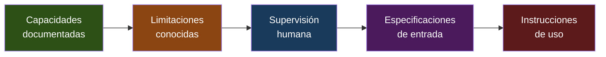

# EU AI Act — Anexo IV: Documentación Técnica

> [!abstract] Resumen ejecutivo
> El Anexo IV del *EU AI Act* define los ==15 elementos obligatorios de documentación técnica== que todo proveedor de un sistema de IA de alto riesgo debe preparar y mantener actualizado. Esta documentación debe demostrar conformidad con los requisitos del Título III y debe estar disponible ==antes de la comercialización==. El comando `licit annex-iv` automatiza la generación de esta documentación consumiendo datos de [[architect-overview|architect]], [[vigil-overview|vigil]] e [[intake-overview|intake]].
> ^resumen

---

## Propósito y alcance legal

El Artículo 11 del *EU AI Act* establece que los proveedores de sistemas de IA de alto riesgo deben elaborar documentación técnica conforme al ==Anexo IV== antes de comercializar o poner en servicio el sistema[^1]. Esta documentación debe:

1. Demostrar que el sistema cumple los requisitos del Título III
2. Proporcionar a las autoridades nacionales la información necesaria para evaluar conformidad
3. Mantenerse actualizada durante toda la vida útil del sistema
4. Estar redactada de forma ==clara, comprensible y completa==

> [!warning] Obligación continuada
> La documentación técnica no es un documento estático. Cada actualización sustancial del sistema requiere actualizar la documentación. [[licit-overview|licit]] facilita este proceso mediante generación incremental con `licit annex-iv --update`.

---

## Los 15 elementos del Anexo IV

### Visión general de la estructura

```mermaid
graph TD
    A[Documentación Técnica<br/>Anexo IV] --> B[1. Descripción general]
    A --> C[2. Descripción detallada]
    A --> D[3. Información de desarrollo]
    A --> E[4. Monitorización y funcionamiento]
    A --> F[5. Gestión de riesgos]

    B --> B1[1a. Propósito previsto]
    B --> B2[1b. Interacciones con otros sistemas]
    B --> B3[1c. Versiones de hardware/software]

    C --> C1[2a. Arquitectura del modelo]
    C --> C2[2b. Decisiones de diseño]
    C --> C3[2c. Datos de entrenamiento]

    D --> D1[3a. Proceso de desarrollo]
    D --> D2[3b. Validación y pruebas]
    D --> D3[3c. Métricas de rendimiento]

    E --> E1[4a. Capacidades y limitaciones]
    E --> E2[4b. Supervisión humana]
    E --> E3[4c. Especificaciones de entrada]

    F --> F1[5a. Sistema de gestión de riesgos]
    F --> F2[5b. Medidas de mitigación]
```



---

### Sección 1: Descripción general del sistema

| Subsección | Contenido requerido | Fuente de datos |
|---|---|---|
| 1a. Propósito previsto | ==Uso intencionado, personas/grupos afectados== | Manual, [[intake-overview\|intake]] |
| 1b. Interacciones | Integración con otros sistemas, APIs | [[architect-overview\|architect]] sessions |
| 1c. Versiones | Hardware, software, frameworks, dependencias | `package.json`, `requirements.txt` |
| 1d. Formas de comercialización | SaaS, on-premise, API, integrado | Manual |
| 1e. Instrucciones de uso | Manual para *deployers* | Manual + `licit annex-iv` |

> [!tip] Automatización con licit
> `licit annex-iv --section=1` genera la Sección 1 extrayendo:
> - Propósito del `README.md` o archivo de manifiesto
> - Dependencias del *lockfile* del proyecto
> - Interacciones de los informes de [[architect-overview|architect]]

> [!example]- Ejemplo de Sección 1a generada por licit
> ```markdown
> ## 1a. Propósito previsto
>
> **Nombre del sistema**: CreditScore AI v2.3.1
> **Proveedor**: Fintech Corp S.L.
> **Propósito**: Sistema de evaluación automatizada de solvencia
>   crediticia para personas físicas solicitantes de préstamos
>   personales en el mercado español.
>
> **Personas afectadas**:
> - Solicitantes de préstamos (personas físicas, mayores de edad)
> - Analistas de riesgo crediticio (usuarios del sistema)
>
> **Contexto de uso**:
> - Pre-evaluación automatizada (sin decisión final)
> - Decisión asistida con revisión humana obligatoria
>
> **Categoría de riesgo**: Alto riesgo (Anexo III, área 5b:
>   evaluación de solvencia crediticia)
>
> **Restricciones de uso**:
> - NO utilizar para scoring social
> - NO utilizar para personas menores de 18 años
> - NO utilizar fuera del mercado español sin re-validación
> ```

---

### Sección 2: Descripción detallada del sistema

Esta sección es la más técnica y requiere documentar la arquitectura interna:

| Subsección | Contenido requerido | Nivel de detalle |
|---|---|---|
| 2a. Arquitectura | ==Topología del modelo, capas, parámetros== | Muy alto |
| 2b. Decisiones de diseño | Justificación de elecciones técnicas | Alto |
| 2c. Datos de entrenamiento | Origen, volumen, características, sesgos | ==Crítico== |
| 2d. Técnicas de entrenamiento | Hiperparámetros, epochs, función de pérdida | Alto |
| 2e. Validación | Métricas, datasets de test, resultados | ==Crítico== |

> [!danger] Datos de entrenamiento — el punto más sensible
> La Sección 2c requiere documentar:
> - Procedencia de todos los conjuntos de datos (*provenance*)
> - Proceso de curación y etiquetado
> - Análisis de sesgos y representatividad
> - Base legal para el procesamiento (conexión con [[data-governance-ia|GDPR]])
> - Decisiones de exclusión de datos y justificación
>
> ==Insuficiente documentación de datos es la causa más frecuente de no conformidad== en evaluaciones preliminares.

> [!example]- Ejemplo de Sección 2a generada por licit
> ```markdown
> ## 2a. Arquitectura del sistema
>
> **Tipo de modelo**: Ensemble (Gradient Boosting + Red Neuronal)
>
> **Componente 1: Gradient Boosting**
> - Framework: XGBoost 2.0.3
> - Árboles: 500
> - Profundidad máxima: 8
> - Learning rate: 0.05
> - Features: 47 variables numéricas y categóricas
>
> **Componente 2: Red Neuronal**
> - Framework: PyTorch 2.1.0
> - Arquitectura: MLP con 3 capas ocultas (256, 128, 64)
> - Activación: ReLU + BatchNorm
> - Dropout: 0.3
> - Entrada: 47 features normalizadas
> - Salida: probabilidad de default [0, 1]
>
> **Ensemble**:
> - Método: Weighted averaging
> - Pesos: XGBoost 0.6, NN 0.4
> - Umbral de decisión: 0.35
>
> **Pipeline de preprocesamiento**:
> - Imputación: mediana (numéricos), moda (categóricos)
> - Encoding: Target encoding para categóricos
> - Scaling: StandardScaler
> - Feature selection: eliminación basada en SHAP < 0.001
> ```

---

### Sección 3: Proceso de desarrollo

> [!info] Trazabilidad del desarrollo
> Esta sección conecta directamente con la funcionalidad de *provenance tracking* de [[licit-overview|licit]]. El comando `licit scan` analiza el historial de git para determinar qué porcentaje del código fue generado por IA, proporcionando información esencial para documentar el proceso de desarrollo.

| Subsección | Contenido | Conexión con herramientas |
|---|---|---|
| 3a. Proceso de desarrollo | Metodología, herramientas, entorno | [[architect-overview\|architect]] sessions |
| 3b. Validación y pruebas | Procedimientos, datasets, resultados | [[vigil-overview\|vigil]] SARIF |
| 3c. Métricas de rendimiento | ==Precisión, recall, F1, AUC== | Informes de evaluación |
| 3d. Cambios pre-comercialización | Historial de cambios significativos | Git history + [[licit-overview\|licit]] scan |

La trazabilidad del código es especialmente relevante. [[trazabilidad-codigo-ia|El artículo sobre trazabilidad]] profundiza en las 6 heurísticas que [[licit-overview|licit]] utiliza para determinar la procedencia del código.

---

### Sección 4: Monitorización y funcionamiento



> [!warning] Supervisión humana — Art. 14
> La documentación debe especificar ==exactamente cómo== se implementa la supervisión humana:
> - ¿Quién tiene acceso a los resultados del sistema?
> - ¿Qué formación necesitan los operadores?
> - ¿Cómo pueden anular las decisiones del sistema?
> - ¿Qué métricas monitorizan los operadores?
> - ¿Cuándo deben escalar a un supervisor senior?

---

### Sección 5: Sistema de gestión de riesgos

La documentación del sistema de gestión de riesgos (Art. 9) debe incluir:

1. **Identificación** de riesgos conocidos y razonablemente previsibles
2. **Estimación** de la probabilidad e impacto de cada riesgo
3. **Evaluación** considerando el uso previsto y el mal uso razonablemente previsible
4. **Medidas de mitigación** adoptadas, con justificación de su adecuación
5. **Riesgo residual** aceptado y justificación

> [!example]- Ejemplo de tabla de riesgos para Sección 5
> ```markdown
> | ID | Riesgo | Prob. | Impacto | Mitigación | Residual |
> |----|--------|-------|---------|------------|----------|
> | R01 | Sesgo por género en scoring | Alta | Alto | Re-entrenamiento con datos balanceados, auditoría trimestral de equidad | Medio |
> | R02 | Datos desactualizados | Media | Alto | Pipeline de actualización mensual, alerta si datos > 30 días | Bajo |
> | R03 | Adversarial attacks en inputs | Baja | Alto | Validación de inputs, detección de anomalías, rate limiting | Bajo |
> | R04 | Drift del modelo | Alta | Medio | Monitorización continua de distribución, re-entrenamiento automático | Bajo |
> | R05 | Fallo de servicio | Baja | Alto | Fallback a reglas estáticas, SLA 99.9% | Bajo |
> | R06 | Fuga de datos personales | Baja | Crítico | Cifrado, anonimización, DPIA, pen testing | Bajo |
> | R07 | Explicabilidad insuficiente | Media | Medio | SHAP values, informes individuales | Medio |
> ```

---

## Generación automatizada con `licit annex-iv`

El comando `licit annex-iv` es la herramienta principal para generar documentación técnica conforme al Anexo IV:

```bash
# Generación completa
licit annex-iv --project ./mi-proyecto --output ./docs/anexo-iv/

# Generación de sección específica
licit annex-iv --section 2 --project ./mi-proyecto

# Actualización incremental
licit annex-iv --update --project ./mi-proyecto

# Con datos de architect y vigil
licit annex-iv --architect-sessions ./sessions/ --vigil-sarif ./reports/
```

> [!success] Fuentes de datos automáticas
> `licit annex-iv` recopila automáticamente:
> - **Sección 1**: `README.md`, `package.json`, `pyproject.toml`, manifiesto del proyecto
> - **Sección 2**: Archivos de configuración de modelo, hiperparámetros, notebooks de entrenamiento
> - **Sección 3**: Historial git (*provenance*), informes de pruebas, métricas de evaluación
> - **Sección 4**: Documentación de API, archivos de configuración de monitorización
> - **Sección 5**: Archivos de análisis de riesgos, informes de [[vigil-overview|vigil]]

---

## Plantilla de documentación

> [!tip] Estructura recomendada de archivos
> ```
> docs/anexo-iv/
> ├── 00-portada.md                    # Identificación del sistema y proveedor
> ├── 01-descripcion-general.md        # Sección 1
> ├── 02-descripcion-detallada.md      # Sección 2
> ├── 03-proceso-desarrollo.md         # Sección 3
> ├── 04-monitorizacion.md             # Sección 4
> ├── 05-gestion-riesgos.md            # Sección 5
> ├── anexos/
> │   ├── A-arquitectura-modelo.md
> │   ├── B-datos-entrenamiento.md
> │   ├── C-resultados-validacion.md
> │   ├── D-analisis-sesgos.md
> │   └── E-vigil-sarif-results.json
> ├── evidencia/
> │   ├── evidence-bundle.json         # Bundle firmado por licit
> │   ├── merkle-tree.json             # Árbol Merkle de integridad
> │   └── hmac-signatures.json         # Firmas HMAC
> └── changelog.md                     # Historial de cambios
> ```

---

## Errores comunes y cómo evitarlos

> [!failure] Errores frecuentes en documentación Anexo IV
> 1. **Documentación genérica**: Copiar plantillas sin adaptar al sistema específico
> 2. **Datos de entrenamiento vagos**: "Se utilizaron datos públicos" sin especificar fuentes
> 3. **Métricas sin contexto**: Reportar F1=0.95 sin indicar dataset, partición ni intervalos de confianza
> 4. **Supervisión humana abstracta**: "Un humano revisa las decisiones" sin detallar proceso
> 5. **Riesgos no cuantificados**: Listar riesgos sin probabilidad ni impacto
> 6. **Sin control de versiones**: Documentación que no refleja la versión actual del sistema
> 7. **Ausencia de datos negativos**: No documentar limitaciones conocidas

---

## Validación de documentación

[[licit-overview|licit]] incluye un validador que verifica la completitud de la documentación:

```bash
# Validar documentación existente
licit annex-iv --validate ./docs/anexo-iv/

# Resultado ejemplo:
# ✓ Sección 1a: Propósito previsto — COMPLETA
# ✓ Sección 1b: Interacciones — COMPLETA
# ✗ Sección 2c: Datos de entrenamiento — INCOMPLETA
#   → Falta: análisis de sesgos, base legal
# ✓ Sección 3b: Validación — COMPLETA
# ✗ Sección 5: Gestión de riesgos — INCOMPLETA
#   → Falta: cuantificación de riesgos residuales
#
# Completitud global: 78% (11/15 secciones completas)
```

> [!question] ¿Cuándo es suficiente la documentación?
> No existe un umbral formal de "suficiencia" en el reglamento. Sin embargo, las directrices de la Oficina Europea de IA sugieren que la documentación debe ser ==suficiente para que un tercero cualificado== pueda evaluar la conformidad del sistema. [[licit-overview|licit]] aplica un criterio conservador que cubre el 100% de los elementos del Anexo IV.

---

## Relación con el ecosistema

La generación de documentación técnica Anexo IV es un proceso que involucra todo el ecosistema:

- **[[intake-overview|intake]]**: Los requisitos capturados por [[intake-overview|intake]] alimentan la Sección 1 (propósito previsto, restricciones de uso) y la Sección 5 (requisitos de seguridad y rendimiento que se convierten en riesgos a gestionar).

- **[[architect-overview|architect]]**: Las sesiones y *traces* de [[architect-overview|architect]] proporcionan evidencia para las Secciones 3 (proceso de desarrollo, historial de decisiones) y 4 (capacidades de monitorización, *logging*). Los informes JSON de architect se incluyen como anexos de evidencia.

- **[[vigil-overview|vigil]]**: Los resultados SARIF de [[vigil-overview|vigil]] alimentan la Sección 2e (validación de seguridad), Sección 3b (pruebas de robustez) y Sección 5 (riesgos de ciberseguridad y medidas de mitigación).

- **[[licit-overview|licit]]**: Orquesta la recopilación de datos de las demás herramientas, genera el documento consolidado, lo valida contra los requisitos del Anexo IV, y produce un *evidence bundle* con firma criptográfica que garantiza la integridad de toda la documentación.

---

## Enlaces y referencias

> [!quote]- Bibliografía y fuentes
> - [^1]: Reglamento (UE) 2024/1689, Artículo 11 y Anexo IV.
> - European Commission, "Guidelines on Technical Documentation for High-Risk AI Systems", 2025.
> - CENELEC, "prEN XXXX: AI — Technical Documentation Template", borrador en desarrollo.
> - [[eu-ai-act-completo]] — Visión completa del reglamento
> - [[eu-ai-act-alto-riesgo]] — Requisitos para sistemas de alto riesgo
> - [[auditoria-ia]] — Proceso de auditoría de sistemas IA
> - [[trazabilidad-codigo-ia]] — Trazabilidad y procedencia del código
> - [[compliance-cicd]] — Integración en pipelines CI/CD

[^1]: El Artículo 11(1) establece: "La documentación técnica de un sistema de IA de alto riesgo se elaborará antes de su introducción en el mercado o puesta en servicio y se mantendrá actualizada."
