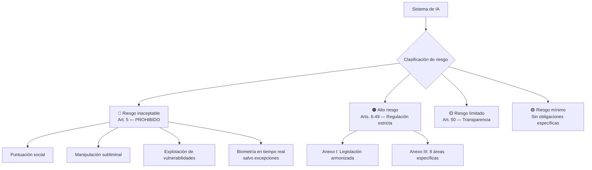
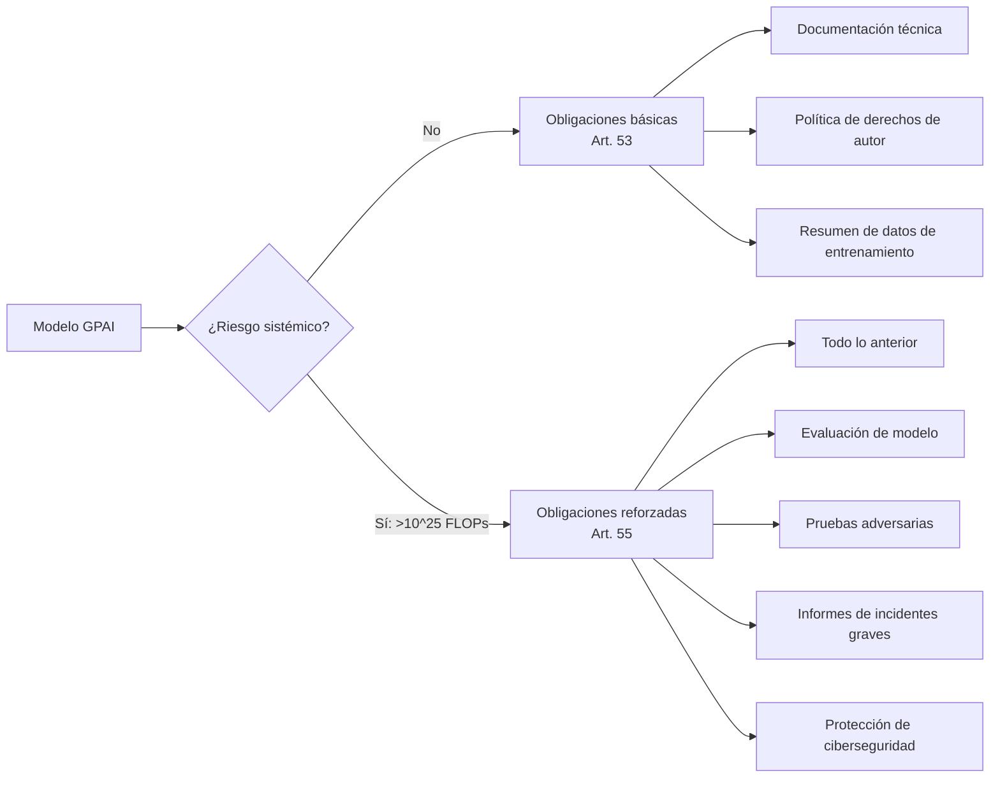
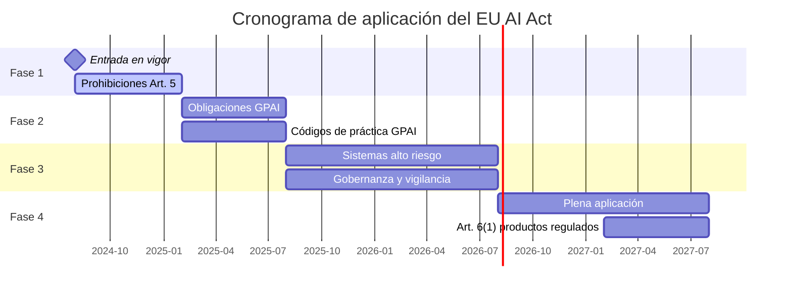

# EU AI Act — Visión Completa

> [!abstract] Resumen ejecutivo
> El *EU AI Act* (Reglamento (UE) 2024/1689) es la ==primera legislación integral del mundo sobre inteligencia artificial==. Establece un marco basado en riesgos con cuatro niveles de clasificación, obligaciones diferenciadas para proveedores y *deployers*, y sanciones de hasta ==€35 millones o el 7% de la facturación global==. Entró en vigor en agosto de 2024 con aplicación progresiva hasta 2027. La herramienta [[licit-overview|licit]] evalúa automáticamente el cumplimiento de 11 artículos clave.
> ^resumen

---

## Contexto y motivación legislativa

La Unión Europea presentó la primera propuesta del *AI Act* en abril de 2021[^1], como parte de su estrategia digital. El reglamento responde a la necesidad de establecer ==reglas armonizadas== para el desarrollo, comercialización y uso de sistemas de IA dentro del mercado interior europeo.

> [!info] Hitos legislativos
> - **Abril 2021**: Propuesta de la Comisión Europea
> - **Junio 2023**: Posición del Parlamento Europeo
> - **Diciembre 2023**: Acuerdo político en trílogos
> - **Marzo 2024**: Aprobación por el Parlamento
> - **Mayo 2024**: Aprobación por el Consejo
> - **Agosto 2024**: Entrada en vigor (publicación en DOUE)
> - **Febrero 2025**: Prohibiciones de prácticas inaceptables
> - **Agosto 2025**: Obligaciones para modelos GPAI
> - **Agosto 2026**: Obligaciones para sistemas de alto riesgo
> - **Agosto 2027**: Plena aplicación de todos los requisitos

El reglamento se basa en el artículo 114 del TFUE (*Treaty on the Functioning of the EU*), lo que significa que busca armonizar el mercado interior, no simplemente proteger derechos fundamentales — aunque estos son un pilar central[^2].

---

## Estructura del reglamento

El *AI Act* se organiza en una estructura formal que todo profesional de *compliance* debe dominar:

| Componente | Cantidad | Contenido clave |
|---|---|---|
| Títulos | 13 | Desde disposiciones generales hasta entrada en vigor |
| Capítulos | 27 | Subdividen los títulos temáticamente |
| Artículos | ==113== | Obligaciones sustantivas y procedimentales |
| Anexos | ==13== | Listas técnicas, tablas de conformidad, criterios |
| Considerandos | 180 | Contexto interpretativo no vinculante |

### Los 13 títulos

```
Título I    — Disposiciones generales (arts. 1-4)
Título II   — Prácticas de IA prohibidas (art. 5)
Título III  — Sistemas de alto riesgo (arts. 6-49)
Título IV   — Obligaciones de transparencia (arts. 50-56)
Título V    — Modelos de IA de propósito general (arts. 51-56)
Título VI   — Medidas de apoyo a la innovación (arts. 57-63)
Título VII  — Gobernanza (arts. 64-74)
Título VIII — Base de datos de la UE (art. 71)
Título IX   — Vigilancia post-comercialización (arts. 72-73)
Título X    — Códigos de conducta (art. 95)
Título XI   — Delegación de poderes (arts. 97-98)
Título XII  — Sanciones (arts. 99-101)
Título XIII — Disposiciones finales (arts. 102-113)
```

> [!tip] Navegación eficiente
> Para evaluaciones con [[licit-overview|licit]], los artículos más relevantes se concentran en el ==Título III== (alto riesgo) y el ==Título IV== (transparencia). El comando `licit assess` cubre 11 artículos distribuidos entre estos títulos.

---

## Clasificación de riesgos

El enfoque *risk-based* es el núcleo del reglamento. Cada sistema de IA se clasifica en uno de cuatro niveles:



### Riesgo inaceptable — Prácticas prohibidas (Art. 5)

> [!danger] Prohibiciones absolutas
> Los siguientes usos de IA están ==terminantemente prohibidos== en la UE:
> 1. **Puntuación social** (*social scoring*) por autoridades públicas
> 2. **Manipulación subliminal** que cause daño
> 3. **Explotación de vulnerabilidades** de grupos específicos (edad, discapacidad)
> 4. **Categorización biométrica** por raza, orientación sexual, creencias
> 5. **Raspado no dirigido** de imágenes faciales de internet o CCTV
> 6. **Reconocimiento de emociones** en centros de trabajo y educación
> 7. **Identificación biométrica remota en tiempo real** en espacios públicos (con excepciones tasadas para seguridad)
> 8. **Policía predictiva** basada exclusivamente en perfilado

Estas prohibiciones entraron en vigor en ==febrero de 2025==, siendo las primeras disposiciones aplicables del reglamento.

### Alto riesgo — El corazón regulatorio

Los sistemas de alto riesgo se determinan de dos maneras:

1. **Anexo I** — Sistemas que forman parte de productos ya regulados bajo legislación armonizada de la UE (dispositivos médicos, maquinaria, juguetes, etc.)
2. **Anexo III** — Ocho áreas de uso específicas detalladas en [[eu-ai-act-alto-riesgo]]

> [!warning] Filtro del Art. 6(3)
> No todo sistema que caiga en una categoría del Anexo III es automáticamente de alto riesgo. El Art. 6(3) permite excluir sistemas que no presenten un ==riesgo significativo== de daño a la salud, seguridad o derechos fundamentales. Sin embargo, esta exclusión requiere documentación y justificación — algo que [[licit-overview|licit]] ayuda a generar.

### Riesgo limitado — Transparencia (Art. 50)

Obligaciones de transparencia para:
- *Chatbots*: informar que se interactúa con IA
- *Deepfakes*: etiquetar contenido generado por IA
- Contenido generado: marcar textos creados por IA
- Sistemas de detección de emociones: informar al usuario

### Riesgo mínimo

Sin obligaciones específicas, pero se recomiendan códigos de conducta voluntarios (Título X).

---

## Obligaciones por rol

Las obligaciones difieren según el rol del actor en la cadena de valor. Ver detalle en [[eu-ai-act-proveedores-vs-deployers]].

| Obligación | Proveedor | *Deployer* | Importador | Distribuidor |
|---|---|---|---|---|
| Sistema de gestión de riesgos | ==Sí (Art. 9)== | Cooperar | — | — |
| Gobernanza de datos | ==Sí (Art. 10)== | — | — | — |
| Documentación técnica | ==Sí (Art. 11)== | — | Verificar | — |
| *Logging* automático | Sí (Art. 12) | ==Conservar logs== | — | — |
| Transparencia | Sí (Art. 13) | ==Sí (Art. 13)== | — | — |
| Supervisión humana | Diseñar (Art. 14) | ==Implementar== | — | — |
| Precisión y robustez | ==Sí (Art. 15)== | Monitorizar | — | — |
| Evaluación de conformidad | ==Sí (Art. 43)== | — | Verificar CE | Verificar CE |
| Registro en base de datos UE | ==Sí (Art. 49)== | Sí (Art. 49) | — | — |
| FRIA | — | ==Sí (Art. 27)== | — | — |

> [!example]- Ejemplo práctico: cadena de responsabilidad
> ```
> Empresa A (Proveedor):
>   - Desarrolla modelo de scoring crediticio
>   - Realiza evaluación de conformidad (Art. 43)
>   - Genera documentación técnica Anexo IV
>   - Registra en base de datos de la UE
>   → licit annex-iv genera documentación
>   → licit assess evalúa cumplimiento
>
> Empresa B (Deployer):
>   - Integra el modelo en su proceso de concesión de créditos
>   - Realiza FRIA (Art. 27)
>   - Implementa supervisión humana
>   - Conserva logs automáticos durante 6 meses mínimo
>   → licit fria genera evaluación de impacto
>   → architect proporciona audit trails
>
> Empresa C (Distribuidor):
>   - Vende la solución de Empresa A a Empresa B
>   - Verifica marcado CE
>   - Verifica que proveedor cumple obligaciones
> ```

---

## Modelos de propósito general (GPAI)

El Título V introduce obligaciones específicas para modelos de IA de propósito general (*General-Purpose AI Models*), como GPT-4, Claude, Llama o Gemini.



> [!question] ¿Cuándo un modelo GPAI tiene riesgo sistémico?
> Se presume riesgo sistémico cuando el cómputo de entrenamiento supera ==10^25 FLOPs== (operaciones de punto flotante). Alternativamente, la Comisión puede designarlo por su impacto en el mercado interior. Actualmente, modelos como GPT-4 y Gemini Ultra superan este umbral.

---

## Cómo licit evalúa el EU AI Act

La herramienta [[licit-overview|licit]] automatiza la evaluación de cumplimiento mediante su comando `licit assess`. Este comando analiza ==11 artículos clave== del reglamento:

| Artículo | Tema | Método de evaluación |
|---|---|---|
| Art. 9 | Gestión de riesgos | Verificación de documentación y [[architect-overview\|architect]] sessions |
| Art. 10 | Gobernanza de datos | Análisis de *manifests* de datos |
| Art. 11 | Documentación técnica | Validación contra ==requisitos Anexo IV== |
| Art. 12 | *Logging* | Verificación de [[architect-overview\|architect]] *traces* |
| Art. 13 | Transparencia | Análisis de *disclosures* |
| Art. 14 | Supervisión humana | Verificación de *human-in-the-loop* |
| Art. 15 | Precisión y robustez | Evaluación de métricas y [[vigil-overview\|vigil]] SARIF |
| Art. 27 | FRIA | Verificación de evaluación de impacto |
| Art. 43 | Conformidad | Estado de evaluación de conformidad |
| Art. 49 | Registro | Verificación de registro en base de datos UE |
| Art. 50 | Transparencia GPAI | Verificación de etiquetado |

> [!success] Integración con el ecosistema
> `licit assess` no trabaja aislado. Consume:
> - Datos de sesión de [[architect-overview|architect]] para verificar *audit trails*
> - Resultados SARIF de [[vigil-overview|vigil]] para evaluar robustez y seguridad
> - Requisitos normalizados de [[intake-overview|intake]] para trazar contra obligaciones
>
> El resultado es un *evidence bundle* con firma criptográfica (*Merkle tree* + HMAC).

---

## Régimen sancionador

> [!danger] Sanciones — las más altas del mundo para IA
> | Infracción | Multa máxima (empresa) | Multa máxima (PYME/startup) |
> |---|---|---|
> | Prácticas prohibidas (Art. 5) | ==€35M o 7% facturación global== | Proporcionalmente reducida |
> | Incumplimiento de obligaciones | €15M o 3% facturación global | Proporcionalmente reducida |
> | Información incorrecta a autoridades | €7.5M o 1% facturación global | Proporcionalmente reducida |
>
> Las sanciones se aplican la que sea ==mayor== de las dos cifras. Para proveedores de modelos GPAI, las multas pueden alcanzar €15M o 3% de facturación global.

---

## Calendario de aplicación



> [!tip] Preparación con licit
> Aunque los requisitos para alto riesgo no son plenamente aplicables hasta agosto de 2026, [[licit-overview|licit]] permite ==evaluar el estado de preparación ahora==. Ejecutar `licit assess --dry-run` genera un informe de brechas (*gap analysis*) sin crear evidencia formal.

---

## Gobernanza institucional

El *AI Act* establece una estructura de gobernanza multinivel:

| Órgano | Función | Composición |
|---|---|---|
| ==Oficina Europea de IA== | Supervisión de modelos GPAI, coordinación | Comisión Europea |
| Comité Europeo de IA | Asesoramiento, coordinación entre estados | Representantes nacionales |
| Foro consultivo | Perspectiva de *stakeholders* | Industria, sociedad civil, academia |
| Panel científico | Asesoramiento técnico | Expertos independientes |
| Autoridades nacionales | Supervisión del mercado nacional | Designadas por cada Estado miembro |

> [!info] Notificación obligatoria
> Los proveedores de modelos GPAI con riesgo sistémico deben notificar a la Oficina Europea de IA ==sin demora== cualquier incidente grave, proporcionando toda la información relevante, incluyendo la naturaleza del incidente y las medidas correctoras adoptadas.

---

## Relación con el ecosistema

El *EU AI Act* es el eje central de la funcionalidad de [[licit-overview|licit]] y se conecta con todo el ecosistema de herramientas:

- **[[intake-overview|intake]]**: Los requisitos normativos del *AI Act* se pueden capturar como *intake items* y trazarse a lo largo del ciclo de desarrollo. Cada artículo puede convertirse en un requisito verificable que [[intake-overview|intake]] normaliza y distribuye.

- **[[architect-overview|architect]]**: Proporciona las ==sesiones de auditoría== y *traces* OpenTelemetry que [[licit-overview|licit]] necesita para evaluar Arts. 12 (logging) y 9 (gestión de riesgos). Los informes de [[architect-overview|architect]] en formato JSON son evidencia directa.

- **[[vigil-overview|vigil]]**: Los resultados de escaneo en formato SARIF alimentan la evaluación del Art. 15 (precisión, robustez, ciberseguridad). [[licit-overview|licit]] consume estos resultados como parte del *evidence bundle*.

- **[[licit-overview|licit]]**: Implementa directamente la evaluación de 11 artículos mediante `licit assess`, genera documentación Anexo IV con `licit annex-iv`, realiza FRIA con `licit fria`, y produce *evidence bundles* con firma criptográfica.

---

## Checklist de cumplimiento

> [!warning] Lista de verificación esencial
> - [ ] Clasificar el sistema de IA según nivel de riesgo
> - [ ] Si alto riesgo: implementar sistema de gestión de riesgos (Art. 9)
> - [ ] Documentar gobernanza de datos de entrenamiento (Art. 10)
> - [ ] Generar documentación técnica Anexo IV → `licit annex-iv`
> - [ ] Implementar *logging* automático (Art. 12) → [[architect-overview|architect]]
> - [ ] Asegurar transparencia (Art. 13)
> - [ ] Diseñar supervisión humana (Art. 14)
> - [ ] Evaluar precisión y robustez (Art. 15) → [[vigil-overview|vigil]]
> - [ ] Realizar evaluación de conformidad (Art. 43)
> - [ ] Registrar en base de datos de la UE (Art. 49)
> - [ ] Si *deployer*: realizar FRIA (Art. 27) → `licit fria`
> - [ ] Evaluar cumplimiento global → `licit assess`

---

## Enlaces y referencias

> [!quote]- Bibliografía y fuentes
> - [^1]: Comisión Europea, "Proposal for a Regulation laying down harmonised rules on artificial intelligence", COM(2021) 206 final, 21 abril 2021.
> - [^2]: Consejo de la Unión Europea, "Regulation (EU) 2024/1689 of the European Parliament and of the Council", DOUE L 2024/1689, 12 julio 2024.
> - Edwards, L. & Veale, M. (2024). "The EU AI Act: a summary of its significance and scope". *Ada Lovelace Institute*.
> - Hacker, P. (2024). "The European AI liability directives". *arXiv preprint*.
> - [[eu-ai-act-anexo-iv]] — Detalle de documentación técnica
> - [[eu-ai-act-fria]] — Evaluación de impacto en derechos fundamentales
> - [[eu-ai-act-alto-riesgo]] — Sistemas de alto riesgo
> - [[eu-ai-act-proveedores-vs-deployers]] — Obligaciones por rol
> - [[regulacion-global]] — Panorama regulatorio mundial

[^1]: COM(2021) 206 final — Propuesta original de la Comisión Europea.
[^2]: Reglamento (UE) 2024/1689 del Parlamento Europeo y del Consejo.
