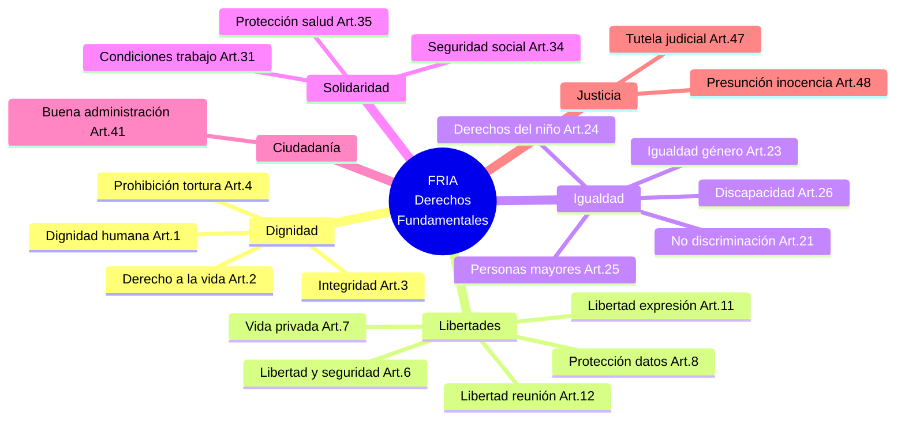
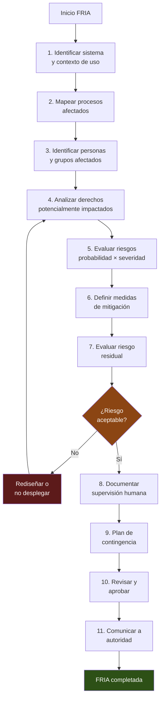

# EU AI Act — FRIA: Evaluación de Impacto en Derechos Fundamentales

> [!abstract] Resumen ejecutivo
> La *Fundamental Rights Impact Assessment* (FRIA) es una ==obligación exclusiva de los *deployers*== de sistemas de IA de alto riesgo bajo el Artículo 27 del *EU AI Act*. Requiere evaluar el impacto del sistema sobre los derechos fundamentales de la Carta de la UE ==antes de su puesta en servicio==. El comando `licit fria` genera una FRIA estructurada mediante un cuestionario guiado que cubre todos los derechos potencialmente afectados, produciendo un documento conforme y un *evidence bundle* firmado criptográficamente.
> ^resumen

---

## Fundamento legal

El Artículo 27 del *EU AI Act* establece la obligación de realizar una FRIA para ciertos *deployers* de sistemas de alto riesgo[^1]:

> [!quote] Artículo 27(1) del EU AI Act
> "Antes de poner en servicio un sistema de IA de alto riesgo [...], los responsables del despliegue que sean organismos de derecho público, o entidades privadas que presten servicios públicos, y los responsables del despliegue de sistemas de IA de alto riesgo contemplados en el anexo III, puntos 5, letras b) y c), realizarán una evaluación del impacto en los derechos fundamentales que el uso de dicho sistema pueda producir."

### ¿Quién debe realizar la FRIA?

| Tipo de *deployer* | ¿Obligación FRIA? | Base legal |
|---|---|---|
| Organismos de derecho público | ==Sí== | Art. 27(1) |
| Entidades privadas con servicios públicos | ==Sí== | Art. 27(1) |
| *Deployers* de scoring crediticio (Anexo III, 5b) | ==Sí== | Art. 27(1) |
| *Deployers* de seguros (Anexo III, 5c) | ==Sí== | Art. 27(1) |
| Otros *deployers* de alto riesgo | Recomendado | Buena práctica |
| *Deployers* de riesgo limitado/mínimo | No obligatorio | — |

> [!warning] Diferencia con DPIA
> La FRIA ==no sustituye== la *Data Protection Impact Assessment* (DPIA) del GDPR (Art. 35). Son evaluaciones complementarias con alcances diferentes:
> - **DPIA**: Centrada en protección de datos personales
> - **FRIA**: Centrada en ==todos los derechos fundamentales== (no solo protección de datos)
>
> En la práctica, [[licit-overview|licit]] permite vincular ambas evaluaciones para evitar duplicación de esfuerzos.

---

## Derechos fundamentales cubiertos

La FRIA debe evaluar el impacto sobre los derechos de la Carta de Derechos Fundamentales de la UE[^2]:



---

## Contenido obligatorio de la FRIA

El Artículo 27(2) especifica los elementos mínimos que debe contener la evaluación:

### a) Descripción de los procesos del *deployer*

> [!info] Procesos en los que se utilizará el sistema
> - Identificar ==todos los procesos== donde se integrará el sistema de IA
> - Describir cómo el sistema interactúa con procesos de toma de decisiones
> - Especificar el grado de automatización vs. intervención humana
> - Documentar la frecuencia de uso y volumen de decisiones

### b) Período y frecuencia de uso previsto

- Fecha de inicio del despliegue
- Duración prevista
- Frecuencia de uso (continuo, periódico, puntual)
- Volumen estimado de personas afectadas

### c) Categorías de personas afectadas

> [!danger] Identificación exhaustiva de personas afectadas
> Es ==crítico== identificar todas las categorías de personas naturales y grupos que podrían verse afectados:
> - Usuarios directos del sistema
> - Personas sujetas a las decisiones del sistema
> - Terceros indirectamente afectados
> - ==Grupos vulnerables== (menores, personas con discapacidad, personas mayores, minorías)

### d) Riesgos específicos para derechos fundamentales

Para cada derecho potencialmente afectado:
1. Identificar el riesgo concreto
2. Evaluar la probabilidad de materialización
3. Evaluar la severidad del impacto
4. Considerar si afecta desproporcionadamente a grupos vulnerables

### e) Medidas de supervisión humana

> [!tip] Conexión con Art. 14
> Las medidas de supervisión humana descritas en la FRIA deben ser coherentes con las especificadas en la documentación técnica del proveedor ([[eu-ai-act-anexo-iv|Anexo IV]]). [[architect-overview|architect]] puede proporcionar evidencia de los mecanismos de supervisión implementados.

### f) Medidas ante materialización de riesgos

Plan de acción para cuando los riesgos identificados se materialicen:
- Procedimientos de escalado
- Mecanismos de suspensión del sistema
- Planes de comunicación a afectados
- Procesos de remediación

### g) Información a la autoridad de vigilancia del mercado

La FRIA (o un resumen) debe comunicarse a la autoridad competente.

---

## Proceso FRIA paso a paso



---

## Generación automatizada con `licit fria`

El comando `licit fria` implementa un cuestionario estructurado que guía al *deployer* a través de todo el proceso FRIA:

```bash
# Iniciar cuestionario FRIA interactivo
licit fria --interactive --project ./mi-proyecto

# Generar FRIA desde archivo de configuración
licit fria --config ./fria-config.yaml --output ./docs/fria/

# Actualizar FRIA existente
licit fria --update ./docs/fria/fria-v1.md

# Validar FRIA completada
licit fria --validate ./docs/fria/
```

### Estructura del cuestionario

> [!example]- Ejemplo del cuestionario FRIA de licit (extracto)
> ```yaml
> fria_questionnaire:
>   system_identification:
>     name: "CreditScore AI v2.3.1"
>     provider: "Fintech Corp S.L."
>     deployer: "Banco Nacional S.A."
>     annex_iii_category: "5b - Solvencia crediticia"
>
>   deployment_context:
>     processes:
>       - name: "Pre-evaluación de solicitudes de préstamo"
>         automation_level: "semi-automatizado"
>         human_oversight: "Analista revisa todas las denegaciones"
>     start_date: "2025-09-01"
>     duration: "indefinido"
>     frequency: "continuo"
>     estimated_volume: "50,000 evaluaciones/mes"
>
>   affected_persons:
>     direct_users:
>       - category: "Analistas de riesgo"
>         count: 45
>     decision_subjects:
>       - category: "Solicitantes de préstamo"
>         count_estimate: "50,000/mes"
>         vulnerable_groups:
>           - "Personas mayores de 65 años"
>           - "Personas con historial crediticio limitado"
>           - "Personas migrantes con datos parciales"
>
>   rights_assessment:
>     - right: "Art. 21 - No discriminación"
>       risk: "Sesgo algorítmico por género, edad o nacionalidad"
>       probability: "media"
>       severity: "alta"
>       mitigation:
>         - "Auditoría trimestral de equidad con métricas de fairness"
>         - "Re-entrenamiento con datos balanceados"
>         - "Prohibición de variables proxy de características protegidas"
>       residual_risk: "bajo"
>
>     - right: "Art. 8 - Protección de datos"
>       risk: "Procesamiento excesivo de datos personales"
>       probability: "baja"
>       severity: "alta"
>       mitigation:
>         - "DPIA completada y aprobada"
>         - "Minimización de datos: solo variables necesarias"
>         - "Anonimización en entornos de desarrollo"
>       residual_risk: "bajo"
> ```

---

## Matriz de evaluación de riesgos

> [!warning] Metodología de evaluación
> La FRIA requiere una evaluación ==sistemática y documentada== de cada riesgo. Se recomienda utilizar una matriz probabilidad-severidad:

| | Severidad baja | Severidad media | Severidad alta | Severidad crítica |
|---|---|---|---|---|
| **Prob. alta** | Moderado | ==Alto== | ==Muy alto== | ==Inaceptable== |
| **Prob. media** | Bajo | Moderado | ==Alto== | ==Muy alto== |
| **Prob. baja** | Mínimo | Bajo | Moderado | ==Alto== |
| **Prob. muy baja** | Mínimo | Mínimo | Bajo | Moderado |

> [!danger] Riesgo inaceptable
> Si algún riesgo se clasifica como ==inaceptable== y no puede mitigarse, el sistema ==no debe desplegarse==. Esta es una barrera (*gate*) fundamental del proceso FRIA que [[licit-overview|licit]] verifica automáticamente.

---

## FRIA vs. DPIA — Tabla comparativa

| Aspecto | FRIA (Art. 27 AI Act) | DPIA (Art. 35 GDPR) |
|---|---|---|
| **Base legal** | EU AI Act | GDPR |
| **Obligado** | *Deployer* | ==Responsable del tratamiento== |
| **Alcance** | Todos los derechos fundamentales | Solo protección de datos |
| **Cuándo** | Antes de puesta en servicio | Antes del tratamiento |
| **Comunicación** | Autoridad de vigilancia del mercado | ==Autoridad de protección de datos== |
| **Consulta previa** | No requerida | Sí, si riesgo alto residual |
| **Actualización** | Ante cambios significativos | Ante cambios en el tratamiento |
| **Herramienta** | `licit fria` | Herramientas GDPR específicas |

> [!tip] Sinergia entre evaluaciones
> [[licit-overview|licit]] permite importar datos de una DPIA existente para pre-rellenar las secciones de la FRIA relacionadas con protección de datos, evitando duplicación:
> ```bash
> licit fria --import-dpia ./dpia-document.pdf --project ./mi-proyecto
> ```

---

## Grupos vulnerables — Análisis especial

El *AI Act* pone énfasis especial en los grupos vulnerables[^3]. La FRIA debe analizar impactos diferenciados:

> [!example]- Análisis de grupos vulnerables — Ejemplo para scoring crediticio
> ```markdown
> ## Análisis de impacto diferenciado
>
> ### Personas mayores de 65 años
> - **Riesgo**: Menor presencia en datos de entrenamiento →
>   posible sesgo en predicciones
> - **Impacto**: Denegación injusta de crédito
> - **Mitigación**: Submuestra representativa en entrenamiento,
>   monitorización de tasas de aprobación por grupo etario
>
> ### Personas migrantes
> - **Riesgo**: Historial crediticio incompleto o inexistente
>   en el país de destino
> - **Impacto**: Exclusión sistemática del acceso a crédito
> - **Mitigación**: Modelo alternativo para personas sin
>   historial, revisión humana obligatoria
>
> ### Personas con discapacidad
> - **Riesgo**: Variables proxy (empleo intermitente,
>   ingresos variables) pueden correlacionar con discapacidad
> - **Impacto**: Discriminación indirecta en acceso a crédito
> - **Mitigación**: Análisis de disparate impact, eliminación
>   de variables con alta correlación con discapacidad
>
> ### Personas jóvenes (18-25 años)
> - **Riesgo**: Historial crediticio breve → predicciones
>   menos fiables
> - **Impacto**: Condiciones crediticias desfavorables
> - **Mitigación**: Umbral de confianza ajustado, revisión
>   humana para scores borderline en este grupo
> ```

---

## Medidas de supervisión humana en la FRIA

> [!success] Requisitos de supervisión humana para FRIA
> La FRIA debe documentar específicamente:
> 1. **Quién supervisa**: Roles, cualificaciones, formación recibida
> 2. **Qué supervisa**: Métricas, umbrales, alertas
> 3. **Cómo supervisa**: Herramientas, dashboards, frecuencia de revisión
> 4. **Cuándo interviene**: Criterios de escalado y anulación
> 5. **Qué puede hacer**: Capacidad real de detener o modificar el sistema
>
> [[architect-overview|architect]] registra todas las intervenciones humanas como parte del *audit trail*, proporcionando evidencia verificable para la FRIA.

---

## Comunicación a la autoridad

El Artículo 27(4) requiere que los resultados de la FRIA se comuniquen a la autoridad de vigilancia del mercado. [[licit-overview|licit]] genera el formato requerido:

```bash
# Generar versión para autoridad
licit fria --export-authority ./docs/fria/ --format pdf

# Generar evidence bundle para la comunicación
licit fria --bundle ./docs/fria/ --sign
```

> [!info] Plazo de comunicación
> La FRIA debe comunicarse ==antes de la primera puesta en servicio== del sistema. No existe un plazo específico previo, pero se recomienda comunicar con suficiente antelación para permitir consultas de la autoridad.

---

## Revisión y actualización

> [!warning] La FRIA no es un documento estático
> Debe actualizarse cuando:
> - Cambien las condiciones de uso del sistema
> - Se identifiquen nuevos grupos afectados
> - Se materialicen riesgos previamente identificados
> - El proveedor actualice sustancialmente el sistema
> - Cambien las circunstancias regulatorias o sociales
>
> `licit fria --update` compara la FRIA existente con el estado actual y señala secciones que requieren revisión.

---

## Relación con el ecosistema

La FRIA se beneficia de la integración con todo el ecosistema de herramientas:

- **[[intake-overview|intake]]**: Los requisitos de derechos fundamentales capturados por [[intake-overview|intake]] alimentan directamente la identificación de derechos afectados en la FRIA. Los requisitos de accesibilidad y no discriminación son especialmente relevantes.

- **[[architect-overview|architect]]**: Proporciona evidencia de ==supervisión humana== a través de *audit trails* y sesiones registradas. Los *traces* de [[architect-overview|architect]] documentan cuándo y cómo intervienen los operadores humanos, información esencial para la sección de supervisión de la FRIA.

- **[[vigil-overview|vigil]]**: Los escaneos de seguridad de [[vigil-overview|vigil]] informan la evaluación de riesgos de ciberseguridad en la FRIA. Vulnerabilidades detectadas en SARIF se mapean a riesgos para derechos fundamentales (ej: fuga de datos → derecho a protección de datos).

- **[[licit-overview|licit]]**: Orquesta todo el proceso FRIA: cuestionario guiado, generación de documento, validación de completitud, exportación para autoridades, y producción de *evidence bundle* firmado.

---

## Enlaces y referencias

> [!quote]- Bibliografía y fuentes
> - [^1]: Reglamento (UE) 2024/1689, Artículo 27 — Evaluación de impacto en los derechos fundamentales para los sistemas de IA de alto riesgo.
> - [^2]: Carta de los Derechos Fundamentales de la Unión Europea (2000/C 364/01).
> - [^3]: Considerando 80 del EU AI Act sobre la especial protección de grupos vulnerables.
> - Agencia de los Derechos Fundamentales de la UE (FRA), "Getting the future right — Artificial intelligence and fundamental rights", 2020.
> - European Digital Rights (EDRi), "Human Rights Impact Assessment for AI Systems", 2022.
> - [[eu-ai-act-completo]] — Visión completa del reglamento
> - [[eu-ai-act-alto-riesgo]] — Clasificación de alto riesgo
> - [[data-governance-ia]] — Gobernanza de datos y GDPR
> - [[ai-liability-directive]] — Responsabilidad civil por IA

[^1]: Art. 27(1) del Reglamento (UE) 2024/1689.
[^2]: Carta de los Derechos Fundamentales de la UE, 2000/C 364/01.
[^3]: Considerando 80 del EU AI Act.
