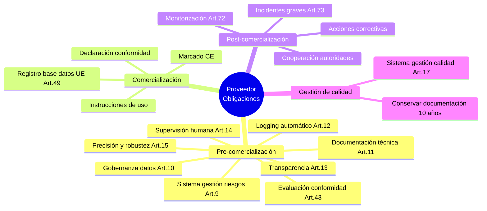
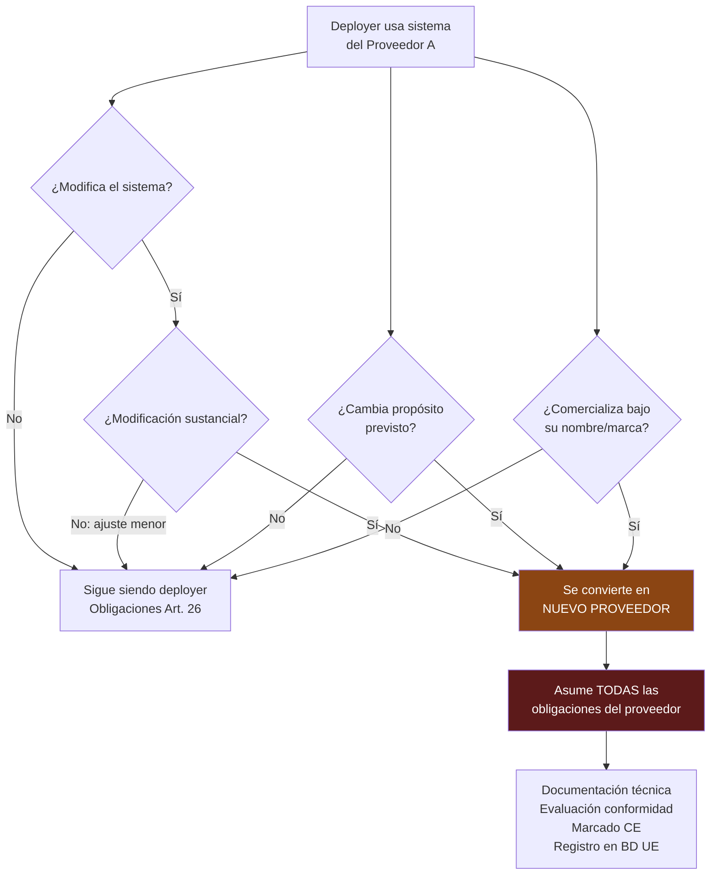
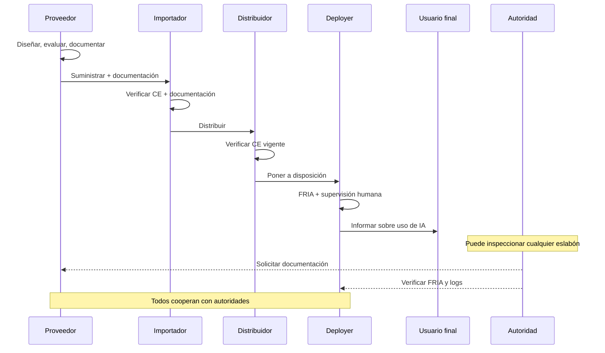

# EU AI Act — Proveedores vs Deployers

> [!abstract] Resumen ejecutivo
> El *EU AI Act* define ==roles diferenciados con obligaciones específicas== en la cadena de valor de la IA: proveedores (*providers*), *deployers* (responsables del despliegue), importadores, distribuidores y representantes autorizados. La distinción proveedor/*deployer* es ==fundamental para determinar quién debe cumplir qué obligaciones==. Un *deployer* puede convertirse en proveedor si realiza una modificación sustancial. [[licit-overview|licit]] rastrea la procedencia del código para determinar autoría y responsabilidad en la cadena.
> ^resumen

---

## Definiciones legales

El Artículo 3 del *EU AI Act* define los roles clave[^1]:

| Rol | Definición | Ejemplo |
|---|---|---|
| ==Proveedor== (*provider*) | Persona/entidad que ==desarrolla== o manda desarrollar un sistema de IA y lo comercializa o pone en servicio bajo su nombre | OpenAI, Anthropic, empresa que entrena su modelo |
| ==*Deployer*== | Persona/entidad que ==utiliza== un sistema de IA bajo su autoridad, excepto uso personal no profesional | Banco que usa scoring IA, hospital con diagnóstico IA |
| Importador | Persona/entidad en la UE que comercializa un sistema de IA de un proveedor de fuera de la UE | Distribuidor europeo de software IA americano |
| Distribuidor | Persona/entidad en la cadena de suministro que ==pone a disposición== un sistema de IA | Reseller, VAR (*Value Added Reseller*) |
| Representante autorizado | Persona en la UE mandatada por un proveedor extranjero | Bufete de abogados representando proveedor |

> [!warning] *Deployer* ≠ usuario final
> El *deployer* es la ==organización== que despliega el sistema en su negocio, no el usuario individual. Un empleado de banco que usa un sistema de scoring no es *deployer*; el banco sí lo es.

---

## Obligaciones del proveedor

El proveedor tiene las obligaciones más extensas:



### Desglose de obligaciones clave

> [!danger] Obligaciones irrenunciables del proveedor
> 1. **Sistema de gestión de riesgos** (Art. 9): Proceso continuo e iterativo durante todo el ciclo de vida
> 2. **Documentación técnica** (Art. 11): Conforme al [[eu-ai-act-anexo-iv|Anexo IV]], actualizada
> 3. **Evaluación de conformidad** (Art. 43): Antes de comercializar
> 4. **Monitorización post-comercialización** (Art. 72): Vigilancia activa continuada
> 5. **Notificación de incidentes** (Art. 73): ==En 72 horas== tras conocimiento
> 6. **Conservación de documentación**: ==Mínimo 10 años== tras retirada del mercado

> [!example]- Ejemplo: Flujo de obligaciones del proveedor
> ```
> Empresa ProviderTech desarrolla un sistema de scoring crediticio:
>
> FASE 1: Diseño y desarrollo
> ├── Implementar sistema de gestión de riesgos (Art. 9)
> │   → Documentar riesgos, mitigaciones, riesgo residual
> ├── Establecer gobernanza de datos (Art. 10)
> │   → Calidad, representatividad, sesgos, base legal GDPR
> ├── Diseñar logging automático (Art. 12)
> │   → architect proporciona OpenTelemetry traces
> ├── Diseñar supervisión humana (Art. 14)
> │   → Interfaz para revisión, botón de parada
> └── Asegurar precisión/robustez/ciberseguridad (Art. 15)
>     → vigil realiza escaneos de seguridad
>
> FASE 2: Pre-comercialización
> ├── Generar documentación técnica Anexo IV
> │   → licit annex-iv --project ./scoring-system
> ├── Realizar evaluación de conformidad (Art. 43)
> │   → licit assess --full
> ├── Aplicar marcado CE
> ├── Emitir declaración de conformidad
> └── Registrar en base de datos UE (Art. 49)
>
> FASE 3: Post-comercialización
> ├── Monitorización continua (Art. 72)
> │   → architect sessions + métricas
> ├── Comunicar incidentes graves (Art. 73)
> │   → 72 horas desde conocimiento
> └── Acciones correctivas si necesario
> ```

---

## Obligaciones del *deployer*

El *deployer* tiene obligaciones menores pero igualmente importantes:

| Obligación | Artículo | Descripción |
|---|---|---|
| Uso conforme | Art. 26(1) | Usar el sistema ==conforme a instrucciones del proveedor== |
| Supervisión humana | Art. 26(2) | ==Implementar== las medidas de supervisión diseñadas por el proveedor |
| Datos de entrada | Art. 26(4) | Asegurar que los datos de entrada son ==relevantes y representativos== |
| Logging | Art. 26(5) | ==Conservar logs== generados automáticamente (mínimo 6 meses) |
| FRIA | ==Art. 27== | Realizar evaluación de impacto en derechos fundamentales |
| Información a afectados | Art. 26(7) | Informar a las personas que están sujetas al sistema |
| Registro | Art. 49(3) | Registrar el uso en la base de datos UE |
| Cooperación | Art. 26(9) | Cooperar con autoridades |

> [!tip] FRIA — Obligación exclusiva del deployer
> La evaluación de impacto en derechos fundamentales ([[eu-ai-act-fria|FRIA]]) es una obligación ==exclusiva del deployer==, no del proveedor. El proveedor facilita la información, pero el *deployer* realiza la evaluación en su contexto de uso específico. `licit fria` guía este proceso.

### Conservación de logs

> [!warning] Retención de logs — 6 meses mínimo
> Los *deployers* deben conservar los logs generados automáticamente por el sistema durante un ==mínimo de 6 meses==, salvo que la legislación aplicable exija un período diferente. [[architect-overview|architect]] gestiona esta retención mediante su sistema de sesiones y *traces*.

---

## Cuándo un *deployer* se convierte en proveedor

> [!danger] Modificación sustancial — cambio de rol
> El Artículo 25 establece que un *deployer* se convierte en proveedor si:
> 1. ==Modifica sustancialmente== el propósito previsto del sistema
> 2. Realiza una ==modificación sustancial== del sistema
> 3. Comercializa el sistema bajo su ==propio nombre o marca==
>
> En estos casos, el antiguo *deployer* asume ==todas las obligaciones del proveedor==.



### ¿Qué es una modificación sustancial?

> [!question] Criterios de modificación sustancial
> El reglamento no define exhaustivamente "modificación sustancial" pero proporciona criterios:
> - Cambio del ==propósito previsto== del sistema
> - Cambio en la ==arquitectura del modelo== (re-entrenamiento significativo)
> - Cambio en el ==algoritmo principal== (no meros ajustes de hiperparámetros)
> - Integración del sistema en un ==contexto diferente== al previsto
>
> [[licit-overview|licit]] puede ayudar a determinar si una modificación es sustancial mediante `licit scan` que analiza el volumen y naturaleza de los cambios de código.

> [!example]- Escenarios de modificación sustancial
> ```
> ESCENARIO 1: NO sustancial
> - El deployer ajusta umbrales de decisión dentro del rango
>   recomendado por el proveedor
> - Resultado: Sigue siendo deployer
>
> ESCENARIO 2: NO sustancial
> - El deployer re-entrena el modelo con datos locales
>   siguiendo el procedimiento documentado por el proveedor
> - Resultado: Depende — si el proveedor lo previó, no sustancial
>
> ESCENARIO 3: SÍ sustancial
> - El deployer toma un sistema de evaluación de CVs y lo usa
>   para evaluar solicitudes de préstamos
> - Resultado: Cambio de propósito → se convierte en proveedor
>
> ESCENARIO 4: SÍ sustancial
> - El deployer modifica la arquitectura del modelo añadiendo
>   nuevas capas y re-entrenando con datos propios
> - Resultado: Modificación sustancial → se convierte en proveedor
>
> ESCENARIO 5: SÍ sustancial
> - El deployer comercializa el sistema bajo su propia marca
>   sin mención del proveedor original
> - Resultado: Comercialización bajo nombre propio → proveedor
> ```

---

## Cadena de responsabilidad



> [!info] Responsabilidad compartida pero diferenciada
> Cada actor en la cadena tiene responsabilidades propias. El proveedor no puede trasladar sus obligaciones al *deployer* mediante contrato, y viceversa. Sin embargo, deben ==cooperar== para garantizar el cumplimiento global. [[contratos-sla-ia|Los contratos entre partes]] deben reflejar esta distribución.

---

## Trazabilidad y procedencia con licit

La distinción proveedor/*deployer* tiene implicaciones directas en la trazabilidad del código:

> [!success] licit scan para trazabilidad de roles
> El comando `licit scan` analiza la procedencia del código para determinar:
> - ==Quién escribió qué código== (git blame analysis)
> - Qué porcentaje es generado por IA vs. humano
> - Cuándo se realizaron cambios (patrones de commits)
> - Si los cambios constituyen una ==modificación sustancial==
>
> Esto es esencial para determinar si un *deployer* ha cruzado la línea y se ha convertido en proveedor.

Las 6 heurísticas de [[trazabilidad-codigo-ia|trazabilidad de código]] de [[licit-overview|licit]] son especialmente relevantes:

| Heurística | Relevancia para roles |
|---|---|
| Git blame analysis | ==Identifica autores== y su afiliación |
| Patrones de commit | Detecta commits automatizados (IA) |
| Correlación de sesiones | Vincula cambios con sesiones de [[architect-overview\|architect]] |
| Análisis de estilo | Diferencia código humano de generado |
| Patrones de mensajes de commit | Detecta mensajes generados por IA |
| Velocidad de cambios de archivo | Detecta cambios masivos no humanos |

---

## Importadores y distribuidores

### Importador (Art. 23)

> [!warning] Obligaciones del importador
> - Verificar que el proveedor ha realizado la evaluación de conformidad
> - Verificar que existe ==documentación técnica==
> - Verificar el ==marcado CE==
> - Verificar que el proveedor está identificado y contactable
> - No comercializar si sospecha no conformidad
> - Conservar copia de la declaración de conformidad ==10 años==
> - Cooperar con autoridades

### Distribuidor (Art. 24)

- Verificar que el sistema lleva marcado CE
- Verificar que el proveedor e importador han cumplido sus obligaciones
- No distribuir si sospecha no conformidad
- Si almacena: condiciones adecuadas de conservación

> [!tip] Importadores y distribuidores como gatekeepers
> Aunque sus obligaciones son menores, importadores y distribuidores actúan como ==filtros de seguridad== en la cadena. Si detectan no conformidad, deben ==detener la comercialización== e informar al proveedor y a las autoridades.

---

## Representante autorizado (Art. 22)

Proveedores establecidos fuera de la UE deben designar un representante autorizado en la UE ==antes de comercializar== su sistema:

| Aspecto | Detalle |
|---|---|
| Quién lo designa | Proveedor fuera de la UE |
| Quién puede ser | Persona física o jurídica en la UE |
| Mandato | Por ==escrito==, especificando obligaciones |
| Obligaciones | Verificar conformidad, mantener documentación, cooperar con autoridades |
| Responsabilidad | ==Solidaria== con el proveedor ante autoridades |

---

## Tabla comparativa de obligaciones

| Obligación | Proveedor | *Deployer* | Importador | Distribuidor |
|---|---|---|---|---|
| Gestión de riesgos (Art. 9) | ==Obligatorio== | Cooperar | — | — |
| Gobernanza de datos (Art. 10) | ==Obligatorio== | Datos de entrada | — | — |
| Documentación técnica (Art. 11) | ==Obligatorio== | — | Verificar | — |
| Logging (Art. 12) | Diseñar | ==Conservar 6 meses== | — | — |
| Transparencia (Art. 13) | Diseñar | ==Implementar== | — | — |
| Supervisión humana (Art. 14) | Diseñar | ==Implementar== | — | — |
| Precisión/robustez (Art. 15) | ==Obligatorio== | Monitorizar | — | — |
| Sistema de calidad (Art. 17) | ==Obligatorio== | — | — | — |
| Evaluación conformidad (Art. 43) | ==Obligatorio== | — | Verificar CE | Verificar CE |
| Marcado CE (Art. 48) | ==Aplicar== | — | Verificar | Verificar |
| Registro BD UE (Art. 49) | ==Obligatorio== | ==Obligatorio== | — | — |
| FRIA (Art. 27) | — | ==Obligatorio== | — | — |
| Información a afectados | Instrucciones | ==Obligatorio== | — | — |
| Notificación incidentes (Art. 73) | ==72 horas== | Informar al proveedor | — | — |
| Cooperación autoridades | ==Obligatorio== | ==Obligatorio== | ==Obligatorio== | ==Obligatorio== |

---

## Relación con el ecosistema

La correcta asignación de roles proveedor/*deployer* impacta en todo el ecosistema de herramientas:

- **[[intake-overview|intake]]**: Los requisitos capturados por [[intake-overview|intake]] deben distinguir entre requisitos del proveedor y requisitos del *deployer*. Esta separación permite trazar qué obligaciones corresponden a cada parte y verificar que ambos lados de la cadena están cubiertos.

- **[[architect-overview|architect]]**: Las sesiones de [[architect-overview|architect]] documentan ==quién hizo qué y cuándo==. Esto es esencial para determinar si un *deployer* ha realizado una modificación sustancial que lo convierta en proveedor. Los *audit trails* proporcionan evidencia temporal y de autoría.

- **[[vigil-overview|vigil]]**: Los escaneos de [[vigil-overview|vigil]] generan evidencia de seguridad que el proveedor necesita para el Art. 15 y que el *deployer* debe conservar como parte de su monitorización. Los resultados SARIF se incorporan al *evidence bundle*.

- **[[licit-overview|licit]]**: El comando `licit scan` analiza la procedencia del código para determinar autoría y detectar si se ha producido una modificación sustancial. `licit assess` evalúa obligaciones diferenciadas según el rol declarado, y `licit report` genera informes consolidados para cada actor de la cadena.

---

## Enlaces y referencias

> [!quote]- Bibliografía y fuentes
> - [^1]: Reglamento (UE) 2024/1689, Artículo 3 — Definiciones.
> - Ebers, M. et al. (2024). "The European AI Act: A Guide to its Provisions on Providers and Deployers". *European Journal of Risk Regulation*.
> - Veale, M. & Borgesius, F.Z. (2024). "Demystifying the Draft EU Artificial Intelligence Act". *Computer Law Review International*.
> - [[eu-ai-act-completo]] — Visión completa del reglamento
> - [[eu-ai-act-alto-riesgo]] — Requisitos para alto riesgo
> - [[ai-liability-directive]] — Directiva de responsabilidad civil
> - [[trazabilidad-codigo-ia]] — Trazabilidad del código
> - [[contratos-sla-ia]] — Contratos y SLAs

[^1]: Art. 3 del Reglamento (UE) 2024/1689 define 68 términos clave del reglamento.
