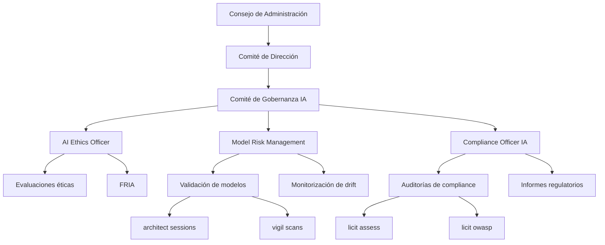
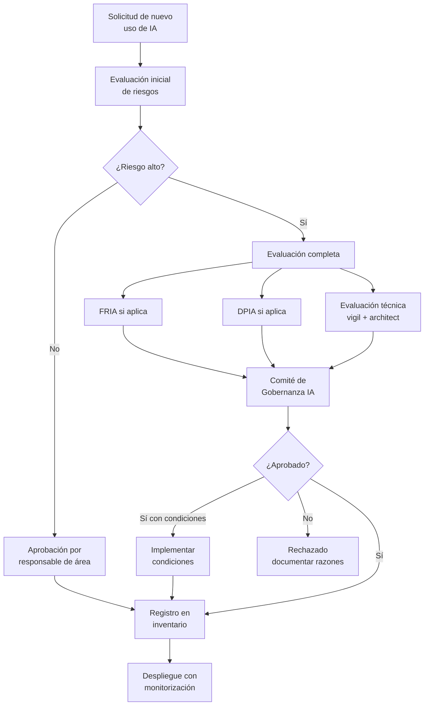

# Gobernanza de IA Empresarial

> [!abstract] Resumen ejecutivo
> La gobernanza de IA empresarial establece las ==políticas, estructuras organizativas, procesos y controles== necesarios para el desarrollo y uso responsable de sistemas de IA dentro de una organización. Incluye comités de gobernanza, roles especializados (AI Ethics Officer, Model Risk Management), políticas de uso aceptable, procesos de evaluación de riesgos y marcos de rendición de cuentas. [[licit-overview|licit]] proporciona ==evidencia automatizada de cumplimiento== para los informes de gobernanza, integrando datos de [[architect-overview|architect]] y [[vigil-overview|vigil]].
> ^resumen

---

## ¿Por qué gobernanza de IA?

> [!question] El caso de negocio para la gobernanza
> - **Regulatorio**: El [[eu-ai-act-completo|EU AI Act]] requiere sistemas de gestión de calidad (Art. 17) y gestión de riesgos (Art. 9) para sistemas de alto riesgo
> - **Reputacional**: Incidentes de IA (sesgos, alucinaciones, fugas de datos) causan ==daño reputacional significativo==
> - **Financiero**: Multas de hasta ==€35M o 7% de facturación global==
> - **Operacional**: Sin gobernanza, el uso de IA se fragmenta y se vuelve incontrolable
> - **Competitivo**: Organizaciones con gobernanza sólida inspiran confianza en clientes y socios

---

## Componentes del marco de gobernanza

```mermaid
graph TD
    A[Marco de Gobernanza IA] --> B[Políticas]
    A --> C[Estructura organizativa]
    A --> D[Procesos]
    A --> E[Controles técnicos]
    A --> F[Rendición de cuentas]

    B --> B1[Política de uso de IA]
    B --> B2[Política de datos para IA]
    B --> B3[Política de riesgos IA]
    B --> B4[Política de proveedores IA]

    C --> C1[Comité de gobernanza IA]
    C --> C2[AI Ethics Officer]
    C --> C3[Model Risk Management]
    C --> C4[Compliance Officer IA]

    D --> D1[Evaluación de riesgos]
    D --> D2[Aprobación de uso]
    D --> D3[Monitorización continua]
    D --> D4[Gestión de incidentes]

    E --> E1[licit — Compliance]
    E --> E2[architect — Audit trails]
    E --> E3[vigil — Seguridad]
    E --> E4[intake — Requisitos]

    F --> F1[Informes periódicos]
    F --> F2[Auditorías internas]
    F --> F3[Métricas de gobernanza]
```



---

## Políticas esenciales

### 1. Política de uso aceptable de IA

> [!tip] Contenido mínimo de la política de uso
> - **Alcance**: Qué se considera "uso de IA" en la organización
> - **Usos permitidos**: Lista blanca de casos de uso aprobados
> - **Usos prohibidos**: ==Prohibiciones explícitas== (scoring social, manipulación)
> - **Requisitos de aprobación**: Proceso para nuevos casos de uso
> - **Responsabilidades**: Quién es responsable de qué
> - **Formación**: Requisitos de capacitación para usuarios
> - **Incumplimiento**: Consecuencias de violar la política

> [!example]- Plantilla de política de uso aceptable
> ```markdown
> # Política de Uso Aceptable de Inteligencia Artificial
> Versión: 2.0 | Fecha: 2025-06-01 | Aprobada por: Comité de Gobernanza IA
>
> ## 1. Alcance
> Esta política aplica a todo uso de sistemas de IA, incluyendo:
> - Modelos de ML desarrollados internamente
> - APIs de IA de terceros (OpenAI, Anthropic, Google)
> - Herramientas de asistencia al código (Copilot, Claude Code)
> - Sistemas de automatización con componentes de IA
>
> ## 2. Principios
> - Transparencia: documentar todo uso de IA
> - Supervisión humana: siempre un humano responsable
> - Proporcionalidad: uso de IA justificado y proporcionado
> - No discriminación: evaluar sesgos antes de desplegar
>
> ## 3. Usos prohibidos
> - Decisiones automatizadas sin revisión humana sobre:
>   - Contratación/despido
>   - Crédito/seguros
>   - Acceso a servicios esenciales
> - Procesamiento de datos personales sensibles sin DPIA
> - Generación de contenido deepfake
> - Scoring social de empleados
>
> ## 4. Proceso de aprobación
> Todo nuevo caso de uso requiere:
> a) Evaluación de riesgos (formulario IA-RISK-001)
> b) Aprobación del responsable de área
> c) Revisión por el AI Ethics Officer
> d) Si alto riesgo: aprobación del Comité de Gobernanza
> e) Registro en el inventario de sistemas IA
>
> ## 5. Herramientas de asistencia al código
> - Uso de Copilot/Claude Code: PERMITIDO con restricciones
> - Todo código generado DEBE ser revisado por humano
> - Documentar uso de IA en commits (Co-authored-by: AI)
> - Ejecutar licit scan semanalmente
> - No usar IA con código clasificado como confidencial
> ```

### 2. Política de datos para IA

| Aspecto | Requisito | Herramienta de verificación |
|---|---|---|
| Base legal | ==GDPR Art. 6 + Art. 9== para datos sensibles | Registro de actividades |
| Minimización | Solo datos necesarios para el propósito | [[data-governance-ia\|Auditoría de datos]] |
| Calidad | Datos precisos, completos, actualizados | Pipelines de calidad |
| Retención | Período definido y justificado | Políticas de retención |
| Transferencias | Evaluación de transferencias internacionales | Cláusulas contractuales |
| Derechos | Mecanismos para ejercicio de derechos ARCO | Procesos GDPR |

### 3. Política de riesgos IA

> [!warning] Evaluación de riesgos obligatoria
> Todo sistema de IA debe pasar por una evaluación de riesgos antes de su despliegue:
> 1. **Clasificación de riesgo**: ¿Es alto riesgo bajo el [[eu-ai-act-completo|EU AI Act]]?
> 2. **Evaluación de impacto**: ¿Afecta a derechos fundamentales? → [[eu-ai-act-fria|FRIA]]
> 3. **Evaluación técnica**: ¿Es robusto y seguro? → [[vigil-overview|vigil]]
> 4. **Evaluación ética**: ¿Cumple principios éticos de la organización?
> 5. **Evaluación legal**: ¿Cumple regulación aplicable? → [[licit-overview|licit]]

### 4. Política de proveedores de IA

Requisitos para selección y gestión de proveedores de IA:

- *Due diligence* de proveedores
- Requisitos contractuales mínimos ([[contratos-sla-ia]])
- Evaluación de ==riesgo de dependencia== (*vendor lock-in*)
- Plan de contingencia y salida
- Derechos de auditoría

---

## Estructura organizativa

### Comité de Gobernanza de IA

> [!info] Composición recomendada
> | Rol | Función | Dedicación |
> |---|---|---|
> | **Sponsor ejecutivo** (CTO/CDO) | Liderazgo y recursos | Parcial |
> | **AI Ethics Officer** | ==Evaluación ética y de impacto== | Tiempo completo |
> | **CISO / Seguridad** | Riesgos de ciberseguridad | Parcial |
> | **DPO** | Protección de datos | Parcial |
> | **Legal** | Cumplimiento normativo | Parcial |
> | **Negocio** | Casos de uso y valor | Parcial |
> | **Ingeniería IA/ML** | Viabilidad técnica y riesgos | Parcial |
> | **RRHH** | Impacto en empleados | Parcial |
> | **Auditoría interna** | Verificación independiente | Parcial |



### AI Ethics Officer

> [!tip] Perfil del AI Ethics Officer
> - Formación en ética, derecho y tecnología
> - Independencia funcional (reporta al Comité, no a Ingeniería)
> - Autoridad para ==detener proyectos de IA== que no cumplan estándares éticos
> - Responsable de [[eu-ai-act-fria|FRIA]] y evaluaciones de impacto
> - Punto de contacto para denuncias internas sobre uso de IA

### Model Risk Management (MRM)

Función crítica especialmente en ==servicios financieros==:

| Actividad | Frecuencia | Herramientas |
|---|---|---|
| Validación inicial de modelos | Antes de producción | Tests estadísticos, [[vigil-overview\|vigil]] |
| Monitorización de *drift* | ==Continua== | Dashboards, alertas |
| Re-validación periódica | Trimestral/anual | Tests de regresión |
| Evaluación de sesgos | Trimestral | Métricas de *fairness* |
| Documentación de modelos | Continua | [[licit-overview\|licit]] annex-iv |
| Inventario de modelos | Continua | Registro centralizado |

---

## Inventario de sistemas IA

> [!danger] Requisito fundamental
> Toda organización debe mantener un ==inventario actualizado de todos los sistemas de IA== que utiliza, desarrolla o despliega. Sin inventario, la gobernanza es imposible.

| Campo | Ejemplo | Obligatorio |
|---|---|---|
| Nombre del sistema | CreditScore AI v2.3 | ==Sí== |
| Propósito | Evaluación de solvencia | ==Sí== |
| Clasificación de riesgo | Alto (Anexo III, 5b) | ==Sí== |
| Proveedor | Interno / ProviderTech S.L. | ==Sí== |
| Responsable interno | María García, Dir. Riesgos | ==Sí== |
| Datos procesados | Datos financieros personales | ==Sí== |
| Base legal GDPR | Interés legítimo (Art. 6.1.f) | ==Sí== |
| Estado | Producción / Piloto / Retirado | ==Sí== |
| FRIA realizada | Sí — Ref: FRIA-2025-003 | Si alto riesgo |
| Última auditoría | 2025-03-15 | ==Sí== |
| Próxima revisión | 2025-09-15 | ==Sí== |

---

## Procesos de gobernanza

### Proceso de aprobación de nuevos usos de IA



### Proceso de gestión de incidentes IA

> [!failure] Incidentes que requieren gestión
> - Decisiones discriminatorias detectadas
> - Alucinaciones con consecuencias reales
> - Fugas de datos a través del sistema de IA
> - Uso no autorizado de IA por empleados
> - Fallo de supervisión humana
> - *Drift* significativo del modelo
> - Vulnerabilidad de seguridad explotada

---

## Métricas de gobernanza

> [!success] KPIs de gobernanza de IA
> | Métrica | Objetivo | Fuente |
> |---|---|---|
> | % sistemas inventariados | ==100%== | Inventario |
> | % sistemas con evaluación de riesgos | ==100%== | `licit assess` |
> | Tiempo medio de resolución de incidentes | <48 horas | Gestión de incidentes |
> | % empleados formados en política IA | >90% | RRHH |
> | % modelos en producción monitorizados | ==100%== | [[architect-overview\|architect]] |
> | Incidentes IA por trimestre | Tendencia decreciente | Registro |
> | Cobertura de auditoría | >80% anual | [[auditoria-ia\|Auditoría]] |
> | Score medio de compliance | >85% | `licit assess` |

---

## Evidencia automatizada con licit

[[licit-overview|licit]] genera automáticamente evidencia para los informes de gobernanza:

```bash
# Informe de compliance para el Comité de Gobernanza
licit report --governance --period Q1-2025

# Evaluación de todos los sistemas inventariados
licit assess --all-systems --output ./governance/Q1-2025/

# Dashboard de métricas de gobernanza
licit report --metrics --format dashboard
```

> [!tip] Automatización del reporting
> Integrar `licit report --governance` en un [[compliance-cicd|pipeline programado]] permite generar informes de gobernanza ==automáticamente cada trimestre==, reduciendo la carga administrativa del Comité y asegurando consistencia.

---

## Marco ISO 42001

La certificación [[iso-standards-ia|ISO 42001]] proporciona un marco formal para el sistema de gestión de IA (*AI Management System*, AIMS) que complementa la gobernanza empresarial:

| Cláusula ISO 42001 | Tema | Relación con gobernanza |
|---|---|---|
| Cláusula 4 | Contexto de la organización | Inventario y alcance |
| Cláusula 5 | ==Liderazgo== | Comité de gobernanza |
| Cláusula 6 | Planificación | Evaluación de riesgos |
| Cláusula 7 | Soporte | Formación y recursos |
| Cláusula 8 | Operación | Procesos de desarrollo y uso |
| Cláusula 9 | Evaluación del desempeño | Métricas y auditoría |
| Cláusula 10 | Mejora | Acciones correctivas |

---

## Relación con el ecosistema

La gobernanza de IA se apoya en todas las herramientas del ecosistema:

- **[[intake-overview|intake]]**: Captura y normaliza los requisitos de gobernanza como *intake items* verificables. Las políticas de gobernanza se traducen en requisitos que [[intake-overview|intake]] distribuye a los equipos de desarrollo para su implementación.

- **[[architect-overview|architect]]**: Proporciona ==audit trails exhaustivos== que el Comité de Gobernanza necesita para verificar el cumplimiento de políticas. Las sesiones registran quién hizo qué, cuándo y con qué coste. Los informes de [[architect-overview|architect]] alimentan las métricas de gobernanza.

- **[[vigil-overview|vigil]]**: Los escaneos de seguridad de [[vigil-overview|vigil]] alimentan la evaluación de riesgos técnicos que la gobernanza requiere. Los resultados SARIF se incluyen en los informes al Comité de Gobernanza.

- **[[licit-overview|licit]]**: Es la ==herramienta central de evidencia de compliance== para gobernanza. `licit assess` evalúa cumplimiento regulatorio, `licit report` genera informes para el Comité, y los *evidence bundles* firmados proporcionan evidencia auditable y verificable para las auditorías internas y externas.

---

## Enlaces y referencias

> [!quote]- Bibliografía y fuentes
> - [^1]: Reglamento (UE) 2024/1689, Artículo 17 — Sistema de gestión de la calidad.
> - OECD, "Recommendation of the Council on Artificial Intelligence", OECD/LEGAL/0449, 2019.
> - World Economic Forum, "AI Governance Alliance", 2024.
> - [[iso-standards-ia]] — ISO 42001 y estándares relacionados
> - [[nist-ai-rmf]] — NIST AI Risk Management Framework
> - [[auditoria-ia]] — Procesos de auditoría
> - [[regulacion-global]] — Panorama regulatorio mundial
> - [[contratos-sla-ia]] — Contratos con proveedores de IA

[^1]: Art. 17 del Reglamento (UE) 2024/1689 sobre sistemas de gestión de la calidad.
