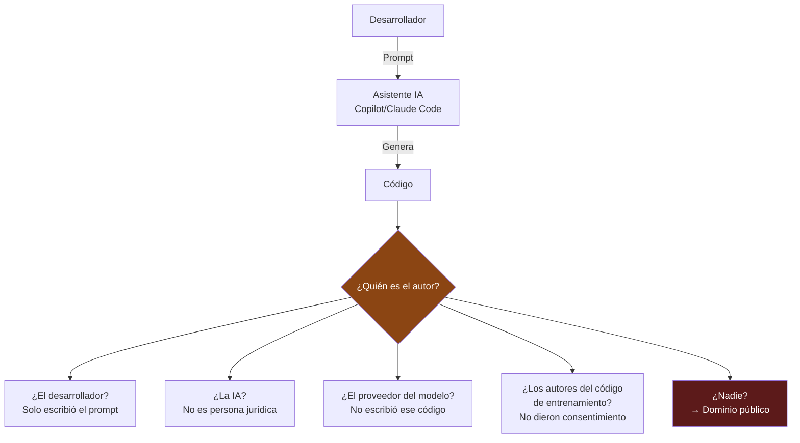
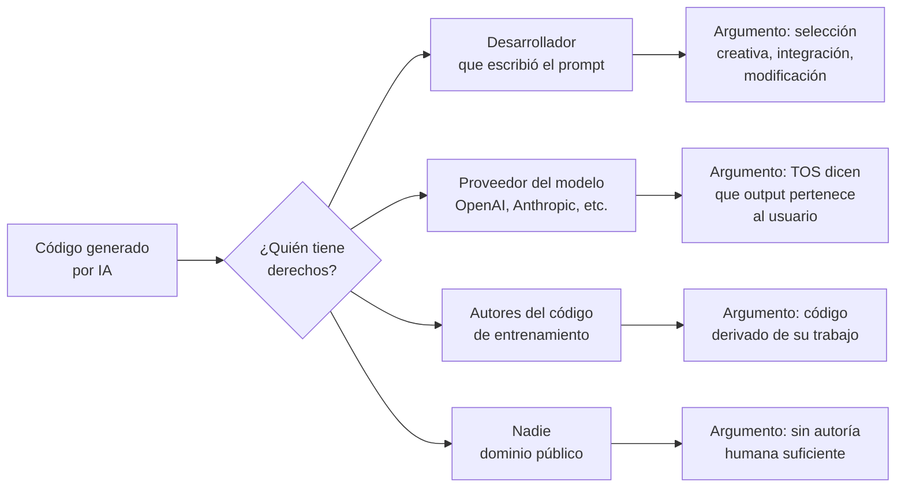

# Propiedad Intelectual del Código Generado por IA

> [!abstract] Resumen ejecutivo
> La propiedad intelectual del código generado por IA es uno de los ==temas jurídicos más inciertos y activos== de la era moderna. Las preguntas fundamentales — ¿puede protegerse por *copyright* el código generado por IA? ¿quién es el autor? ¿qué pasa con el código de entrenamiento? — ==no tienen respuesta definitiva== en la mayoría de jurisdicciones. La posición actual de la US Copyright Office, los precedentes como *Thaler v. Vidal*, y los litigios activos contra GitHub Copilot están definiendo este campo. Para las empresas, la trazabilidad del código con [[licit-overview|licit]] es esencial para gestionar estos riesgos.
> ^resumen

---

## El problema fundamental



> [!question] Las tres preguntas sin respuesta
> 1. ==¿Es protegible por copyright el código generado por IA?==
> 2. Si lo es, ==¿quién es el titular de los derechos?==
> 3. ==¿Infringe el entrenamiento== los derechos de los autores del código fuente?

---

## Copyright y código generado por IA

### Posición de la US Copyright Office

> [!danger] La posición más clara del mundo: EE.UU.
> La US Copyright Office ha establecido que[^1]:
> 1. El *copyright* requiere ==autoría humana== (*human authorship*)
> 2. El material generado ==exclusivamente por IA no es protegible==
> 3. Si un humano realiza ==contribución creativa suficiente== (selección, arreglo, modificación), el resultado puede ser protegible
> 4. El prompt por sí solo ==probablemente no es suficiente== contribución creativa
>
> Esto significa que el código generado puramente por IA podría estar en el ==dominio público== en EE.UU.

### Posición de la UE

| Aspecto | Posición actual |
|---|---|
| Requisito de autoría humana | ==Sí== (jurisprudencia TJUE: *Infopaq*, *Painer*) |
| Definición de autor | "Creación intelectual propia del autor" |
| IA como autor | ==No reconocido== — no es persona física |
| Prompt como contribución | Sin precedente judicial claro |
| *Sui generis* database right | Podría aplicar a datasets, no a outputs |

> [!info] Diferencias clave entre EE.UU. y UE
> | Aspecto | EE.UU. | UE |
> |---|---|---|
> | Registro | Necesario para litigar | ==No necesario== (automático) |
> | Threshold de originalidad | "Modicum of creativity" | "Creación intelectual propia" |
> | *Fair use* / excepciones | Flexible (4 factores) | ==Taxativo== (lista cerrada) |
> | Text & data mining | ¿Fair use? (incierto) | Excepción TDM (Art. 4 Dir. Copyright) |

---

## Caso *Thaler v. Vidal* (2023)

> [!quote] Precedente judicial clave
> Stephen Thaler solicitó patentar inventos generados por su sistema de IA DABUS (*Device for the Autonomous Bootstrapping of Unified Sentience*). El caso llegó al Federal Circuit de EE.UU. y a tribunales de múltiples países.

| Jurisdicción | Decisión | Razón |
|---|---|---|
| ==EE.UU.== | Rechazada | Patent Act requiere ==inventor humano== |
| UK | Rechazada | Patents Act: inventor = persona natural |
| ==Australia== (primera instancia) | Aceptada, luego revertida | Interpretación amplia revertida en apelación |
| Sudáfrica | ==Aceptada== | Sin requisito explícito de inventor humano |
| UE (EPO) | Rechazada | EPC requiere inventor humano |

> [!warning] Implicación para código generado
> Si una IA no puede ser inventora de patentes, ==tampoco puede ser autora de código== para fines de copyright. Esto refuerza la posición de que el código puramente generado por IA carece de protección de propiedad intelectual.

---

## Litigio GitHub Copilot

### *Doe v. GitHub* (caso activo)

> [!failure] Demanda colectiva contra GitHub Copilot
> Presentada en noviembre de 2022 en el Northern District of California:
>
> **Demandantes**: Desarrolladores de software open source
> **Demandados**: GitHub, Microsoft, OpenAI
>
> **Alegaciones**:
> 1. Copilot reproduce código con licencia ==sin cumplir los términos== (atribución GPL, MIT, etc.)
> 2. Violación de la *DMCA* (*Digital Millennium Copyright Act*)
> 3. Prácticas comerciales engañosas
> 4. ==Incumplimiento de licencias open source==
>
> **Estado**: Parcialmente desestimado en 2023, procedimiento continúa sobre alegaciones de licencias.

### Implicaciones prácticas

> [!danger] Riesgos para empresas que usan Copilot/asistentes de código
> 1. **Código generado podría contener fragmentos con licencia**: Si Copilot reproduce código GPL, ==tu código podría quedar sujeto a GPL==
> 2. **Sin protección de copyright**: Código sin autoría humana suficiente → dominio público
> 3. **Responsabilidad por infracciones**: ¿Quién responde si el código generado infringe derechos?
> 4. **Due diligence**: Necesidad de verificar procedencia → [[trazabilidad-codigo-ia|licit scan]]

---

## Patentes e IA

### ¿Puede patentarse código o inventos generados por IA?

| Aspecto | Estado actual |
|---|---|
| IA como inventora | ==Rechazado== globalmente (excepto Sudáfrica) |
| Humano que usa IA como herramienta | ==Potencialmente patentable== |
| Requisito de contribución humana | Inventiva humana suficiente necesaria |
| Patentes de métodos de IA | Patentables (la IA como invención, no inventora) |

> [!tip] Estrategia de patentes con IA
> - Documentar la ==contribución humana creativa== en cada invención
> - No declarar que la invención fue generada por IA (puede impedir patentabilidad)
> - Usar IA como ==herramienta== bajo dirección humana (análogo a usar calculadora)
> - Registrar la participación humana con [[architect-overview|architect]] sessions

---

## Derechos del desarrollador vs. proveedor del modelo



### Términos de servicio de proveedores

| Proveedor | Propiedad del output | Restricciones |
|---|---|---|
| ==OpenAI== | "You own the output" | No usar para entrenar modelos competidores |
| ==Anthropic== | "You retain rights to your inputs and outputs" | Subject to TOS |
| GitHub Copilot | Output pertenece al usuario | Indemnización por IP (Business plan) |
| Google (Gemini) | Usuario retiene derechos sobre outputs | Sujeto a TOS |

> [!warning] TOS ≠ Ley
> Los términos de servicio ==no pueden otorgar derechos que la ley no reconoce==. Si la ley dice que el código generado por IA no tiene copyright, los TOS que dicen "you own the output" son ==jurídicamente irrelevantes== respecto al copyright.

---

## Recomendaciones para empresas

> [!success] Estrategia práctica de gestión de IP
> 1. **Documentar la contribución humana**: Registrar cómo el desarrollador modificó, seleccionó y adaptó el código generado → [[architect-overview|architect]] sessions
> 2. **Rastrear procedencia**: Usar `licit scan` para ==cuantificar la proporción humana/IA==
> 3. **Revisar todo código generado**: La revisión humana puede añadir la contribución creativa necesaria
> 4. **Política interna clara**: Definir reglas sobre uso de IA en desarrollo → [[gobernanza-ia-empresarial]]
> 5. **Cláusulas contractuales**: Incluir cláusulas de IP en contratos con clientes → [[contratos-sla-ia]]
> 6. **Segregar código**: Mantener separación clara entre código humano y generado por IA
> 7. **Registrar copyright**: Registrar obras con contribución humana sustancial
> 8. **No depender de secreto**: Si el código no tiene copyright, ==el secreto comercial es la alternativa==

> [!example]- Política interna de IP para código generado por IA
> ```markdown
> ## Política de Propiedad Intelectual — Código Generado por IA
>
> ### Principios
> 1. Todo código generado por IA DEBE ser revisado y
>    modificado por un desarrollador humano antes de commit
> 2. La revisión debe ser sustancial, no meramente cosmética
> 3. Se documenta la contribución humana en el commit message
>
> ### Registro
> - Commits con IA: incluir "Co-authored-by: AI"
> - Ejecutar `licit scan` semanalmente
> - Mantener ratio >60% código humano en módulos críticos
>
> ### Protección
> - Código con >80% contribución humana → registrar copyright
> - Código con alta proporción IA → proteger como secreto
>   comercial (NDA, controles de acceso)
> - Código para clientes → incluir cláusula de IP en contrato
>
> ### Prohibiciones
> - NO usar asistentes de código con código de terceros
>   bajo NDA sin evaluación legal
> - NO copiar-pegar outputs de IA sin revisión
> - NO afirmar autoría humana de código puramente generado
> ```

---

## Cuestiones abiertas

> [!question] Preguntas sin respuesta definitiva (a junio 2025)
> 1. ¿Es suficiente un prompt creativo y detallado para establecer autoría?
> 2. ¿Cuánta modificación humana es ==suficiente== para generar copyright?
> 3. ¿Puede reclamarse protección si no se declara el uso de IA?
> 4. ¿Qué pasa con el código generado por agentes autónomos sin intervención humana?
> 5. ¿Aplica la doctrina de *work for hire* al código generado por IA contratada como servicio?
> 6. ¿Pueden los autores de código de entrenamiento reclamar derechos sobre los outputs?
> 7. ¿Cómo afectará el [[eu-ai-act-completo|EU AI Act]] Art. 50 (transparencia) a las reclamaciones de copyright?

---

## Relación con el ecosistema

La gestión de IP del código generado por IA requiere trazabilidad de todo el ecosistema:

- **[[intake-overview|intake]]**: Los requisitos de propiedad intelectual del cliente se capturan como *intake items*. Restricciones como "el entregable debe ser 100% autoría humana" o "aceptamos uso de asistentes de código con documentación" se normalizan y distribuyen.

- **[[architect-overview|architect]]**: Las sesiones de [[architect-overview|architect]] documentan ==cuándo se usó IA, qué se generó y cómo se modificó==. Esta trazabilidad es esencial para demostrar contribución humana suficiente en caso de disputa de IP.

- **[[vigil-overview|vigil]]**: Los escaneos de [[vigil-overview|vigil]] pueden detectar patrones de código ==potencialmente copiados de repositorios con licencias restrictivas==, complementando la evaluación de riesgos de IP.

- **[[licit-overview|licit]]**: El comando `licit scan` cuantifica la proporción humano/IA del código, proporcionando ==evidencia objetiva de la contribución humana==. Esto es relevante tanto para reclamar derechos de copyright como para cumplir obligaciones de transparencia del EU AI Act.

---

## Enlaces y referencias

> [!quote]- Bibliografía y fuentes
> - [^1]: US Copyright Office, "Copyright Registration Guidance: Works Containing Material Generated by Artificial Intelligence", 88 FR 16190, marzo 2023.
> - Thaler v. Vidal, 43 F.4th 1207 (Fed. Cir. 2022).
> - Doe v. GitHub, Inc., No. 4:22-cv-06823 (N.D. Cal. 2022).
> - Samuelson, P. (2024). "Generative AI Meets Copyright". *Science*, 381(6654).
> - [[open-source-compliance-ia]] — Licencias de modelos open source
> - [[trazabilidad-codigo-ia]] — Rastreo de procedencia
> - [[contratos-sla-ia]] — Cláusulas contractuales de IP
> - [[regulacion-global]] — Panorama regulatorio global

[^1]: US Copyright Office, Registro Federal vol. 88, No. 51, marzo 2023.
