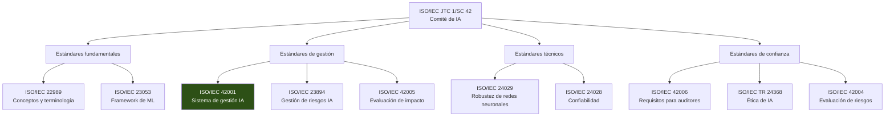
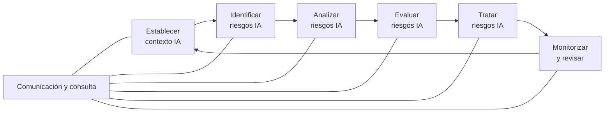
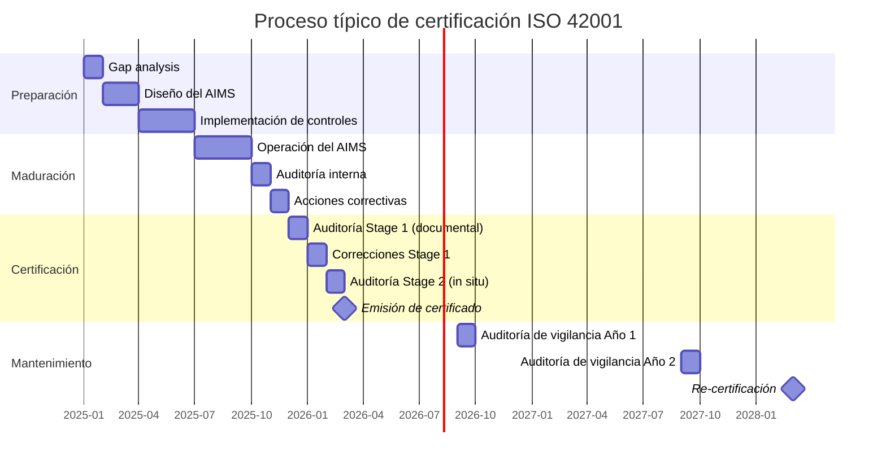

# Estándares ISO para Inteligencia Artificial

> [!abstract] Resumen ejecutivo
> La ISO ha desarrollado una familia de estándares para IA liderada por ==ISO/IEC 42001:2023, el primer estándar certificable del mundo para sistemas de gestión de IA== (*AI Management System*, AIMS). Complementado por ISO/IEC 23894 (gestión de riesgos IA), ISO/IEC 22989 (conceptos y terminología) e ISO/IEC 23053 (framework de ML), estos estándares proporcionan marcos formales que se alinean con el [[eu-ai-act-completo|EU AI Act]]. [[licit-overview|licit]] genera evidencia compatible con estos estándares para facilitar la certificación y auditoría.
> ^resumen

---

## Panorama de estándares ISO/IEC para IA



---

## ISO/IEC 42001:2023 — Sistema de Gestión de IA

### El primer estándar certificable para IA

ISO/IEC 42001 es el ==estándar más importante== de la familia. Publicado en diciembre de 2023, establece requisitos para un sistema de gestión de IA (*AIMS*) que las organizaciones pueden certificar[^1].

> [!success] ¿Por qué certificarse?
> - Demuestra ==compromiso verificable== con el uso responsable de IA
> - Facilita el cumplimiento del [[eu-ai-act-completo|EU AI Act]] (presunción de conformidad)
> - Proporciona ventaja competitiva en licitaciones y contratos
> - Reduce riesgo regulatorio y de reputación
> - Marco estructurado para [[gobernanza-ia-empresarial|gobernanza]]
> - Reconocimiento internacional

### Estructura (basada en Annex SL)

ISO 42001 sigue la estructura de alto nivel (*High Level Structure*, HLS) común a todos los estándares de sistemas de gestión ISO:

| Cláusula | Título | Contenido clave |
|---|---|---|
| 4 | Contexto de la organización | Partes interesadas, alcance del AIMS, ==inventario de IA== |
| 5 | Liderazgo | Compromiso de dirección, política de IA, roles |
| 6 | Planificación | ==Evaluación de riesgos y oportunidades==, objetivos |
| 7 | Soporte | Recursos, competencia, concienciación, comunicación |
| 8 | Operación | ==Desarrollo y uso responsable de IA==, control de procesos |
| 9 | Evaluación del desempeño | Monitorización, auditoría interna, revisión por dirección |
| 10 | Mejora | No conformidades, acciones correctivas, ==mejora continua== |

> [!info] Anexos normativos de ISO 42001
> | Anexo | Contenido | Aplicación |
> |---|---|---|
> | Anexo A | ==Controles de referencia== (39 controles) | Obligatorio seleccionar |
> | Anexo B | Guía de implementación de controles | Orientativo |
> | Anexo C | Objetivos y fuentes de riesgo de IA | Orientativo |
> | Anexo D | Uso de IA en diferentes dominios | Orientativo |

### Los 39 controles del Anexo A

> [!warning] Selección de controles — Statement of Applicability
> La organización debe evaluar todos los 39 controles y documentar en una ==Declaración de Aplicabilidad== (*Statement of Applicability*, SoA) cuáles aplica y cuáles no, con justificación.

Los controles se agrupan en temas:

| Grupo | Controles | Ejemplos |
|---|---|---|
| Políticas de IA | A.2.x | Política de uso de IA, principios éticos |
| Organización | A.3.x | Roles, responsabilidades, comité de IA |
| Recursos | A.4.x | Competencias, formación, herramientas |
| ==Desarrollo de IA== | A.5.x | Diseño, desarrollo, validación, pruebas |
| ==Datos== | A.6.x | Gobernanza de datos, calidad, procedencia |
| Sistema de IA | A.7.x | Documentación, logging, supervisión humana |
| ==Terceros== | A.8.x | Proveedores, cadena de suministro |
| Operación | A.9.x | Despliegue, monitorización, incidentes |
| Cumplimiento | A.10.x | Regulación, auditoría, mejora |

> [!example]- Mapeo de controles ISO 42001 → Herramientas del ecosistema
> ```
> A.5.2  Evaluación de impacto de IA
>        → licit fria + licit assess
>
> A.5.4  Documentación técnica
>        → licit annex-iv
>
> A.6.2  Procedencia de datos
>        → licit scan (provenance tracking)
>
> A.7.2  Registro y trazabilidad
>        → architect sessions + OpenTelemetry traces
>
> A.7.3  Supervisión humana
>        → architect audit trails
>
> A.7.4  Robustez y seguridad
>        → vigil SARIF scans
>
> A.9.2  Monitorización post-despliegue
>        → architect monitoring + licit verify
>
> A.10.1 Cumplimiento regulatorio
>        → licit assess (EU AI Act compliance)
>
> A.10.2 Auditoría interna
>        → licit report + evidence bundles
> ```

---

## ISO/IEC 23894:2023 — Gestión de riesgos IA

Extensión de ISO 31000 (gestión de riesgos general) para contextos de IA[^2]:



### Riesgos específicos de IA cubiertos

> [!danger] Categorías de riesgo IA según ISO 23894
> | Categoría | Ejemplos | Conexión regulatoria |
> |---|---|---|
> | ==Sesgo y discriminación== | Sesgo algorítmico, datos no representativos | EU AI Act Art. 10 |
> | Robustez | Adversarial attacks, drift del modelo | EU AI Act Art. 15 |
> | Transparencia | Falta de explicabilidad, opacidad | EU AI Act Art. 13 |
> | Privacidad | Memorización de datos, inferencia | GDPR Arts. 5, 25 |
> | Seguridad | Prompt injection, RCE, data poisoning | [[owasp-agentic-compliance\|OWASP]] |
> | Autonomía | Decisiones no supervisadas | EU AI Act Art. 14 |
> | ==Responsabilidad== | Atribución difusa de responsabilidad | [[ai-liability-directive]] |

---

## ISO/IEC 22989:2022 — Conceptos y terminología

Establece la ==terminología común== para IA a nivel internacional. Importante para:

- Alinear vocabulario entre equipos técnicos, legales y de negocio
- Interpretar consistentemente regulaciones y estándares
- Evitar ambigüedades en documentación técnica

> [!tip] Términos clave definidos
> - **Sistema de IA**: Sistema que utiliza ingeniería del conocimiento o aprendizaje automático
> - **Modelo de ML**: Función matemática con parámetros aprendidos de datos
> - **Datos de entrenamiento**: Datos utilizados para ajustar parámetros del modelo
> - **Sesgo de IA**: Resultado no equitativo producido por un sistema de IA
> - **Explicabilidad**: Grado en que el funcionamiento de un sistema de IA puede ser explicado

---

## ISO/IEC 23053:2022 — Framework de ML

Framework para sistemas de IA basados en *machine learning*. Define:

| Componente | Descripción | Relevancia |
|---|---|---|
| Pipeline de ML | Etapas desde datos hasta despliegue | Documentación [[eu-ai-act-anexo-iv\|Anexo IV]] |
| Validación | Métodos de validación y pruebas | [[auditoria-ia\|Auditoría]] |
| Monitorización | Detección de drift y degradación | [[architect-overview\|architect]] |
| ==Reproducibilidad== | Capacidad de reproducir resultados | [[trazabilidad-codigo-ia\|Trazabilidad]] |

---

## Relación ISO 42001 — EU AI Act

> [!success] Presunción de conformidad
> El uso de normas armonizadas (que pueden basarse en ISO 42001) otorga una ==presunción de conformidad== con los requisitos del EU AI Act. Esto no es conformidad automática, pero facilita significativamente la evaluación de conformidad (Art. 43).

| Requisito EU AI Act | Artículo | Control ISO 42001 |
|---|---|---|
| Sistema gestión riesgos | Art. 9 | ==A.5.2, A.5.3== |
| Gobernanza de datos | Art. 10 | ==A.6.1, A.6.2, A.6.3== |
| Documentación técnica | Art. 11 | A.5.4, A.7.1 |
| Logging | Art. 12 | ==A.7.2== |
| Transparencia | Art. 13 | A.7.1, A.5.4 |
| Supervisión humana | Art. 14 | ==A.7.3== |
| Precisión/robustez | Art. 15 | A.7.4 |
| Sistema de calidad | Art. 17 | ==Cláusulas 4-10 (AIMS completo)== |

---

## Proceso de certificación ISO 42001



> [!warning] Duración típica
> El proceso desde el *gap analysis* hasta la certificación suele durar ==12-18 meses== para organizaciones de tamaño medio. Organizaciones con [[gobernanza-ia-empresarial|gobernanza de IA]] madura pueden acelerar a 8-12 meses.

---

## Cómo licit apoya la certificación

```bash
# Gap analysis contra ISO 42001
licit assess --framework iso-42001 --project ./

# Generar Statement of Applicability
licit report --soa --framework iso-42001

# Generar evidencia para auditoría
licit report --audit-evidence --framework iso-42001 --output ./audit/

# Verificar evidence bundles para auditor
licit verify --bundle ./audit/evidence-bundle.json
```

> [!tip] Evidence bundles como evidencia de auditoría
> Los *evidence bundles* de [[licit-overview|licit]] con firma criptográfica (*Merkle tree* + HMAC) proporcionan ==evidencia inmutable y verificable== que los auditores de certificación pueden validar independientemente con `licit verify`.

---

## Otros estándares relevantes

| Estándar | Título | Estado | Relevancia |
|---|---|---|---|
| ISO/IEC 42005 | ==Evaluación de impacto de IA== | En desarrollo | Complementa [[eu-ai-act-fria\|FRIA]] |
| ISO/IEC 42006 | Requisitos para auditores de IA | Publicado | [[auditoria-ia]] |
| ISO/IEC TR 24368 | Ética de IA | Publicado | Gobernanza |
| ISO/IEC 24029 | Robustez de redes neuronales | Publicado | Art. 15 AI Act |
| ISO/IEC 24028 | Confiabilidad de IA | Publicado | Confianza |
| ISO/IEC 5259 | Calidad de datos para IA | En desarrollo | Art. 10 AI Act |
| ISO/IEC 38507 | ==Gobernanza de IA== | Publicado | [[gobernanza-ia-empresarial]] |

---

## Relación con el ecosistema

Los estándares ISO proporcionan marcos formales que las herramientas del ecosistema implementan:

- **[[intake-overview|intake]]**: Los requisitos de ISO 42001 pueden capturarse como *intake items* y trazarse durante el ciclo de desarrollo. Los controles del Anexo A se convierten en requisitos verificables que [[intake-overview|intake]] normaliza.

- **[[architect-overview|architect]]**: Cumple directamente los controles A.7.2 (==registro y trazabilidad==) y A.9.2 (monitorización) de ISO 42001 mediante *OpenTelemetry traces*, sesiones de auditoría y *cost tracking*.

- **[[vigil-overview|vigil]]**: Los escaneos de seguridad de [[vigil-overview|vigil]] proporcionan evidencia para el control A.7.4 (robustez y seguridad) de ISO 42001. Los resultados SARIF documentan el estado de seguridad del sistema.

- **[[licit-overview|licit]]**: Genera evidencia compatible con ISO 42001 para todos los controles aplicables. `licit assess --framework iso-42001` evalúa conformidad, y los *evidence bundles* firmados criptográficamente constituyen evidencia auditable para la certificación.

---

## Enlaces y referencias

> [!quote]- Bibliografía y fuentes
> - [^1]: ISO/IEC 42001:2023, "Information technology — Artificial intelligence — Management system", ISO, 2023.
> - [^2]: ISO/IEC 23894:2023, "Information technology — Artificial intelligence — Guidance on risk management", ISO, 2023.
> - ISO/IEC JTC 1/SC 42, "Artificial intelligence" — Portal oficial del subcomité.
> - BSI, "Guide to implementing ISO/IEC 42001", 2024.
> - [[eu-ai-act-completo]] — EU AI Act y presunción de conformidad
> - [[nist-ai-rmf]] — Comparación con framework NIST
> - [[gobernanza-ia-empresarial]] — Marco de gobernanza
> - [[auditoria-ia]] — Procesos de auditoría

[^1]: ISO/IEC 42001:2023 — Primer estándar certificable para sistemas de gestión de IA.
[^2]: ISO/IEC 23894:2023 — Extensión de ISO 31000 para gestión de riesgos de IA.
