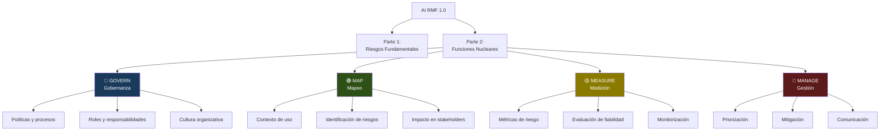
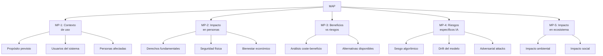
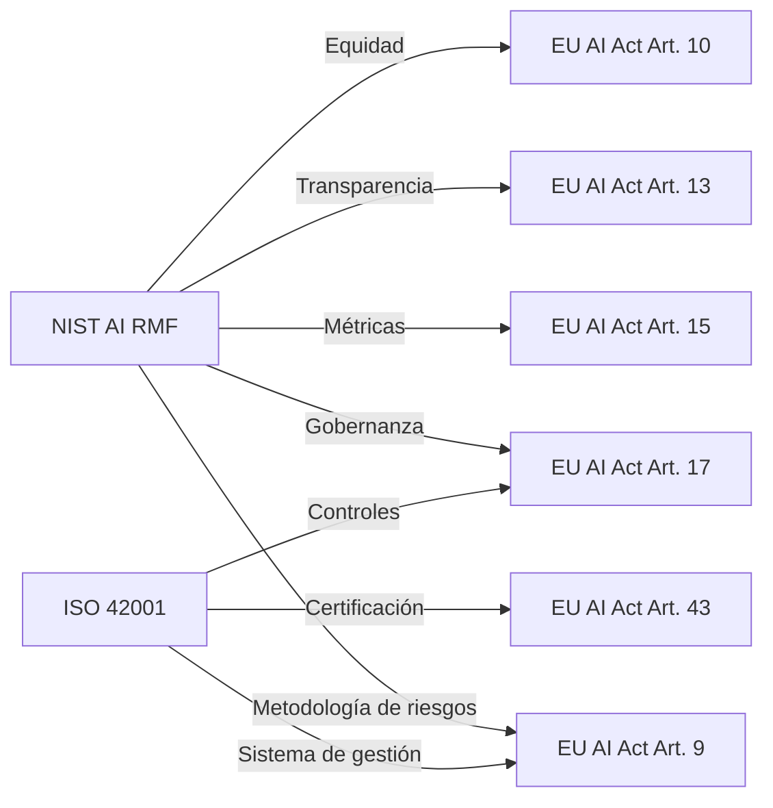
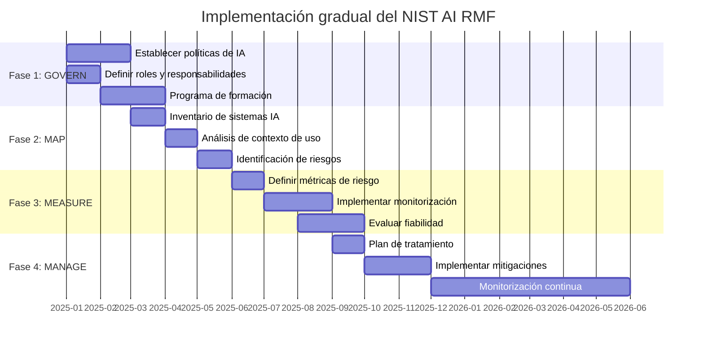

# NIST AI Risk Management Framework

> [!abstract] Resumen ejecutivo
> El *NIST AI Risk Management Framework* (AI RMF 1.0) es un ==marco voluntario de gestión de riesgos de IA== publicado por el Instituto Nacional de Estándares y Tecnología de EE.UU. en enero de 2023. Organizado en 4 funciones nucleares — ==Govern, Map, Measure, Manage== — proporciona un enfoque estructurado y flexible para identificar, evaluar y mitigar riesgos de IA. Aunque es voluntario, se ha convertido en referencia global y complementa al [[eu-ai-act-completo|EU AI Act]]. [[licit-overview|licit]] puede evaluar sistemas contra este framework.
> ^resumen

---

## Contexto y origen

El *National Institute of Standards and Technology* (NIST) publicó el AI RMF 1.0 en enero de 2023[^1], respondiendo a una necesidad creciente de marcos de gestión de riesgos específicos para IA que complementen los marcos generales existentes.

> [!info] Características distintivas del NIST AI RMF
> - **Voluntario**: No es regulación, es un ==marco de referencia==
> - **Tecnológicamente agnóstico**: Aplicable a cualquier tipo de IA
> - **Flexible y escalable**: Adaptable a organizaciones de cualquier tamaño
> - **Alineado con otros marcos**: Compatible con ISO 31000, ISO 42001, EU AI Act
> - **Basado en consenso**: Desarrollado con amplia participación de la industria
> - **Vivo**: Actualizado periódicamente con *Playbook* complementario

---

## Estructura del framework



---

## Parte 1: Riesgos fundamentales de IA

### Características de IA fiable

El NIST define 7 características que un sistema de IA debe poseer para ser considerado ==fiable y de confianza==:

| Característica | Descripción | Evaluación |
|---|---|---|
| **Válido y fiable** | Funciona según especificaciones | Métricas de rendimiento |
| **Seguro** (*safe*) | No causa ==daño a personas== | Evaluación de riesgos |
| **Seguro** (*secure*) | Resistente a ==ataques== | [[vigil-overview\|vigil]] SARIF |
| **Resiliente** | Funciona ante ==fallos parciales== | Tests de resiliencia |
| **Accountable** | ==Rendición de cuentas== clara | [[architect-overview\|architect]] audit trails |
| **Transparente** | Funcionamiento comprensible | Documentación, explicabilidad |
| **Explicable** | Resultados ==interpretables== | SHAP, LIME, atribución |
| **Privado** | Protege datos personales | GDPR, DPIA |
| **Equitativo** (*fair*) | ==Sin sesgos discriminatorios== | Métricas de equidad |

> [!warning] Tensiones entre características
> Las 7 características pueden estar en ==tensión entre sí==. Por ejemplo:
> - Más transparencia puede reducir privacidad
> - Más seguridad (*secure*) puede reducir usabilidad
> - Más equidad puede reducir precisión en ciertos subgrupos
>
> El framework reconoce estas tensiones y requiere documentar los ==trade-offs== adoptados.

---

## Parte 2: Las 4 funciones nucleares

### GOVERN — Gobernanza

> [!tip] Función transversal
> GOVERN es la única función ==transversal== que informa y conecta las otras tres. Establece la cultura, políticas y procesos necesarios para gestionar riesgos de IA en toda la organización.

#### Subcategorías de GOVERN

| ID | Subcategoría | Descripción |
|---|---|---|
| GV-1 | Políticas | ==Establecer políticas de IA== documentadas y aprobadas |
| GV-2 | Responsabilidades | Definir roles y responsabilidades claras |
| GV-3 | Fuerza laboral | Capacitar al personal en riesgos de IA |
| GV-4 | Cultura | Fomentar cultura de responsabilidad con IA |
| GV-5 | Participación | Involucrar a ==todas las partes interesadas== |
| GV-6 | Documentación | Documentar decisiones y procesos |

> [!example]- Implementación práctica de GOVERN
> ```yaml
> govern_implementation:
>   policies:
>     - name: "Política de uso aceptable de IA"
>       owner: "AI Ethics Officer"
>       review_cycle: "anual"
>       last_review: "2025-03-01"
>
>   roles:
>     - role: "AI Risk Owner"
>       reports_to: "CTO"
>       responsibilities:
>         - "Evaluación de riesgos de IA"
>         - "Aprobación de nuevos sistemas de IA"
>         - "Supervisión de métricas de riesgo"
>
>   training:
>     - program: "AI Risk Awareness"
>       target: "Todos los empleados"
>       frequency: "anual"
>       completion_rate: "87%"
>
>     - program: "AI Risk Management Advanced"
>       target: "Equipo de ML/IA"
>       frequency: "semestral"
>       completion_rate: "95%"
>
>   documentation:
>     tool: "licit report --governance"
>     format: "evidence bundle (signed)"
>     retention: "10 años"
> ```

### MAP — Mapeo de riesgos

La función MAP identifica el ==contexto== en el que opera el sistema de IA y los riesgos asociados:



| ID | Subcategoría | Preguntas clave | Herramienta |
|---|---|---|---|
| MP-1 | Contexto de uso | ¿Para qué se usa? ¿Quién lo usa? | [[intake-overview\|intake]] |
| MP-2 | Impacto en personas | ¿A quién afecta? ¿Cómo? | `licit fria` |
| MP-3 | Beneficios vs riesgos | ¿Se justifica el uso de IA? | Análisis manual |
| MP-4 | ==Riesgos específicos== | ¿Qué puede fallar? | `licit assess` |
| MP-5 | Impacto ecosistémico | ¿Efectos secundarios? | Análisis manual |

### MEASURE — Medición de riesgos

> [!info] Cuantificar para gestionar
> MAP identifica riesgos cualitativamente; MEASURE los ==cuantifica== con métricas y pruebas. Sin medición, la gestión de riesgos es subjetiva.

| ID | Subcategoría | Métricas | Herramienta |
|---|---|---|---|
| ME-1 | Fiabilidad | Precisión, recall, F1, AUC | Tests ML estándar |
| ME-2 | ==Equidad== | Disparate impact, equalidad de oportunidades | Auditoría de *fairness* |
| ME-3 | Seguridad | OWASP score, vulnerabilidades detectadas | [[vigil-overview\|vigil]] |
| ME-4 | Transparencia | Nivel de explicabilidad, documentación | `licit assess` |
| ME-5 | Privacidad | *Membership inference*, *data leakage* | Tests de privacidad |
| ME-6 | Robustez | Tasa de éxito en adversarial attacks | Tests de robustez |

> [!danger] Métricas de equidad — complejidad real
> No existe una ==métrica única de equidad== que sea universalmente correcta. Diferentes métricas pueden ser ==mutuamente incompatibles== (teorema de imposibilidad de Chouldechova-Kleinberg):
> - *Demographic parity*: misma tasa de positivos por grupo
> - *Equalized odds*: mismas tasas de VP y FP por grupo
> - *Predictive parity*: misma precision por grupo
> - *Individual fairness*: individuos similares → resultados similares
>
> La elección de métrica es una ==decisión de política== que debe documentarse.

### MANAGE — Gestión de riesgos

La función MANAGE ==prioriza, mitiga y comunica== los riesgos identificados y medidos:

| ID | Subcategoría | Acción |
|---|---|---|
| MG-1 | Priorización | Ordenar riesgos por ==severidad × probabilidad== |
| MG-2 | Plan de tratamiento | Definir acciones de mitigación para cada riesgo |
| MG-3 | Implementación | Ejecutar acciones de mitigación |
| MG-4 | ==Monitorización== | Monitorizar riesgos residuales continuamente |
| MG-5 | Comunicación | Informar a *stakeholders* sobre estado de riesgos |
| MG-6 | Desactivación | Proceso para ==retirar el sistema== si riesgo inaceptable |

> [!success] licit como herramienta de MANAGE
> `licit assess` produce un ==informe de gestión de riesgos== que cubre MG-1 (priorización por severidad) y MG-4 (monitorización mediante ejecución periódica). Los *evidence bundles* firmados constituyen la evidencia para MG-5 (comunicación documentada).

---

## AI RMF Playbook

El *AI RMF Playbook* complementa el framework con ==acciones sugeridas== para cada subcategoría[^2]:

> [!tip] Estructura del Playbook
> Para cada subcategoría, el Playbook proporciona:
> 1. **Acciones sugeridas**: Pasos concretos a implementar
> 2. **Transparency notes**: Qué documentar sobre las acciones tomadas
> 3. **AI actor tasks**: Quién realiza cada acción
> 4. **Cross-references**: Referencias a otros frameworks (ISO, OECD)

---

## Relación con el EU AI Act

| Aspecto | NIST AI RMF | EU AI Act |
|---|---|---|
| Naturaleza | ==Voluntario== | ==Obligatorio== |
| Jurisdicción | EE.UU. (global por adopción) | UE (extraterritorial) |
| Enfoque | Gestión integral de riesgos | Clasificación por niveles de riesgo |
| Estructura | 4 funciones nucleares | Títulos, artículos, anexos |
| Certificación | No (es un marco) | Evaluación de conformidad (Art. 43) |
| Sanciones | Ninguna | Hasta ==€35M / 7%== |
| Complementariedad | Cubre GOVERN que AI Act asume | Establece obligaciones específicas |

> [!question] ¿Puedo usar NIST AI RMF para cumplir el EU AI Act?
> No directamente, pero ==se complementan fuertemente==. NIST AI RMF proporciona la metodología de gestión de riesgos que el Art. 9 del EU AI Act requiere. Usar ambos marcos conjuntamente es la ==mejor práctica== para organizaciones que operan globalmente.



---

## Relación con NIST Cybersecurity Framework

El AI RMF se alinea con el *NIST Cybersecurity Framework* (CSF 2.0):

| Función CSF | Función AI RMF | Relación |
|---|---|---|
| Identify | ==MAP== | Identificar activos y riesgos |
| Protect | MANAGE | Implementar controles |
| Detect | ==MEASURE== | Detectar anomalías y riesgos |
| Respond | MANAGE | Responder a incidentes |
| Recover | MANAGE | Recuperar de incidentes |
| Govern (CSF 2.0) | ==GOVERN== | Gobernanza transversal |

> [!info] Sinergia CSF + AI RMF
> Organizaciones que ya tienen implementado el CSF de NIST pueden ==extenderlo== con el AI RMF para cubrir riesgos específicos de IA. Los procesos de gobernanza, evaluación y monitorización son compartidos.

---

## Implementación práctica

### Enfoque gradual



---

## Perfiles de uso

El AI RMF introduce el concepto de ==Perfiles== (*Profiles*) que personalizan el framework para contextos específicos:

> [!tip] Tipos de perfiles
> - **Perfil actual** (*Current Profile*): Describe el estado actual de gestión de riesgos
> - **Perfil objetivo** (*Target Profile*): Describe el estado deseado
> - **Gap analysis**: Diferencia entre perfil actual y objetivo → plan de acción
>
> [[licit-overview|licit]] puede generar perfiles mediante `licit assess --framework nist-ai-rmf --profile current` y `--profile target`.

---

## Relación con el ecosistema

El NIST AI RMF se implementa con apoyo de todo el ecosistema:

- **[[intake-overview|intake]]**: Los requisitos del framework (acciones sugeridas del Playbook) se capturan como *intake items* y se distribuyen a los equipos. Las subcategorías del RMF se convierten en requisitos verificables que [[intake-overview|intake]] normaliza y traza.

- **[[architect-overview|architect]]**: Implementa directamente la función MEASURE (monitorización continua) y apoya GOVERN (documentación de decisiones). Los *OpenTelemetry traces* y sesiones de [[architect-overview|architect]] proporcionan las métricas operativas que MEASURE requiere.

- **[[vigil-overview|vigil]]**: Los escaneos de seguridad de [[vigil-overview|vigil]] alimentan la función MEASURE (subcategoría ME-3: seguridad) y MANAGE (identificación de vulnerabilidades a mitigar). Los resultados SARIF se integran en el perfil de riesgos.

- **[[licit-overview|licit]]**: Puede evaluar sistemas contra el AI RMF mediante `licit assess --framework nist-ai-rmf`. Los *evidence bundles* firmados documentan el estado de cumplimiento de cada función y subcategoría, facilitando la comunicación con *stakeholders* (MANAGE, MG-5).

---

## Enlaces y referencias

> [!quote]- Bibliografía y fuentes
> - [^1]: NIST, "Artificial Intelligence Risk Management Framework (AI RMF 1.0)", NIST AI 100-1, enero 2023.
> - [^2]: NIST, "AI RMF Playbook", https://airc.nist.gov/AI_RMF_Playbook.
> - NIST, "NIST AI RMF Generative AI Profile", NIST AI 600-1, julio 2024.
> - Tabassi, E. (2023). "AI Risk Management Framework: Overview and Use". *NIST Presentation*.
> - [[eu-ai-act-completo]] — Complementariedad con EU AI Act
> - [[iso-standards-ia]] — Comparación con ISO 42001
> - [[gobernanza-ia-empresarial]] — Función GOVERN
> - [[auditoria-ia]] — Función MEASURE
> - [[owasp-agentic-compliance]] — Riesgos de seguridad específicos

[^1]: NIST AI 100-1, publicado el 26 de enero de 2023.
[^2]: AI RMF Playbook, recurso complementario actualizado periódicamente.
