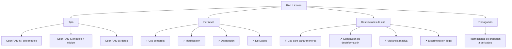
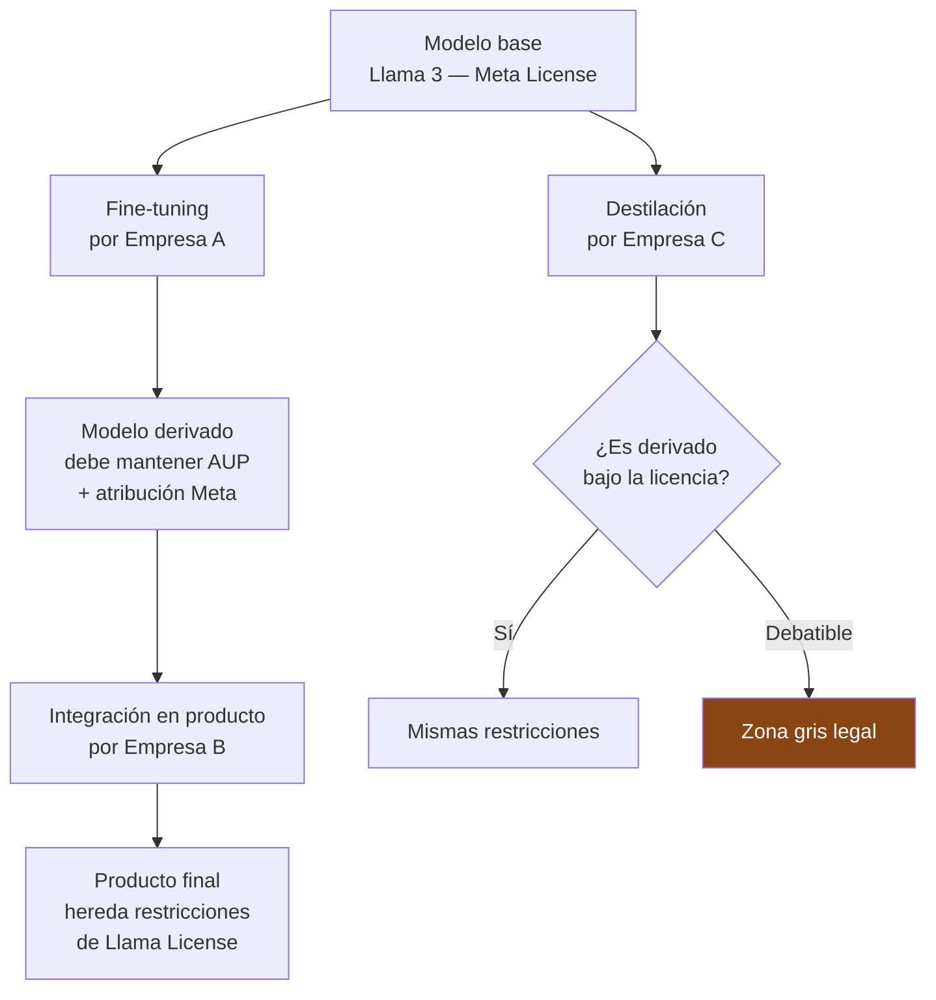

# Licencias Open Source y Compliance para IA

> [!abstract] Resumen ejecutivo
> El ecosistema de modelos de IA *open source* opera bajo un ==marco de licencias complejo y en evolución== que difiere significativamente del software tradicional. Licencias como *RAIL* (*Responsible AI License*), la Llama License de Meta, y adaptaciones de Apache 2.0 y MIT introducen restricciones de uso (*use restrictions*) que no existen en licencias de software convencionales. Los datos de entrenamiento tienen su propio régimen de licencias (Creative Commons, *fair use*). ==Cumplir con estas licencias es una obligación de compliance== que [[licit-overview|licit]] ayuda a rastrear mediante análisis de procedencia.
> ^resumen

---

## El problema: modelos "open source" que no son open source

> [!warning] Open source ≠ Open weights ≠ Open model
> La comunidad de IA utiliza términos de forma inconsistente. Distinguir correctamente es ==esencial para compliance==:

| Término | Definición | Ejemplo |
|---|---|---|
| **Open source** (OSI) | Código fuente disponible, ==sin restricciones de uso== | Linux, Python |
| **Open weights** | Pesos del modelo disponibles, ==con posibles restricciones== | Llama, Mistral |
| **Open model** | Pesos + datos de entrenamiento + código | OLMo (AI2) |
| **Proprietary** | Acceso solo vía API, nada publicado | GPT-4, Claude |

> [!danger] La controversia OSI
> La *Open Source Initiative* (OSI) publicó en 2024 la definición de ==Open Source AI==, que requiere:
> 1. Acceso a pesos del modelo
> 2. Código de entrenamiento e inferencia
> 3. Información suficiente sobre datos de entrenamiento
> 4. ==Sin restricciones de uso==
>
> Bajo esta definición, modelos como Llama ==no son open source== porque tienen restricciones de uso. Esto tiene implicaciones legales y de compliance.

---

## Licencias de modelos de IA

### RAIL — Responsible AI License



> [!info] OpenRAIL — la licencia más usada en IA
> Creada por BigScience y Hugging Face, RAIL es la base de las licencias de modelos como:
> - Stable Diffusion (CreativeML OpenRAIL-M)
> - BLOOM (BigScience OpenRAIL-M)
> - Modelos de Hugging Face (OpenRAIL-S)
>
> ==Característica clave==: Permite uso comercial y modificación, pero las restricciones de uso ==se propagan obligatoriamente a derivados== (*behavioral use restrictions*).

### Meta Llama License

| Aspecto | Detalle |
|---|---|
| Modelo | Llama 2, Llama 3, Llama 3.1 |
| Tipo | ==Licencia propietaria con permisos amplios== |
| Uso comercial | Sí, con restricciones |
| Umbral de usuarios | ==>700M usuarios mensuales activos==: requiere licencia especial |
| Restricciones de uso | *Acceptable Use Policy* (AUP) |
| Derivados | Permitidos, pero deben incluir "Built with Meta Llama" |
| Datos de entrenamiento | ==No publicados== |

> [!warning] Restricciones de la Llama License
> - No usar para entrenar otros modelos de IA que compitan con Llama
> - No usar en violación de leyes aplicables
> - No usar para ==vigilancia masiva==
> - Si >700M MAU: necesitas permiso expreso de Meta
> - Derivados deben mantener la AUP
> - Debe incluir atribución "Built with Meta Llama"

### Comparativa de licencias de modelos

| Licencia | Uso comercial | ==Restricciones de uso== | Propagación | Datos abiertos |
|---|---|---|---|---|
| OpenRAIL-M | ✓ | Sí (behavioral) | ==Sí== | No requerido |
| Llama License | ✓ (con límite) | Sí (AUP) | ==Sí== | No |
| Apache 2.0 (Mistral) | ✓ | ==No== | No | No requerido |
| MIT | ✓ | ==No== | No | No requerido |
| GPL-3.0 | ✓ | No | Sí (copyleft) | N/A |
| CreativeML OpenRAIL-M | ✓ | Sí | ==Sí== | No |
| OLMo License (AI2) | ✓ | ==No== | No | ==Sí== |

> [!tip] Para compliance, lo que importa es
> 1. ==¿Hay restricciones de uso?== → Verificar que tu caso de uso está permitido
> 2. ¿Se propagan a derivados? → Verificar que puedes cumplir hacia *downstream*
> 3. ¿Hay umbral de usuarios? → Verificar si tu escala requiere licencia adicional
> 4. ¿Requiere atribución? → Implementar en la interfaz de usuario

---

## Licencias de datos de entrenamiento

> [!danger] El terreno más incierto de la IA
> Las licencias de los datos de entrenamiento son el aspecto ==más polémico y menos resuelto== del compliance de IA.

| Tipo de dato | Licencia típica | Problema de compliance |
|---|---|---|
| Web scraping | ==Sin licencia== (uso de contenido ajeno) | ¿Fair use? ¿Infracción de copyright? |
| Creative Commons CC-BY | Atribución requerida | ==¿Cómo atribuir millones de fuentes?== |
| Creative Commons CC-BY-NC | No comercial | Entrenamiento comercial = violación |
| Datos con copyright | Todos los derechos reservados | ==Potencialmente ilegal== sin licencia |
| Datos públicos gubernamentales | Dominio público | Generalmente seguro |
| Datos sintéticos | Del modelo que los generó | Licencia del modelo base |

### Litigios activos sobre datos de entrenamiento

> [!failure] Litigios clave
> | Caso | Demandante | Demandado | Tema |
> |---|---|---|---|
> | ==NYT v. OpenAI/Microsoft== | New York Times | OpenAI, Microsoft | Uso de artículos para entrenar GPT |
> | Authors Guild v. OpenAI | Autores de libros | OpenAI | Uso de libros para entrenamiento |
> | Getty v. Stability AI | Getty Images | Stability AI | Uso de fotos para entrenar Stable Diffusion |
> | Concord v. Anthropic | Discográficas | Anthropic | Uso de letras de canciones |
> | Anderson v. Stability AI | Artistas | Stability AI, Midjourney | Estilo artístico como propiedad |

### Fair use en EE.UU.

> [!question] ¿Es fair use entrenar un modelo con datos protegidos por copyright?
> El test de *fair use* (17 U.S.C. § 107) evalúa 4 factores:
> 1. **Propósito y carácter**: ¿Es transformativo? → Argumento fuerte para IA
> 2. **Naturaleza de la obra**: ¿Factual o creativa? → Variable
> 3. **Cantidad utilizada**: ¿Cuánto se usó? → Todo el dataset (contra *fair use*)
> 4. **Efecto en el mercado**: ¿Sustituye la obra original? → ==Argumento más debatido==
>
> No hay precedente judicial definitivo aún. Los casos en curso definirán el panorama.

---

## Model Cards como compliance

Las *Model Cards* son documentación estandarizada que acompaña a modelos de IA:

> [!success] Contenido de una Model Card para compliance
> | Sección | Contenido | Relevancia de compliance |
> |---|---|---|
> | Descripción del modelo | Arquitectura, propósito, limitaciones | [[eu-ai-act-anexo-iv\|Anexo IV]] Sección 1-2 |
> | ==Usos previstos== | Casos de uso aprobados | Restricciones de licencia |
> | ==Usos prohibidos== | Casos de uso prohibidos | Restricciones RAIL/Llama |
> | Datos de entrenamiento | Fuentes, procesamiento | Compliance de licencias |
> | Métricas de evaluación | Rendimiento, equidad | Art. 15 AI Act |
> | ==Limitaciones y sesgos== | Sesgos conocidos | Art. 13 transparencia |
> | Impacto ético | Consideraciones éticas | [[eu-ai-act-fria\|FRIA]] |

---

## Derivados y cadena de licencias



> [!warning] La propagación de restricciones
> Si tu producto usa un modelo con restricciones de uso (RAIL, Llama), esas restricciones ==se propagan a tu producto final==. Esto significa:
> - Tu producto no puede usarse para los fines prohibidos
> - Debes comunicar las restricciones a tus usuarios
> - Debes incluir las atribuciones requeridas
> - Si un usuario viola las restricciones, ==tú también puedes ser responsable==

---

## Trazabilidad de licencias con licit

[[licit-overview|licit]] ayuda a rastrear las licencias de los modelos y datos utilizados:

```bash
# Escanear licencias de modelos en el proyecto
licit scan --licenses --project ./mi-proyecto

# Resultado:
# ═══════════════════════════════════════════
# ESCANEO DE LICENCIAS DE IA
# ═══════════════════════════════════════════
# Modelos detectados:
#   llama-3.1-70b → Meta Llama License
#     ⚠ Restricción: >700M MAU requiere licencia
#     ⚠ Restricción: AUP prohíbe vigilancia masiva
#     ℹ Requiere atribución: "Built with Meta Llama"
#
#   stable-diffusion-xl → CreativeML OpenRAIL-M
#     ⚠ Restricción: behavioral use restrictions
#     ⚠ Propagación: restricciones se heredan
#
# Datos de entrenamiento:
#   custom-dataset-v2 → Propietario (OK)
#   openwebtext → Sin licencia explícita (⚠ riesgo)
```

---

## Recomendaciones prácticas

> [!tip] Checklist de compliance de licencias IA
> - [ ] Inventariar ==todos los modelos== de IA utilizados y sus licencias
> - [ ] Verificar que el caso de uso está ==permitido bajo cada licencia==
> - [ ] Verificar restricciones de escala (umbral de usuarios)
> - [ ] Implementar atribuciones requeridas en la UI/documentación
> - [ ] Documentar la ==cadena de licencias== para modelos derivados
> - [ ] Evaluar riesgo de licencias de datos de entrenamiento
> - [ ] Mantener registro de cambios de licencia (algunos proveedores las cambian)
> - [ ] Incluir análisis de licencias en [[compliance-cicd|pipeline CI/CD]]
> - [ ] Consultar con legal ante cualquier zona gris

---

## Relación con el ecosistema

Las licencias *open source* de IA afectan a todo el ecosistema:

- **[[intake-overview|intake]]**: Los requisitos de licencias se capturan como *intake items* de compliance. Cada restricción de uso de un modelo se convierte en un ==requisito negativo== ("no usar para X") que se traza a lo largo del desarrollo.

- **[[architect-overview|architect]]**: Las sesiones de [[architect-overview|architect]] registran qué modelos se utilizaron en cada fase del desarrollo. Esta trazabilidad es esencial para ==demostrar que no se usaron modelos fuera de sus términos de licencia==.

- **[[vigil-overview|vigil]]**: Los escaneos de [[vigil-overview|vigil]] pueden detectar ==dependencias de modelos no autorizados== o con licencias no evaluadas, similar a cómo las herramientas de SCA (*Software Composition Analysis*) detectan vulnerabilidades en dependencias.

- **[[licit-overview|licit]]**: El comando `licit scan --licenses` realiza un análisis de las licencias de modelos y datos del proyecto. Los resultados se incluyen en la documentación técnica del [[eu-ai-act-anexo-iv|Anexo IV]] y en el *evidence bundle* de compliance.

---

## Enlaces y referencias

> [!quote]- Bibliografía y fuentes
> - [^1]: BigScience Workshop, "The BigScience RAIL License", 2022.
> - [^2]: Open Source Initiative, "The Open Source AI Definition", v1.0, octubre 2024.
> - Meta, "Meta Llama 3.1 Community License Agreement", 2024.
> - Contractor, D. et al. (2022). "Behavioral use licensing for responsible AI". *FAccT 2022*.
> - [[ip-codigo-generado-ia]] — Propiedad intelectual de código generado
> - [[trazabilidad-codigo-ia]] — Rastreo de procedencia del código
> - [[data-governance-ia]] — Licencias de datos de entrenamiento
> - [[contratos-sla-ia]] — Cláusulas de licencia en contratos

[^1]: BigScience RAIL License — Primer uso de behavioral use restrictions en IA.
[^2]: OSI Open Source AI Definition — Definición formal de qué constituye IA open source.
