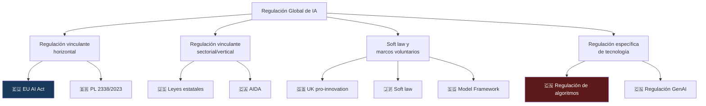

# Regulación Global de IA — Panorama Mundial

> [!abstract] Resumen ejecutivo
> La regulación de IA está evolucionando rápidamente en todo el mundo, con ==enfoques radicalmente diferentes== entre jurisdicciones. La UE lidera con el [[eu-ai-act-completo|EU AI Act]] (regulación vinculante basada en riesgos), EE.UU. combina *Executive Orders* con legislación estatal fragmentada, el Reino Unido adopta un enfoque ==pro-innovación sin legislación horizontal==, China regula algoritmos y IA generativa con normas específicas, y otras jurisdicciones (Canadá, Singapur, Japón, Brasil) desarrollan marcos propios. Para organizaciones globales, ==cumplir múltiples jurisdicciones simultáneamente== es el desafío central que [[licit-overview|licit]] ayuda a gestionar.
> ^resumen

---

## Mapa de enfoques regulatorios



---

## Unión Europea

### EU AI Act (Reglamento 2024/1689)

> [!info] Primera legislación horizontal del mundo
> El [[eu-ai-act-completo|EU AI Act]] es la ==primera regulación integral y vinculante del mundo sobre IA==. Su enfoque basado en riesgos clasifica los sistemas de IA en 4 niveles y establece obligaciones proporcionales. Ver [[eu-ai-act-completo]] para detalle completo.

| Aspecto | Detalle |
|---|---|
| Tipo | ==Reglamento (directamente aplicable)== |
| Entrada en vigor | Agosto 2024 |
| Plena aplicación | Agosto 2027 |
| Alcance | Extraterritorial (afecta a quien opera en el mercado UE) |
| Sanciones | Hasta ==€35M o 7% facturación global== |
| Enfoque | Basado en riesgos (4 niveles) |

### AI Liability Directive

La [[ai-liability-directive|Directiva de Responsabilidad Civil por IA]] complementa el *AI Act* con un régimen de responsabilidad civil específico. Introduce la ==presunción de causalidad== y facilita la carga de la prueba para las víctimas.

### Otras regulaciones UE relevantes

| Regulación | Relevancia para IA |
|---|---|
| GDPR | ==Protección de datos en entrenamiento y uso== |
| Data Act | Acceso a datos generados por productos IoT |
| Digital Services Act | Transparencia algorítmica en plataformas |
| Digital Markets Act | Interoperabilidad y acceso a datos |
| Cyber Resilience Act | Seguridad de productos digitales |
| Product Liability Directive | Responsabilidad por productos defectuosos |

---

## Estados Unidos

### Enfoque federal

EE.UU. ==no tiene legislación federal horizontal== sobre IA. El enfoque se basa en:

> [!warning] Fragmentación regulatoria
> La ausencia de una ley federal integral ha creado un ==mosaico regulatorio== donde cada estado, agencia y sector tiene sus propias reglas. Esto supone un desafío significativo para el cumplimiento.

#### Executive Order 14110 (Oct 2023)

| Aspecto | Detalle |
|---|---|
| Título | "Safe, Secure, and Trustworthy AI" |
| Naturaleza | ==Orden ejecutiva (no ley)== |
| Alcance | Agencias federales + requisitos para desarrolladores |
| Requisitos | Modelos >10^26 FLOPs: notificación al gobierno, resultados de red teaming |
| *NIST AI RMF* | Promueve adopción del [[nist-ai-rmf|AI RMF]] |
| Estado | Vigente (parcialmente revocado y reinstaurado) |

#### Legislación estatal

> [!danger] El mosaico estatal
> | Estado | Legislación | Estado | Enfoque |
> |---|---|---|---|
> | ==Colorado== | SB 24-205 (AI Consumer Protections Act) | Promulgada 2024 | Transparencia y no discriminación en alto riesgo |
> | California | SB-1047 (AI Safety) | ==Vetada 2024== | Seguridad de modelos de frontera |
> | California | AB-2013 (Training data transparency) | Promulgada 2024 | Transparencia de datos de entrenamiento |
> | Illinois | AI Video Interview Act | Vigente | IA en entrevistas de empleo |
> | NYC | Local Law 144 | Vigente | Herramientas de contratación automatizada |
> | Texas | HB-1709 | Promulgada 2023 | Inventario de usos de IA por gobierno |
> | Connecticut | SB-2 | Promulgada 2024 | Evaluaciones de impacto de IA |
> | Utah | SB-149 | Promulgada 2024 | Regulación de IA generativa |

> [!tip] Colorado AI Act — El más cercano al EU AI Act
> El *Colorado AI Act* (SB 24-205) es la ==legislación estatal más comprehensiva== de EE.UU. Clasifica sistemas de alto riesgo (*consequential AI*), requiere evaluaciones de impacto, y establece obligaciones de transparencia similares al EU AI Act. Entra en vigor en ==febrero de 2026==.

#### Regulación sectorial federal

| Sector | Agencia | Regulación/Guía |
|---|---|---|
| Finanzas | SEC, CFTC, OCC | Guías sobre modelos de riesgo |
| Salud | FDA | ==Software as Medical Device (SaMD)== |
| Empleo | EEOC | Guía sobre discriminación algorítmica |
| Vivienda | HUD | *Fair Housing Act* aplicado a IA |
| Consumo | FTC | Sección 5 — prácticas engañosas |
| Defensa | DoD | Directiva 3000.09 (armas autónomas) |

---

## Reino Unido

> [!info] Enfoque pro-innovación
> El Reino Unido ha adoptado deliberadamente un enfoque ==sin legislación horizontal==, favoreciendo la regulación sectorial existente y la orientación voluntaria[^1].

| Aspecto | Detalle |
|---|---|
| Enfoque | Pro-innovación, basado en principios |
| Legislación horizontal | ==No== (deliberadamente) |
| Principios | Seguridad, transparencia, equidad, accountability, contestabilidad |
| Reguladores | Sectoriales existentes (FCA, Ofcom, ICO, CMA, etc.) |
| AI Safety Institute | Evaluación de modelos de frontera |

### AI Safety Institute (AISI)

Establecido en noviembre de 2023, el AISI:
- Evalúa modelos de frontera antes de su lanzamiento
- Realiza ==pruebas de seguridad avanzadas== (*red teaming*)
- Publica investigación sobre riesgos de IA
- Colabora internacionalmente (Cumbre de Bletchley Park)

> [!question] ¿Cambiará el enfoque del UK?
> El gobierno laborista (desde julio 2024) ha señalado la posibilidad de ==legislación vinculante== para IA, particularmente tras la Cumbre de Seúl y el *AI Seoul Accord*. Sin embargo, hasta la fecha, el enfoque sigue siendo predominantemente voluntario.

---

## China

> [!danger] Regulación por tecnología — el enfoque más granular
> China regula tecnologías de IA ==individualmente== con normas específicas, creando un marco regulatorio que es paradójicamente más detallado en ciertos aspectos que el EU AI Act.

| Regulación | Fecha | Alcance |
|---|---|---|
| Regulación de algoritmos de recomendación | ==Mar 2022== | Transparencia algorítmica, opt-out |
| Regulación de *deep synthesis* (deepfakes) | Ene 2023 | Etiquetado, verificación de identidad |
| Medidas provisionales de IA generativa | ==Ago 2023== | Entrenamiento, contenido, registro |
| Regulación de ética en ciencia y tecnología | Mar 2024 | Principios éticos |

### Características del enfoque chino

| Aspecto | Detalle |
|---|---|
| Registro | Modelos de IA generativa deben ==registrarse== ante autoridades |
| Contenido | Prohibición de contenido que "subvierta el poder estatal" |
| Datos de entrenamiento | ==Aprobación de datos== de entrenamiento |
| Etiquetado | Obligatorio para todo contenido generado por IA |
| Evaluación | Evaluación de seguridad antes de lanzamiento público |
| Valores socialistas | Contenido debe alinearse con valores socialistas |

---

## Canadá

### Artificial Intelligence and Data Act (AIDA)

| Aspecto | Detalle |
|---|---|
| Tipo | Parte del Bill C-27 (*Digital Charter Implementation Act*) |
| Estado | ==En trámite parlamentario== (re-presentado) |
| Enfoque | Sistemas de IA de "alto impacto" |
| Requisitos | Evaluaciones de impacto, transparencia, supervisión |
| Regulador | Comisionado de IA y Datos (nuevo cargo) |

> [!warning] Estado legislativo incierto
> AIDA ha enfrentado múltiples retrasos y cambios. El estado legislativo actual debe verificarse antes de cualquier decisión de compliance.

---

## Singapur

### Model AI Governance Framework

| Aspecto | Detalle |
|---|---|
| Tipo | ==Marco voluntario== |
| Edición | 2ª edición (2020) |
| Enfoque | Principios y prácticas de gobernanza |
| Complemento | PDPA (*Personal Data Protection Act*) |
| Herramienta | AI Verify — framework de pruebas de gobernanza |

> [!tip] AI Verify — herramienta práctica
> Singapur ha desarrollado ==AI Verify==, un framework *open-source* de pruebas de gobernanza de IA que evalúa transparencia, equidad, robustez y accountabilidad. Es complementario a la evaluación que [[licit-overview|licit]] realiza.

---

## Japón

### Enfoque de soft law

| Aspecto | Detalle |
|---|---|
| Tipo | ==Directrices voluntarias== |
| Principios | Principios de IA centrados en el humano (2019) |
| Guía | AI Governance Guidelines (actualización continua) |
| Regulación vinculante | No específica para IA (utiliza leyes existentes) |
| Enfoque | ==Agilidad regulatoria== (*agile governance*) |

---

## Brasil

### PL 2338/2023

| Aspecto | Detalle |
|---|---|
| Tipo | Proyecto de ley |
| Estado | ==Aprobado en el Senado==, pendiente en Cámara |
| Enfoque | Basado en riesgos (similar al EU AI Act) |
| Clasificación | Riesgo inaceptable, alto, riesgo general |
| Autoridad | Autoridad Nacional de IA (ANPD como supervisora) |
| Inspiración | EU AI Act + características locales |

---

## Tabla comparativa global

| Jurisdicción | Tipo | Enfoque | ==Sanciones== | Estado |
|---|---|---|---|---|
| 🇪🇺 UE | Reglamento vinculante | Basado en riesgos | ==€35M / 7%== | Vigente |
| 🇺🇸 EE.UU. (federal) | Executive Orders + guías | Sectorial + voluntario | Variables | Parcialmente vigente |
| 🇺🇸 Colorado | Ley estatal | Alto riesgo | Bajo CCPA | Vigente 2026 |
| 🇬🇧 UK | Marco voluntario | Pro-innovación | Sectoriales | Vigente |
| 🇨🇳 China | Regulaciones específicas | Por tecnología | ==Administrativas== | Vigente |
| 🇨🇦 Canadá | Proyecto de ley | Alto impacto | Por definir | En trámite |
| 🇸🇬 Singapur | Marco voluntario | Principios | N/A | Vigente |
| 🇯🇵 Japón | Directrices | Soft law | N/A | Vigente |
| 🇧🇷 Brasil | Proyecto de ley | Basado en riesgos | Por definir | En trámite |
| 🇰🇷 Corea del Sur | Ley de promoción | Pro-innovación + seguridad | Limitadas | Vigente |
| 🇮🇳 India | Sin regulación específica | Caso por caso | N/A | — |
| 🇦🇺 Australia | Directrices + revisión | Voluntario (por ahora) | N/A | En revisión |

---

## Implicaciones para empresas globales

> [!danger] El desafío del cumplimiento multi-jurisdiccional
> Una empresa que opera globalmente puede estar sujeta simultáneamente a:
> - EU AI Act (si tiene usuarios o clientes en la UE)
> - Regulaciones estatales de EE.UU. (Colorado, NYC, etc.)
> - Regulaciones chinas (si opera en China)
> - GDPR + AI Act (datos de ciudadanos europeos)
> - Regulaciones sectoriales (salud, finanzas) en cada jurisdicción
>
> ==El cumplimiento del EU AI Act generalmente cubre la mayoría de requisitos de otras jurisdicciones==, pero no todos. Se requiere análisis caso por caso.

> [!success] licit como herramienta multi-jurisdiccional
> [[licit-overview|licit]] permite evaluar cumplimiento contra múltiples frameworks:
> ```bash
> # Evaluación multi-framework
> licit assess --framework eu-ai-act,nist-ai-rmf,colorado-ai-act
>
> # Gap analysis entre jurisdicciones
> licit report --multi-jurisdiction --output ./compliance/global/
> ```

---

## Relación con el ecosistema

El panorama regulatorio global impacta en cómo se utilizan todas las herramientas:

- **[[intake-overview|intake]]**: Los requisitos regulatorios de múltiples jurisdicciones se capturan como *intake items* con etiquetas de jurisdicción. [[intake-overview|intake]] permite filtrar y priorizar requisitos por jurisdicción aplicable.

- **[[architect-overview|architect]]**: Los *audit trails* de [[architect-overview|architect]] deben cumplir requisitos de retención que varían por jurisdicción (6 meses EU AI Act, variables en EE.UU., etc.). La configuración de retención se adapta a la jurisdicción más estricta.

- **[[vigil-overview|vigil]]**: Los escaneos de seguridad de [[vigil-overview|vigil]] son universalmente relevantes ya que ==todas las jurisdicciones== requieren algún nivel de seguridad y robustez en sistemas de IA.

- **[[licit-overview|licit]]**: Es la herramienta central para gestionar compliance multi-jurisdiccional. `licit assess` soporta múltiples frameworks regulatorios, y `licit report` genera informes adaptados a cada jurisdicción con la evidencia específica requerida.

---

## Enlaces y referencias

> [!quote]- Bibliografía y fuentes
> - [^1]: UK Government, "A pro-innovation approach to AI regulation", White Paper, marzo 2023.
> - OECD AI Policy Observatory, "OECD.AI Policy Observatory", https://oecd.ai.
> - Bradford, A. (2020). "The Brussels Effect: How the European Union Rules the World". Oxford University Press.
> - Smuha, N.A. (2024). "Beyond the Brussels Effect: The Global Landscape of AI Regulation". *European Journal of Risk Regulation*.
> - [[eu-ai-act-completo]] — Detalle del EU AI Act
> - [[ai-liability-directive]] — Directiva europea de responsabilidad
> - [[nist-ai-rmf]] — Framework NIST de EE.UU.
> - [[iso-standards-ia]] — Estándares internacionales

[^1]: UK Government White Paper on AI Regulation, marzo 2023.
