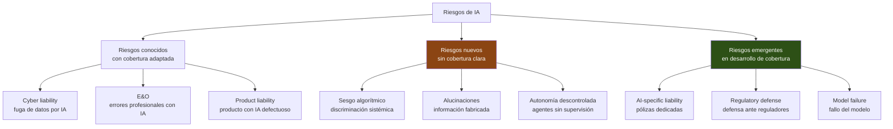
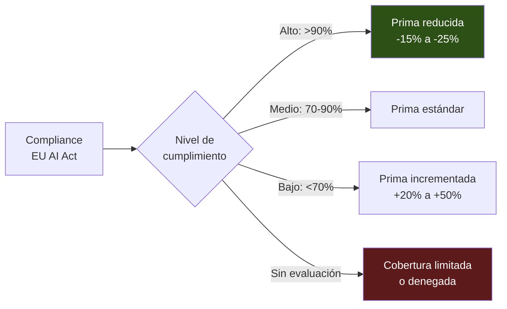

# Seguros para Sistemas de IA

> [!abstract] Resumen ejecutivo
> El mercado de seguros para IA está emergiendo rápidamente como respuesta a los ==nuevos riesgos que la IA introduce== y a la regulación que los cuantifica. Los tipos de cobertura incluyen responsabilidad profesional (*E&O*), responsabilidad por producto, *cyber liability* y la nueva ==AI liability insurance==. Las aseguradoras requieren cada vez más evidencia de cumplimiento regulatorio, documentación técnica y pruebas de seguridad como condición para la cobertura. Los *evidence bundles* de [[licit-overview|licit]] con firma criptográfica son una herramienta directa para satisfacer estos requisitos y obtener ==primas más competitivas==.
> ^resumen

---

## El mercado emergente de seguros de IA

> [!info] Por qué las aseguradoras necesitan entender la IA
> La IA introduce riesgos que las pólizas tradicionales ==no cubren adecuadamente==:
> - **Decisiones discriminatorias**: Un sistema de scoring que discrimina por raza → ¿cubre la póliza de E&O?
> - **Alucinaciones con daño**: Un chatbot médico que da un diagnóstico erróneo → ¿cubre la póliza de producto?
> - **Sesgo sistémico**: Un sistema de contratación que discrimina → ¿cubre *employment practices liability*?
> - **Daño reputacional**: Una IA que genera contenido ofensivo → ¿cubre *media liability*?



---

## Tipos de cobertura

### 1. Responsabilidad profesional (*Errors & Omissions*, E&O)

> [!tip] Cobertura más relevante actualmente
> La póliza de E&O cubre ==errores profesionales y negligencias== en la prestación de servicios. Para empresas de IA, esto incluye:
> - Errores en predicciones del modelo que causan daño al cliente
> - Fallos en la implementación del sistema de IA
> - ==Asesoramiento incorrecto== basado en outputs de IA
> - Incumplimiento de SLAs ([[contratos-sla-ia]])

| Aspecto | Cobertura E&O para IA |
|---|---|
| Qué cubre | Daños a terceros por ==errores profesionales== |
| Qué excluye típicamente | Daño intencional, incumplimiento deliberado |
| Límite típico | €1M-€10M |
| ==Deducible== | €25K-€100K |
| Prima típica | 0.5%-3% del límite |
| Requisito emergente | ==Evidencia de compliance== IA |

### 2. Responsabilidad por producto (*Product Liability*)

> [!warning] Impacto de la PLD revisada
> La *Product Liability Directive* revisada (ver [[ai-liability-directive]]) extiende la responsabilidad objetiva a ==software y componentes de IA==. Esto significa:
> - El proveedor de IA es responsable ==sin necesidad de demostrar culpa==
> - Los componentes de IA integrados en productos generan responsabilidad
> - La falta de actualizaciones se considera ==defecto del producto==

| Escenario | ¿Cubre product liability? |
|---|---|
| Robot con IA causa daño físico | ==Sí== |
| Software de diagnóstico médico falla | ==Sí== (bajo PLD revisada) |
| Scoring crediticio discriminatorio | ==Potencialmente== |
| Chatbot da consejo financiero erróneo | ==Zona gris== |

### 3. Cyber Liability

Los sistemas de IA amplían la superficie de ataque, lo que impacta las pólizas de *cyber*:

| Riesgo cyber específico de IA | Cobertura |
|---|---|
| ==Data poisoning== del modelo | Generalmente cubierto |
| Extracción de datos de entrenamiento | Generalmente cubierto |
| *Prompt injection* que causa fuga de datos | ==Depende de la póliza== |
| Adversarial attacks que inutilizan el sistema | Generalmente cubierto |
| Uso de IA por atacantes contra el sistema | Generalmente cubierto |

### 4. AI-Specific Liability (emergente)

> [!success] Nuevos productos de seguros específicos para IA
> Aseguradoras líderes están desarrollando pólizas ==específicas para riesgos de IA==:
>
> | Producto | Cobertura | Aseguradora (ejemplo) |
> |---|---|---|
> | AI Errors & Omissions | Errores de modelos de IA | Munich Re |
> | Algorithm Liability | Decisiones algorítmicas discriminatorias | Swiss Re |
> | Model Failure | ==Degradación o fallo del modelo== | Lloyd's syndicates |
> | Regulatory Defense | Costes de defensa ante reguladores IA | Allianz |
> | AI Product Recall | Retiro de producto con componente IA | Zurich |

---

## Qué exigen las aseguradoras

### Requisitos de suscripción

> [!danger] Sin documentación, sin cobertura
> Las aseguradoras están incorporando requisitos específicos de IA en sus procesos de suscripción:

| Requisito | Detalle | Cómo cumplirlo |
|---|---|---|
| ==Inventario de sistemas IA== | Lista completa de todos los sistemas de IA en uso | [[gobernanza-ia-empresarial\|Inventario de gobernanza]] |
| Documentación técnica | Documentación del funcionamiento del sistema | `licit annex-iv` |
| ==Evaluación de riesgos== | Análisis de riesgos documentado | `licit assess` |
| Pruebas de seguridad | Escaneos de vulnerabilidades | [[vigil-overview\|vigil]] SARIF |
| Supervisión humana | Evidencia de human-in-the-loop | [[architect-overview\|architect]] sessions |
| Historial de incidentes | Registro de fallos e incidentes | Registros internos |
| ==Compliance regulatorio== | Evidencia de cumplimiento EU AI Act | `licit assess` + evidence bundle |
| Formación de empleados | Programa de formación en IA | Registros RRHH |
| Plan de contingencia | Proceso ante fallos del sistema | Documentación operativa |
| FRIA | Evaluación de impacto (si alto riesgo) | `licit fria` |

### El cuestionario de suscripción de IA

> [!example]- Cuestionario típico de aseguradora (extracto)
> ```markdown
> ## Cuestionario de Suscripción — AI Liability
>
> SECCIÓN A: Inventario
> 1. ¿Cuántos sistemas de IA utiliza su organización? [ ]
> 2. ¿Cuántos están clasificados como alto riesgo bajo EU AI Act? [ ]
> 3. ¿Mantiene un inventario actualizado de todos los sistemas? [Sí/No]
>    Si sí, proporcione el inventario.
>
> SECCIÓN B: Gobernanza
> 4. ¿Tiene un comité de gobernanza de IA? [Sí/No]
> 5. ¿Tiene un AI Ethics Officer? [Sí/No]
> 6. ¿Tiene políticas de uso aceptable de IA? [Sí/No]
>    Si sí, proporcione copia.
>
> SECCIÓN C: Compliance
> 7. ¿Ha realizado evaluación de conformidad EU AI Act? [Sí/No]
>    Si sí, proporcione evidence bundle de licit assess.
> 8. ¿Ha realizado FRIA para sistemas de alto riesgo? [Sí/No]
>    Si sí, proporcione documentación de licit fria.
> 9. ¿Realiza auditorías periódicas de sus sistemas de IA? [Sí/No]
>    Frecuencia: [ ]
>
> SECCIÓN D: Técnica
> 10. ¿Realiza pruebas de seguridad de sus sistemas de IA? [Sí/No]
>     Si sí, proporcione último informe SARIF de vigil.
> 11. ¿Implementa supervisión humana? [Sí/No]
>     Describa el mecanismo.
> 12. ¿Monitoriza el rendimiento del modelo en producción? [Sí/No]
>     Si sí, proporcione métricas de los últimos 12 meses.
>
> SECCIÓN E: Incidentes
> 13. ¿Ha tenido incidentes relacionados con IA en los últimos
>     3 años? [Sí/No]
>     Si sí, describa cada incidente.
> 14. ¿Tiene un proceso de gestión de incidentes de IA? [Sí/No]
>
> SECCIÓN F: Datos
> 15. ¿Procesa datos personales con sus sistemas de IA? [Sí/No]
> 16. ¿Ha completado DPIAs para estos sistemas? [Sí/No]
> 17. ¿Utiliza datos de entrenamiento con licencias verificadas? [Sí/No]
> ```

---

## Evidence bundles como soporte de suscripción

> [!success] licit evidence bundles para aseguradoras
> Los *evidence bundles* de [[licit-overview|licit]] proporcionan exactamente lo que las aseguradoras necesitan:

```bash
# Generar evidence bundle completo para aseguradora
licit report --insurance-application \
  --include assess,fria,annex-iv,owasp,scan \
  --vigil-sarif ./reports/vigil.sarif \
  --architect-sessions ./sessions/ \
  --bundle --sign \
  --output ./insurance/evidence-bundle.json

# Verificar bundle (la aseguradora puede ejecutar esto)
licit verify --bundle ./insurance/evidence-bundle.json
```

El *evidence bundle* incluye:
1. ==Score de compliance== EU AI Act (por artículo)
2. Documentación técnica Anexo IV (verificación de completitud)
3. FRIA si aplica (resumen y score)
4. Evaluación OWASP Agentic (10 riesgos)
5. Análisis de procedencia del código
6. Resultados SARIF de seguridad
7. ==Firma criptográfica== (Merkle tree + HMAC)
8. Timestamp verificable

---

## Impacto del EU AI Act en primas



> [!tip] Compliance como reductor de primas
> Las aseguradoras están empezando a ofrecer ==descuentos por cumplimiento verificable==:
> - Certificación [[iso-standards-ia|ISO 42001]]: -10% a -15%
> - Evidence bundle de [[licit-overview|licit]] con score >90%: -5% a -10%
> - Auditoría externa anual: -5%
> - Programa de formación en IA: -3% a -5%

---

## Conexión con la AI Liability Directive

La [[ai-liability-directive]] tiene un impacto directo en el mercado de seguros:

| Mecanismo AILD | Impacto en seguros |
|---|---|
| ==Presunción de causalidad== | Aumenta probabilidad de condenas → ==primas más altas== |
| Acceso a evidencia | Más información disponible → mejor evaluación de riesgos |
| Inversión carga de prueba | Demandados necesitan evidencia de compliance → ==valor de licit== |
| Régimen de responsabilidad claro | Mercado más predecible → ==productos de seguro más definidos== |

> [!warning] Sin la AILD, incertidumbre actuarial
> Antes de la AILD, las aseguradoras no podían predecir con fiabilidad la probabilidad de condena en casos de IA. La AILD proporciona un marco más predecible que permite ==desarrollar modelos actuariales específicos para IA==.

---

## Tipos de siniestros de IA

> [!failure] Escenarios de siniestro reales y potenciales
> | Escenario | Tipo de daño | Cobertura |
> |---|---|---|
> | Scoring crediticio discriminatorio | ==Daño financiero + dignidad== | E&O + AI Liability |
> | Chatbot médico con consejo erróneo | Daño a la salud | Product Liability |
> | Sistema de contratación sesgado | Discriminación laboral | Employment Practices |
> | Deepfake que daña reputación | Daño reputacional | Media Liability |
> | Agente autónomo que borra datos | ==Daño patrimonial== | Cyber Liability |
> | Coche autónomo accidente | Daño físico | Auto Liability + Product |
> | Alucinación en asesoramiento legal | Daño profesional | E&O |
> | Fuga de datos por prompt injection | Fuga de datos personales | Cyber Liability |

---

## Cálculo de cobertura necesaria

> [!info] Factores para dimensionar la cobertura
> | Factor | Impacto en cobertura | Ejemplo |
> |---|---|---|
> | Clasificación de riesgo AI Act | ==Alto riesgo = mayor cobertura== | Scoring crediticio vs. chatbot FAQ |
> | Volumen de afectados | Mayor volumen = mayor exposición | 50K decisiones/mes vs. 100/mes |
> | Tipo de decisión | Decisiones irreversibles = mayor riesgo | Denegación de empleo vs. recomendación |
> | Jurisdicción | UE (sanciones altas) vs. otros | Hasta €35M bajo AI Act |
> | Historial de incidentes | Más incidentes = prima más alta | — |
> | ==Nivel de compliance== | Mayor compliance = ==menor prima== | Score licit >90% |
> | Supervisión humana | Más supervisión = menor riesgo | HITL vs. fully automated |

---

## Exclusiones comunes

> [!danger] Qué NO cubren las pólizas de IA
> - Uso deliberado de IA para causar daño
> - ==Prácticas prohibidas== bajo EU AI Act Art. 5
> - Incumplimiento conocido y deliberado de regulación
> - Daño causado tras notificación de vulnerabilidad no parcheada
> - Sanciones regulatorias (*fines*) — generalmente no asegurables
> - ==Guerra y terrorismo== (incluido ciberterrorismo estatal)
> - Daño ambiental por IA (cobertura específica necesaria)
> - Pérdida de beneficios por fallo de IA sin daño a terceros

---

## Recomendaciones prácticas

> [!success] Estrategia de seguros para empresas de IA
> 1. **Inventariar riesgos**: Usar `licit assess` para identificar y cuantificar riesgos
> 2. **Documentar compliance**: Generar *evidence bundles* con [[licit-overview|licit]] regularmente
> 3. **Combinar coberturas**: E&O + Cyber + AI-specific para cobertura completa
> 4. **Revisar exclusiones**: Verificar que la póliza no excluye riesgos de IA
> 5. **Negociar descuentos**: Presentar evidencia de compliance para reducir primas
> 6. **Actualizar anualmente**: Los riesgos de IA evolucionan rápidamente
> 7. **Coordinar con contratos**: Alinear coberturas con cláusulas de [[contratos-sla-ia|contratos]]
> 8. **Considerar cautivas**: Para riesgos no asegurables en mercado estándar

---

## Relación con el ecosistema

Los seguros de IA dependen de la evidencia generada por todo el ecosistema:

- **[[intake-overview|intake]]**: Los requisitos de seguros (coberturas mínimas, requisitos de documentación de aseguradoras) se capturan como *intake items*. Esto asegura que el desarrollo cumple los estándares que las aseguradoras exigen.

- **[[architect-overview|architect]]**: Proporciona ==métricas operativas== (disponibilidad, latencia, tasas de error) que las aseguradoras necesitan para evaluar riesgos técnicos. Los *audit trails* de [[architect-overview|architect]] demuestran la supervisión humana que reduce primas.

- **[[vigil-overview|vigil]]**: Los escaneos de seguridad de [[vigil-overview|vigil]] son ==evidencia directa== para satisfacer requisitos de suscripción de pólizas cyber y AI liability. Un perfil de seguridad limpio (sin vulnerabilidades high/critical) reduce significativamente las primas.

- **[[licit-overview|licit]]**: Es la ==herramienta central para satisfacer los requisitos de las aseguradoras==. Los *evidence bundles* firmados criptográficamente proporcionan la evidencia de compliance que las aseguradoras requieren para suscripción, y que los asegurados necesitan para reclamar ante siniestros.

---

## Enlaces y referencias

> [!quote]- Bibliografía y fuentes
> - [^1]: Munich Re, "AI-related insurance: a growing market", 2024.
> - [^2]: Swiss Re Institute, "AI and insurance: Opportunities and risks", sigma 5/2024.
> - Lloyd's of London, "AI: Risk, opportunity and the future of insurance", 2024.
> - European Insurance and Occupational Pensions Authority (EIOPA), "Artificial Intelligence Governance Principles", 2021.
> - [[ai-liability-directive]] — Directiva de responsabilidad civil por IA
> - [[contratos-sla-ia]] — Contratos como base de la cobertura
> - [[eu-ai-act-completo]] — Regulación que define el estándar de compliance
> - [[auditoria-ia]] — Auditoría como requisito de aseguradoras
> - [[gobernanza-ia-empresarial]] — Gobernanza como factor de reducción de primas

[^1]: Munich Re es una de las aseguradoras líderes en desarrollo de productos de seguros específicos para IA.
[^2]: Swiss Re Institute sigma report sobre oportunidades y riesgos de IA en seguros.
