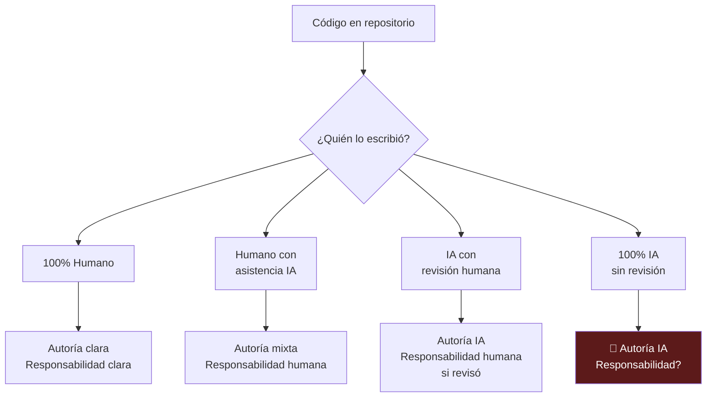
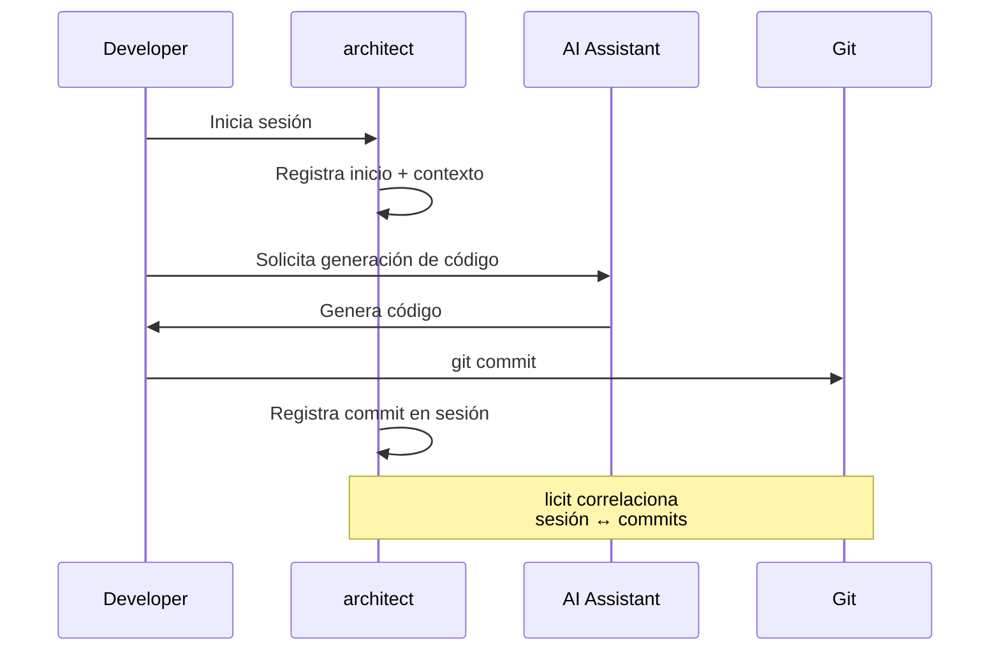

# Trazabilidad y Procedencia del Código IA

> [!abstract] Resumen ejecutivo
> Determinar si el código fue ==escrito por un humano o generado por IA== es un desafío fundamental para el cumplimiento regulatorio. El *EU AI Act* exige transparencia sobre el uso de IA en el desarrollo (Art. 50), y la trazabilidad del código es esencial para la documentación técnica ([[eu-ai-act-anexo-iv|Anexo IV]]). [[licit-overview|licit]] implementa ==6 heurísticas de *provenance tracking*== que analizan el historial git para determinar la procedencia del código: análisis de git blame, patrones de commit, correlación de sesiones, análisis de estilo, patrones de mensajes y velocidad de cambios.
> ^resumen

---

## El problema de la procedencia

En la era de los asistentes de código IA (*GitHub Copilot*, *Claude Code*, *Cursor*, *ChatGPT*), una pregunta fundamental ha emergido: ==¿quién escribió realmente este código?==

> [!question] ¿Por qué importa la procedencia?
> 1. **Cumplimiento regulatorio**: El *EU AI Act* (Art. 50) requiere transparencia sobre contenido generado por IA
> 2. **Propiedad intelectual**: La atribución de autoría determina derechos de *copyright* ([[ip-codigo-generado-ia]])
> 3. **Responsabilidad**: ¿Quién responde por un *bug* en código generado por IA?
> 4. **Calidad**: Código generado sin supervisión puede contener vulnerabilidades
> 5. **Licencias**: Código generado puede incorporar fragmentos de código bajo licencias restrictivas ([[open-source-compliance-ia]])
> 6. **Auditoría**: Las auditorías de código requieren saber ==quién revisó qué==



---

## Las 6 heurísticas de licit

[[licit-overview|licit]] implementa 6 heurísticas complementarias mediante su comando `licit scan` para determinar la procedencia del código[^1]:

### Heurística 1: Análisis de Git Blame

La heurística más directa: analizar la salida de `git blame` para identificar patrones de autoría.

> [!info] ¿Qué revela git blame?
> - **Autor**: Nombre y email del committer
> - **Fecha**: Cuándo se escribió cada línea
> - **Commit**: Hash del commit que introdujo cada línea
> - **Concentración temporal**: ¿Muchas líneas en poco tiempo?

```bash
# Ejemplo de análisis de git blame
licit scan --heuristic git-blame --path ./src/

# Resultado:
# Archivo: src/scoring/model.py
# Total líneas: 450
# Líneas por autor:
#   developer@company.com: 280 (62.2%)
#   ai-assistant@tool.com:  85 (18.9%)  ← IA identificada
#   unknown-batch@ci.com:   85 (18.9%)  ← Sospechoso
```

> [!warning] Limitaciones de git blame
> Git blame solo muestra el ==último autor== de cada línea. Si un humano modifica una línea generada por IA, git blame mostrará al humano. Por eso [[licit-overview|licit]] combina múltiples heurísticas.

### Heurística 2: Patrones temporales de commits

Los commits generados por IA tienen patrones temporales distintos a los humanos:

| Patrón | Humano típico | IA típica |
|---|---|---|
| Horario de commits | ==Horas laborables== | Cualquier hora |
| Frecuencia | Variable, con pausas | ==Ráfagas intensas== |
| Intervalo entre commits | Minutos a horas | ==Segundos a minutos== |
| Tamaño de commits | Variable, incremental | ==Grande, bloques completos== |
| Patrón semanal | Lunes-viernes | Sin patrón |

> [!example]- Ejemplo de análisis temporal
> ```
> Análisis temporal del repositorio:
>
> Período: 2025-01-15 a 2025-06-01
>
> Patrón de commits por hora (UTC):
> 00: ██ (12)        12: ████████████ (67)
> 01: █ (4)          13: ██████████ (58)
> 02: (0)            14: █████████ (53)
> 03: (0)            15: ████████ (49)
> 04: (0)            16: ███████ (42)
> 05: (0)            17: █████ (31)
> 06: █ (3)          18: ██ (14)
> 07: ██ (9)         19: █ (6)
> 08: ████ (22)      20: █ (5)
> 09: ██████ (35)    21: █ (7)
> 10: ████████ (48)  22: ██████████ (59)  ← Anomalía
> 11: ██████████ (61) 23: ████████ (47)   ← Anomalía
>
> ⚠ Anomalía detectada: actividad intensa entre 22:00-23:59
>   42 commits en 2 horas el 2025-03-15
>   → Alta probabilidad de sesión de IA automatizada
>   → Correlacionar con architect sessions
> ```

### Heurística 3: Correlación con sesiones de architect

> [!success] Integración clave con architect
> [[architect-overview|architect]] registra sesiones de desarrollo que incluyen invocaciones de herramientas de IA. [[licit-overview|licit]] correlaciona los timestamps de commits con las sesiones de [[architect-overview|architect]] para determinar si el código fue generado durante una ==sesión asistida por IA==.



```bash
# Correlación de sesiones
licit scan --heuristic session-correlation \
  --architect-sessions ./sessions/ \
  --git-repo ./

# Resultado:
# Sesión arch-2025-03-15-001:
#   Duración: 2h 15m
#   Herramientas IA invocadas: 34 veces
#   Commits durante sesión: 8
#   Archivos modificados: 23
#   → Confianza de asistencia IA: 94%
```

### Heurística 4: Análisis de estilo de código

El código generado por IA tiende a tener características estilísticas distinguibles:

> [!tip] Señales de código generado por IA
> - ==Comentarios excesivamente detallados== y formateados
> - Nombres de variables consistentemente descriptivos
> - Patrones de estructura uniformes a lo largo de archivos diferentes
> - Uso de patrones de diseño *textbook* sin adaptación al contexto
> - ==Docstrings perfectamente formateadas==
> - Manejo de errores genérico y repetitivo
> - Código "demasiado limpio" — sin atajos ni deuda técnica
> - Importaciones innecesarias que se eliminan en revisión

| Señal estilística | Peso en heurística | Confianza |
|---|---|---|
| Comentarios estilo tutorial | 0.15 | Media |
| Consistencia perfecta de nombrado | 0.10 | Baja |
| Patrones repetitivos inter-archivo | ==0.25== | Alta |
| Docstrings tipo template | 0.15 | Media |
| Error handling genérico | 0.10 | Baja |
| Código boilerplate extenso | ==0.25== | Alta |

### Heurística 5: Patrones de mensajes de commit

> [!info] Mensajes de commit reveladores
> Los mensajes de commit generados o asociados a IA tienen patrones identificables:
> - Prefijos específicos: `feat:`, `fix:`, `refactor:` (puede ser convencional commits humano)
> - ==Descripciones excesivamente detalladas== para cambios simples
> - Mensajes en inglés perfecto cuando el equipo es no anglófono
> - Estructura consistente que coincide con prompts de IA
> - Referencia explícita a IA: "Generated by", "AI-assisted", "Co-authored-by: AI"

```bash
# Análisis de mensajes de commit
licit scan --heuristic commit-messages --git-repo ./

# Resultado:
# Mensajes analizados: 342
# Patrones detectados:
#   Conventional commits: 89% (puede ser humano o IA)
#   Descripciones >200 chars: 34% (↑ probabilidad IA)
#   Co-authored-by IA: 12% (confirmado IA)
#   Idioma inconsistente: 8% (↑ probabilidad IA)
#   Mensajes idénticos en estructura: 15% (↑ probabilidad IA)
```

### Heurística 6: Velocidad de cambios de archivo

La velocidad a la que se modifican archivos es un indicador potente:

> [!danger] Velocidad sobrehumana
> Si un desarrollador modifica ==500 líneas en 15 archivos en 3 minutos==, es estadísticamente improbable que sea trabajo manual. Estas ráfagas de productividad son características de generación asistida por IA.


| Métrica | Umbral humano | Umbral IA | Método |
|---|---|---|---|
| Líneas/minuto añadidas | <30 | ==>100== | Análisis git diff + timestamps |
| Archivos/commit | 1-5 | ==>10== | Análisis git log --stat |
| Intervalo entre commits | >5 min | ==<2 min== | Análisis de timestamps |
| Ratio código/comentarios | 3:1 - 10:1 | ==1:1 - 2:1== | Análisis de contenido |

---

## Combinación de heurísticas

[[licit-overview|licit]] combina las 6 heurísticas en un ==score de confianza ponderado==:

```bash
# Escaneo completo con todas las heurísticas
licit scan --project ./mi-proyecto --output ./provenance-report/

# Resultado consolidado:
# ═══════════════════════════════════════════════
# INFORME DE PROCEDENCIA DEL CÓDIGO
# Proyecto: mi-proyecto
# Período: 2025-01-01 a 2025-06-01
# ═══════════════════════════════════════════════
#
# Distribución de autoría estimada:
#   Código humano:             62.3%  (14,230 líneas)
#   Código asistido por IA:    28.1%  (6,425 líneas)
#   Código generado por IA:     9.6%  (2,195 líneas)
#
# Confianza del análisis: 87%
#
# Heurísticas aplicadas:
#   ✓ Git blame analysis:       peso 0.20  confianza 92%
#   ✓ Patrones temporales:      peso 0.15  confianza 78%
#   ✓ Correlación sesiones:     peso 0.25  confianza 94%
#   ✓ Análisis de estilo:       peso 0.15  confianza 71%
#   ✓ Mensajes de commit:       peso 0.10  confianza 85%
#   ✓ Velocidad de cambios:     peso 0.15  confianza 88%
```

> [!warning] No es una ciencia exacta
> Las heurísticas proporcionan ==estimaciones probabilísticas==, no certezas. Un desarrollador muy productivo puede parecer IA, y un agente de IA con configuración cuidadosa puede parecer humano. La combinación de heurísticas reduce falsos positivos pero no los elimina.

---

## Implicaciones regulatorias

### EU AI Act — Art. 50 (Transparencia)

> [!danger] Obligación de transparencia
> El Art. 50 del [[eu-ai-act-completo|EU AI Act]] requiere que los proveedores de sistemas de IA diseñados para generar contenido (incluyendo código) aseguren que ==el output esté marcado como generado por IA== de forma detectable por máquina. Esto aplica a GitHub Copilot, Claude, ChatGPT y todos los asistentes de código.

### Documentación técnica — Anexo IV

La Sección 3 del [[eu-ai-act-anexo-iv|Anexo IV]] requiere documentar el ==proceso de desarrollo==, incluyendo qué herramientas se utilizaron. Si se utilizó IA para generar código del sistema, esto debe documentarse.

### Propiedad intelectual

La procedencia del código tiene implicaciones directas en [[ip-codigo-generado-ia|propiedad intelectual]]:
- ¿Es copyrightable el código generado por IA?
- ¿Quién es el autor legal?
- ¿Se incorporaron fragmentos de código bajo licencias restrictivas?

---

## Git blame como herramienta forense

> [!tip] Técnicas avanzadas de git blame
> ```bash
> # Blame detallado con timestamps
> git blame --date=iso-strict src/modelo.py
>
> # Blame ignorando cambios de whitespace
> git blame -w src/modelo.py
>
> # Blame con detección de movimiento de código
> git blame -M -C src/modelo.py
>
> # Blame mostrando el commit original (no el refactor)
> git blame -C -C -C src/modelo.py
>
> # Estadísticas de autoría por archivo
> git log --format='%an' -- src/modelo.py | sort | uniq -c | sort -rn
> ```

> [!example]- Script de análisis forense de git
> ```bash
> #!/bin/bash
> # Análisis forense de procedencia de código
> # Uso: ./forensic-analysis.sh <repo-path> <start-date>
>
> REPO=$1
> START_DATE=$2
>
> echo "=== Análisis forense de procedencia ==="
> echo "Repositorio: $REPO"
> echo "Desde: $START_DATE"
> echo ""
>
> # 1. Commits por hora del día
> echo "--- Distribución horaria de commits ---"
> git -C $REPO log --since="$START_DATE" \
>   --format='%ad' --date=format:'%H' | \
>   sort | uniq -c | sort -k2
>
> # 2. Tamaño promedio de commits
> echo ""
> echo "--- Tamaño de commits (líneas cambiadas) ---"
> git -C $REPO log --since="$START_DATE" \
>   --shortstat --format='' | \
>   grep -E 'files? changed'
>
> # 3. Intervalos entre commits del mismo autor
> echo ""
> echo "--- Intervalos mínimos entre commits ---"
> git -C $REPO log --since="$START_DATE" \
>   --format='%at %an' | sort -k2 | \
>   awk 'prev_author==$2 {print $1-prev_time, $2}
>        {prev_time=$1; prev_author=$2}'
>
> # 4. Archivos con mayor velocidad de cambio
> echo ""
> echo "--- Archivos con cambios rápidos ---"
> git -C $REPO log --since="$START_DATE" \
>   --diff-filter=M --name-only --format='%at' | \
>   paste - - | sort | uniq -c | sort -rn | head -20
> ```

---

## Mejores prácticas para trazabilidad

> [!success] Recomendaciones para equipos de desarrollo
> 1. **Configurar [[architect-overview|architect]]** para registrar todas las sesiones de desarrollo
> 2. **Usar `Co-authored-by: AI`** en mensajes de commit cuando se usa IA
> 3. **Documentar el uso de herramientas IA** en el proceso de desarrollo
> 4. **Ejecutar `licit scan` regularmente** como parte del [[compliance-cicd|pipeline CI/CD]]
> 5. **Separar commits humanos de commits asistidos** por IA cuando sea posible
> 6. **Mantener un registro de sesiones** de herramientas de IA utilizadas
> 7. **Revisar todo código generado** antes de hacer commit
> 8. **No borrar historial de git** — es evidencia forense

---

## Relación con el ecosistema

La trazabilidad del código es un servicio transversal que conecta con todo el ecosistema:

- **[[intake-overview|intake]]**: Los requisitos de transparencia y trazabilidad capturados por [[intake-overview|intake]] definen los umbrales y políticas que `licit scan` aplica. Por ejemplo, un requisito puede especificar "máximo 30% de código generado por IA sin revisión humana documentada".

- **[[architect-overview|architect]]**: Es la ==fuente de datos más valiosa== para la Heurística 3 (correlación de sesiones). Las sesiones de [[architect-overview|architect]] registran cuándo se invocaron herramientas de IA, qué se generó y cuánto costó. Esta correlación temporal con commits git es la heurística de mayor confianza.

- **[[vigil-overview|vigil]]**: Los escaneos de [[vigil-overview|vigil]] pueden revelar vulnerabilidades típicas de código generado por IA (patrones inseguros comunes, falta de validación de inputs). Esto complementa el análisis de procedencia con evaluación de calidad de seguridad.

- **[[licit-overview|licit]]**: Implementa las 6 heurísticas de *provenance tracking* mediante `licit scan`. Los resultados alimentan la documentación técnica del [[eu-ai-act-anexo-iv|Anexo IV]] y se incluyen en el *evidence bundle* con firma criptográfica para auditorías.

---

## Enlaces y referencias

> [!quote]- Bibliografía y fuentes
> - [^1]: Reglamento (UE) 2024/1689, Artículo 50 — Obligaciones de transparencia para proveedores de ciertos sistemas de IA.
> - Kirchner, J.H. et al. (2024). "Machine-generated text detection". *OpenAI Technical Report*.
> - Mitchell, M. et al. (2023). "Measuring Data". *Google Research*.
> - [[eu-ai-act-completo]] — Art. 50 sobre transparencia
> - [[eu-ai-act-anexo-iv]] — Documentación técnica del proceso de desarrollo
> - [[ip-codigo-generado-ia]] — Propiedad intelectual del código generado
> - [[open-source-compliance-ia]] — Licencias y código generado
> - [[compliance-cicd]] — Integración de trazabilidad en CI/CD

[^1]: Art. 50 del Reglamento (UE) 2024/1689 sobre obligaciones de transparencia.
