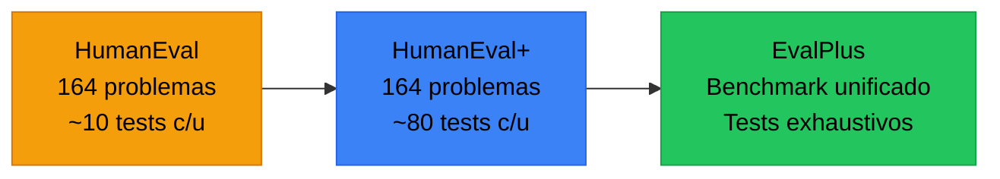
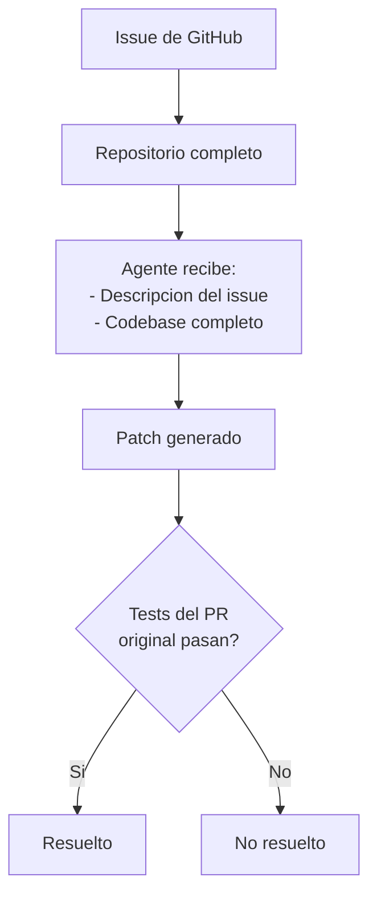
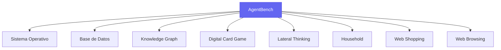
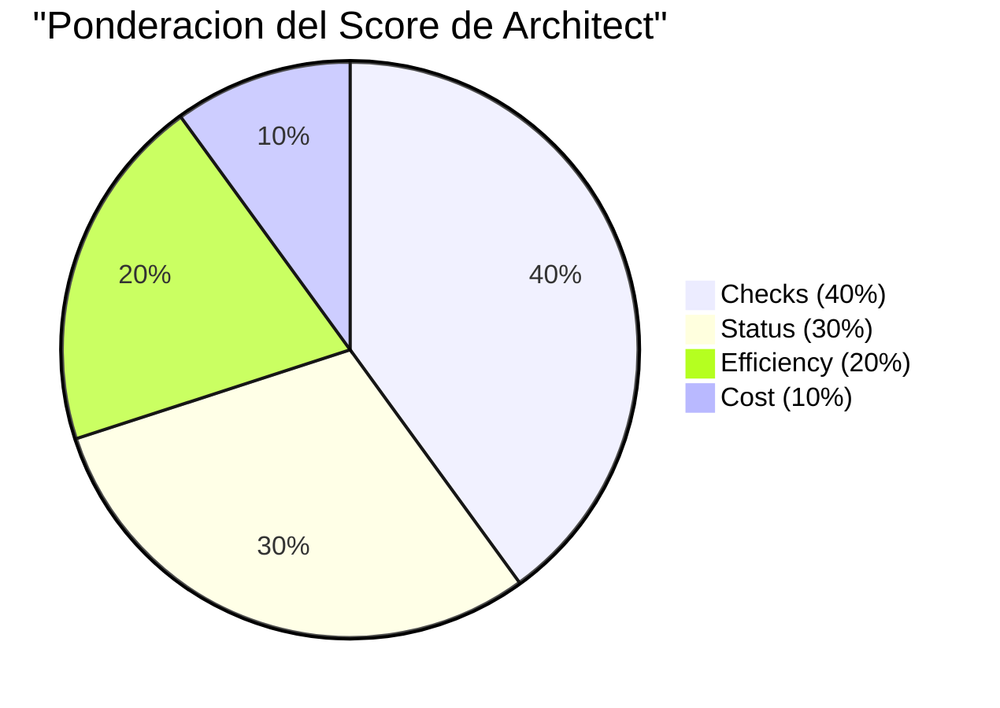
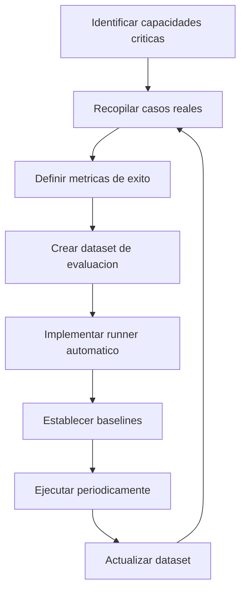

# Benchmarking de Agentes IA

> [!abstract] Resumen
> Los benchmarks son la vara de medir del progreso en agentes de IA. Desde ==SWE-bench para resolucion de issues reales de GitHub== hasta ==GAIA para asistentes generales==, cada benchmark mide capacidades especificas con limitaciones que deben entenderse. El sistema `eval` de architect implementa su propio benchmark con ==scoring compuesto ponderado== (checks 40pts + status 30pts + efficiency 20pts + cost 10pts). Entender que mide cada benchmark — y que no mide — es fundamental para interpretar resultados. ^resumen

---

## Por que necesitamos benchmarks

Los benchmarks proveen un lenguaje comun para comparar capacidades. Sin ellos, las afirmaciones sobre agentes serian anecdoticas. Pero un benchmark ==no es verdad absoluta== — es una lente especifica que revela aspectos particulares de la capacidad.

> [!warning] La Ley de Goodhart aplicada a benchmarks
> "Cuando una medida se convierte en objetivo, deja de ser buena medida." Los modelos optimizados para SWE-bench pueden no ser los mejores para tareas reales de desarrollo. Los benchmarks son herramientas de diagnostico, no destinos.

---

## Benchmarks de generacion de codigo

### HumanEval y MBPP

Los benchmarks fundacionales para generacion de codigo.

| Aspecto | HumanEval | MBPP |
|---------|-----------|------|
| Creador | OpenAI | Google |
| Tamano | 164 problemas | 974 problemas |
| Tipo | Funciones autocontenidas | Funciones simples |
| Metrica | ==pass@k== | ==pass@k== |
| Dificultad | Intermedia | Basica-Intermedia |
| Limitacion | Funciones aisladas, no codigo real | Demasiado simple |

> [!info] pass@k explicado
> `pass@k` mide la probabilidad de que al menos una de k muestras generadas sea correcta. `pass@1` es la metrica mas exigente: una sola oportunidad. `pass@10` permite 10 intentos.
>
> Formula: $pass@k = 1 - \binom{n-c}{k} / \binom{n}{k}$ donde n = total muestras, c = correctas.

### HumanEval+ y EvalPlus

Extensiones que agregan tests adicionales para detectar soluciones que pasan los tests originales por suerte.



> [!tip] Usa EvalPlus, no HumanEval original
> Muchos modelos que reportan 90%+ en HumanEval caen a 70-80% en HumanEval+ porque los tests adicionales exponen edge cases no cubiertos. ==EvalPlus es el benchmark mas honesto para generacion de funciones==.

---

## SWE-bench: El benchmark de referencia para agentes de codigo

*SWE-bench* es el benchmark mas relevante para agentes de programacion. Consiste en ==issues reales de repositorios populares de GitHub== con sus correspondientes pull requests de solucion.

### Estructura



### Variantes

| Variante | Tamano | ==Dificultad== | Uso recomendado |
|----------|--------|---------------|-----------------|
| SWE-bench Full | 2,294 issues | ==Alta== | Evaluacion exhaustiva |
| SWE-bench Lite | 300 issues | ==Media-Alta== | Evaluacion rapida |
| ==SWE-bench Verified== | 500 issues | ==Media-Alta== | Evaluacion confiable (curado manualmente) |

> [!danger] Limitaciones de SWE-bench
> - Solo mide correccion de bugs y features en proyectos Python especificos
> - Los tests de verificacion pueden ser insuficientes (el patch pasa los tests pero introduce otros problemas)
> - No mide calidad del codigo, solo funcionalidad
> - Sesgo hacia proyectos con buenos test suites
> - El subconjunto *Verified* es mas confiable pero mas pequeno

> [!question] Que resultados son impresionantes en SWE-bench?
> - **< 5%**: Sistemas basicos sin capacidad de agente
> - **5-15%**: Agentes competentes con limitaciones
> - **15-30%**: Agentes avanzados con buenas herramientas
> - **30-50%**: Estado del arte (a junio 2025)
> - **> 50%**: Resultados que merecen escrutinio sobre posible data leakage

---

## GAIA: Asistentes generales

*GAIA* (General AI Assistants) evalua la capacidad de asistentes de IA para resolver tareas del mundo real que requieren multiples pasos.

### Niveles de dificultad

| Nivel | Descripcion | Ejemplo | ==Humanos== | ==Mejor modelo== |
|-------|-------------|---------|-------------|-----------------|
| 1 | Simple, pocos pasos | Buscar dato en web | ==92%== | ==~70%== |
| 2 | Multi-paso, herramientas | Calcular con datos de PDF | ==86%== | ==~50%== |
| 3 | Complejo, razonamiento largo | Investigacion multi-fuente | ==78%== | ==~30%== |

> [!info] GAIA mide algo diferente a SWE-bench
> Mientras SWE-bench es especifico para programacion, GAIA mide capacidades generales: busqueda web, procesamiento de documentos, calculo, razonamiento multi-paso. Un agente puede ser excelente en SWE-bench y mediocre en GAIA, o viceversa.

---

## WebArena: Navegacion web

*WebArena* evalua agentes que navegan sitios web reales para completar tareas.

Entornos simulados:
- E-commerce (tipo Amazon)
- Foros (tipo Reddit)
- Gestion de contenido (tipo GitLab)
- Mapas (tipo Google Maps)

> [!example]- Ejemplo de tarea WebArena
> ```
> Tarea: "Encuentra el producto mas barato con rating > 4 estrellas
> en la categoria 'electronics' y agregalo al carrito"
>
> Pasos esperados:
> 1. Navegar a la categoria electronics
> 2. Ordenar por precio ascendente
> 3. Filtrar por rating > 4 estrellas
> 4. Seleccionar el primer producto
> 5. Click en "Add to Cart"
>
> Evaluacion: El producto correcto esta en el carrito
> ```

---

## AgentBench: Multi-entorno

*AgentBench* evalua agentes en ==8 entornos diferentes==:



> [!tip] AgentBench para evaluacion holistica
> Si necesitas evaluar un agente de proposito general, AgentBench da la imagen mas completa. Ningun otro benchmark cubre tantos dominios.

---

## Benchmarks de razonamiento matematico

### MATH y GSM8K

| Benchmark | Problemas | Nivel | ==Metrica== |
|-----------|-----------|-------|-------------|
| GSM8K | 8,500 | Escuela primaria/secundaria | ==Accuracy== |
| MATH | 12,500 | Competiciones matematicas | ==Accuracy por nivel== |
| AIME | 30/ano | Competicion avanzada | ==Score== |

> [!warning] Los benchmarks matematicos estan saturando
> Los modelos mas recientes alcanzan 90%+ en GSM8K. Esto no significa que "resolvieron" matematicas — significa que el benchmark necesita actualizacion. MATH y AIME siguen siendo discriminativos.

---

## El sistema eval de architect

[[architect-overview|Architect]] implementa un sistema de evaluacion competitiva propio que merece analisis detallado.

### Scoring compuesto ponderado



| Componente | Peso | ==Que mide== | Como se calcula |
|------------|------|-------------|-----------------|
| Checks | 40% | ==Verificaciones pasan== | % de checks exit 0 |
| Status | 30% | ==Tarea completada== | Binario: complete vs incomplete |
| Efficiency | 20% | ==Pasos utilizados== | Inverso del numero de pasos |
| Cost | 10% | ==Costo en tokens== | Inverso del costo total |

### Evaluacion multi-modelo

El comando `eval` ejecuta la misma tarea con multiples modelos y compara resultados:

> [!example]- Ejemplo: Evaluacion competitiva multi-modelo
> ```bash
> # Ejecutar evaluacion con 3 modelos en paralelo
> architect eval \
>   --task "Implementa rate limiting middleware" \
>   --checks "pytest tests/test_rate_limit.py" \
>   --checks "mypy src/middleware.py" \
>   --models claude-3-opus,gpt-4,gemini-ultra \
>   --runs 3
>
> # Output:
> # Model           | Checks | Status | Efficiency | Cost  | TOTAL
> # claude-3-opus   | 38/40  | 30/30  | 16/20      | 8/10  | 92/100
> # gpt-4           | 36/40  | 30/30  | 14/20      | 7/10  | 87/100
> # gemini-ultra    | 32/40  | 30/30  | 18/20      | 9/10  | 89/100
> ```

> [!success] Ventajas del enfoque de architect
> - Evaluacion contextualizada a tu proyecto especifico
> - Los checks son tus propios tests, no problemas genericos
> - El scoring ponderado refleja lo que realmente importa
> - Multi-modelo permite comparar proveedores objetivamente
> - Reproducible dentro de las limitaciones del [[reproducibilidad-ia|no-determinismo]]

---

## Disenar benchmarks propios

Para muchos equipos, los benchmarks publicos son insuficientes. El [[evals-como-producto|enfoque de evals como producto]] sugiere crear evaluaciones propias.

### Proceso de diseno



> [!danger] Errores comunes al disenar benchmarks
> - Dataset demasiado pequeno (< 50 casos no es estadisticamente significativo)
> - Sesgo de seleccion (solo incluir casos faciles o dificiles)
> - Metricas mal alineadas con el objetivo real
> - No actualizar el dataset cuando el agente mejora
> - Contamination: el agente fue entrenado con datos del benchmark

---

## Interpretacion critica de resultados

> [!quote] "All benchmarks are wrong, but some are useful."
> Parafraseando a George Box. Un benchmark es un modelo simplificado de la realidad.

### Preguntas para evaluar un benchmark

1. ==Que mide exactamente?== (no que dice que mide)
2. ==Que NO mide?== (gaps y puntos ciegos)
3. Como se previene la contaminacion de datos?
4. El dataset es representativo del uso real?
5. Las metricas capturan la calidad real o solo funcionalidad?
6. El [[regression-testing-ia|regression testing]] es viable con este benchmark?

> [!failure] Senales de alerta en reportes de benchmarks
> - Solo reportar el mejor resultado de muchas ejecuciones
> - No reportar intervalos de confianza
> - Omitir el costo por ejecucion
> - No especificar la version exacta del modelo
> - Resultados significativamente mejores que todo el state-of-the-art sin explicacion clara

---

## Relacion con el ecosistema

Los benchmarks son el sistema de medicion que permite evaluar objetivamente los componentes del ecosistema.

[[intake-overview|Intake]] puede beneficiarse de benchmarks que midan la calidad de normalizacion de especificaciones. Un benchmark de intake mediria: dada una especificacion ambigua, la version normalizada captura todos los requisitos? Los criterios de test incluidos son verificables?

[[architect-overview|Architect]] es el componente mas directamente evaluable con benchmarks. Su sistema `eval` implementa benchmarking propio, pero tambien puede evaluarse con SWE-bench para compararse con otros agentes de codigo. La combinacion de benchmarks publicos (SWE-bench) y privados (eval propio) da la imagen mas completa.

[[vigil-overview|Vigil]] podria benchmarkearse contra datasets de tests con problemas conocidos: dado un conjunto de tests con defectos (empty assertions, assert True, over-mocking), cuantos detectan las 26 reglas? El ==precision y recall de la deteccion== son las metricas relevantes.

[[licit-overview|Licit]] requiere que los resultados de benchmarks sean auditables. Cada ejecucion de benchmark debe generar evidencia reproducible — datasets usados, versiones de modelos, timestamps, resultados brutos — que se empaquetan en *evidence bundles*.

---

## Enlaces y referencias

> [!quote]- Bibliografia y recursos
> - Jimenez, C. E. et al. "SWE-bench: Can Language Models Resolve Real-World GitHub Issues?" ICLR 2024. [^1]
> - Mialon, G. et al. "GAIA: A Benchmark for General AI Assistants." 2023. [^2]
> - Zhou, S. et al. "WebArena: A Realistic Web Environment for Building Autonomous Agents." 2023. [^3]
> - Liu, X. et al. "AgentBench: Evaluating LLMs as Agents." ICLR 2024. [^4]
> - Chen, M. et al. "Evaluating Large Language Models Trained on Code." 2021. [^5]
> - Hendrycks, D. et al. "Measuring Mathematical Problem Solving With the MATH Dataset." NeurIPS 2021. [^6]

[^1]: El benchmark de referencia para agentes de programacion, con variantes Lite y Verified.
[^2]: Benchmark para asistentes generales con tareas multi-paso del mundo real.
[^3]: Evaluacion de agentes en entornos web realistas con tareas de navegacion.
[^4]: Benchmark multi-entorno que cubre la mayor variedad de dominios.
[^5]: Paper original de HumanEval que establecio pass@k como metrica estandar.
[^6]: Benchmark de razonamiento matematico con problemas de competiciones.
