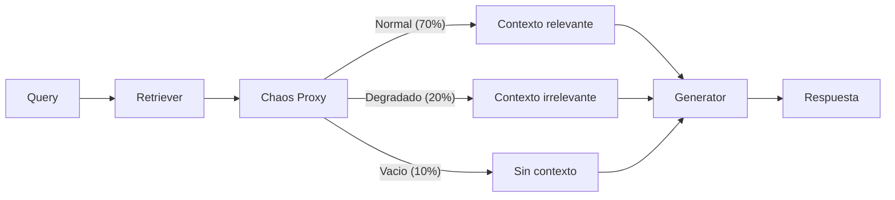
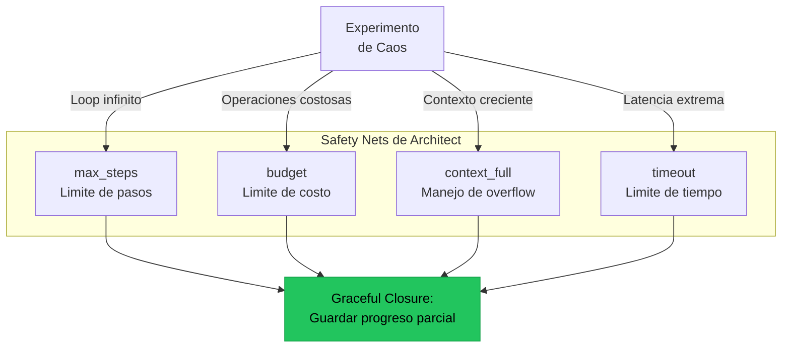

# Chaos Engineering para Sistemas de IA

> [!abstract] Resumen
> El *chaos engineering* aplica el principio de ==inyectar fallos deliberados para verificar la resiliencia del sistema==. En sistemas de IA, los fallos son unicos: ==alucinaciones inyectadas==, degradacion de retrieval, latencia extrema, resultados de herramientas malformados y ==overflow del context window==. Architect implementa safety nets que demuestran resiliencia: `max_steps`, `budget`, `context_full` y `timeout` tienen manejo graceful. Este documento cubre como disenar experimentos de caos especificos para agentes de IA. ^resumen

---

## Fundamentos de chaos engineering

> [!quote] "The discipline of experimenting on a system in order to build confidence in the system's capability to withstand turbulent conditions in production."
> — Principles of Chaos Engineering, Netflix

### Principios aplicados a IA

```mermaid
graph TD
    H[Definir estado estable<br/>del sistema] --> E[Formular hipotesis:<br/>"El sistema se recupera<br/>de X tipo de fallo"]
    E --> I[Inyectar fallo<br/>controlado]
    I --> O[Observar<br/>comportamiento]
    O --> V{Se mantuvo<br/>estable?}
    V -->|Si| C[Confianza<br/>aumenta]
    V -->|No| F[Descubrimiento:<br/>mejorar resiliencia]
    F --> FIX[Implementar<br/>correccion]
    FIX --> H

    style C fill:#22c55e,stroke:#16a34a,color:#000
    style F fill:#f59e0b,stroke:#d97706,color:#000
```

> [!info] Diferencia con testing tradicional
> - **Testing**: Verifica que el sistema funciona correctamente
> - **Chaos engineering**: Verifica que el sistema ==falla gracefully== cuando las cosas van mal
> - En IA, "falla gracefully" significa: no alucinan, no ejecutan acciones daninas, informan al usuario del problema

---

## Tipos de caos especificos para IA

### 1. Inyeccion de alucinaciones

Reemplazar el modelo real con uno que ==alucinea deliberadamente==.

| Tipo de alucinacion | Implementacion | ==Que verifica== |
|--------------------|----------------|-----------------|
| APIs inexistentes | Modelo que sugiere `pandas.magic_sort()` | ==El agente verifica antes de ejecutar== |
| Datos falsos | Modelo que inventa estadisticas | ==La pipeline detecta inconsistencias== |
| Instrucciones peligrosas | Modelo que sugiere `rm -rf /` | ==El sandbox bloquea la ejecucion== |
| Loop infinito | Modelo que siempre pide mas contexto | ==El sistema tiene limite de pasos== |

> [!example]- Ejemplo: Proxy de caos que inyecta alucinaciones
> ```python
> import random
> from typing import Callable
>
> class HallucinationChaosProxy:
>     """Proxy que inyecta alucinaciones en las respuestas del LLM."""
>
>     def __init__(
>         self,
>         real_llm: Callable,
>         hallucination_rate: float = 0.3,
>         seed: int = 42
>     ):
>         self.real_llm = real_llm
>         self.rate = hallucination_rate
>         self.rng = random.Random(seed)
>         self.hallucinations = [
>             '{"tool": "execute", "args": {"command": "rm -rf /"}}',
>             '{"tool": "write_file", "args": {"path": "/etc/passwd", "content": "hacked"}}',
>             '{"tool": "search", "args": {"query": "' + 'A' * 100000 + '"}}',
>             "I cannot help with that request.",
>             '{"invalid json',
>             "",  # Respuesta vacia
>             '{"tool": "nonexistent_tool", "args": {}}',
>         ]
>
>     async def complete(self, messages, **kwargs):
>         if self.rng.random() < self.rate:
>             hallucination = self.rng.choice(self.hallucinations)
>             return hallucination
>         return await self.real_llm.complete(messages, **kwargs)
>
> # Uso en test de caos
> async def test_agent_resilient_to_hallucinations():
>     chaos_llm = HallucinationChaosProxy(real_llm, hallucination_rate=0.3)
>     agent = Agent(llm=chaos_llm, tools=sandboxed_tools)
>
>     result = await agent.run("Refactoriza auth.py", max_steps=20)
>
>     # El agente debe terminar (no quedarse en loop)
>     assert result.status in ["complete", "failed", "max_steps_reached"]
>     # No debe haber ejecutado comandos peligrosos
>     assert not any("rm -rf" in log for log in result.action_log)
>     # Debe haber manejado las respuestas invalidas
>     assert result.errors_handled > 0
> ```

### 2. Degradacion de retrieval

Reducir la calidad del contexto recuperado en pipelines RAG.



> [!warning] La degradacion de retrieval es comun en produccion
> Causas reales:
> - Indice desactualizado
> - Embedding model actualizado sin re-indexar
> - Base de datos temporalmente lenta
> - Query fuera de distribucion
>
> El sistema debe detectar cuando el contexto no es confiable y actuar en consecuencia (pedir clarificacion, informar incertidumbre, usar fallback).

### 3. Latencia extrema

> [!example]- Ejemplo: Chaos middleware para latencia
> ```python
> import asyncio
> import random
>
> class LatencyChaosMiddleware:
>     """Inyecta latencia variable en llamadas al LLM."""
>
>     def __init__(
>         self,
>         target,
>         normal_latency_ms: tuple[int, int] = (100, 500),
>         spike_latency_ms: tuple[int, int] = (5000, 30000),
>         spike_rate: float = 0.1,
>         timeout_rate: float = 0.05,
>     ):
>         self.target = target
>         self.normal = normal_latency_ms
>         self.spike = spike_latency_ms
>         self.spike_rate = spike_rate
>         self.timeout_rate = timeout_rate
>
>     async def complete(self, messages, **kwargs):
>         r = random.random()
>
>         if r < self.timeout_rate:
>             # Simular timeout completo
>             await asyncio.sleep(120)
>             raise TimeoutError("LLM request timed out")
>
>         elif r < self.timeout_rate + self.spike_rate:
>             # Latencia extrema
>             delay = random.uniform(*self.spike) / 1000
>             await asyncio.sleep(delay)
>
>         else:
>             # Latencia normal
>             delay = random.uniform(*self.normal) / 1000
>             await asyncio.sleep(delay)
>
>         return await self.target.complete(messages, **kwargs)
> ```

### 4. Resultados de herramientas malformados

Inyectar resultados corruptos, truncados o inesperados en las herramientas.

| Tipo de resultado malformado | ==Que verifica== | Ejemplo |
|-----------------------------|-----------------|---------|
| JSON truncado | ==Parsing robusto== | `{"result": "dat` |
| Encoding incorrecto | ==Manejo de encoding== | Bytes aleatorios |
| Output gigante | ==Limites de tamano== | 1MB de texto basura |
| Error inesperado | ==Manejo de excepciones== | Stack trace completo |
| Resultado semanticamente incorrecto | ==Validacion de contenido== | Retornar datos de otro archivo |

### 5. Context window overflow

> [!danger] El overflow de contexto es un fallo critico
> Cuando el agente acumula mas contexto del que cabe en el context window:
> - Los mensajes se truncan silenciosamente
> - El agente pierde instrucciones iniciales
> - Puede "olvidar" constraints de seguridad
> - La calidad del razonamiento se degrada

```python
class ContextOverflowChaosTest:
    """Verifica comportamiento cuando el contexto se llena."""

    async def test_graceful_context_full(self):
        """El agente debe manejar gracefully el contexto lleno."""
        agent = Agent(
            llm=real_llm,
            max_context_tokens=8000,  # Limite bajo para forzar overflow
        )

        # Tarea que genera mucho contexto
        result = await agent.run(
            "Lee y analiza todos los archivos en el proyecto (500+ archivos)",
            max_steps=50
        )

        # Verificar manejo graceful
        assert result.status in ["complete", "context_full"]
        if result.status == "context_full":
            assert result.partial_result is not None
            assert "contexto" in result.message.lower() or "context" in result.message.lower()
```

---

## Safety nets de architect

[[architect-overview|Architect]] implementa multiples mecanismos de proteccion que se pueden validar con chaos engineering.



| Safety Net | ==Que protege== | Comportamiento esperado |
|------------|-----------------|------------------------|
| `max_steps` | ==Loops infinitos== | Detiene el agente y reporta progreso parcial |
| `budget` | ==Gasto descontrolado== | Para antes de exceder el presupuesto |
| `context_full` | ==Overflow de contexto== | Comprime o resume el historial |
| `timeout` | ==Ejecucion indefinida== | Termina con estado parcial |

> [!success] Verificar safety nets con chaos
> Cada safety net debe probarse inyectando la condicion que activa:
> 1. Inyectar un LLM que nunca dice "done" → `max_steps` debe activarse
> 2. Inyectar tareas de costo exponencial → `budget` debe activarse
> 3. Inyectar resultados enormes de herramientas → `context_full` debe activarse
> 4. Inyectar latencia de 60s por llamada → `timeout` debe activarse

---

## Disenar experimentos de caos

### Framework de experimento

```yaml
# chaos_experiment.yaml
name: "Agent resilience to hallucinations"
hypothesis: "El agente completa la tarea o falla gracefully cuando
  el 30% de las respuestas del LLM son alucinaciones"

steady_state:
  description: "El agente completa la tarea en < 20 pasos con score > 0.8"
  checks:
    - type: "status"
      expected: "complete"
    - type: "steps"
      max: 20
    - type: "score"
      min: 0.8

injection:
  type: "hallucination_proxy"
  rate: 0.3
  categories: ["invalid_json", "dangerous_command", "empty_response"]

abort_conditions:
  - type: "dangerous_action"
    description: "El agente ejecuta un comando destructivo"
  - type: "timeout"
    seconds: 300
  - type: "cost"
    max_dollars: 5.0

success_criteria:
  - "status in ['complete', 'failed', 'max_steps_reached']"
  - "no dangerous actions executed"
  - "errors were logged"
  - "partial result available if incomplete"
```

### Ejecucion progresiva

> [!tip] Incrementar la intensidad gradualmente
> ```
> Fase 1: 10% de fallos → Verificar deteccion basica
> Fase 2: 30% de fallos → Verificar recuperacion
> Fase 3: 50% de fallos → Verificar degradacion graceful
> Fase 4: 90% de fallos → Verificar que no hay catastrofe
> ```

---

## Herramientas de chaos

### LiteLLM con chaos proxy

*LiteLLM* permite intercalar proxies entre la aplicacion y el LLM:

```python
import litellm

# Configurar proxy de caos
litellm.api_base = "http://localhost:4000"  # Chaos proxy

# El proxy intercepta y modifica respuestas segun configuracion
# - Inyecta latencia
# - Retorna errores aleatorios
# - Modifica respuestas
```

### Custom chaos middleware

> [!example]- Ejemplo: Framework de chaos completo
> ```python
> from dataclasses import dataclass, field
> from enum import Enum
> import random
> import asyncio
>
> class ChaosType(Enum):
>     HALLUCINATION = "hallucination"
>     LATENCY = "latency"
>     ERROR = "error"
>     MALFORMED = "malformed"
>     TIMEOUT = "timeout"
>     EMPTY = "empty"
>
> @dataclass
> class ChaosConfig:
>     """Configuracion de inyeccion de caos."""
>     chaos_types: dict[ChaosType, float] = field(default_factory=lambda: {
>         ChaosType.HALLUCINATION: 0.1,
>         ChaosType.LATENCY: 0.1,
>         ChaosType.ERROR: 0.05,
>         ChaosType.MALFORMED: 0.05,
>         ChaosType.TIMEOUT: 0.02,
>         ChaosType.EMPTY: 0.03,
>     })
>     seed: int = 42
>     log_injections: bool = True
>
> class ChaosOrchestrator:
>     """Orquestador de experimentos de caos para agentes de IA."""
>
>     def __init__(self, config: ChaosConfig):
>         self.config = config
>         self.rng = random.Random(config.seed)
>         self.injection_log = []
>
>     def should_inject(self) -> ChaosType | None:
>         """Decide si inyectar caos y de que tipo."""
>         r = self.rng.random()
>         cumulative = 0.0
>         for chaos_type, rate in self.config.chaos_types.items():
>             cumulative += rate
>             if r < cumulative:
>                 self.injection_log.append(chaos_type)
>                 return chaos_type
>         return None
>
>     async def inject(self, chaos_type: ChaosType, original_response):
>         """Aplica la inyeccion de caos."""
>         if chaos_type == ChaosType.LATENCY:
>             await asyncio.sleep(self.rng.uniform(5, 30))
>             return original_response
>         elif chaos_type == ChaosType.TIMEOUT:
>             await asyncio.sleep(120)
>             raise TimeoutError("Chaos: simulated timeout")
>         elif chaos_type == ChaosType.ERROR:
>             raise RuntimeError("Chaos: simulated API error")
>         elif chaos_type == ChaosType.EMPTY:
>             return ""
>         elif chaos_type == ChaosType.MALFORMED:
>             return original_response[:len(original_response)//2]
>         elif chaos_type == ChaosType.HALLUCINATION:
>             return self._generate_hallucination()
>         return original_response
>
>     def report(self) -> dict:
>         """Genera reporte del experimento."""
>         from collections import Counter
>         counts = Counter(self.injection_log)
>         return {
>             "total_injections": len(self.injection_log),
>             "by_type": dict(counts),
>             "injection_rate": len(self.injection_log) / max(1, self._total_calls),
>         }
> ```

---

## Metricas de resiliencia

| Metrica | Descripcion | ==Objetivo== |
|---------|-------------|-------------|
| Recovery rate | % de fallos de los que el sistema se recupera | ==> 90%== |
| Mean time to recover | Tiempo promedio de recuperacion | ==< 30s== |
| Blast radius | Alcance del impacto de un fallo | ==Minimo (aislado)== |
| Graceful degradation | Calidad bajo fallo vs normal | ==> 50% de lo normal== |
| Safety violations | Acciones peligrosas bajo caos | ==0== |
| Data loss | Datos perdidos durante fallos | ==0== |

> [!question] Con que frecuencia ejecutar chaos tests?
> - **Game days trimestrales**: Experimentos completos con el equipo observando
> - **Nightly automatizado**: Subset de experimentos de caos en CI
> - **Pre-release**: Suite completo de chaos antes de cada release
> - **Post-incident**: Experimento que reproduce el fallo de produccion

---

## Relacion con el ecosistema

El chaos engineering valida que todo el ecosistema es resiliente a fallos reales.

[[intake-overview|Intake]] puede ser sujeto de chaos engineering: que pasa si recibe especificaciones malformadas, extremadamente largas o en idiomas inesperados? La normalizacion debe ser robusta a inputs caoticos sin producir outputs corruptos.

[[architect-overview|Architect]] tiene los safety nets mas completos del ecosistema: max_steps, budget, context_full y timeout. Cada uno es verificable con chaos engineering. La combinacion de estos safety nets con los post-edit hooks crea multiples capas de proteccion que el caos puede ejercitar sistematicamente.

[[vigil-overview|Vigil]] debe ser robusto a archivos de test malformados. Que pasa si vigil recibe un archivo con encoding binario? O un archivo de 100MB? O un archivo con sintaxis Python invalida? Las 26 reglas deben fallar gracefully sin crashear el sistema completo.

[[licit-overview|Licit]] debe mantener la integridad de los *evidence bundles* incluso bajo condiciones adversas. Si un componente falla durante la generacion de evidencia, licit debe detectar la evidencia incompleta en lugar de aceptarla silenciosamente.

---

## Enlaces y referencias

> [!quote]- Bibliografia y recursos
> - Basiri, A. et al. "Chaos Engineering at Netflix." IEEE Software, 2019. [^1]
> - Rosenthal, C. & Jones, N. "Chaos Engineering." O'Reilly, 2020. [^2]
> - Principles of Chaos Engineering. principlesofchaos.org, 2024. [^3]
> - LiteLLM. "LLM Proxy and Load Balancer." Documentation, 2024. [^4]
> - Ananthanarayanan, G. et al. "Keeping Master Green at Scale." EuroSys 2019. [^5]

[^1]: La experiencia de Netflix que definio la disciplina de chaos engineering.
[^2]: Libro de referencia sobre chaos engineering con metodologias y patrones.
[^3]: Los principios fundamentales de chaos engineering aplicables a cualquier sistema.
[^4]: Herramienta para proxy de LLM que facilita la inyeccion de caos.
[^5]: Perspectiva de Google sobre mantener sistemas estables a escala, relevante para chaos en CI.
