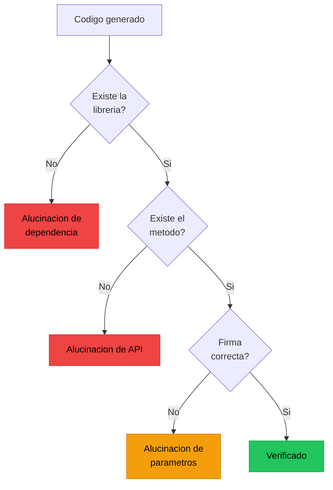
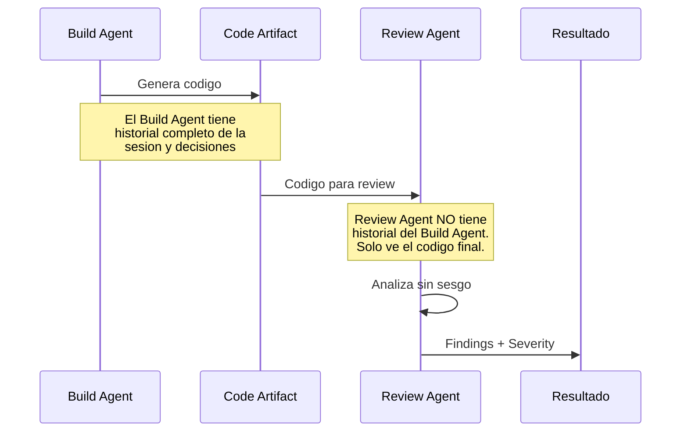

# Code Review de Codigo Generado por IA

> [!abstract] Resumen
> El codigo generado por IA requiere practicas de review ==fundamentalmente diferentes== al codigo humano. Los LLMs producen codigo que parece correcto superficialmente pero puede contener ==APIs alucinadas==, ==vulnerabilidades sutiles== y ==tests que siempre pasan sin verificar nada==. Architect implementa *auto-review* con un agente de revision que opera en ==clean-context== (sin historial de build) para auditar cambios sin sesgo. Este documento cubre que buscar, como automatizar y herramientas disponibles. ^resumen

---

## Por que el review de codigo IA es diferente

El codigo humano y el codigo generado por IA tienen patrones de errores distintos:

| Aspecto | Codigo humano | ==Codigo IA== |
|---------|--------------|--------------|
| Errores de sintaxis | Raros | ==Raros== |
| Errores de logica | Comunes, patrones conocidos | ==Comunes, patrones nuevos== |
| APIs inexistentes | Casi nunca | ==Frecuente (alucinacion)== |
| Consistencia de estilo | Variable | ==Generalmente consistente== |
| Seguridad | Errores conocidos | ==Errores sutiles y novedosos== |
| Tests | Pueden ser incompletos | ==Pueden ser vacios/triviales== |
| Documentacion | Puede faltar | ==Puede ser inventada== |
| Dependencias | Conocidas | ==Pueden no existir== |

> [!danger] La trampa de la confianza
> El codigo de IA ==parece mas profesional== que mucho codigo humano: bien formateado, con docstrings, con nombres descriptivos. Esto genera una falsa sensacion de calidad. El reviewer baja la guardia cuando el codigo "se ve bien", que es exactamente cuando necesita subir la guardia.

---

## Que buscar en el review

### 1. APIs y metodos alucinados



> [!warning] Ejemplos reales de APIs alucinadas
> - `pandas.DataFrame.to_jsonl()` — no existe, es `to_json(lines=True)`
> - `requests.get(url, retry=3)` — `retry` no es un parametro de `get()`
> - `pathlib.Path.read_bytes_async()` — metodo inventado
> - `asyncio.create_task_group()` — es de `anyio`, no de `asyncio`
> - `torch.nn.TransformerEncoder(nhead=8)` — `nhead` es parametro de `TransformerEncoderLayer`, no de `TransformerEncoder`

### 2. Calidad de tests generados

Los tests son donde el codigo IA es mas peligroso. Un test que siempre pasa da falsa confianza.

> [!example]- Ejemplo: Tests problematicos generados por IA
> ```python
> # PROBLEMA 1: Assert True - siempre pasa
> def test_authentication():
>     user = create_user("test@example.com")
>     result = authenticate(user.email, "password123")
>     assert True  # Vigil Rule: empty-assertion
>
> # PROBLEMA 2: Todo mockeado - no prueba nada real
> @patch("auth.db.get_user")
> @patch("auth.hasher.verify")
> @patch("auth.token.generate")
> def test_login(mock_token, mock_verify, mock_db):
>     mock_db.return_value = {"id": 1}
>     mock_verify.return_value = True
>     mock_token.return_value = "fake-token"
>     result = login("user", "pass")
>     assert result == "fake-token"  # Solo prueba que los mocks funcionan
>
> # PROBLEMA 3: No assertions - el test nunca puede fallar
> def test_data_processing():
>     data = load_data("test.csv")
>     processed = process(data)
>     # "Se deberia verificar el resultado"
>     # (el LLM dejo un comentario en lugar de assertion)
>
> # PROBLEMA 4: Hardcoded expected values sin logica
> def test_calculate_total():
>     result = calculate_total([10, 20, 30])
>     assert result == 60  # Correcto, pero no prueba edge cases
>     # Falta: test con lista vacia, negativos, floats, etc.
> ```

[[vigil-overview|Vigil]] detecta los problemas 1, 2 y 3 con sus 26 reglas deterministicas. El problema 4 requiere [[mutation-testing|mutation testing]] o review humano.

### 3. Problemas de seguridad

| Problema | ==Frecuencia en codigo IA== | Ejemplo |
|----------|---------------------------|---------|
| SQL injection | ==Media== | Concatenacion de strings en queries |
| Path traversal | ==Alta== | No validar paths de archivos |
| Secrets hardcoded | ==Media== | API keys en el codigo |
| Deserializacion insegura | ==Alta== | `pickle.loads()` sin validacion |
| Command injection | ==Media== | `os.system()` con input de usuario |
| SSRF | ==Baja== | URLs no validadas en requests |

> [!tip] Checklist de seguridad para codigo IA
> 1. Buscar `os.system()`, `subprocess.call()` con `shell=True`
> 2. Verificar que no hay SQL construido con f-strings
> 3. Comprobar que los paths se validan contra un sandbox
> 4. Buscar secrets hardcoded (regex para API keys, passwords)
> 5. Verificar que las dependencias existen y son de confianza
> 6. Comprobar que no hay `eval()` o `exec()` con input externo

### 4. Patrones de codigo sospechosos

> [!warning] Senales de alerta en codigo generado por IA
> - **Codigo demasiado generico**: Implementa mas de lo solicitado, sugiere que es boilerplate memorizado
> - **Comentarios explicando lo obvio**: `# Incrementa el contador` antes de `counter += 1`
> - **Imports no usados**: El LLM importa librerias "por si acaso"
> - **Variables no usadas**: Define variables que nunca se referencian
> - **TODO sin implementar**: El LLM deja `# TODO: implement this` como placeholder
> - **Manejo de errores generico**: `except Exception: pass` en todas partes

---

## Auto-review de architect

[[architect-overview|Architect]] implementa *auto-review* con un agente de revision que opera en ==clean-context==.

### Concepto: Clean-Context Review



> [!info] Por que clean-context importa
> Si el reviewer ve el historial de como se llego al codigo, tiene sesgo de confirmacion: "el agente tomo estas decisiones razonables, asi que el resultado debe ser correcto". El clean-context review ==elimina este sesgo== al presentar solo el codigo final, como lo veria un reviewer humano que no participo en el desarrollo.

### Que revisa el auto-review

1. **Correccion logica**: El codigo hace lo que se supone que debe hacer?
2. **Consistencia**: El cambio es consistente con el estilo del proyecto?
3. **Completitud**: Faltan edge cases, error handling, tests?
4. **Seguridad**: Hay vectores de ataque introducidos?
5. **Performance**: Hay problemas obvios de rendimiento?
6. **Mantenibilidad**: El codigo es facil de entender y modificar?

> [!example]- Ejemplo: Output de auto-review de architect
> ```markdown
> ## Auto-Review Results
>
> ### Critical Issues (must fix)
> 1. **[SECURITY]** L45: `os.system(f"rm {user_input}")` - Command injection
>    possible. Use `subprocess.run()` with list args instead.
> 2. **[BUG]** L78: `if len(items) > 0` should be `if items` for Pythonic
>    check, but more importantly the `else` branch returns `None` instead
>    of empty list, breaking downstream code.
>
> ### Warnings (should fix)
> 3. **[TEST]** L120-135: Test `test_process_data` has no assertions.
>    It runs the function but never checks the result.
> 4. **[PERF]** L92: Loading entire file into memory with `read()`.
>    For large files, use line-by-line processing.
>
> ### Suggestions (nice to have)
> 5. **[STYLE]** L12: Consider extracting the validation logic into
>    a separate `validate_input()` function.
>
> ### Summary
> - Critical: 2 (blocking)
> - Warnings: 2 (recommended)
> - Suggestions: 1 (optional)
> - Verdict: CHANGES REQUIRED
> ```

---

## Herramientas de code review para IA

### Herramientas especializadas

| Herramienta | Tipo | ==Fortaleza== | Integracion |
|------------|------|-------------|-------------|
| Architect Review Agent | Agente IA | ==Clean-context, sin sesgo== | CLI |
| GitHub Copilot Review | IA integrada | ==Nativo en GitHub== | GitHub PR |
| CodeRabbit | IA SaaS | ==Review detallado, multi-archivo== | GitHub/GitLab |
| Qodo (ex-CodiumAI) | IA + Tests | ==Genera tests para validar cambios== | IDE + CI |
| Amazon CodeGuru | IA + AWS | ==Performance + seguridad== | AWS |

### Combinando herramientas

> [!tip] Stack recomendado de review
> ```
> Nivel 1 (automatico, CI):
>   - Linter (Ruff/ESLint) — errores de estilo y bugs obvios
>   - Type checker (mypy/tsc) — errores de tipos
>   - Security scanner (Bandit/Semgrep) — vulnerabilidades conocidas
>   - Vigil — calidad de tests
>
> Nivel 2 (automatico, PR):
>   - Architect auto-review — analisis clean-context
>   - CodeRabbit — review multi-archivo con contexto
>
> Nivel 3 (humano):
>   - Reviewer humano — juicio, arquitectura, intencion
> ```

---

## Checklist de review para codigo IA

> [!success] Checklist completo

**Correccion**
- [ ] Todas las APIs/metodos referenciados existen y tienen la firma correcta
- [ ] Las dependencias importadas estan en requirements.txt/package.json
- [ ] La logica implementa lo solicitado, no mas ni menos
- [ ] Los tipos de retorno son consistentes en todos los caminos

**Tests**
- [ ] Los tests tienen assertions significativas (no assert True)
- [ ] Los tests prueban comportamiento, no implementacion
- [ ] Hay tests para edge cases (vacio, null, error)
- [ ] El mocking es minimo y justificado

**Seguridad**
- [ ] No hay secrets hardcoded
- [ ] No hay injection (SQL, command, path)
- [ ] Los inputs de usuario se validan/sanitizan
- [ ] Los permisos se verifican donde corresponde

**Calidad**
- [ ] No hay imports no usados
- [ ] No hay variables no usadas
- [ ] No hay TODO/FIXME sin resolver
- [ ] La complejidad es razonable

**Documentacion**
- [ ] Los docstrings son factuales (no inventan parametros)
- [ ] Los comentarios agregan valor (no repiten el codigo)
- [ ] Los nombres son descriptivos y correctos

---

## Metricas de efectividad del review

| Metrica | Descripcion | ==Benchmark== |
|---------|-------------|--------------|
| Defect detection rate | % de defectos encontrados por review | ==> 60%== |
| False positive rate | % de findings que no son problemas reales | ==< 15%== |
| Review time | Tiempo por review (automatico) | ==< 2 min== |
| Critical escape rate | Defectos criticos no detectados | ==< 2%== |
| Developer satisfaction | Utilidad percibida por el equipo | ==> 7/10== |

> [!question] El auto-review puede reemplazar al humano?
> No completamente. El auto-review es excelente para:
> - Detectar bugs de patron conocido
> - Verificar APIs y dependencias
> - Encontrar problemas de seguridad estandar
>
> El humano sigue siendo necesario para:
> - Evaluar decisiones de arquitectura
> - Cuestionar la intencion del cambio
> - Detectar problemas de dominio especifico
> - Juzgar mantenibilidad a largo plazo

---

## Anti-patrones en el review de codigo IA

> [!failure] Antipatrones comunes
> 1. **Rubber stamping**: Aprobar sin leer porque "el IA es bueno"
> 2. **Paranoia excesiva**: Reescribir todo manualmente, anulando el beneficio
> 3. **Review solo superficial**: Verificar formato pero no logica
> 4. **Ignorar tests**: Asumir que si los tests pasan, el codigo esta bien
> 5. **No verificar dependencias**: Asumir que los imports son correctos
> 6. **Confianza en un solo tool**: Usar solo linting como "review"

---

## Relacion con el ecosistema

El code review es la ultima linea de defensa antes de que el codigo generado entre en produccion.

[[intake-overview|Intake]] proporciona la especificacion contra la cual se evalua el codigo generado. Sin una spec clara de intake, el reviewer no puede juzgar si el codigo cumple los requisitos. Los criterios de aceptacion normalizados por intake se convierten en items del checklist de review.

[[architect-overview|Architect]] implementa auto-review como parte integral de su flujo. El agente de review en clean-context inspecciona los cambios sin el historial del build agent, eliminando sesgo de confirmacion. Esto es una implementacion concreta del principio de separacion de concerns en quality assurance.

[[vigil-overview|Vigil]] actua como un reviewer especializado en tests. Mientras el reviewer general evalua el codigo de produccion, vigil evalua especificamente la calidad de los tests con sus 26 reglas. La combinacion de ambos — review general + analisis de test quality — cubre tanto el codigo como la red de seguridad que lo protege.

[[licit-overview|Licit]] puede requerir que todo codigo generado por IA pase por review documentado. Los findings del review, las correcciones realizadas, y la aprobacion final se empaquetan como evidencia de compliance. Esto es especialmente relevante en sectores regulados donde el codigo generado por IA necesita trazabilidad.

---

## Enlaces y referencias

> [!quote]- Bibliografia y recursos
> - Google. "Code Review Developer Guide." Engineering Practices, 2024. [^1]
> - Microsoft. "How to Review AI-Generated Code." DevBlog, 2024. [^2]
> - CodeRabbit. "AI-Powered Code Review." Documentation, 2024. [^3]
> - OWASP. "Code Review Guide." 2023. [^4]
> - Sadowski, C. et al. "Modern Code Review: A Case Study at Google." ICSE 2018. [^5]

[^1]: Guia de Google sobre mejores practicas de code review que sigue siendo relevante para codigo IA.
[^2]: Perspectiva de Microsoft sobre los desafios especificos del review de codigo generado por IA.
[^3]: Documentacion de una herramienta lider en review automatizado con IA.
[^4]: Referencia de OWASP para aspectos de seguridad en code review.
[^5]: Estudio empirico sobre code review a escala que informa las mejores practicas actuales.
