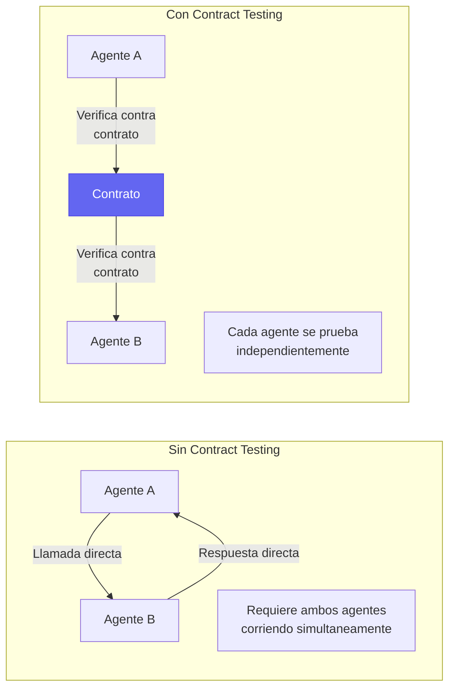
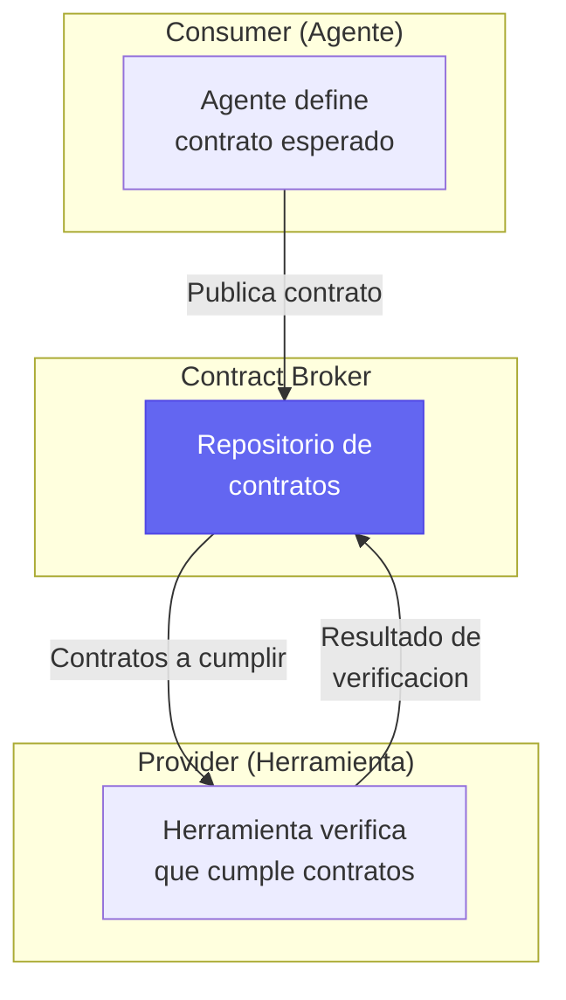
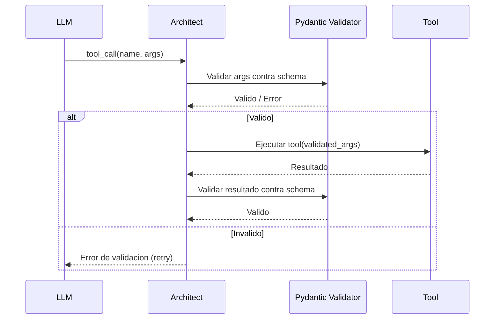
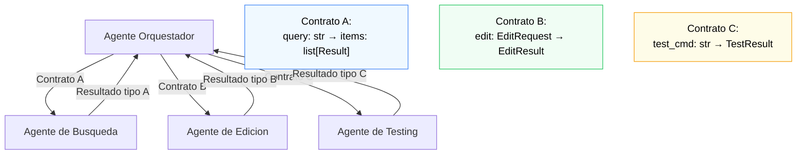

# Contract Testing entre Agentes

> [!abstract] Resumen
> El *contract testing* verifica que las ==interfaces entre componentes cumplen expectativas acordadas==. En sistemas multi-agente, esto significa validar que los inputs y outputs de cada agente y herramienta son compatibles. Los *consumer-driven contracts* permiten que el agente consumidor defina lo que espera del proveedor. La validacion de schemas con *Pydantic* en architect y la especificacion de *MCP* (*Model Context Protocol*) para herramientas son implementaciones concretas de esta idea. ^resumen

---

## Que es contract testing

En testing de integracion clasico, se prueban los componentes juntos. Esto es costoso y fragil. El contract testing ==verifica interfaces en aislamiento==: cada lado del contrato se prueba por separado.



> [!info] La analogia del contrato legal
> Un contrato legal define obligaciones mutuas sin requerir que ambas partes esten presentes. De la misma forma, un contract test define la interfaz sin requerir que ambos componentes se ejecuten simultaneamente. Esto es especialmente valioso cuando los "componentes" son agentes de IA con tiempos de ejecucion largos y costos significativos.

---

## Tipos de contratos en sistemas de IA

### Schema contracts

El contrato mas basico: la estructura de datos intercambiados.

| Contrato | Que define | ==Herramienta de validacion== |
|----------|-----------|------------------------------|
| Input schema | Estructura del request | ==Pydantic / JSON Schema== |
| Output schema | Estructura de la respuesta | ==Pydantic / JSON Schema== |
| Error schema | Estructura de errores | ==JSON Schema== |
| Metadata | Informacion adicional requerida | ==Custom validation== |

> [!example]- Ejemplo: Contract con Pydantic para herramienta de agente
> ```python
> from pydantic import BaseModel, Field, validator
> from typing import Literal
>
> # CONTRATO: Definicion de la herramienta de busqueda
> class SearchRequest(BaseModel):
>     """Contrato de entrada para la herramienta de busqueda."""
>     query: str = Field(
>         ...,
>         min_length=1,
>         max_length=500,
>         description="Termino de busqueda"
>     )
>     max_results: int = Field(
>         default=10,
>         ge=1,
>         le=100,
>         description="Numero maximo de resultados"
>     )
>     filter_type: Literal["code", "docs", "all"] = Field(
>         default="all",
>         description="Tipo de contenido a buscar"
>     )
>
>     @validator("query")
>     def query_not_only_whitespace(cls, v):
>         if not v.strip():
>             raise ValueError("query no puede ser solo whitespace")
>         return v
>
> class SearchResultItem(BaseModel):
>     """Contrato de cada item de resultado."""
>     path: str
>     title: str
>     score: float = Field(ge=0.0, le=1.0)
>     snippet: str = Field(max_length=500)
>
> class SearchResponse(BaseModel):
>     """Contrato de salida de la herramienta de busqueda."""
>     items: list[SearchResultItem]
>     total: int = Field(ge=0)
>     query_time_ms: float = Field(ge=0)
>     status: Literal["success", "partial", "error"]
>
>     @validator("total")
>     def total_gte_items(cls, v, values):
>         if "items" in values and v < len(values["items"]):
>             raise ValueError("total no puede ser menor que len(items)")
>         return v
>
> # TEST DEL CONTRATO (lado productor)
> def test_search_tool_produces_valid_response():
>     tool = SearchTool()
>     request = SearchRequest(query="python decorators")
>     response = tool.execute(request)
>     # Si esto no lanza excepcion, el contrato se cumple
>     SearchResponse.model_validate(response)
>
> # TEST DEL CONTRATO (lado consumidor)
> def test_agent_sends_valid_request():
>     agent = Agent()
>     action = agent.decide_next_action("Busca informacion sobre decoradores")
>     # Verificar que el agente genera un request valido
>     SearchRequest.model_validate(action.args)
> ```

### Behavioral contracts

Mas alla de la estructura, definen ==comportamientos esperados==.

> [!tip] Behavioral contracts cubren lo que schemas no cubren
> Un schema valida que `score` es un float entre 0 y 1. Un behavioral contract valida que los resultados estan ordenados por score descendente, o que una query especifica siempre retorna al menos un resultado.

```python
class SearchBehavioralContract:
    """Contrato de comportamiento para la herramienta de busqueda."""

    def verify_ordering(self, response: SearchResponse) -> bool:
        """Los resultados deben estar ordenados por score descendente."""
        scores = [item.score for item in response.items]
        return scores == sorted(scores, reverse=True)

    def verify_relevance(self, request: SearchRequest, response: SearchResponse) -> bool:
        """Al menos un resultado debe contener el termino de busqueda."""
        query_lower = request.query.lower()
        return any(
            query_lower in item.title.lower() or query_lower in item.snippet.lower()
            for item in response.items
        )

    def verify_consistency(self, response: SearchResponse) -> bool:
        """El total debe ser >= len(items)."""
        return response.total >= len(response.items)
```

---

## Consumer-Driven Contracts (CDC)

En *consumer-driven contracts*, el ==consumidor define lo que espera del proveedor==. Esto es natural para agentes: el agente define que formato necesita de sus herramientas.



### Pact para agentes

*Pact* es el framework de referencia para CDC. Se adapta a agentes:

> [!example]- Ejemplo: Consumer-driven contract con Pact
> ```python
> import atexit
> import unittest
> from pact import Consumer, Provider
>
> # El agente (consumer) define lo que espera
> pact = Consumer("CodingAgent").has_pact_with(
>     Provider("SearchTool"),
>     pact_dir="./pacts"
> )
> pact.start_service()
> atexit.register(pact.stop_service)
>
> class TestAgentSearchContract(unittest.TestCase):
>     """Tests que definen el contrato desde el lado del agente."""
>
>     def test_busqueda_retorna_resultados(self):
>         """El agente espera que una busqueda con query valida
>         retorne al menos un resultado."""
>         expected = {
>             "items": [
>                 {
>                     "path": "src/auth.py",
>                     "title": "Authentication module",
>                     "score": 0.95,
>                     "snippet": "def authenticate(user, password)..."
>                 }
>             ],
>             "total": 1,
>             "query_time_ms": 42.0,
>             "status": "success"
>         }
>
>         (pact
>             .given("Existe codigo de autenticacion en el proyecto")
>             .upon_receiving("una busqueda de autenticacion")
>             .with_request("POST", "/search", body={
>                 "query": "authentication",
>                 "max_results": 10,
>                 "filter_type": "code"
>             })
>             .will_respond_with(200, body=expected))
>
>         with pact:
>             result = search_client.search("authentication")
>             self.assertGreater(len(result["items"]), 0)
>             self.assertEqual(result["status"], "success")
>
>     def test_busqueda_vacia_retorna_error(self):
>         """El agente espera un error claro para queries vacias."""
>         (pact
>             .upon_receiving("una busqueda con query vacia")
>             .with_request("POST", "/search", body={
>                 "query": "",
>             })
>             .will_respond_with(400, body={
>                 "error": "query no puede estar vacia",
>                 "status": "error"
>             }))
>
>         with pact:
>             with self.assertRaises(ValidationError):
>                 search_client.search("")
> ```

---

## Contract testing para MCP

El *Model Context Protocol* (MCP) define una interfaz estandar para herramientas de LLM. El contract testing para MCP verifica que las implementaciones cumplen la especificacion.

### Contratos MCP

| Aspecto MCP | ==Contrato== | Verificacion |
|-------------|------------|-------------|
| Tool listing | Cada tool tiene name, description, inputSchema | ==Schema validation== |
| Tool execution | Request cumple inputSchema, response es valida | ==Runtime validation== |
| Error handling | Errores siguen formato estandar | ==Response validation== |
| Resource listing | Resources tienen URI, name, mimeType | ==Schema validation== |
| Prompt templates | Templates tienen name, arguments | ==Schema validation== |

```python
class MCPContractVerifier:
    """Verifica que un servidor MCP cumple el contrato."""

    async def verify_tool_listing(self, server) -> list[str]:
        """Verifica que el listado de tools es valido."""
        errors = []
        tools = await server.list_tools()

        for tool in tools:
            if not tool.get("name"):
                errors.append(f"Tool sin nombre: {tool}")
            if not tool.get("description"):
                errors.append(f"Tool '{tool.get('name')}' sin descripcion")
            if not tool.get("inputSchema"):
                errors.append(f"Tool '{tool.get('name')}' sin inputSchema")
            else:
                # Verificar que inputSchema es JSON Schema valido
                try:
                    jsonschema.Draft7Validator.check_schema(
                        tool["inputSchema"]
                    )
                except jsonschema.SchemaError as e:
                    errors.append(
                        f"Tool '{tool['name']}' inputSchema invalido: {e}"
                    )
        return errors

    async def verify_tool_execution(self, server, tool_name, args) -> list[str]:
        """Verifica que la ejecucion de un tool cumple el contrato."""
        errors = []
        try:
            result = await server.call_tool(tool_name, args)
            if not isinstance(result, dict):
                errors.append(f"Resultado no es dict: {type(result)}")
            if "content" not in result:
                errors.append("Resultado no tiene campo 'content'")
        except Exception as e:
            # Las excepciones deben seguir formato MCP
            if not hasattr(e, "code") or not hasattr(e, "message"):
                errors.append(f"Excepcion no sigue formato MCP: {e}")
        return errors
```

> [!warning] MCP es un protocolo en evolucion
> La especificacion MCP esta cambiando rapidamente. Los contract tests para MCP deben actualizarse con cada nueva version de la especificacion. Mantener los tests alineados con la version de MCP que se esta usando.

---

## Validacion de schemas en architect

[[architect-overview|Architect]] usa *Pydantic* para validar los argumentos de herramientas, implementando contract testing de forma nativa.



> [!success] La validacion como contrato en runtime
> Cuando architect valida los argumentos con Pydantic antes de ejecutar una herramienta, esta haciendo contract testing en tiempo real. Si el LLM genera argumentos invalidos, la validacion falla y el LLM recibe feedback para corregir, en lugar de que la herramienta falle con un error crptico.

---

## Patrones de contract testing para multi-agente

### Patron: Agente Orquestador + Agentes Especializados



> [!question] Como manejar contratos cuando los agentes evolucionan?
> 1. **Versionado de contratos**: Cada contrato tiene una version
> 2. **Backward compatibility**: Nuevas versiones deben ser compatibles con consumidores antiguos
> 3. **Contract broker**: Repositorio central de contratos con historial
> 4. **CI verification**: Verificar contratos en cada PR
> 5. **Deprecation policy**: Anunciar cambios con antelacion

### Patron: Verification en cadena

```python
class AgentChainContractVerifier:
    """Verifica que la cadena completa de agentes
    mantiene la compatibilidad de contratos."""

    def verify_chain(self, chain: list[AgentSpec]) -> list[str]:
        errors = []
        for i in range(len(chain) - 1):
            producer = chain[i]
            consumer = chain[i + 1]

            # Verificar que el output del productor es compatible
            # con el input del consumidor
            if not self.schemas_compatible(
                producer.output_schema,
                consumer.input_schema
            ):
                errors.append(
                    f"Incompatibilidad: output de '{producer.name}' "
                    f"no es compatible con input de '{consumer.name}'"
                )
        return errors

    def schemas_compatible(self, output_schema, input_schema) -> bool:
        """Un output es compatible si tiene todos los campos
        que el input requiere."""
        required_fields = input_schema.get("required", [])
        output_fields = output_schema.get("properties", {})
        return all(f in output_fields for f in required_fields)
```

---

## Metricas de contract testing

| Metrica | Descripcion | ==Objetivo== |
|---------|-------------|-------------|
| Contract coverage | % de interfaces con contratos | ==> 90%== |
| Contract violations | Violaciones en produccion/dia | ==0== |
| Schema validation rate | % de requests que pasan validacion | ==> 99.5%== |
| Contract drift | Contratos desalineados con implementacion | ==0== |
| Breaking changes detected | Cambios incompatibles en CI | ==100% detectados== |

---

## Relacion con el ecosistema

El contract testing asegura que los componentes del ecosistema pueden interoperar de forma confiable.

[[intake-overview|Intake]] define un contrato de output: la especificacion normalizada tiene un schema esperado. Los agentes downstream (como architect) son consumidores de este contrato. Si intake cambia su formato de output, el contract test del consumidor fallara antes de que el problema llegue a produccion.

[[architect-overview|Architect]] implementa contract testing nativamente a traves de Pydantic. Cada herramienta tiene un schema de input y output validado en runtime. Esto es contract testing continuo — no solo en CI, sino en cada ejecucion. El contrato entre el LLM y las herramientas esta formalizado en los schemas de Pydantic.

[[vigil-overview|Vigil]] define un contrato para su analisis: recibe archivos de test y produce un reporte con findings de sus 26 reglas. Los consumidores de vigil dependen de que este reporte tenga una estructura especifica. Contract testing verificaria que cambios en vigil no rompen la integracion con herramientas downstream.

[[licit-overview|Licit]] tiene contratos estrictos para *evidence bundles*: cada tipo de evidencia tiene un schema esperado. Si un componente genera evidencia que no cumple el schema de licit, el bundle es rechazado. Contract testing previene este problema verificando compatibilidad antes del deployment.

---

## Enlaces y referencias

> [!quote]- Bibliografia y recursos
> - Pact Foundation. "Consumer-Driven Contract Testing." pact.io, 2024. [^1]
> - Pydantic Documentation. "Data Validation Using Python Type Annotations." 2024. [^2]
> - Anthropic. "Model Context Protocol Specification." 2024. [^3]
> - Fowler, M. "Consumer-Driven Contracts: A Service Evolution Pattern." martinfowler.com, 2006. [^4]
> - Clemson, T. "Testing Strategies in a Microservice Architecture." 2014. [^5]

[^1]: Framework de referencia para consumer-driven contracts con soporte multi-lenguaje.
[^2]: La libreria que architect usa para validacion de schemas como forma de contract testing.
[^3]: Especificacion del protocolo MCP que define contratos para herramientas de LLM.
[^4]: Articulo seminal de Martin Fowler sobre el patron de consumer-driven contracts.
[^5]: Estrategias de testing para microservicios aplicables a sistemas multi-agente.
