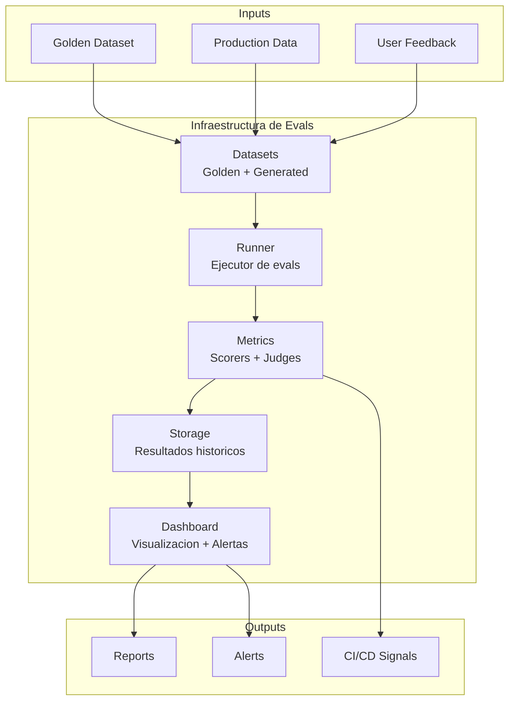
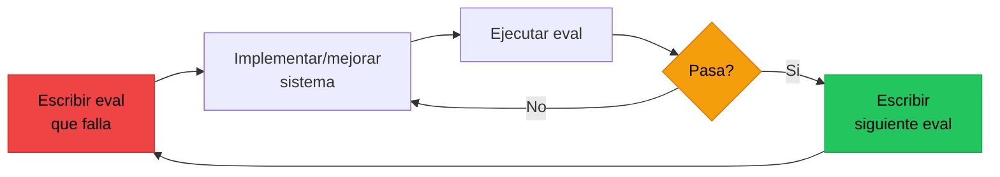
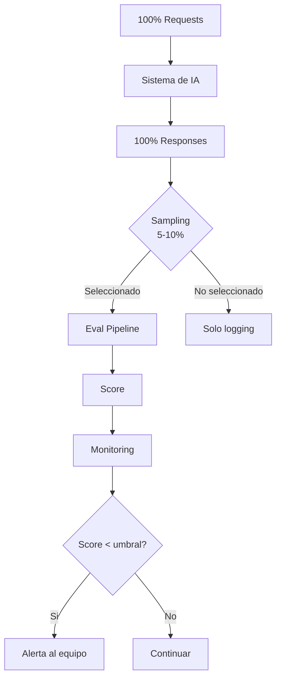
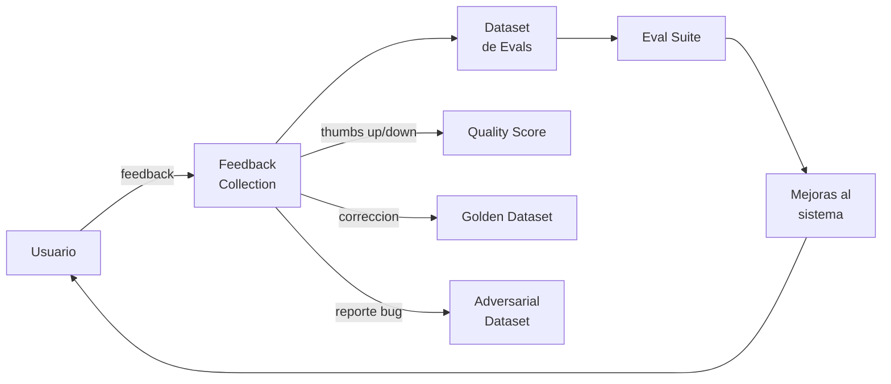
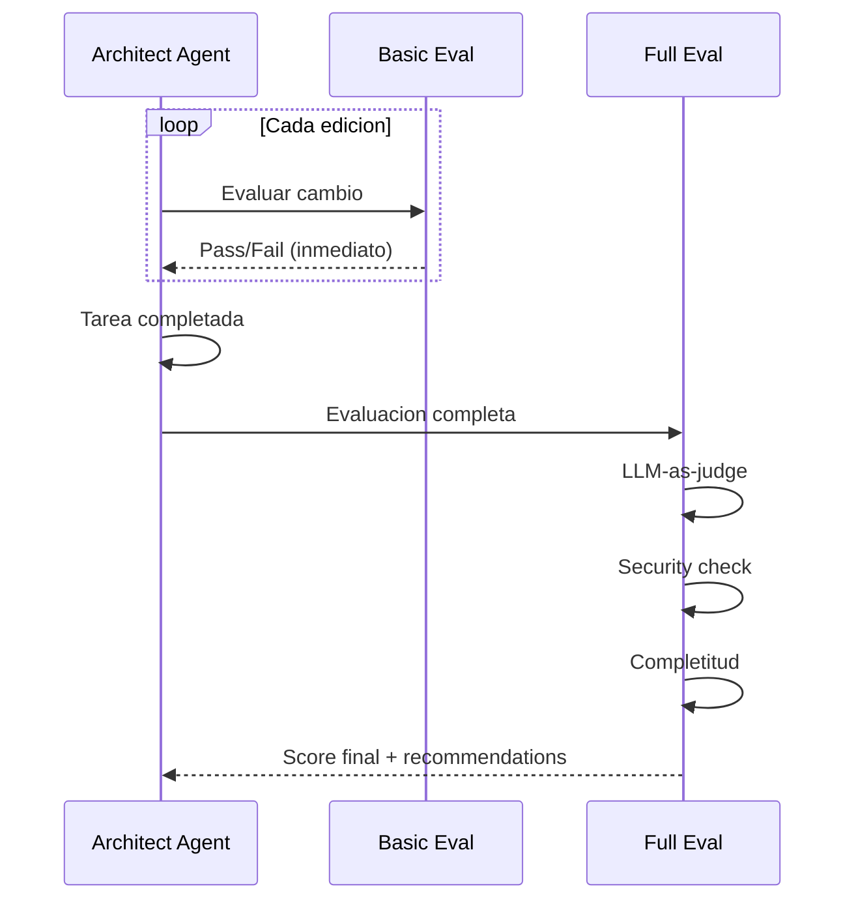
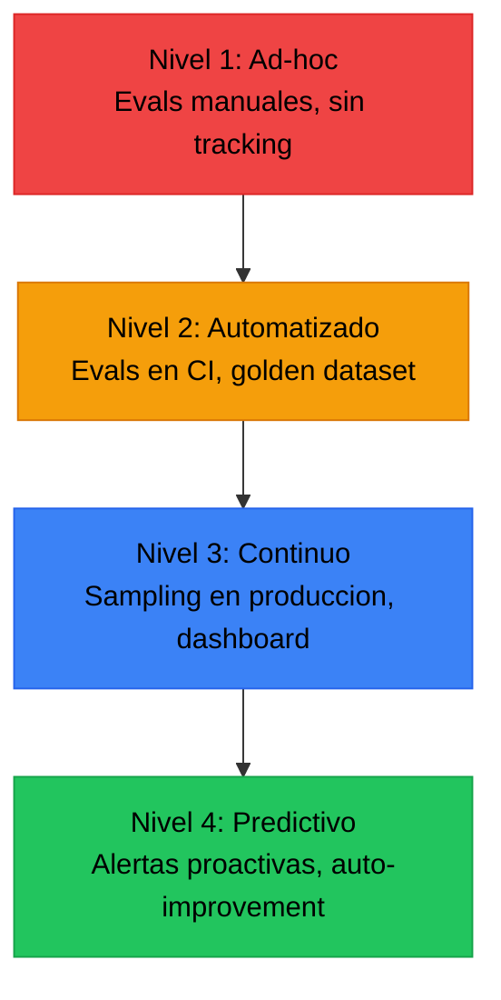

# Evaluaciones como Producto

> [!abstract] Resumen
> Las evaluaciones (*evals*) no son solo una fase de testing — son ==un producto interno que requiere su propia infraestructura==, mantenimiento y evolucion. El *eval-driven development* (EDD) es el equivalente de TDD para IA: ==escribir evals primero, luego mejorar el sistema hasta que pasen==. La evaluacion continua en produccion con sampling y feedback loops transforma las evals de un evento puntual a un proceso constante. El *self-evaluator* de architect (modos basico/completo) es una implementacion concreta de evals como parte integral del agente. ^resumen

---

## La filosofia de evals como producto

> [!quote] "Your evals are the product. The model is just a component."
> — Perspectiva emergente en la comunidad de AI engineering

Las evaluaciones merecen el mismo rigor que el codigo de produccion:

| Aspecto | Codigo de produccion | ==Evaluaciones== |
|---------|---------------------|-----------------|
| Versionado | Git | ==Git== |
| CI/CD | Tests automaticos | ==Evals automaticas== |
| Monitoring | Metricas, alertas | ==Dashboard de scores== |
| Documentation | README, docstrings | ==Metodologia, criterios== |
| Review | Code review | ==Eval review== |
| Ownership | Equipo de producto | ==Equipo de calidad IA== |

---

## Infraestructura de evaluaciones

### Componentes principales



### Datasets

El combustible de las evaluaciones. Sin datos de calidad, las evals no sirven.

> [!tip] Fuentes de datos para evals
> 1. **Golden datasets curados**: Casos manualmente verificados (ver [[regression-testing-ia]])
> 2. **Datos de produccion**: Muestreo de interacciones reales (con anonimizacion)
> 3. **User feedback**: Calificaciones explicitas de usuarios
> 4. **Synthetic data**: Generados programaticamente para edge cases
> 5. **Adversarial data**: Inputs disenados para romper el sistema (ver [[testing-seguridad-agentes]])

### Runner

El ejecutor de evaluaciones — orquesta la ejecucion de tests contra datasets.

> [!example]- Ejemplo: Eval runner modular
> ```python
> from dataclasses import dataclass, field
> from typing import Protocol
> from datetime import datetime
>
> class Scorer(Protocol):
>     """Protocolo para scorers de evaluacion."""
>     def score(self, input: str, output: str, expected: str | None) -> float: ...
>
> @dataclass
> class EvalConfig:
>     """Configuracion de un eval suite."""
>     name: str
>     dataset_path: str
>     scorers: list[Scorer]
>     runs_per_case: int = 3
>     timeout_per_case: int = 120
>     pass_threshold: float = 0.8
>     sampling_rate: float = 1.0  # 1.0 = evaluar todo
>
> @dataclass
> class EvalResult:
>     """Resultado de una ejecucion de eval."""
>     config_name: str
>     timestamp: datetime
>     total_cases: int
>     passed: int
>     failed: int
>     scores: dict[str, float]
>     pass_rate: float = field(init=False)
>     duration_seconds: float = 0.0
>
>     def __post_init__(self):
>         self.pass_rate = self.passed / self.total_cases if self.total_cases > 0 else 0
>
> class EvalRunner:
>     """Ejecutor de evaluaciones."""
>
>     def __init__(self, system_under_test: callable):
>         self.sut = system_under_test
>
>     async def run(self, config: EvalConfig) -> EvalResult:
>         """Ejecuta un eval suite completo."""
>         dataset = self.load_dataset(config.dataset_path)
>
>         if config.sampling_rate < 1.0:
>             dataset = self.sample(dataset, config.sampling_rate)
>
>         passed = 0
>         failed = 0
>         all_scores = {s.__class__.__name__: [] for s in config.scorers}
>
>         for case in dataset:
>             case_scores = await self.evaluate_case(
>                 case, config.scorers, config.runs_per_case
>             )
>             avg_score = sum(case_scores.values()) / len(case_scores)
>
>             if avg_score >= config.pass_threshold:
>                 passed += 1
>             else:
>                 failed += 1
>
>             for name, score in case_scores.items():
>                 all_scores[name].append(score)
>
>         return EvalResult(
>             config_name=config.name,
>             timestamp=datetime.now(),
>             total_cases=len(dataset),
>             passed=passed,
>             failed=failed,
>             scores={k: sum(v)/len(v) for k, v in all_scores.items()},
>         )
> ```

### Metricas y scorers

| Tipo de scorer | Descripcion | ==Costo== | Determinismo |
|---------------|-------------|-----------|-------------|
| Rule-based | Regex, contains, format | ==Gratis== | Deterministico |
| Embedding-based | Similitud semantica | ==Bajo (embedding)== | Alto |
| LLM-judge | LLM evalua calidad | ==Alto (API call)== | No deterministico |
| Execution-based | Ejecutar y verificar output | ==Variable== | Deterministico |
| Human-in-the-loop | Evaluacion humana | ==Muy alto (tiempo)== | Subjetivo |

### Dashboard

> [!info] Un dashboard de evals debe mostrar
> - Score actual vs historico (tendencia)
> - Breakdown por categoria de tarea
> - Regression rate vs version anterior
> - Costo por ejecucion
> - Flaky rate (ver [[flaky-tests-ia]])
> - Distribucion de scores (no solo promedio)

---

## Eval-Driven Development (EDD)

El *eval-driven development* es el equivalente de TDD para sistemas de IA:



### Comparacion TDD vs EDD

| Aspecto | TDD | ==EDD== |
|---------|-----|---------|
| Unidad de test | Funcion/clase | ==Tarea/comportamiento== |
| Determinismo | Deterministico | ==Probabilistico== |
| Criterio de paso | assert exacto | ==Score >= umbral== |
| Frecuencia | Cada commit | ==Cada cambio de prompt/modelo== |
| Costo | Gratis | ==Tokens de API== |
| Velocidad | Milisegundos | ==Segundos a minutos== |

> [!tip] Practicas de EDD
> 1. **Antes de cambiar un prompt**: Escribir una eval que capture el comportamiento deseado
> 2. **Antes de cambiar de modelo**: Ejecutar eval suite completo como baseline
> 3. **Antes de deploy**: Verificar que no hay regresion vs baseline
> 4. **Periodicamente**: Ejecutar eval suite completo para detectar drift

> [!warning] EDD no reemplaza TDD
> EDD es para la ==capa de IA== (prompts, modelos, agentes). TDD sigue siendo para la ==capa de software== (funciones, clases, APIs). Ambos coexisten.

---

## Evaluacion continua en produccion

### Sampling en produccion

No se puede evaluar el 100% de las interacciones en produccion (demasiado costoso), pero se puede ==muestrear un porcentaje== para monitoring continuo.



> [!danger] Sampling bias
> El muestreo aleatorio puede no capturar edge cases. Complementar con:
> - Muestreo estratificado por tipo de tarea
> - Muestreo por errores (evaluar mas cuando hay errores)
> - Muestreo por duracion (evaluar interacciones largas)
> - Muestreo por usuario (diversidad de patrones de uso)

### Feedback loops



> [!success] Tipos de feedback util
> - **Thumbs up/down**: Rapido, masivo, ruidoso
> - **Correcciones textuales**: El usuario corrige la respuesta — oro puro para evals
> - **Reportes de bugs**: Inputs que causan problemas — adversarial dataset
> - **Feature requests**: Lo que el sistema deberia hacer — nuevos eval cases
> - **Metricas de uso**: Tiempo en pagina, re-queries, abandono — proxies de calidad

---

## El self-evaluator de architect

[[architect-overview|Architect]] implementa evaluacion continua a traves de su *self-evaluator* con dos modos.

### Modo basico

Verificaciones rapidas y deterministicas:

| Check | ==Que verifica== | Costo |
|-------|-----------------|-------|
| Compilacion | El codigo compila sin errores | ==Gratis== |
| Tests pasan | pytest/jest/etc retorna exit 0 | ==Gratis== |
| Lint limpio | No hay errores de linting | ==Gratis== |
| Types correctos | mypy/tsc pasan | ==Gratis== |

### Modo completo (full)

Evaluaciones mas profundas que incluyen LLM-as-judge:

| Check | ==Que verifica== | Costo |
|-------|-----------------|-------|
| Correccion logica | El cambio resuelve lo solicitado | ==1 LLM call== |
| Code quality | El codigo sigue mejores practicas | ==1 LLM call== |
| Test quality | Los tests son significativos | ==1 LLM call + vigil== |
| Security review | No hay vulnerabilidades introducidas | ==1 LLM call== |
| Completitud | No falta nada de lo solicitado | ==1 LLM call== |

> [!info] Cuando usar cada modo
> - **Basico**: Despues de cada edicion (post-edit hook). Rapido, gratis, deterministico.
> - **Full**: Al completar una tarea. Mas costoso pero mas exhaustivo. Incluye evaluacion semantica.



---

## Construir infraestructura de evals

### Niveles de madurez



> [!question] En que nivel estas?
> - **Nivel 1**: "Probamos manualmente y parece que funciona"
> - **Nivel 2**: "Tenemos evals automatizadas en CI que bloquean PRs"
> - **Nivel 3**: "Monitoreamos calidad en produccion continuamente"
> - **Nivel 4**: "El sistema detecta degradacion y propone correcciones automaticamente"
>
> La mayoria de equipos esta en nivel 1-2. El objetivo es nivel 3 como minimo para produccion.

### Plan de implementacion

> [!tip] Roadmap para construir infraestructura de evals
> **Semana 1-2**: Golden dataset con 50+ casos curados
> **Semana 3-4**: Eval runner automatico con 3+ scorers
> **Mes 2**: Integracion CI/CD, bloqueo de PRs con regresion
> **Mes 3**: Sampling en produccion, dashboard basico
> **Mes 4+**: Feedback loops, alertas, mejora continua

---

## Costo de evaluaciones

| Tipo de eval | ==Costo por caso== | Frecuencia | Costo mensual (500 casos) |
|-------------|-------------------|------------|--------------------------|
| Rule-based | ==~$0== | Cada commit | ==~$0== |
| Embedding | ==$0.0001== | Cada commit | ==~$5== |
| LLM-judge (GPT-4) | ==$0.01-0.10== | Cada PR | ==~$250== |
| LLM-judge (Claude) | ==$0.01-0.15== | Cada PR | ==~$300== |
| LLM-judge (local) | ==~$0 (compute)== | Flexible | ==~$50 (GPU)== |
| Human eval | ==$1-5== | Semanal | ==~$500+== |

> [!warning] El costo escala con la ambicion
> Pasar de 50 a 500 eval cases multiplica el costo por 10. Usar LLM-judge en lugar de rule-based multiplica por otro 10. Planifica el presupuesto de evals como parte del presupuesto de infraestructura.

---

## Relacion con el ecosistema

Las evaluaciones como producto conectan todos los componentes del ecosistema en un ciclo de mejora continua.

[[intake-overview|Intake]] alimenta las evaluaciones con criterios de aceptacion desde la especificacion. Cuando intake normaliza un requisito, los criterios de exito se convierten en eval cases. Si intake produce buenas especificaciones, las evals son mas precisas. Si las evals detectan problemas, eso informa mejoras en como intake procesa especificaciones.

[[architect-overview|Architect]] implementa evals como parte integral de su operacion con el self-evaluator (basic/full). No es un paso separado — es un componente del agente que evalua continuamente su propio output. Los 717+ tests del codebase de architect son tambien un producto: un eval suite curado que verifica la calidad del propio agente.

[[vigil-overview|Vigil]] es un scorer dentro de la infraestructura de evals. Sus 26 reglas deterministicas pueden ejecutarse como parte del eval runner sin costo de LLM. Vigil aporta la capa de analisis estatico que complementa los scorers dinamicos basados en ejecucion y los basados en LLM-as-judge.

[[licit-overview|Licit]] es tanto consumidor como habilitador de evals como producto. Consume resultados de evaluaciones como evidencia de compliance. Y habilita evals al definir que metricas y umbrales son necesarios para cumplir regulaciones especificas. Los *evidence bundles* incluyen resultados de evals como prueba de calidad.

---

## Enlaces y referencias

> [!quote]- Bibliografia y recursos
> - Hamel Husain. "Your AI Product Needs Evals." Blog, 2024. [^1]
> - Braintrust Team. "Evals are All You Need." 2024. [^2]
> - Shreya Rajpal. "Building Evaluation Infrastructure." 2024. [^3]
> - Eugene Yan. "Evaluation Strategies for LLM Applications." eugeneyan.com, 2024. [^4]
> - Jason Wei. "Evaluating LLMs is Hard." Google Research Blog, 2024. [^5]

[^1]: El articulo que popularizo la idea de tratar evals como un producto interno.
[^2]: Perspectiva de Braintrust sobre la centralidad de las evaluaciones en desarrollo de IA.
[^3]: Guia practica para construir infraestructura de evaluaciones desde cero.
[^4]: Analysis comprensivo de estrategias de evaluacion con recomendaciones practicas.
[^5]: Perspectiva de Google Research sobre los desafios fundamentales de evaluar LLMs.
