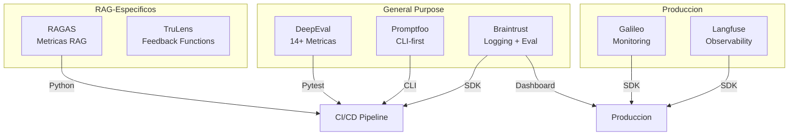
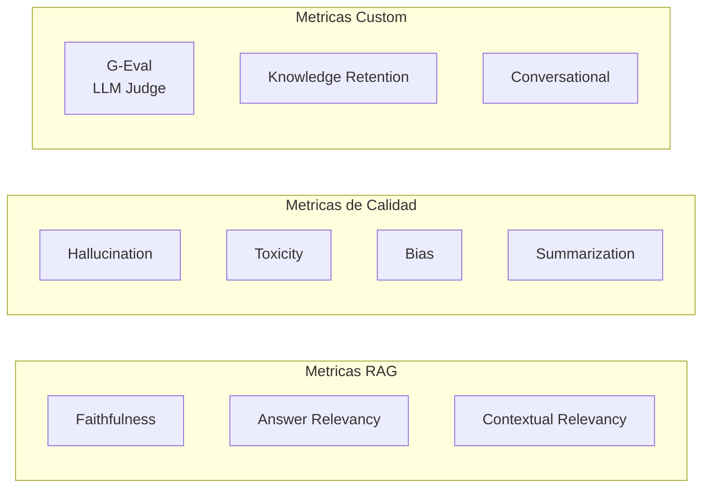
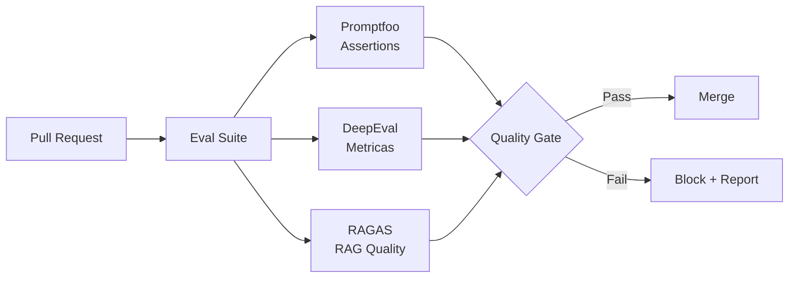

# Frameworks de Evaluacion para IA

> [!abstract] Resumen
> Comparativa exhaustiva de los principales frameworks de evaluacion para sistemas de IA. Desde ==RAGAS para RAG== hasta ==Promptfoo para CI/CD==, cada framework tiene fortalezas especificas. La eleccion depende del caso de uso: produccion vs desarrollo, RAG vs agentes, equipo grande vs individual. El ecosistema evoluciona rapidamente — este documento refleja el estado a junio 2025. ^resumen

---

## Panorama de frameworks



> [!info] Nota sobre volatilidad
> Este documento tiene status `volatile` porque el ecosistema de evaluacion cambia rapidamente. Nuevos frameworks aparecen cada mes y los existentes agregan funcionalidades. Verifica las versiones actuales antes de tomar decisiones.

---

## RAGAS (RAG Assessment)

Framework especializado en evaluar sistemas *RAG* (*Retrieval-Augmented Generation*).

### Metricas principales

| Metrica | Que mide | ==Rango== |
|---------|----------|-----------|
| Faithfulness | Respuesta fundamentada en el contexto | ==0-1== |
| Answer Relevancy | Respuesta relevante a la pregunta | ==0-1== |
| Context Precision | Contexto recuperado es preciso | ==0-1== |
| Context Recall | Contexto cubre la respuesta esperada | ==0-1== |
| Answer Correctness | Correccion factual vs ground truth | ==0-1== |

> [!example]- Ejemplo: Evaluacion RAG con RAGAS
> ```python
> from ragas import evaluate
> from ragas.metrics import (
>     faithfulness,
>     answer_relevancy,
>     context_precision,
>     context_recall,
> )
> from datasets import Dataset
>
> # Dataset de evaluacion
> eval_data = {
>     "question": [
>         "Como implemento autenticacion JWT?",
>         "Que es el patron Repository?",
>     ],
>     "answer": [
>         "Para implementar JWT, necesitas instalar PyJWT...",
>         "El patron Repository abstrae el acceso a datos...",
>     ],
>     "contexts": [
>         ["JWT es un estandar para tokens...", "PyJWT es la libreria..."],
>         ["Repository Pattern separa logica...", "Se usa con ORM..."],
>     ],
>     "ground_truth": [
>         "JWT se implementa con PyJWT usando encode/decode...",
>         "Repository abstrae la capa de persistencia...",
>     ],
> }
>
> dataset = Dataset.from_dict(eval_data)
> result = evaluate(
>     dataset,
>     metrics=[faithfulness, answer_relevancy, context_precision, context_recall],
> )
>
> print(result)
> # {'faithfulness': 0.87, 'answer_relevancy': 0.91, ...}
> ```

> [!tip] Cuando usar RAGAS
> Ideal si tu sistema principal es RAG. Las metricas estan disenadas especificamente para evaluar la cadena retrieval -> generation. Para agentes generales, considera DeepEval o Promptfoo.

---

## DeepEval

Framework de proposito general con ==14+ metricas== y integracion nativa con *Pytest*.

### Metricas disponibles



> [!example]- Ejemplo: Tests con DeepEval y Pytest
> ```python
> import pytest
> from deepeval import assert_test
> from deepeval.test_case import LLMTestCase
> from deepeval.metrics import (
>     AnswerRelevancyMetric,
>     FaithfulnessMetric,
>     HallucinationMetric,
>     GEval,
> )
>
> def test_respuesta_relevante():
>     test_case = LLMTestCase(
>         input="Explica dependency injection en Python",
>         actual_output="Dependency injection es un patron donde...",
>         retrieval_context=[
>             "DI es un patron de diseno que permite...",
>             "En Python, DI se puede implementar con..."
>         ]
>     )
>
>     relevancy = AnswerRelevancyMetric(threshold=0.7)
>     faithfulness = FaithfulnessMetric(threshold=0.8)
>
>     assert_test(test_case, [relevancy, faithfulness])
>
> def test_sin_alucinaciones():
>     test_case = LLMTestCase(
>         input="Que version de Python soporta match/case?",
>         actual_output="Python 3.10 introdujo match/case...",
>         context=["Python 3.10 PEP 634 structural pattern matching"]
>     )
>
>     hallucination = HallucinationMetric(threshold=0.5)
>     assert_test(test_case, [hallucination])
>
> def test_calidad_con_geval():
>     """G-Eval permite metricas custom con LLM-as-Judge."""
>     correctness = GEval(
>         name="Correctness",
>         criteria="Evalua si la respuesta es factualmente correcta",
>         evaluation_params=[
>             "input", "actual_output", "expected_output"
>         ],
>         threshold=0.7,
>     )
>
>     test_case = LLMTestCase(
>         input="Cual es la complejidad de dict lookup en Python?",
>         actual_output="O(1) en promedio, O(n) en el peor caso",
>         expected_output="O(1) amortizado para lookup en diccionarios"
>     )
>
>     assert_test(test_case, [correctness])
> ```

> [!success] Ventajas de DeepEval
> - Integracion directa con Pytest (se ejecuta con `pytest`)
> - 14+ metricas listas para usar
> - G-Eval para metricas custom sin codigo
> - Dashboard gratuito en Confident AI
> - Compatible con cualquier LLM (OpenAI, Anthropic, local)

---

## TruLens

Framework enfocado en *feedback functions* y tracking de aplicaciones.

### Concepto central: Feedback Functions

Las *feedback functions* son evaluadores que se ejecutan sobre inputs/outputs de la aplicacion:

| Feedback Function | Que evalua | ==Uso principal== |
|-------------------|-----------|-------------------|
| Groundedness | Respuesta fundamentada en contexto | ==RAG== |
| Relevance | Input relevante al contexto recuperado | ==RAG== |
| Coherence | Consistencia interna | ==General== |
| Harmfulness | Contenido danino | ==Seguridad== |
| Custom | Lo que definas | ==Especifico== |

> [!warning] Complejidad de setup
> TruLens requiere mas configuracion inicial que DeepEval o Promptfoo. Necesita una base de datos (SQLite por defecto) para almacenar trazas y resultados. Puede ser overhead innecesario para proyectos pequenos.

---

## Promptfoo

==Framework CLI-first== disenado para integracion en CI/CD y *red teaming*.

### Configuracion por YAML

```yaml
# promptfooconfig.yaml
prompts:
  - "Eres un asistente tecnico. Pregunta: {{question}}"
  - "Responde de forma concisa: {{question}}"

providers:
  - openai:gpt-4
  - anthropic:claude-3-sonnet

tests:
  - vars:
      question: "Que es un mutex?"
    assert:
      - type: contains
        value: "exclusion mutua"
      - type: llm-rubric
        value: "La respuesta explica correctamente que es un mutex"
      - type: cost
        threshold: 0.01
  - vars:
      question: "Diferencia entre proceso e hilo?"
    assert:
      - type: similar
        value: "Los procesos tienen memoria separada, los hilos comparten memoria"
        threshold: 0.7
```

> [!tip] Promptfoo para CI/CD
> La integracion con CI/CD es donde Promptfoo brilla. Se puede ejecutar en GitHub Actions:
> ```yaml
> # .github/workflows/eval.yml
> - name: Run LLM evals
>   run: npx promptfoo eval --ci
> ```
> El flag `--ci` produce salida parseable y retorna exit code apropiado.

### Red Teaming con Promptfoo

Promptfoo incluye capacidades de *red teaming* para [[testing-seguridad-agentes|testing de seguridad]]:

```yaml
redteam:
  plugins:
    - harmful
    - jailbreak
    - prompt-injection
  strategies:
    - base64
    - leetspeak
    - rot13
```

---

## Galileo

Plataforma de ==monitoring en produccion== con deteccion de alucinaciones.

> [!info] Galileo es SaaS
> A diferencia de los frameworks open-source anteriores, Galileo es una plataforma comercial con modelo de pricing por uso. Ofrece un free tier limitado.

Funcionalidades principales:
- *Hallucination Detection*: Deteccion en tiempo real de alucinaciones
- *Prompt Inspector*: Analisis de la efectividad de prompts
- *Data Quality*: Evaluacion de la calidad de datos de entrenamiento/RAG
- *Guardrails*: Reglas de proteccion en tiempo real

---

## Braintrust

Combina ==logging + evaluacion== en una plataforma unificada.

```python
from braintrust import Eval

Eval(
    "Mi-App-QA",
    data=[
        {"input": "Que es TDD?", "expected": "Test-Driven Development..."},
        {"input": "Que es CI?", "expected": "Continuous Integration..."},
    ],
    task=lambda input: llm.complete(input),
    scores=[
        lambda output, expected: {
            "name": "similarity",
            "score": semantic_similarity(output, expected)
        }
    ],
)
```

> [!success] Puntos fuertes de Braintrust
> - SDK simple y elegante
> - Dashboard con tracking historico de metricas
> - Comparacion side-by-side de ejecuciones
> - Integracion con Vercel y Next.js

---

## Tabla comparativa completa

| Criterio | RAGAS | DeepEval | TruLens | Promptfoo | Galileo | Braintrust |
|----------|-------|----------|---------|-----------|---------|------------|
| **Tipo** | OSS | OSS + SaaS | OSS + SaaS | OSS | SaaS | OSS + SaaS |
| **Metricas** | 5 RAG | ==14+== | 8+ | Custom | 10+ | Custom |
| **CI/CD** | Manual | ==Pytest nativo== | Manual | ==CLI nativo== | API | SDK |
| **RAG** | ==Excelente== | Bueno | Bueno | Basico | Bueno | Basico |
| **Agentes** | Limitado | Bueno | Bueno | ==Bueno== | Bueno | Bueno |
| **Red Team** | No | Basico | No | ==Excelente== | Basico | No |
| **Dashboard** | No | Si (gratis) | Si | Si (local) | ==Si (SaaS)== | Si |
| **Pricing** | Gratis | Freemium | Freemium | Gratis | ==Pago== | Freemium |
| **Curva** | Baja | ==Baja== | Media | Baja | Media | Baja |

> [!question] Como elegir?
> - **RAG puro**: RAGAS es la referencia, complementa con DeepEval
> - **CI/CD en equipo**: Promptfoo por su naturaleza CLI y config YAML
> - **Pytest existente**: DeepEval se integra sin friccion
> - **Produccion/monitoring**: Galileo o Langfuse
> - **Prototipo rapido**: Braintrust por su SDK simple
> - **Red teaming**: Promptfoo es el unico con soporte nativo robusto

---

## Integracion con pipelines de calidad



Estos frameworks se integran directamente con los [[quality-gates|quality gates]]. En una pipeline tipica, las evaluaciones se ejecutan como parte de los checks automaticos, bloqueando el merge si la calidad cae por debajo de umbrales definidos.

> [!danger] No confiar en un solo framework
> Cada framework tiene puntos ciegos. RAGAS no detecta problemas de seguridad. DeepEval puede tener falsos positivos en hallucination detection. Promptfoo depende de la calidad de los rubrics definidos. ==Combinar multiples frameworks reduce el riesgo de gaps en la evaluacion==.

---

## Relacion con el ecosistema

Los frameworks de evaluacion son la infraestructura tecnica que habilita la calidad en todo el ecosistema.

[[intake-overview|Intake]] define los criterios de aceptacion durante la normalizacion de especificaciones. Estos criterios son el input para disenar eval suites con estos frameworks: las assertions de Promptfoo y las metricas de DeepEval derivan directamente de lo que intake especifica como "correcto".

[[architect-overview|Architect]] utiliza un enfoque propio de evaluacion con su comando `eval` que ejecuta evaluaciones competitivas multi-modelo con scoring compuesto (checks 40pts + status 30pts + efficiency 20pts + cost 10pts). Esto complementa los frameworks externos con evaluacion contextualizada al flujo de trabajo del agente.

[[vigil-overview|Vigil]] opera en un nivel diferente — analisis estatico — pero sus 26 reglas pueden verse como un framework de evaluacion deterministico sin costo de LLM. Donde DeepEval necesita llamar al LLM para evaluar hallucination, vigil detecta problemas como tests vacios sin ninguna llamada.

[[licit-overview|Licit]] requiere evidencia auditable de calidad. Los reportes generados por estos frameworks — scores de RAGAS, resultados de DeepEval, outputs de Promptfoo — se convierten en *evidence bundles* que demuestran compliance.

---

## Enlaces y referencias

> [!quote]- Bibliografia y recursos
> - RAGAS. "Evaluation of RAG Pipelines." Documentation, 2024. [^1]
> - Confident AI. "DeepEval: The LLM Evaluation Framework." 2024. [^2]
> - TruEra. "TruLens: Evaluate and Track LLM Applications." 2024. [^3]
> - Promptfoo. "Test Your LLM App." Documentation, 2024. [^4]
> - Braintrust. "The Developer Tool for AI Products." 2024. [^5]
> - Rungalileo. "Galileo: GenAI Studio." 2024. [^6]

[^1]: Framework de referencia para evaluacion de RAG con metricas establecidas.
[^2]: Documentacion completa del framework con mayor numero de metricas integradas.
[^3]: Pionero en feedback functions para evaluacion de aplicaciones LLM.
[^4]: Framework CLI-first con la mejor integracion CI/CD del mercado.
[^5]: Plataforma que combina logging y evaluacion con SDK elegante.
[^6]: Plataforma SaaS lider en monitoring de produccion para LLMs.
