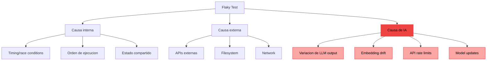
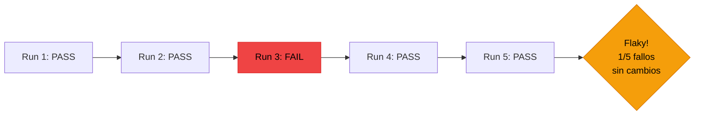
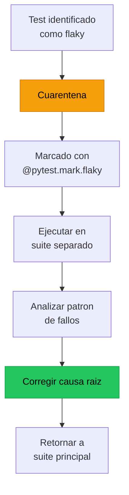

# Flaky Tests en Sistemas de IA

> [!abstract] Resumen
> Un *flaky test* es un test que ==pasa y falla intermitentemente sin cambios en el codigo==. En sistemas de IA, la flakiness se amplifica por la ==variacion inherente de las salidas del LLM==, dependencias de APIs externas, *embedding drift* y asunciones sobre el entorno. Los tests generados por IA son ==especialmente propensos== a flakiness por dependencias de tiempo, valores hardcoded y assertions sobre formatos especificos. Detectar, medir y mitigar la flakiness es esencial para mantener la confianza en el pipeline de CI/CD. ^resumen

---

## Anatomia de un flaky test



> [!info] Por que la flakiness es peor en IA
> En software convencional, la flakiness es un problema molesto. En sistemas de IA, es ==sistematico==:
> - Cada llamada al LLM es potencialmente no-deterministica (ver [[reproducibilidad-ia]])
> - Las APIs de modelos pueden tener latencia variable
> - Los embeddings pueden cambiar con actualizaciones del modelo
> - Los rate limits pueden causar fallos intermitentes
> - Los modelos se actualizan silenciosamente

---

## Causas especificas de flakiness en IA

### 1. Variacion de output del LLM

La causa mas comun y fundamental. El [[testing-llm-outputs|mismo prompt puede producir outputs diferentes]].

| Scenario | Causa de variacion | ==Impacto en tests== |
|----------|-------------------|---------------------|
| temperature > 0 | Muestreo aleatorio | ==Alto: cada run diferente== |
| temperature = 0 | Batching, hardware | ==Bajo pero presente== |
| Model update | Nuevo checkpoint | ==Alto: comportamiento cambia== |
| Load balancing | Diferentes replicas | ==Bajo: misma familia== |

> [!example]- Ejemplo: Test flaky por variacion de output
> ```python
> # FLAKY: Depende del formato exacto del LLM
> def test_genera_lista_de_tareas():
>     result = llm.complete("Lista 3 tareas para setup de proyecto Python")
>
>     # Falla si el LLM usa "•" en vez de "-", o numeros en vez de bullets
>     tasks = result.strip().split("\n")
>     assert len(tasks) == 3  # A veces el LLM agrega intro o conclusion
>     for task in tasks:
>         assert task.startswith("- ")  # A veces usa "1.", "•", "*"
>
> # ESTABLE: Assertions flexibles sobre propiedades
> def test_genera_lista_de_tareas_estable():
>     result = llm.complete("Lista 3 tareas para setup de proyecto Python")
>
>     # Contar items con heuristica flexible
>     lines = [l.strip() for l in result.strip().split("\n") if l.strip()]
>     item_lines = [l for l in lines if l[0] in "-•*" or l[0].isdigit()]
>     assert len(item_lines) >= 3, f"Esperaba >= 3 items, encontre {len(item_lines)}"
>
>     # Verificar contenido semantico, no formato
>     lower = result.lower()
>     assert any(w in lower for w in ["virtualenv", "venv", "environment", "entorno"])
> ```

### 2. Embedding drift

Los modelos de embedding se actualizan, cambiando las distancias entre vectores.

```python
# FLAKY: Umbral de similitud muy ajustado
def test_documentos_similares():
    vec_a = embed("machine learning fundamentals")
    vec_b = embed("ML basics")
    sim = cosine_similarity(vec_a, vec_b)
    assert sim > 0.85  # Marginal: puede pasar o fallar segun version del modelo

# ESTABLE: Umbral con margen y verificacion relativa
def test_documentos_similares_estable():
    vec_a = embed("machine learning fundamentals")
    vec_b = embed("ML basics")
    vec_c = embed("cooking recipes")  # Referencia negativa
    sim_ab = cosine_similarity(vec_a, vec_b)
    sim_ac = cosine_similarity(vec_a, vec_c)
    assert sim_ab > sim_ac, "Documentos relacionados deben ser mas similares que no relacionados"
    assert sim_ab > 0.5, "Similitud minima para documentos del mismo tema"
```

> [!tip] Usa assertions relativas, no absolutas
> En lugar de `sim > 0.85`, verifica que ==documentos similares tienen mayor similitud que documentos no relacionados==. Esto es robusto a cambios en el modelo de embedding.

### 3. API rate limits y timeouts

> [!warning] Tests que dependen de APIs externas son inherentemente flaky
> Rate limits, timeouts y errores transitorios causan fallos intermitentes. Estrategias:
> - Retry con backoff exponencial
> - Circuit breaker pattern
> - Caching de respuestas en tests
> - Mocks para CI, API real solo para nightly

### 4. Dependencias de tiempo en tests generados por IA

Los LLMs frecuentemente generan tests con dependencias de tiempo:

```python
# FLAKY: Generado por IA, depende del tiempo exacto
def test_token_expiration():
    token = create_token(expires_in=1)  # 1 segundo
    time.sleep(1)  # Exactamente 1 segundo... pero puede ser mas
    assert is_expired(token)  # Flaky si sleep < 1s real

# ESTABLE: Sin dependencia de tiempo real
def test_token_expiration_estable():
    token = create_token(expires_at=datetime(2020, 1, 1))
    with freeze_time("2020-01-02"):
        assert is_expired(token)
```

### 5. Valores hardcoded

> [!danger] Los LLMs aman los valores hardcoded
> ```python
> # Generado por IA: asume que el puerto 8080 esta libre
> def test_server_starts():
>     server = start_server(port=8080)  # Puede estar ocupado
>     response = requests.get("http://localhost:8080/health")
>     assert response.status_code == 200
>
> # Correcto: usar puerto dinamico
> def test_server_starts():
>     server = start_server(port=0)  # SO asigna puerto libre
>     response = requests.get(f"http://localhost:{server.port}/health")
>     assert response.status_code == 200
> ```

---

## Deteccion de flaky tests

### Metodo: Ejecucion repetida

```bash
# Ejecutar cada test N veces y detectar inconsistencias
pytest --count=10 tests/ -x --tb=short
# Plugin: pytest-repeat
```

### Metodo: Tracking historico



> [!example]- Ejemplo: Sistema de deteccion de flaky tests
> ```python
> from dataclasses import dataclass
> from collections import defaultdict
> import json
>
> @dataclass
> class TestRecord:
>     name: str
>     passed: bool
>     duration: float
>     run_id: str
>     commit_hash: str
>
> class FlakyDetector:
>     """Detecta tests flaky analizando historial de ejecuciones."""
>
>     def __init__(self, history_path: str):
>         self.history_path = history_path
>         self.records: dict[str, list[TestRecord]] = defaultdict(list)
>
>     def add_result(self, record: TestRecord):
>         self.records[record.name].append(record)
>
>     def detect_flaky(self, min_runs: int = 5, window: int = 20) -> list[dict]:
>         """Detecta tests flaky en una ventana de ejecuciones."""
>         flaky = []
>         for name, records in self.records.items():
>             recent = records[-window:]
>             if len(recent) < min_runs:
>                 continue
>
>             passes = sum(1 for r in recent if r.passed)
>             fails = len(recent) - passes
>
>             if 0 < fails < len(recent):  # Ni siempre pasa ni siempre falla
>                 # Verificar si los fallos ocurrieron sin cambios de commit
>                 commits_on_fail = {r.commit_hash for r in recent if not r.passed}
>                 commits_on_pass = {r.commit_hash for r in recent if r.passed}
>                 same_commit_different_result = commits_on_fail & commits_on_pass
>
>                 if same_commit_different_result:
>                     flaky.append({
>                         "name": name,
>                         "flaky_rate": fails / len(recent),
>                         "total_runs": len(recent),
>                         "pass_rate": passes / len(recent),
>                         "commits_affected": len(same_commit_different_result),
>                     })
>
>         return sorted(flaky, key=lambda x: x["flaky_rate"], reverse=True)
> ```

### Metricas de flakiness

| Metrica | Formula | ==Umbral aceptable== |
|---------|---------|---------------------|
| Flaky rate global | Tests flaky / Total tests | ==< 5%== |
| Flaky rate individual | Fallos / Ejecuciones (por test) | ==< 10%== |
| Impacto en CI | Builds fallidos por flakiness / Total builds | ==< 3%== |
| Mean time to detect | Tiempo hasta identificar como flaky | ==< 1 semana== |
| Mean time to fix | Tiempo desde deteccion hasta fix | ==< 2 semanas== |

---

## Estrategias de mitigacion

### Para tests de LLM

| Estrategia | Descripcion | ==Efectividad== |
|-----------|-------------|----------------|
| temperature=0 | Reducir variabilidad | ==Media (no determinista)== |
| Assertions flexibles | Propiedades, no valores exactos | ==Alta== |
| Retry con analisis | Reintentar y analizar patron de fallos | ==Media== |
| Caching de respuestas | Cachear outputs para tests | ==Alta (pierde frescura)== |
| Mock deterministico | Reemplazar LLM con mock | ==Maxima (pierde realismo)== |
| Scoring estadistico | Pasar si >= N/M ejecuciones pasan | ==Alta== |

### Patron: Retry inteligente

```python
import pytest

def pytest_runtest_makereport(item, call):
    """Plugin para retry automatico de tests marcados como flaky."""
    if call.excinfo is not None and hasattr(item, "flaky_retries"):
        for i in range(item.flaky_retries):
            # Re-ejecutar el test
            try:
                item.runtest()
                # Si pasa en el retry, marcar como warning no error
                call.excinfo = None
                item.add_marker(pytest.mark.xfail(
                    reason=f"Flaky: paso en intento {i+2}"
                ))
                break
            except Exception:
                continue
```

### Patron: Normalizacion de entorno

> [!tip] Checklist de normalizacion para tests de IA
> - [ ] Fijar timezone (UTC)
> - [ ] Fijar locale (en_US.UTF-8)
> - [ ] Fijar seed de random cuando sea posible
> - [ ] Usar puertos dinamicos
> - [ ] Usar directorios temporales
> - [ ] Fijar version de modelo explicitamente
> - [ ] Mockear reloj del sistema para tests con tiempo
> - [ ] Aislar estado entre tests

### Patron: Quarantine



> [!danger] Cuarentena no es solucion permanente
> Poner un test en cuarentena es una medida temporal. Si un test lleva mas de 2 semanas en cuarentena sin atencion, es senial de deuda tecnica acumulandose. ==Los tests flaky sin resolver erosionan la confianza en toda la suite==.

---

## Flakiness especifica de tests generados por IA

Los tests generados por IA tienen patrones de flakiness unicos que [[test-generation-ia|la generacion automatica]] debe abordar.

| Patron | Ejemplo | ==Frecuencia== | Solucion |
|--------|---------|---------------|----------|
| Puerto hardcoded | `port=8080` | ==Alta== | Puerto dinamico |
| Sleep fijo | `time.sleep(1)` | ==Alta== | freeze_time/mock |
| Path absoluto | `/home/user/project/...` | ==Media== | Paths relativos/tmp |
| Fecha actual | `datetime.now()` | ==Alta== | Clock injection |
| Orden de dict | `list(dict.keys())[0]` | ==Baja (Python 3.7+)== | Acceso por clave |
| Formato de float | `assert str(0.1+0.2) == "0.3"` | ==Media== | pytest.approx |

> [!question] Debe el LLM generar tests anti-flaky?
> Idealmente si, pero los LLMs actuales no tienen suficiente conciencia de flakiness. La solucion practica es:
> 1. El LLM genera tests
> 2. Un post-procesador detecta patrones flaky conocidos
> 3. El LLM recibe feedback para corregir
> 4. Validation con ejecucion repetida (3-5x)

---

## Relacion con el ecosistema

La gestion de flaky tests impacta directamente la confianza en el pipeline de calidad de todo el ecosistema.

[[intake-overview|Intake]] puede contribuir a reducir flakiness al normalizar especificaciones con criterios de test claros y deterministicos. Si intake especifica "la respuesta debe contener la palabra X" en lugar de "la respuesta debe tener formato de lista con bullets", los tests resultantes seran menos flaky.

[[architect-overview|Architect]] enfrenta flakiness en sus 717+ tests. Su estrategia — post-edit hooks que ejecutan tests inmediatamente tras cada cambio — ayuda a detectar flakiness tempranamente. Si un test falla intermitentemente durante el loop del agente, architect lo reintenta, lo que puede enmascarar o revelar flakiness.

[[vigil-overview|Vigil]] puede detectar algunos patrones de flakiness estaticamente: tests que usan `time.sleep()`, tests que dependen de `datetime.now()`, tests con puertos hardcoded. Agregar reglas de flakiness a las 26 reglas existentes de vigil seria una extension natural.

[[licit-overview|Licit]] necesita que los tests de compliance sean deterministicos. Un test de compliance flaky es peor que inutil — puede dar aprobacion falsa. Los *evidence bundles* de licit deben incluir informacion sobre la flaky rate de los tests que produjeron la evidencia.

---

## Enlaces y referencias

> [!quote]- Bibliografia y recursos
> - Google. "Flaky Tests at Google and How We Mitigate Them." Google Testing Blog, 2020. [^1]
> - Luo, Q. et al. "An Empirical Analysis of Flaky Tests." FSE 2014. [^2]
> - Parry, O. et al. "A Survey on Flaky Tests." ACM TOSEM, 2021. [^3]
> - pytest-repeat Documentation. "Pytest Plugin for Repeating Tests." 2024. [^4]
> - Memon, A. "Understanding Flaky Tests." Microsoft Research, 2022. [^5]

[^1]: Perspectiva de Google sobre flakiness a escala con datos de millones de tests.
[^2]: Primer estudio empirico riguroso sobre la naturaleza y causas de tests flaky.
[^3]: Survey comprensivo del estado del arte en deteccion y mitigacion de flaky tests.
[^4]: Herramienta practica para detectar flakiness mediante ejecucion repetida.
[^5]: Investigacion de Microsoft sobre las causas fundamentales de la flakiness.
