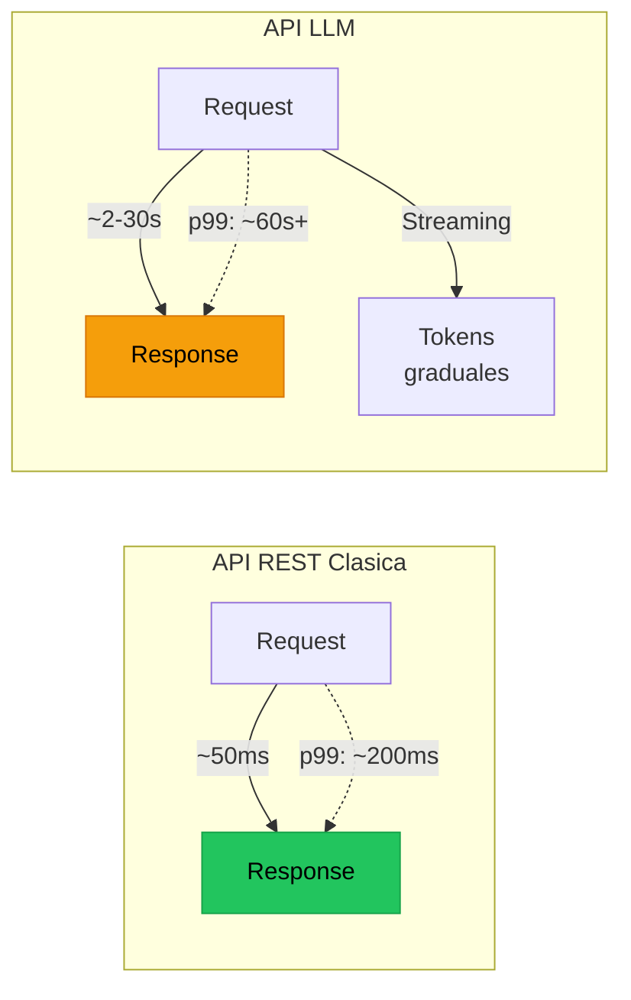
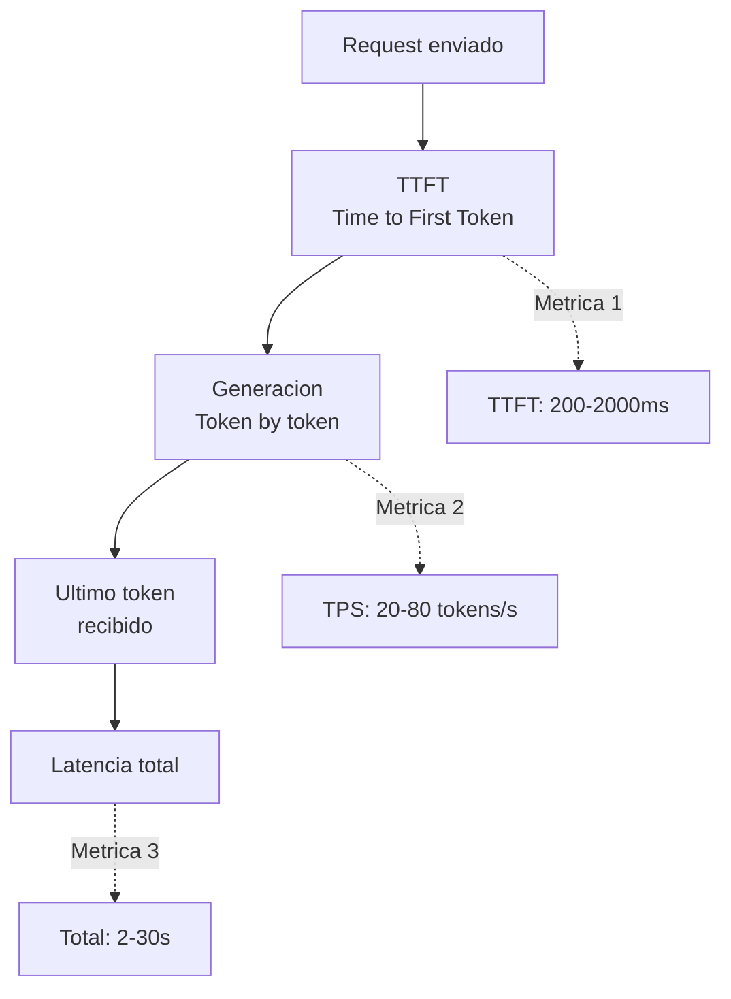
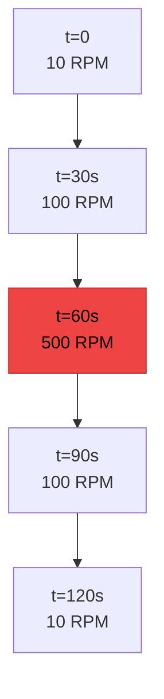

# Load Testing de Sistemas Basados en LLM

> [!abstract] Resumen
> Los sistemas basados en LLM tienen caracteristicas de rendimiento unicas: ==latencia de segundos== (no milisegundos), ==throughput limitado por tokens/segundo==, ==costos que escalan linealmente con el trafico== y ==rate limits impuestos por proveedores==. El load testing requiere metricas especializadas (tokens/s, TTFT, p95 latencia) y herramientas adaptadas como *Locust* con plugins LLM y *k6* con extensiones custom. Los escenarios de carga deben incluir ==burst traffic==, ==contextos largos concurrentes== y ==comportamiento bajo rate limits==. ^resumen

---

## Por que el load testing de LLMs es diferente



| Aspecto | API REST clasica | ==API LLM== |
|---------|-----------------|-------------|
| Latencia tipica | 10-200ms | ==2,000-30,000ms== |
| Unidad de throughput | Requests/segundo | ==Tokens/segundo== |
| Costo marginal | ~$0.00001/request | ==$0.001-0.10/request== |
| Rate limiting | Por IP/token | ==Por tokens/minuto== |
| Recursos servidor | CPU/memoria fijos | ==GPU, escalan con contexto== |
| Caching | Efectivo (mismos params) | ==Limitado (outputs variables)== |
| Streaming | Poco comun | ==Estandar (SSE/WebSocket)== |

> [!warning] Los costos escalan con la carga
> En una API REST, duplicar el trafico puede costar $10 extra en infraestructura. En un sistema LLM, duplicar el trafico puede costar ==$10,000 extra en API calls==. El load test en si mismo puede ser costoso.

---

## Metricas clave

### Metricas de latencia



| Metrica | Descripcion | ==Valores tipicos== |
|---------|-------------|-------------------|
| TTFT | Time to First Token | ==200ms - 2s== |
| TPS | Tokens per second (output) | ==20-80 tokens/s== |
| Total latency | Tiempo completo de respuesta | ==2-30s== |
| p50 | Percentil 50 de latencia | ==3-5s== |
| p95 | Percentil 95 | ==8-15s== |
| p99 | Percentil 99 | ==15-60s== |
| Context processing | Tiempo para procesar input largo | ==~0.5s por 1K tokens== |

### Metricas de throughput

| Metrica | Descripcion | ==Como medir== |
|---------|-------------|---------------|
| RPM | Requests per minute | ==Counter de requests completados== |
| TPM (input) | Tokens per minute procesados | ==Sum(input tokens) / minutos== |
| TPM (output) | Tokens per minute generados | ==Sum(output tokens) / minutos== |
| Concurrent requests | Requests simultaneos | ==Gauge en cualquier momento== |
| Queue depth | Requests esperando | ==Longitud de cola== |

### Metricas de error

| Metrica | Descripcion | ==Umbral critico== |
|---------|-------------|-------------------|
| Error rate | % de requests fallidos | ==< 1% bajo carga normal== |
| Rate limit hits | % de 429 responses | ==< 5%== |
| Timeout rate | % de requests que exceden timeout | ==< 2%== |
| Context overflow | % de requests truncados por contexto | ==< 1%== |

---

## Herramientas de load testing

### Locust con plugins LLM

> [!example]- Ejemplo: Locustfile para testing de LLM
> ```python
> from locust import HttpUser, task, between, events
> from locust.runners import MasterRunner
> import json
> import time
>
> class LLMUser(HttpUser):
>     """Simula usuarios que interactuan con una API de LLM."""
>     wait_time = between(2, 10)  # Usuarios reales no hacen requests instantaneos
>
>     def on_start(self):
>         self.headers = {
>             "Authorization": f"Bearer {self.environment.parsed_options.api_key}",
>             "Content-Type": "application/json"
>         }
>         self.metrics = {
>             "ttft": [],
>             "total_latency": [],
>             "tokens_generated": [],
>         }
>
>     @task(3)
>     def short_query(self):
>         """Query corta: ~100 tokens de output."""
>         self._make_request(
>             prompt="Explica que es un mutex en una frase.",
>             max_tokens=100,
>             name="short_query"
>         )
>
>     @task(2)
>     def medium_query(self):
>         """Query media: ~500 tokens de output."""
>         self._make_request(
>             prompt="Explica el patron Observer con ejemplo en Python.",
>             max_tokens=500,
>             name="medium_query"
>         )
>
>     @task(1)
>     def long_query(self):
>         """Query larga: ~2000 tokens de output."""
>         self._make_request(
>             prompt="Escribe una guia completa de testing en Python con ejemplos.",
>             max_tokens=2000,
>             name="long_query"
>         )
>
>     def _make_request(self, prompt, max_tokens, name):
>         start = time.time()
>         ttft = None
>
>         with self.client.post(
>             "/v1/chat/completions",
>             json={
>                 "model": "gpt-4",
>                 "messages": [{"role": "user", "content": prompt}],
>                 "max_tokens": max_tokens,
>                 "stream": True,
>             },
>             headers=self.headers,
>             stream=True,
>             name=name,
>             catch_response=True,
>         ) as response:
>             if response.status_code == 429:
>                 response.failure("Rate limited")
>                 return
>             if response.status_code != 200:
>                 response.failure(f"Status {response.status_code}")
>                 return
>
>             tokens = 0
>             for line in response.iter_lines():
>                 if line and b"data: " in line:
>                     if ttft is None:
>                         ttft = time.time() - start
>                     tokens += 1
>
>             total = time.time() - start
>             self.metrics["ttft"].append(ttft or total)
>             self.metrics["total_latency"].append(total)
>             self.metrics["tokens_generated"].append(tokens)
>
>             if tokens == 0:
>                 response.failure("No tokens generated")
> ```

### k6 con extensiones LLM

```javascript
// k6_llm_test.js
import http from 'k6/http';
import { check, sleep } from 'k6';
import { Trend, Counter, Rate } from 'k6/metrics';

const ttft = new Trend('ttft_ms');
const tokensPerSecond = new Trend('tokens_per_second');
const rateLimitHits = new Counter('rate_limit_hits');
const errorRate = new Rate('error_rate');

export const options = {
  scenarios: {
    ramp_up: {
      executor: 'ramping-vus',
      startVUs: 1,
      stages: [
        { duration: '2m', target: 10 },
        { duration: '5m', target: 10 },
        { duration: '2m', target: 50 },
        { duration: '5m', target: 50 },
        { duration: '2m', target: 0 },
      ],
    },
  },
  thresholds: {
    'ttft_ms': ['p(95)<3000'],
    'error_rate': ['rate<0.05'],
    'tokens_per_second': ['avg>20'],
  },
};

export default function () {
  const payload = JSON.stringify({
    model: 'gpt-4',
    messages: [{ role: 'user', content: 'Explain dependency injection.' }],
    max_tokens: 200,
  });

  const start = Date.now();
  const res = http.post('https://api.openai.com/v1/chat/completions', payload, {
    headers: {
      'Authorization': `Bearer ${__ENV.OPENAI_API_KEY}`,
      'Content-Type': 'application/json',
    },
    timeout: '60s',
  });

  const duration = Date.now() - start;

  if (res.status === 429) {
    rateLimitHits.add(1);
    errorRate.add(true);
    return;
  }

  const success = check(res, {
    'status is 200': (r) => r.status === 200,
    'has choices': (r) => JSON.parse(r.body).choices?.length > 0,
  });

  errorRate.add(!success);

  if (success) {
    const body = JSON.parse(res.body);
    const tokens = body.usage?.completion_tokens || 0;
    ttft.add(duration);  // Simplified: real TTFT needs streaming
    tokensPerSecond.add(tokens / (duration / 1000));
  }

  sleep(Math.random() * 5 + 2);
}
```

> [!tip] k6 vs Locust para LLM testing
> - **Locust**: Mejor para streaming (Python, facil de parsear SSE), mas flexible para metricas custom
> - **k6**: Mejor rendimiento (Go), mejores thresholds declarativos, integracion Grafana nativa
> - **Recomendacion**: Locust para pruebas exploratorias, k6 para CI/CD automatizado

---

## Escenarios de carga

### 1. Burst traffic

Picos subitos de trafico, como cuando un articulo se vuelve viral.



> [!question] Que verificar en burst traffic?
> - El rate limiter del proveedor se activa? Como se maneja?
> - La cola de requests crece? Tiene limite?
> - Los requests en cola eventualmente completan o hacen timeout?
> - El costo del burst es aceptable?

### 2. Sustained load

Carga constante durante horas, verificando estabilidad a largo plazo.

| Metrica a monitorear | ==Por que== |
|---------------------|-----------|
| Memory usage over time | ==Detectar memory leaks en caching== |
| Latency drift | ==La latencia no debe crecer con el tiempo== |
| Error rate stability | ==Los errores no deben acumularse== |
| Connection pool health | ==Las conexiones se reciclan correctamente== |

### 3. Concurrent long contexts

Multiples requests simultaneos con contextos largos (100K+ tokens).

> [!danger] Long contexts son el escenario mas costoso
> Un request con 100K tokens de contexto consume significativamente mas recursos que 100 requests con 1K tokens. Verificar:
> - El proveedor acepta multiples long-context requests simultaneos?
> - El TTFT se degrada significativamente con long contexts?
> - El costo por request con long context es lineal o super-lineal?

### 4. Rate limit behavior

Verificar que el sistema maneja rate limits gracefully.

> [!example]- Ejemplo: Test de comportamiento bajo rate limit
> ```python
> async def test_rate_limit_behavior():
>     """Verifica que el sistema maneja rate limits gracefully."""
>     results = []
>     errors = []
>
>     # Enviar mas requests de los que el rate limit permite
>     async with asyncio.TaskGroup() as tg:
>         for i in range(100):  # Mas que el rate limit
>             tg.create_task(
>                 make_request_and_record(i, results, errors)
>             )
>
>     # Analizar resultados
>     total = len(results) + len(errors)
>     rate_limited = sum(1 for e in errors if "429" in str(e))
>     succeeded = len(results)
>     other_errors = len(errors) - rate_limited
>
>     print(f"Total: {total}")
>     print(f"Succeeded: {succeeded}")
>     print(f"Rate limited (429): {rate_limited}")
>     print(f"Other errors: {other_errors}")
>
>     # Verificaciones
>     assert other_errors == 0, "No debe haber errores no-rate-limit"
>     assert succeeded > 0, "Al menos algunos requests deben completar"
>
>     # Si hay retry logic, verificar que eventualmente completan
>     if rate_limited > 0:
>         # Esperar y reintentar los rate-limited
>         await asyncio.sleep(60)  # Esperar a que se resetee el rate limit
>         retry_results = await retry_failed(errors)
>         assert len(retry_results) > 0, "Retries deben eventualmente completar"
> ```

---

## Proyeccion de costos desde load tests

> [!tip] Usar load tests para estimar costos de produccion

```python
class CostProjector:
    """Proyecta costos de produccion basandose en resultados de load test."""

    def __init__(self, pricing: dict):
        # Pricing en dolares por 1M tokens
        self.input_price = pricing["input_per_1m"]
        self.output_price = pricing["output_per_1m"]

    def project(self, load_test_results: dict, daily_requests: int) -> dict:
        avg_input_tokens = load_test_results["avg_input_tokens"]
        avg_output_tokens = load_test_results["avg_output_tokens"]

        daily_input_tokens = daily_requests * avg_input_tokens
        daily_output_tokens = daily_requests * avg_output_tokens

        daily_cost = (
            (daily_input_tokens / 1_000_000) * self.input_price +
            (daily_output_tokens / 1_000_000) * self.output_price
        )

        return {
            "daily_requests": daily_requests,
            "daily_input_tokens": daily_input_tokens,
            "daily_output_tokens": daily_output_tokens,
            "daily_cost_usd": round(daily_cost, 2),
            "monthly_cost_usd": round(daily_cost * 30, 2),
            "annual_cost_usd": round(daily_cost * 365, 2),
            "cost_per_request_usd": round(daily_cost / daily_requests, 4),
        }
```

| Escenario | Requests/dia | Tokens promedio | ==Costo mensual estimado== |
|-----------|-------------|----------------|--------------------------|
| Startup | 1,000 | 500 in / 300 out | ==$15-50== |
| Growth | 10,000 | 800 in / 500 out | ==$200-600== |
| Scale | 100,000 | 1000 in / 600 out | ==$3,000-10,000== |
| Enterprise | 1,000,000 | 1500 in / 800 out | ==$40,000-120,000== |

---

## Optimizaciones reveladas por load testing

| Problema detectado | ==Optimizacion== | Impacto |
|-------------------|-----------------|---------|
| TTFT alto bajo carga | ==Implementar cola de prioridad== | -40% p95 TTFT |
| Rate limits frecuentes | ==Distribuir entre multiples API keys== | -80% rate limits |
| Costos altos | ==Caching de respuestas similares== | -30% costo |
| Latencia en long context | ==Summarizacion previa de contexto== | -50% latencia |
| Memory leaks | ==Connection pooling con limites== | Estabilidad a largo plazo |

---

## Relacion con el ecosistema

El load testing valida que el ecosistema funciona a escala, no solo en condiciones ideales.

[[intake-overview|Intake]] puede ser cuello de botella si la normalizacion de especificaciones es lenta. Bajo carga, multiples especificaciones llegando simultaneamente deben procesarse sin degradacion. Load testing de intake verifica que la normalizacion escala linealmente.

[[architect-overview|Architect]] bajo carga significa multiples sesiones de agente corriendo simultaneamente. Cada sesion consume tokens, memoria y potencialmente acceso a herramientas compartidas. El load testing revela si las sesiones concurrentes interfieren entre si y si los safety nets (budget, timeout) funcionan correctamente bajo presion.

[[vigil-overview|Vigil]] debe poder analizar tests a la velocidad que se generan. Si architect genera 100 archivos de test por hora y vigil tarda 5 segundos por archivo, no hay problema. Pero si el volumen sube 10x, vigil podria convertirse en cuello de botella. Load testing de vigil verifica que las 26 reglas escalan con el volumen.

[[licit-overview|Licit]] debe generar *evidence bundles* sin bloquear el pipeline principal. Si la generacion de evidencia tarda demasiado bajo carga, puede retrasar deployments. Load testing verifica que la generacion de evidencia es asincrona y no impacta el flujo principal.

---

## Enlaces y referencias

> [!quote]- Bibliografia y recursos
> - Locust Documentation. "Load Testing Tool." locust.io, 2024. [^1]
> - Grafana k6. "The Best Developer Experience for Load Testing." 2024. [^2]
> - OpenAI. "Rate Limits." API Documentation, 2024. [^3]
> - Anthropic. "Rate Limits and Usage." API Documentation, 2024. [^4]
> - Anyscale. "How to Benchmark LLM Inference." Blog, 2024. [^5]

[^1]: Herramienta de load testing mas popular en Python con soporte para streaming.
[^2]: Framework de load testing con mejor integracion Grafana para visualizacion.
[^3]: Documentacion oficial de rate limits de OpenAI necesaria para planificar load tests.
[^4]: Documentacion de rate limits de Anthropic con limites por modelo y tier.
[^5]: Guia practica sobre como benchmarkear correctamente la inferencia de LLMs.
