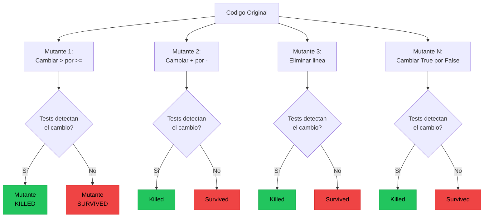
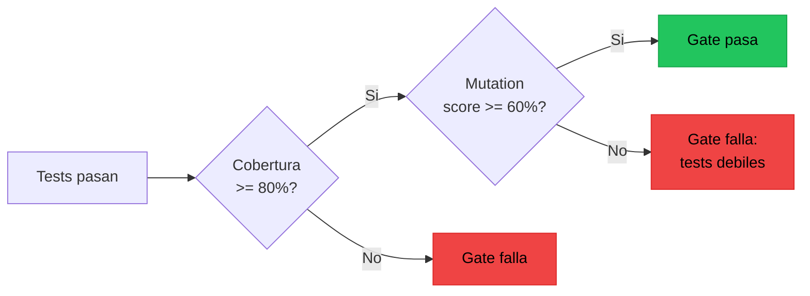
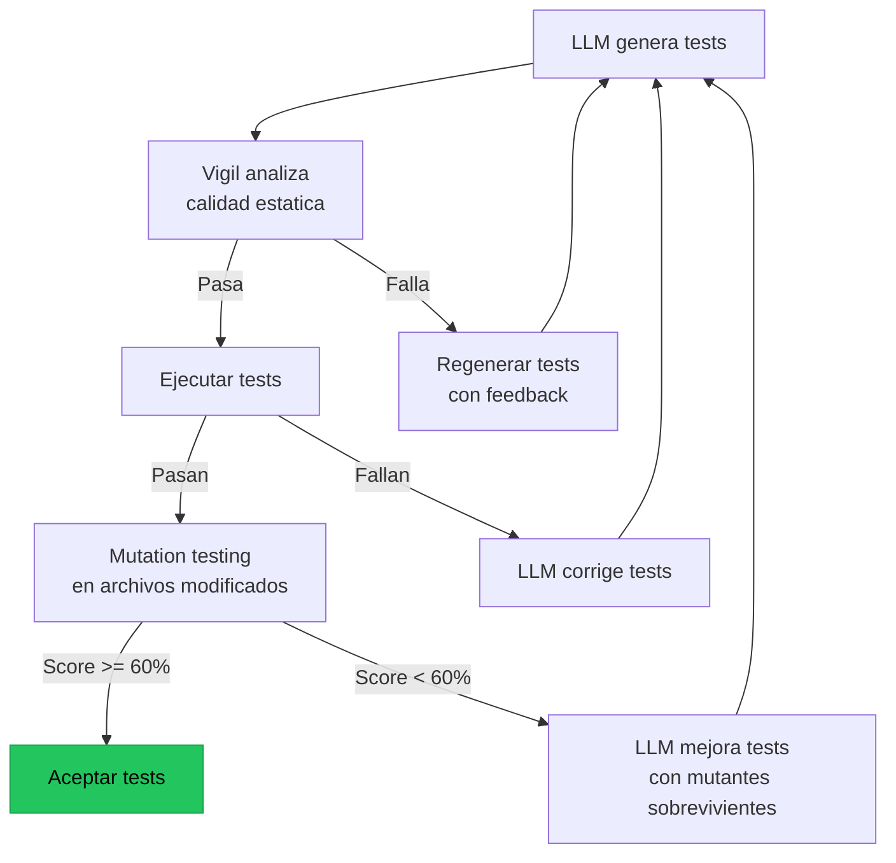

# Mutation Testing para Validar Calidad de Tests

> [!abstract] Resumen
> El *mutation testing* introduce ==pequenos cambios deliberados (mutaciones) en el codigo fuente== y verifica si los tests existentes los detectan. Si un test suite no detecta una mutacion, tiene un hueco de cobertura. El ==mutation score== (mutaciones detectadas / total) es la metrica mas honesta de calidad de tests — mas fiable que la cobertura de lineas. Para tests generados por IA, mutation testing es critico porque los LLMs escriben tests que pasan pero ==frecuentemente no detectan bugs reales==. ^resumen

---

## Fundamentos del mutation testing

### Concepto



> [!info] Terminologia
> - **Mutante**: Copia del codigo con un cambio deliberado
> - **Killed**: Un test detecto la mutacion (fallo con el mutante)
> - **Survived**: Ningun test detecto la mutacion (todos pasaron con el mutante)
> - **Mutation score**: `killed / (killed + survived)` expresado en porcentaje
> - **Equivalent mutant**: Mutacion que produce el mismo comportamiento (falso sobreviviente)

---

## Operadores de mutacion

Los operadores definen que tipo de cambios se introducen:

| Operador | Ejemplo original | ==Mutacion== | Categoria |
|----------|-----------------|-------------|-----------|
| Relacional | `a > b` | ==`a >= b`== | Boundary |
| Aritmetico | `a + b` | ==`a - b`== | Calculo |
| Logico | `a and b` | ==`a or b`== | Logica |
| Negacion | `if condition:` | ==`if not condition:`== | Control flow |
| Eliminacion | `return x + 1` | ==`return x`== | Simplificacion |
| Constante | `timeout = 30` | ==`timeout = 0`== | Valor |
| Return | `return True` | ==`return False`== | Return value |
| Excepcion | `raise ValueError` | ==_(eliminado)_== | Error handling |

> [!tip] No todos los operadores son igualmente utiles
> Los operadores de ==boundary== (cambiar `>` por `>=`) y ==return value== (cambiar `True` por `False`) detectan los problemas mas comunes en tests. Enfoca ahi primero.

---

## Por que mutation testing importa para IA

### El problema de los tests generados por IA

> [!danger] Los LLMs generan tests que pasan pero no protegen
> Un LLM puede generar un test suite con 100% de cobertura de lineas donde:
> - Cada linea se ejecuta al menos una vez
> - Todos los tests pasan
> - Pero ==ningun test verificaria si el codigo tuviera un bug==
>
> El mutation score revela esta realidad brutal.

Ejemplo concreto:

```python
# Codigo bajo test
def calculate_discount(price: float, quantity: int) -> float:
    """Calcula descuento: 10% para 5+, 20% para 10+."""
    if quantity >= 10:
        return price * 0.8
    elif quantity >= 5:
        return price * 0.9
    return price

# Test generado por IA (parece bueno)
def test_calculate_discount():
    assert calculate_discount(100, 10) == 80.0  # 20% off
    assert calculate_discount(100, 5) == 90.0   # 10% off
    assert calculate_discount(100, 1) == 100.0  # sin descuento
```

> [!question] Que pasa si mutamos?
> - Mutacion `quantity >= 10` → `quantity > 10`: ==El test NO detecta esto== porque usa exactamente 10
> - Mutacion `price * 0.8` → `price * 0.9`: El test SI detecta (espera 80, obtiene 90)
> - Mutacion `quantity >= 5` → `quantity > 5`: ==El test NO detecta esto== porque usa exactamente 5
>
> Mutation score: 1/3 = ==33%==. Los tests parecen buenos pero son fragiles en los boundaries.

### Test mejorado tras mutation testing

```python
def test_calculate_discount_boundaries():
    # Exactamente en el boundary
    assert calculate_discount(100, 10) == 80.0
    assert calculate_discount(100, 5) == 90.0
    # Justo debajo del boundary
    assert calculate_discount(100, 9) == 90.0   # NO 20%, solo 10%
    assert calculate_discount(100, 4) == 100.0   # NO descuento
    # Justo arriba del boundary
    assert calculate_discount(100, 11) == 80.0
    assert calculate_discount(100, 6) == 90.0
```

Mutation score con el test mejorado: ==100%==.

---

## Herramientas

### mutmut (Python)

La herramienta de referencia para mutation testing en Python.

> [!example]- Ejemplo: Uso de mutmut
> ```bash
> # Instalar
> pip install mutmut
>
> # Ejecutar mutation testing
> mutmut run --paths-to-mutate=src/ --tests-dir=tests/
>
> # Ver resultados
> mutmut results
>
> # Output:
> # Total mutants: 147
> # Killed: 98 (66.7%)
> # Survived: 42 (28.6%)
> # Timeout: 5 (3.4%)
> # Suspicious: 2 (1.4%)
>
> # Detalle de un mutante sobreviviente
> mutmut show 23
>
> # --- a/src/auth.py
> # +++ b/src/auth.py
> # @@ -45,7 +45,7 @@
> #  def validate_token(token: str) -> bool:
> # -    if len(token) < 32:
> # +    if len(token) < 33:
> #          return False
>
> # Esto revela que no hay test para tokens de exactamente 32 caracteres
> ```

### Stryker (JavaScript/TypeScript)

> [!example]- Ejemplo: Configuracion de Stryker
> ```javascript
> // stryker.config.mjs
> /** @type {import('@stryker-mutator/api/core').PartialStrykerOptions} */
> const config = {
>   packageManager: 'npm',
>   reporters: ['html', 'clear-text', 'progress'],
>   testRunner: 'jest',
>   coverageAnalysis: 'perTest',
>   mutate: [
>     'src/**/*.ts',
>     '!src/**/*.test.ts',
>     '!src/**/*.spec.ts',
>   ],
>   thresholds: {
>     high: 80,
>     low: 60,
>     break: 50,  // Falla el CI si mutation score < 50%
>   },
>   concurrency: 4,
>   timeoutMS: 10000,
> };
>
> export default config;
> ```
>
> ```bash
> # Ejecutar
> npx stryker run
>
> # Output:
> # All tests
> #   Mutant killed:        210 (78.36%)
> #   Mutant survived:       43 (16.04%)
> #   Mutant no coverage:    12 (4.48%)
> #   Mutant timeout:         3 (1.12%)
> #
> # Mutation score: 78.36%
> ```

### Comparativa de herramientas

| Herramienta | Lenguaje | ==Velocidad== | Configurabilidad | CI Ready |
|------------|----------|-------------|-----------------|----------|
| mutmut | Python | ==Media== | Alta | Si |
| Stryker | JS/TS/C# | ==Alta (paralelo)== | Muy alta | Si |
| PIT | Java/Kotlin | ==Alta== | Alta | Si |
| cosmic-ray | Python | ==Baja== | Media | Si |
| cargo-mutants | Rust | ==Alta== | Media | Si |

---

## Mutation testing como quality gate

El mutation score puede integrarse como [[quality-gates|quality gate]] en el pipeline.



> [!warning] Mutation testing es lento
> Ejecutar todos los mutantes puede tomar ==10-100x mas== que ejecutar los tests una vez. Estrategias para manejarlo:
> - Solo mutar archivos modificados en el PR
> - Ejecutar en nightly, no en cada push
> - Usar *mutation sampling* (evaluar un % aleatorio de mutantes)
> - Limitar operadores a los mas informativos
> - Ejecutar en paralelo (Stryker es excelente para esto)

---

## Aplicacion a vigil y analisis de test quality

[[vigil-overview|Vigil]] detecta problemas ==estaticamente== (sin ejecutar nada). Mutation testing los detecta ==dinamicamente== (ejecutando tests contra mutantes). Son complementarios:

| Problema | ==Vigil lo detecta?== | ==Mutation testing lo detecta?== |
|----------|----------------------|---------------------------------|
| `assert True` | ==Si (regla)== | ==Si (todo mutante sobrevive)== |
| Tests sin assertions | ==Si (regla)== | ==Si (todo mutante sobrevive)== |
| Over-mocking | ==Si (regla)== | ==Si (mutantes en code real sobreviven)== |
| Assertions insuficientes | ==No== | ==Si (mutantes sobreviven)== |
| Boundary errors | ==No== | ==Si (operador boundary)== |
| Missing edge cases | ==No== | ==Si (mutantes en edge cases sobreviven)== |

> [!success] Vigil + mutation testing = cobertura completa
> - Vigil detecta problemas obvios de forma rapida y gratuita (sin ejecucion)
> - Mutation testing detecta problemas sutiles pero requiere ejecucion
> - Juntos cubren todo el espectro de calidad de tests

---

## Mutation testing para tests generados por IA

### Flujo recomendado



> [!example]- Ejemplo: Feedback de mutantes sobrevivientes al LLM
> ```python
> PROMPT = """Los siguientes mutantes sobrevivieron en tu test suite,
> lo que significa que tus tests no detectarian estos bugs:
>
> Mutante 1 (SURVIVED):
>   Archivo: src/auth.py, linea 45
>   Cambio: `if len(token) < 32` → `if len(token) < 33`
>   Esto significa que no hay test para tokens de exactamente 32 caracteres.
>
> Mutante 2 (SURVIVED):
>   Archivo: src/auth.py, linea 52
>   Cambio: `return True` → `return False`
>   Esto significa que no verificas el valor de retorno de validate_session().
>
> Por favor agrega tests que detecten estos mutantes.
> Los tests deben:
> 1. Cubrir el boundary exacto (32 caracteres)
> 2. Verificar que validate_session() retorna True cuando es valida
> """
> ```

---

## Interpretacion de resultados

| Mutation Score | ==Interpretacion== | Accion recomendada |
|---------------|-------------------|-------------------|
| 90-100% | ==Excelente: tests muy robustos== | Mantener |
| 70-89% | ==Bueno: la mayoria de bugs se detectarian== | Mejorar areas debiles |
| 50-69% | ==Aceptable: riesgo moderado== | Priorizar mejoras |
| 30-49% | ==Pobre: muchos bugs pasarian desapercibidos== | Accion urgente |
| < 30% | ==Critico: los tests dan falsa confianza== | Reescribir test suite |

> [!danger] Mutation score < 50% con cobertura > 80% es una senal de alarma
> Significa que el codigo se ejecuta pero ==no se verifica==. Esto es comun en tests generados por IA que recorren el codigo sin hacer assertions significativas. Es peor que no tener tests porque da ==falsa confianza==.

---

## Limitaciones y consideraciones

> [!question] Cuando NO usar mutation testing?
> - Codigo con muchos side effects (IO, network, DB) — las mutaciones pueden causar danos
> - Test suites que tardan > 30 minutos — el mutation testing seria impracticable
> - Codigo que cambia muy frecuentemente — el costo de mutation testing no se justifica
> - Prototipos y MVPs — prioriza funcionalidad sobre test quality
> - Codigo trivial (getters/setters) — las mutaciones equivalentes son noise

### Mutantes equivalentes

Un mutante equivalente produce el mismo comportamiento que el original. No puede ser detectado porque ==no hay diferencia observable==.

```python
# Original
def abs_value(x):
    if x < 0:
        return -x
    return x

# Mutante equivalente: cambiar < por <=
# abs_value(0) == 0 en ambos casos
def abs_value(x):
    if x <= 0:  # Mutacion
        return -x   # -0 == 0, asi que es equivalente
    return x
```

> [!tip] Manejo de mutantes equivalentes
> - Marcarlos manualmente como equivalentes
> - Usar heuristicas para detectarlos automaticamente
> - Excluirlos del calculo del mutation score
> - Un 5-15% de mutantes equivalentes es normal

---

## Relacion con el ecosistema

El mutation testing valida que toda la infraestructura de testing del ecosistema realmente funciona.

[[intake-overview|Intake]] define criterios de calidad que pueden incluir un mutation score minimo. Cuando intake normaliza una especificacion que dice "cobertura robusta de tests", mutation testing es lo que convierte esa frase vaga en una metrica concreta y verificable.

[[architect-overview|Architect]] puede integrar mutation testing en sus quality gates. Despues de que el agente genera tests y estos pasan, un check adicional `mutmut run --paths-to-mutate=archivos_modificados` verificaria que los tests son robustos. Los 717+ tests del propio codebase de architect serian un candidato ideal para mutation testing.

[[vigil-overview|Vigil]] y mutation testing son complementarios como se explico arriba. Vigil opera en la capa estatica (sin ejecucion, instantaneo, 26 reglas). Mutation testing opera en la capa dinamica (ejecucion requerida, costoso, pero descubre problemas sutiles). La combinacion de ambos cubre desde tests vacios hasta assertions insuficientes.

[[licit-overview|Licit]] puede requerir un mutation score minimo como evidencia de calidad de testing. El reporte de mutation testing — que mutantes sobrevivieron, cuales fueron eliminados, y el score final — se incluye en *evidence bundles* como prueba de que los tests son efectivos, no solo existentes.

---

## Enlaces y referencias

> [!quote]- Bibliografia y recursos
> - Jia, Y. & Harman, M. "An Analysis and Survey of the Development of Mutation Testing." IEEE TSE, 2011. [^1]
> - mutmut Documentation. "Mutation Testing for Python." 2024. [^2]
> - Stryker Mutator. "Mutation Testing for JavaScript and Friends." 2024. [^3]
> - Papadakis, M. et al. "Mutation Testing Advances: An Analysis and Survey." Advances in Computers, 2019. [^4]
> - Parsai, A. "Comparing Mutation Testing Tools." ICST 2020. [^5]

[^1]: El survey mas citado sobre mutation testing con analisis historico completo.
[^2]: Documentacion de la herramienta mas popular de mutation testing en Python.
[^3]: Framework lider en mutation testing para ecosistema JavaScript con excelente paralelismo.
[^4]: Survey actualizado que cubre los avances recientes incluyendo optimizaciones de rendimiento.
[^5]: Comparativa empirica de herramientas de mutation testing en diferentes lenguajes.
