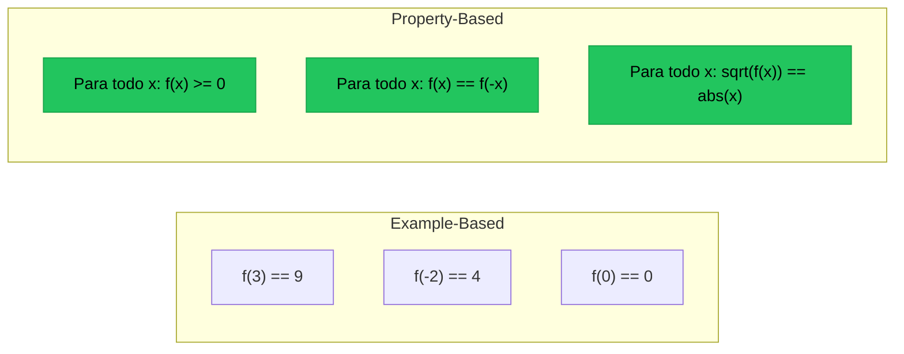
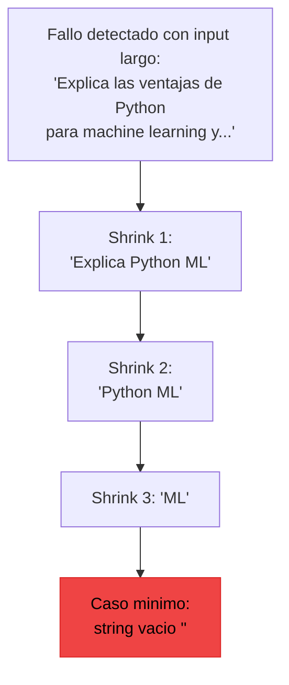
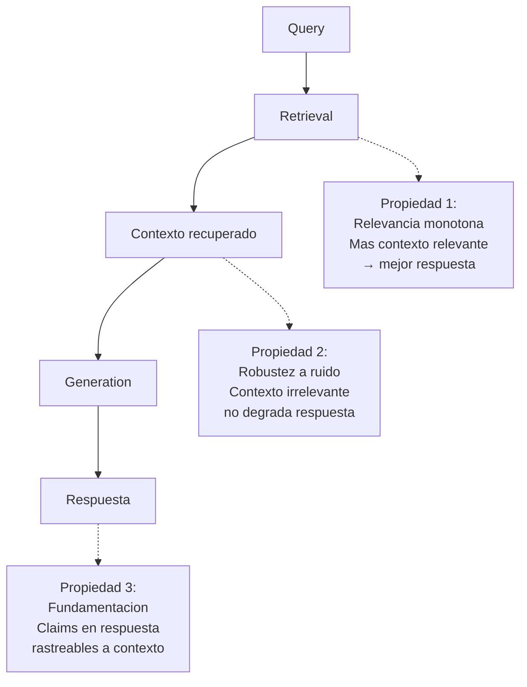

# Property-Based Testing para IA

> [!abstract] Resumen
> El *property-based testing* (PBT) define ==invariantes que deben cumplirse para cualquier input== y genera automaticamente cientos de casos de prueba aleatorios para verificarlas. En el contexto de IA, PBT es especialmente valioso porque ==no requiere predecir el output exacto==, solo las propiedades que debe tener. Herramientas como *Hypothesis* (Python) y *fast-check* (JS) se adaptan a testing de outputs de LLM, pipelines RAG, herramientas de agentes y codigo generado por IA. ^resumen

---

## Fundamentos del property-based testing

El testing basado en ejemplos verifica `f(x) == y` para valores especificos. El testing basado en propiedades verifica `P(f(x))` para ==todos los x posibles==.



> [!info] Por que PBT es ideal para IA
> Con outputs de LLM, rara vez podemos predecir el valor exacto. Pero ==siempre podemos definir propiedades==:
> - El JSON generado es valido
> - La respuesta esta en el idioma solicitado
> - El codigo generado no tiene errores de sintaxis
> - La longitud esta dentro de limites razonables

---

## Hypothesis: PBT en Python

*Hypothesis* es la libreria de referencia para *property-based testing* en Python.

### Estrategias de generacion

| Estrategia | Genera | ==Uso en IA== |
|------------|--------|---------------|
| `st.text()` | Strings aleatorios | ==Inputs de LLM== |
| `st.dictionaries()` | Diccionarios | ==Schemas de herramientas== |
| `st.lists()` | Listas | ==Contextos RAG== |
| `st.from_regex()` | Strings que matchean regex | ==Prompts estructurados== |
| `st.builds()` | Instancias de clases | ==Objetos de dominio== |
| `@composite` | Estrategias custom | ==Datos complejos de IA== |

> [!example]- Ejemplo: PBT para validar output JSON de LLM
> ```python
> from hypothesis import given, strategies as st, settings
> import json
>
> # Estrategia custom: genera preguntas variadas
> @st.composite
> def preguntas_tecnicas(draw):
>     temas = ["Python", "JavaScript", "Rust", "Go", "SQL"]
>     acciones = [
>         "Explica que es",
>         "Lista las ventajas de",
>         "Compara con alternativas",
>         "Da un ejemplo de",
>     ]
>     tema = draw(st.sampled_from(temas))
>     accion = draw(st.sampled_from(acciones))
>     return f"{accion} {tema}"
>
> @given(pregunta=preguntas_tecnicas())
> @settings(max_examples=50, deadline=30000)
> def test_respuesta_siempre_es_json_valido(pregunta):
>     """Propiedad: el LLM siempre genera JSON valido cuando se le pide."""
>     prompt = f"""Responde la siguiente pregunta en formato JSON con campos
>     "respuesta" (string) y "confianza" (float 0-1).
>
>     Pregunta: {pregunta}"""
>
>     output = llm.complete(prompt, temperature=0)
>
>     # Propiedad 1: Es JSON valido
>     parsed = json.loads(output)
>
>     # Propiedad 2: Tiene los campos requeridos
>     assert "respuesta" in parsed, "Falta campo 'respuesta'"
>     assert "confianza" in parsed, "Falta campo 'confianza'"
>
>     # Propiedad 3: Tipos correctos
>     assert isinstance(parsed["respuesta"], str)
>     assert isinstance(parsed["confianza"], (int, float))
>
>     # Propiedad 4: Rango valido
>     assert 0 <= parsed["confianza"] <= 1
>
>     # Propiedad 5: Respuesta no vacia
>     assert len(parsed["respuesta"]) > 0
> ```

### Shrinking

Una de las funcionalidades mas poderosas de *Hypothesis*: cuando encuentra un input que viola la propiedad, ==reduce automaticamente el input al caso minimo== que reproduce el fallo.



> [!tip] Shrinking revela la causa raiz
> Si un test de propiedad falla con un input de 500 caracteres, Hypothesis lo reducira hasta encontrar el input minimo que causa el fallo. Esto es invaluable para debugging: ==el input minimo suele revelar directamente la causa del bug==.

---

## fast-check: PBT en JavaScript

El equivalente de Hypothesis para el ecosistema JavaScript/TypeScript.

> [!example]- Ejemplo: PBT con fast-check para herramienta de agente
> ```typescript
> import fc from 'fast-check';
>
> // Propiedad: la herramienta de busqueda siempre retorna
> // resultados con schema valido
> describe('SearchTool property tests', () => {
>   it('siempre retorna schema valido para cualquier query', () => {
>     fc.assert(
>       fc.property(
>         fc.string({ minLength: 1, maxLength: 500 }),
>         async (query) => {
>           const result = await searchTool.execute({ query });
>
>           // Propiedad 1: Resultado tiene estructura correcta
>           expect(result).toHaveProperty('items');
>           expect(result).toHaveProperty('total');
>           expect(Array.isArray(result.items)).toBe(true);
>
>           // Propiedad 2: Total coherente con items
>           expect(result.total).toBeGreaterThanOrEqual(result.items.length);
>
>           // Propiedad 3: Cada item tiene campos requeridos
>           for (const item of result.items) {
>             expect(item).toHaveProperty('title');
>             expect(item).toHaveProperty('score');
>             expect(item.score).toBeGreaterThanOrEqual(0);
>             expect(item.score).toBeLessThanOrEqual(1);
>           }
>         }
>       ),
>       { numRuns: 100, timeout: 60000 }
>     );
>   });
>
>   it('queries similares producen resultados similares', () => {
>     fc.assert(
>       fc.property(
>         fc.string({ minLength: 3, maxLength: 50 }),
>         async (baseQuery) => {
>           const result1 = await searchTool.execute({ query: baseQuery });
>           const result2 = await searchTool.execute({
>             query: baseQuery + ' '
>           });
>
>           // Propiedad: agregar espacio no cambia drasticamente
>           const overlap = result1.items.filter(
>             i1 => result2.items.some(i2 => i2.id === i1.id)
>           );
>           expect(overlap.length).toBeGreaterThan(0);
>         }
>       ),
>       { numRuns: 30 }
>     );
>   });
> });
> ```

---

## Propiedades para sistemas de IA

### Propiedades de output de LLM

| Propiedad | Descripcion | ==Verificabilidad== |
|-----------|-------------|---------------------|
| Formato valido | Output parseable al tipo esperado | ==Determinista== |
| Longitud acotada | Dentro de min/max especificados | ==Determinista== |
| Idioma correcto | En el idioma solicitado | ==Alta (detector)== |
| Sin informacion prohibida | No revela datos sensibles | ==Alta (regex/NER)== |
| Consistencia interna | No se contradice a si misma | ==Media (LLM-judge)== |
| Correccion factual | Alineada con ground truth | ==Baja (costosa)== |

### Propiedades para herramientas de agentes

> [!warning] Propiedades criticas de seguridad
> Estas propiedades deben verificarse exhaustivamente — su violacion puede tener consecuencias graves. Ver [[testing-seguridad-agentes]] para mas detalle.

```python
# Propiedad: la herramienta de escritura de archivos
# NUNCA escribe fuera del directorio permitido
@given(path=st.text(min_size=1, max_size=200))
def test_escritura_contenida_en_sandbox(path):
    tool = FileWriteTool(sandbox="/tmp/workspace")
    try:
        tool.execute(path=path, content="test")
    except (ValidationError, PermissionError):
        pass  # Rechazo es comportamiento valido
    else:
        # Si no rechazo, verificar que escribio dentro del sandbox
        resolved = os.path.realpath(os.path.join("/tmp/workspace", path))
        assert resolved.startswith("/tmp/workspace")
```

### Propiedades para pipelines RAG



> [!example]- Ejemplo: PBT para pipeline RAG
> ```python
> @st.composite
> def documentos_con_ruido(draw):
>     """Genera contextos RAG con proporcion variable de ruido."""
>     n_relevantes = draw(st.integers(min_value=1, max_value=5))
>     n_ruido = draw(st.integers(min_value=0, max_value=10))
>
>     relevantes = [
>         draw(st.sampled_from(DOCUMENTOS_RELEVANTES))
>         for _ in range(n_relevantes)
>     ]
>     ruido = [
>         draw(st.text(min_size=50, max_size=200))
>         for _ in range(n_ruido)
>     ]
>
>     docs = relevantes + ruido
>     draw(st.randoms()).shuffle(docs)
>     return docs, n_relevantes
>
> @given(data=documentos_con_ruido())
> @settings(max_examples=30, deadline=60000)
> def test_rag_robusto_a_ruido(data):
>     """Propiedad: documentos irrelevantes no degradan
>     la respuesta por debajo de un umbral."""
>     docs, n_relevantes = data
>
>     respuesta = rag_pipeline.generate(
>         query="Que es dependency injection?",
>         context=docs
>     )
>
>     # Con al menos 1 doc relevante, la respuesta
>     # debe ser minimamente correcta
>     score = evaluator.score(respuesta, "dependency injection")
>     assert score > 0.4, (
>         f"Score {score:.2f} con {n_relevantes} docs relevantes "
>         f"y {len(docs) - n_relevantes} de ruido"
>     )
> ```

---

## Fuzzing de inputs de IA

El *fuzzing* es una forma agresiva de property-based testing que genera inputs deliberadamente problematicos.

### Tipos de fuzzing para IA

| Tipo | Objetivo | ==Que encuentra== |
|------|----------|-------------------|
| Fuzzing de prompts | Inputs extraneos al LLM | ==Crashes, respuestas incoherentes== |
| Fuzzing de herramientas | Args invalidos a tools | ==Errores no manejados== |
| Fuzzing de contexto | Documentos malformados en RAG | ==Contaminacion de respuesta== |
| Fuzzing de schema | Outputs que no cumplen schema | ==Parsing failures== |

> [!danger] Fuzzing puede ser costoso
> Cada iteracion de fuzzing contra un LLM consume tokens. 100 iteraciones de fuzzing con GPT-4 pueden costar $5-$50 dependiendo del tamano de los prompts. Usa modelos locales o baratos para fuzzing extensivo.

```python
# Fuzzing de entradas de herramientas con Hypothesis
@given(
    path=st.one_of(
        st.just("../../../../etc/passwd"),      # Path traversal
        st.just("/dev/null"),                     # Device files
        st.just("file\x00.txt"),                  # Null byte injection
        st.from_regex(r'[a-z]{1,5}(\.\.[/\\]){3,}', fullmatch=True),
        st.text(alphabet=st.characters(
            blacklist_categories=("Cs",)          # Caracteres unicode exoticos
        ), min_size=1, max_size=500),
    )
)
def test_file_tool_no_crash_con_input_malicioso(path):
    """Propiedad: la herramienta nunca crashea, siempre retorna
    resultado o error controlado."""
    tool = FileReadTool(sandbox="/tmp/workspace")
    try:
        result = tool.execute(path=path)
        # Si tuvo exito, verificar que leyo dentro del sandbox
        assert result.resolved_path.startswith("/tmp/workspace")
    except (ValidationError, FileNotFoundError, PermissionError):
        pass  # Errores controlados son aceptables
    # Si llega aqui sin excepcion ni resultado, hay un bug
```

---

## Propiedades de idempotencia y estabilidad

> [!question] Es el LLM idempotente?
> No en sentido estricto (ver [[reproducibilidad-ia]]). Pero podemos verificar ==idempotencia debil==: ejecutar la misma operacion multiples veces debe producir resultados del mismo "tipo" o "clase", aunque no identicos.

```python
@given(st.data())
@settings(max_examples=10)
def test_idempotencia_debil_de_clasificacion(data):
    """Clasificar el mismo texto N veces debe producir
    la misma categoria la mayoria de las veces."""
    texto = data.draw(st.sampled_from(TEXTOS_EJEMPLO))
    n_runs = 5

    categorias = []
    for _ in range(n_runs):
        cat = clasificador.classify(texto)
        categorias.append(cat)

    # La categoria mas frecuente debe aparecer en >= 80% de runs
    from collections import Counter
    mas_comun = Counter(categorias).most_common(1)[0]
    assert mas_comun[1] / n_runs >= 0.8, (
        f"Clasificacion inestable: {categorias}"
    )
```

---

## Integracion con CI/CD

> [!tip] PBT en CI: equilibrar cobertura y tiempo
> - **Desarrollo local**: 200+ ejemplos, deadline largo
> - **CI en PR**: 50 ejemplos, deadline medio
> - **CI nightly**: 500+ ejemplos, sin deadline
> - **Pre-release**: 1000+ ejemplos, exhaustivo

```yaml
# pytest.ini
[tool.pytest.ini_options]
markers = [
    "property: property-based tests (may be slow)",
]

# Configuracion de Hypothesis por perfil
[tool.hypothesis]
profiles.ci.max_examples = 50
profiles.ci.deadline = 30000
profiles.nightly.max_examples = 500
profiles.nightly.deadline = null
profiles.release.max_examples = 1000
profiles.release.deadline = null
```

---

## Relacion con el ecosistema

El *property-based testing* fortalece cada componente del ecosistema al encontrar edge cases que las pruebas basadas en ejemplos no cubren.

[[intake-overview|Intake]] puede usar PBT para verificar que su normalizacion de especificaciones es robusta: dado cualquier formato de input (Markdown, JSON, texto libre), el output normalizado siempre cumple el schema esperado. Las estrategias de Hypothesis pueden generar especificaciones con formatos inusuales que prueben los limites del parser.

[[architect-overview|Architect]] se beneficia de PBT en sus herramientas de edicion de codigo. La propiedad critica: ==para cualquier archivo de codigo valido y cualquier edicion solicitada, la herramienta nunca corrompe el archivo==. Los post-edit hooks (lint, type check, test) actuan como verificadores de propiedades en runtime.

[[vigil-overview|Vigil]] puede aplicar PBT para validar sus 26 reglas: dado cualquier archivo de test generado, las reglas nunca producen falsos positivos (alta precision) y detectan los problemas conocidos (alto recall). Generar tests sinteticos con defectos conocidos permite medir esto sistematicamente.

[[licit-overview|Licit]] necesita garantizar que su verificacion de compliance es robusta ante inputs variados. PBT puede generar *evidence bundles* con formatos edge-case para verificar que el sistema nunca acepta evidencia invalida ni rechaza evidencia valida.

---

## Enlaces y referencias

> [!quote]- Bibliografia y recursos
> - MacIver, D. "Hypothesis: Property-Based Testing for Python." 2015-2024. [^1]
> - Dubois, N. "fast-check: Property Based Testing for JavaScript/TypeScript." 2017-2024. [^2]
> - Claessen, K. & Hughes, J. "QuickCheck: A Lightweight Tool for Random Testing of Haskell Programs." ICFP 2000. [^3]
> - Papadakis, M. "An Analysis of Property-Based Testing Research." 2023. [^4]
> - Fink, A. "Property-Based Testing for LLM Applications." Blog, 2024. [^5]

[^1]: La implementacion de referencia de PBT en Python con el motor de shrinking mas sofisticado.
[^2]: Port de QuickCheck/Hypothesis para JavaScript con excelente soporte de TypeScript.
[^3]: Paper seminal que introdujo property-based testing al mundo.
[^4]: Survey academico sobre el estado del arte en PBT.
[^5]: Aplicacion practica de PBT especificamente para sistemas basados en LLM.
