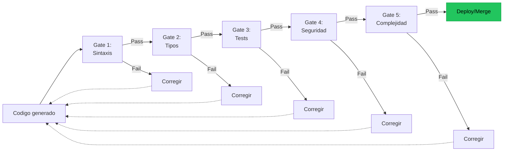
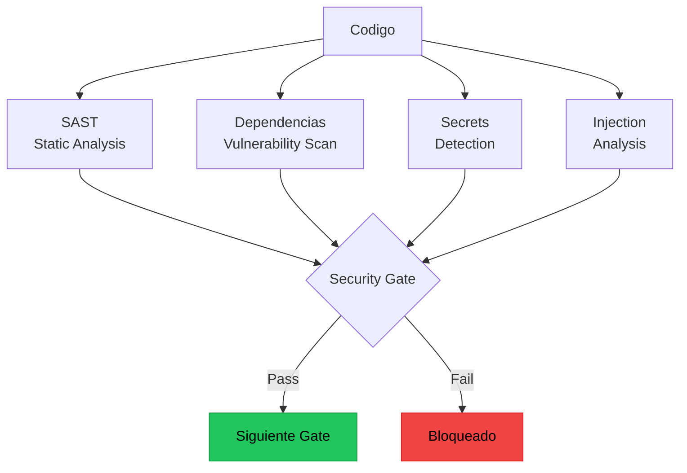
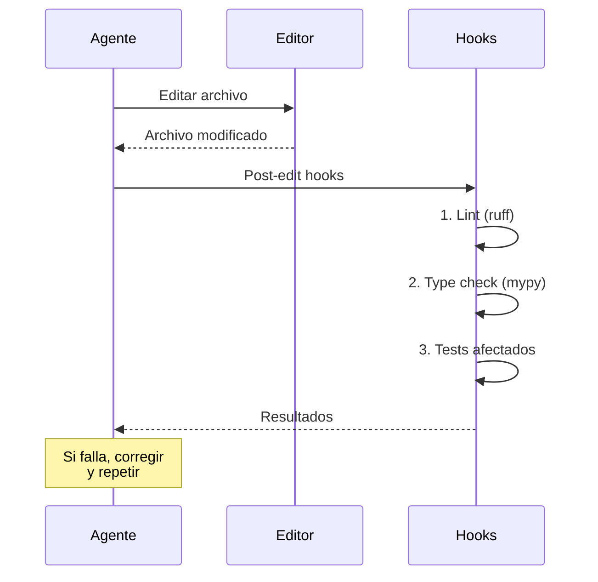
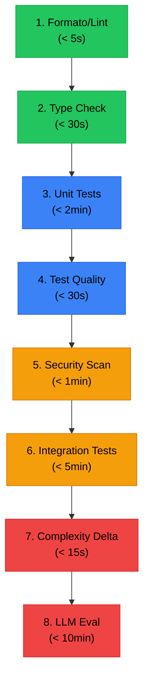

# Quality Gates en Pipelines de IA

> [!abstract] Resumen
> Los *quality gates* son ==puntos de verificacion automatizados== que deben superarse antes de que el codigo avance en el pipeline. En sistemas de IA, son especialmente criticos porque el codigo generado puede compilar y pasar tests basicos mientras contiene ==APIs alucinadas, vulnerabilidades de seguridad o tests vacios==. La implementacion de architect — *Ralph Loop* con checks de shell, *post-edit hooks* y *code health delta* — demuestra como integrar quality gates directamente en el flujo del agente. ^resumen

---

## Que son los quality gates

Un *quality gate* es una condicion booleana que debe evaluarse como verdadera para que el proceso continue. En el contexto de pipelines de IA, los quality gates verifican que el codigo generado o modificado cumple estandares minimos de calidad.



> [!info] Quality gates vs tests
> Un test verifica comportamiento. Un quality gate ==decide si el proceso continua o se detiene==. Los tests pueden ser uno de los quality gates, pero no son el unico tipo. Linting, type checking, security scanning y complexity analysis son quality gates que no requieren ejecutar tests.

---

## Taxonomia de quality gates

### Gates de sintaxis y formato

| Gate | Herramienta | ==Que detecta== | Costo |
|------|------------|-----------------|-------|
| Linting | Ruff, ESLint | ==Errores de estilo y bugs potenciales== | Bajo |
| Formateo | Black, Prettier | ==Inconsistencia de formato== | Bajo |
| Import sorting | isort | ==Imports desordenados== | Bajo |
| Syntax check | `python -c "compile(...)"` | ==Errores de sintaxis== | Bajo |

> [!tip] Los gates de sintaxis son los mas baratos
> Ejecutan en milisegundos, no requieren dependencias externas pesadas, y detectan problemas que de otro modo causarian errores en etapas posteriores. ==Siempre deben ser el primer gate==.

### Gates de tipo y seguridad de tipos

```python
# mypy como quality gate
# Exit code 0 = pasa, cualquier otro = falla
# Esto es exactamente como architect lo implementa
$ mypy src/ --strict
# Success: no issues found in 45 source files
```

> [!warning] Type checking de codigo generado por IA
> Los LLMs frecuentemente generan codigo con tipos incorrectos o inexistentes. Errores comunes:
> - Usar `Optional` sin importar de `typing`
> - Tipos que no existen en la version de Python del proyecto
> - Generics incorrectos (`list[str]` en Python 3.8)
> - Tipos de retorno que no coinciden con el return real

### Gates de testing

El gate mas obvio pero con matices importantes cuando el codigo — o los tests — son generados por IA.

> [!danger] El test generado puede ser el problema
> Un LLM puede generar codigo que pasa los tests porque ==los tests tambien fueron generados con defectos==. [[vigil-overview|Vigil]] detecta estos problemas con sus 26 reglas:
> - Tests sin assertions
> - `assert True`
> - Todo mockeado
> - Cobertura superficial
>
> El quality gate de testing debe verificar tanto que los tests pasen como que ==los tests sean significativos==.

### Gates de seguridad



### Gates de complejidad

| Metrica | Descripcion | ==Umbral tipico== |
|---------|-------------|-------------------|
| Complejidad ciclomatica | Numero de caminos independientes | ==< 10 por funcion== |
| Lineas por funcion | Longitud de funciones | ==< 50 lineas== |
| Codigo duplicado | Bloques repetidos | ==< 5% duplicacion== |
| Profundidad de anidamiento | Niveles de if/for/while | ==< 4 niveles== |
| Cohesion de modulo | Responsabilidades por modulo | ==Alta (LCOM < 0.5)== |

---

## Implementacion en architect

[[architect-overview|Architect]] implementa quality gates en multiples niveles, creando un sistema de verificacion integral.

### El Ralph Loop

El nucleo del sistema de quality gates de architect. Concepto simple pero poderoso:

1. Definir checks como comandos shell
2. Ejecutar el comando
3. `exit 0` = el check pasa
4. Cualquier otro exit code = el check falla
5. El agente recibe el error y lo corrige
6. Repetir hasta que todos pasen

> [!example]- Ejemplo: Configuracion de checks en architect
> ```yaml
> # architect.yaml
> checks:
>   - name: "Type checking"
>     command: "mypy src/ --strict"
>     required: true
>
>   - name: "Linting"
>     command: "ruff check src/"
>     required: true
>
>   - name: "Tests"
>     command: "pytest tests/ -x --tb=short"
>     required: true
>
>   - name: "Security scan"
>     command: "bandit -r src/ -ll"
>     required: true
>
>   - name: "Complexity check"
>     command: "radon cc src/ -a -nc"
>     required: false  # Warning, no bloquea
>
>   - name: "Coverage"
>     command: "pytest --cov=src --cov-fail-under=80"
>     required: true
> ```

> [!success] La elegancia del exit code
> El patron `exit 0 = pass` es universalmente compatible. Cualquier herramienta de linea de comandos puede ser un quality gate: linters, type checkers, test runners, scripts custom, incluso `curl` para verificar una API. No se necesita un formato de reporte especifico.

### Post-Edit Hooks

Despues de cada edicion de codigo, architect ejecuta automaticamente:



> [!info] Post-edit hooks vs CI quality gates
> Los post-edit hooks son quality gates ==en tiempo de edicion==, no en CI. El agente recibe feedback inmediato y puede corregir antes de hacer commit. Esto es mucho mas eficiente que esperar al pipeline de CI para descubrir un error de tipos.

### Code Health Delta

Architect analiza el ==cambio en la salud del codigo== (delta), no solo el estado actual:

| Metrica | Antes | Despues | ==Delta== | Evaluacion |
|---------|-------|---------|-----------|------------|
| Complejidad ciclomatica | 8.2 | 8.5 | ==+0.3== | Aceptable |
| Codigo duplicado | 3.1% | 3.0% | ==-0.1%== | Mejora |
| Funciones largas | 5 | 7 | ==+2== | Warning |
| Lineas de test | 450 | 520 | ==+70== | Mejora |

> [!tip] Delta es mas util que valor absoluto
> Un proyecto legacy puede tener complejidad ciclomatica promedio de 15. Exigir < 10 en un gate bloquea todo trabajo. Pero exigir que ==el delta no sea positivo== (o sea < +2) permite trabajo en el legacy mientras previene degradacion.

---

## Diseno de quality gates efectivos

### Principios de diseno

> [!warning] Antipatrones de quality gates
> - **Gate demasiado estricto**: Bloquea trabajo legitimo, el equipo lo desactiva
> - **Gate demasiado laxo**: No detecta nada, da falsa confianza
> - **Gate lento**: Tarda > 5 minutos, interrumpe el flujo de trabajo
> - **Gate no informativo**: Falla sin explicar que esta mal o como corregirlo
> - **Gate sin override**: No hay forma de bypassear en emergencias (con audit trail)

### Orden optimo de gates



> [!tip] Fail fast
> Ordenar gates de mas rapido a mas lento. Si el lint falla en 2 segundos, no tiene sentido esperar 10 minutos por el eval de LLM. ==El gate mas rapido y barato va primero==.

### Gates condicionales

No todos los gates deben ejecutarse siempre:

```yaml
gates:
  - name: "Security scan"
    condition: "files_changed('src/**/*.py')"
    required: true

  - name: "Frontend tests"
    condition: "files_changed('frontend/**')"
    required: true

  - name: "LLM eval"
    condition: "files_changed('prompts/**') or files_changed('config/model*.yaml')"
    required: true

  - name: "Full integration"
    condition: "branch == 'main' or label == 'full-test'"
    required: true
```

---

## Quality gates para codigo generado por IA

El codigo generado por IA necesita gates adicionales que el codigo humano no requiere:

| Gate especifico de IA | ==Que detecta== | Herramienta |
|----------------------|-----------------|-------------|
| API verification | ==APIs alucinadas que no existen== | ast + importlib |
| Test quality check | ==Tests vacios, assert True== | vigil (26 reglas) |
| Dependency check | ==Dependencias no declaradas== | pipreqs + diff |
| Pattern check | ==Antipatrones comunes de LLM== | Custom rules |
| License check | ==Codigo con licencia incompatible== | scancode |

> [!example]- Ejemplo: Gate custom para detectar APIs alucinadas
> ```python
> #!/usr/bin/env python3
> """Quality gate: detecta llamadas a APIs que no existen."""
> import ast
> import importlib
> import sys
>
> def check_imports(filepath: str) -> list[str]:
>     """Verifica que todos los imports existen."""
>     errors = []
>     with open(filepath) as f:
>         tree = ast.parse(f.read())
>
>     for node in ast.walk(tree):
>         if isinstance(node, ast.Import):
>             for alias in node.names:
>                 try:
>                     importlib.import_module(alias.name)
>                 except ImportError:
>                     errors.append(
>                         f"L{node.lineno}: import '{alias.name}' - "
>                         f"modulo no encontrado (posible alucinacion)"
>                     )
>         elif isinstance(node, ast.ImportFrom):
>             if node.module:
>                 try:
>                     mod = importlib.import_module(node.module)
>                     for alias in node.names:
>                         if not hasattr(mod, alias.name):
>                             errors.append(
>                                 f"L{node.lineno}: from {node.module} "
>                                 f"import {alias.name} - "
>                                 f"'{alias.name}' no existe en "
>                                 f"'{node.module}'"
>                             )
>                 except ImportError:
>                     errors.append(
>                         f"L{node.lineno}: from '{node.module}' - "
>                         f"modulo no encontrado"
>                     )
>     return errors
>
> if __name__ == "__main__":
>     all_errors = []
>     for filepath in sys.argv[1:]:
>         errors = check_imports(filepath)
>         all_errors.extend(errors)
>
>     if all_errors:
>         print("API Verification FAILED:")
>         for error in all_errors:
>             print(f"  {error}")
>         sys.exit(1)  # Gate falla
>     else:
>         print("API Verification PASSED")
>         sys.exit(0)  # Gate pasa
> ```

---

## Metricas de quality gates

| Metrica | Descripcion | ==Objetivo== |
|---------|-------------|-------------|
| Gate pass rate | % de ejecuciones que pasan todos los gates | ==> 80% (el agente corrige)== |
| Mean time to pass | Tiempo promedio desde primer fallo hasta que pasa | ==< 3 iteraciones== |
| False positive rate | % de bloqueos que son falsos positivos | ==< 2%== |
| Gate coverage | % del codigo cubierto por al menos un gate | ==100%== |
| Escape rate | % de bugs que pasan todos los gates | ==< 5%== |

> [!question] Un gate que nunca falla es util?
> No. Un gate que siempre pasa probablemente es demasiado laxo y deberia ajustarse. Un buen gate falla ==lo suficiente para ser util== pero no tanto como para ser molesto. El sweet spot es 10-20% de fallas que el agente corrige automaticamente.

---

## Relacion con el ecosistema

Los quality gates son el sistema nervioso del ecosistema — conectan verificacion automatizada con cada fase del desarrollo.

[[intake-overview|Intake]] puede definir quality gates como parte de la especificacion normalizada. Cuando intake procesa un requisito como "la funcion debe tener 100% de cobertura de tests", esto se traduce directamente en un gate: `pytest --cov=modulo --cov-fail-under=100`.

[[architect-overview|Architect]] es la implementacion de referencia de quality gates en agentes. El Ralph Loop, los post-edit hooks y el code health delta son tres niveles de gates que operan en momentos diferentes: durante la tarea, tras cada edicion, y como evaluacion global. Los 717+ tests son la evidencia de que este sistema funciona.

[[vigil-overview|Vigil]] opera como un quality gate especializado en la calidad de tests. Sus 26 reglas deterministicas verifican que los tests generados son significativos — no solo que pasan. Vigil complementa el gate de testing (que verifica que los tests pasan) con un meta-gate (que verifica que los tests son buenos).

[[licit-overview|Licit]] convierte los resultados de quality gates en evidencia de compliance. Cada ejecucion de gate produce un registro auditable: que se verifico, cuando, resultado, y si hubo override. Estos registros se incluyen en *evidence bundles* que demuestran due diligence en la calidad del software.

---

## Enlaces y referencias

> [!quote]- Bibliografia y recursos
> - Fowler, M. "Continuous Integration." martinfowler.com, 2006. [^1]
> - Humble, J. & Farley, D. "Continuous Delivery." Addison-Wesley, 2010. [^2]
> - Google. "Building Secure and Reliable Systems." O'Reilly, 2020. [^3]
> - SonarSource. "Quality Gates." SonarQube Documentation, 2024. [^4]
> - Ruff Documentation. "The Extremely Fast Python Linter." 2024. [^5]

[^1]: El articulo seminal sobre integracion continua que introdujo el concepto de gates automatizados.
[^2]: Libro de referencia sobre delivery continuo con capitulos sobre quality gates.
[^3]: Perspectiva de Google sobre como construir sistemas confiables con verificacion automatizada.
[^4]: SonarQube popularizo el termino "quality gate" en el ecosistema Java/enterprise.
[^5]: Ruff como ejemplo de herramienta de linting ultrarapida ideal para quality gates.
