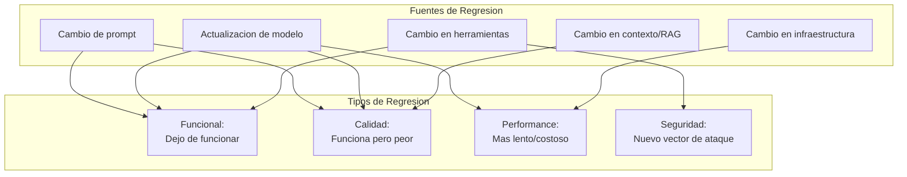
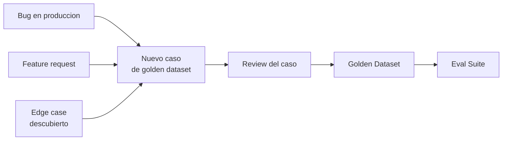
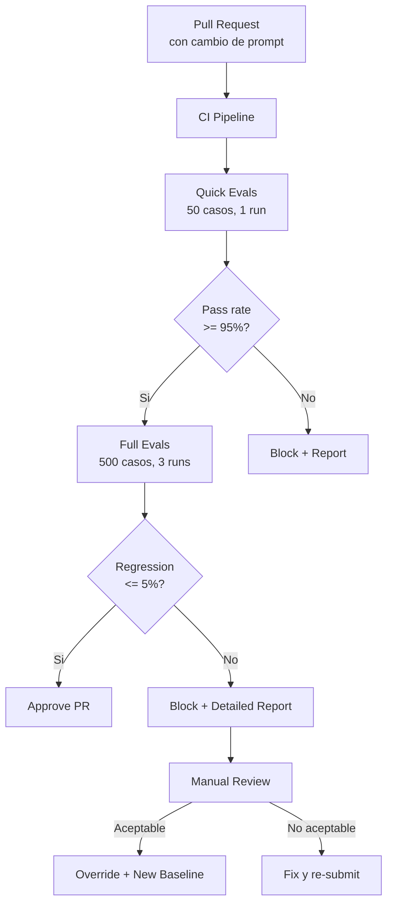

# Regression Testing para Sistemas de IA

> [!abstract] Resumen
> Cambiar un prompt, actualizar un modelo o modificar la logica del agente puede ==romper casos que antes funcionaban correctamente==. El regression testing para IA requiere ==golden datasets curados==, ==snapshot testing adaptado== al no-determinismo, y ==eval suites versionadas== que se ejecutan en cada cambio. La integracion con CI/CD — bloqueando merges cuando se detecta regresion — es fundamental para mantener la calidad a medida que el sistema evoluciona. ^resumen

---

## El problema de la regresion en IA

En software convencional, la regresion ocurre cuando un cambio rompe funcionalidad existente. En sistemas de IA, el problema se amplifica por multiples factores:



> [!warning] La regresion silenciosa
> La forma mas peligrosa de regresion en IA es la ==regresion de calidad==. El sistema sigue "funcionando" (no hay errores), pero las respuestas son peores. Sin metricas continuas, esto pasa desapercibido hasta que los usuarios se quejan.

---

## Golden datasets

Un *golden dataset* es un conjunto curado de pares input/output que representan el comportamiento esperado del sistema.

### Estructura de un golden dataset

| Campo | Descripcion | ==Obligatorio== |
|-------|-------------|-----------------|
| `id` | Identificador unico del caso | ==Si== |
| `input` | Entrada completa al sistema | ==Si== |
| `expected_output` | Salida de referencia | ==Si== |
| `category` | Tipo de tarea | ==Si== |
| `difficulty` | Nivel de dificultad | No |
| `assertions` | Verificaciones especificas | ==Si== |
| `metadata` | Contexto adicional | No |
| `added_date` | Cuando se agrego | ==Si== |
| `source` | Origen del caso | No |

> [!example]- Ejemplo: Golden dataset en formato JSONL
> ```jsonl
> {"id": "auth-001", "input": "Corrige el bug donde el login falla con emails que contienen +", "category": "bug-fix", "difficulty": "medium", "expected_output": {"files_modified": ["auth/validator.py"], "test_pass": true}, "assertions": [{"type": "file_contains", "path": "auth/validator.py", "value": "\\+"}, {"type": "test_passes", "command": "pytest tests/test_auth.py"}], "added_date": "2025-03-15", "source": "production-incident-#1234"}
> {"id": "refactor-001", "input": "Extrae la logica de validacion de auth/views.py a auth/validators.py", "category": "refactor", "difficulty": "easy", "expected_output": {"files_modified": ["auth/views.py", "auth/validators.py"], "complexity_delta": "negative"}, "assertions": [{"type": "file_exists", "path": "auth/validators.py"}, {"type": "test_passes", "command": "pytest tests/"}, {"type": "complexity_check", "threshold": "no_increase"}], "added_date": "2025-04-01", "source": "tech-debt-review"}
> {"id": "feature-001", "input": "Implementa rate limiting de 100 requests/minuto por usuario en el endpoint /api/search", "category": "feature", "difficulty": "hard", "expected_output": {"files_modified": ["api/middleware.py", "api/search.py", "tests/test_rate_limit.py"], "test_pass": true}, "assertions": [{"type": "test_passes", "command": "pytest tests/test_rate_limit.py"}, {"type": "contains", "path": "api/middleware.py", "value": "rate_limit"}], "added_date": "2025-05-10", "source": "sprint-planning"}
> ```

### Curado y mantenimiento

> [!tip] Reglas para curar golden datasets
> 1. **Diversidad**: Cubrir todas las categorias de tarea que el agente maneja
> 2. **Dificultad graduada**: Incluir casos faciles, medios y dificiles
> 3. **Fuentes reales**: Preferir casos de produccion sobre sinteticos
> 4. **Assertions verificables**: Cada caso debe tener assertions deterministicas
> 5. **Actualizacion continua**: Agregar nuevos casos regularmente, especialmente de bugs encontrados



---

## Snapshot testing adaptado

El *snapshot testing* clasico compara output exacto. Para IA, necesitamos ==comparacion flexible==.

### Niveles de comparacion

| Nivel | Que compara | ==Tolerancia== | Uso |
|-------|-----------|----------------|-----|
| Exacto | String completo | ==Ninguna== | Solo para outputs deterministicos |
| Estructural | Schema/formato del output | ==Formato flexible== | JSON, listas, tablas |
| Semantico | Significado del contenido | ==Parafraseo ok== | Respuestas de texto libre |
| Funcional | Resultado de ejecutar el output | ==Proceso flexible== | Codigo generado |

> [!example]- Ejemplo: Snapshot testing con comparacion multi-nivel
> ```python
> from snapshot_testing import Snapshot, ComparisonLevel
>
> class TestAgentSnapshots:
>     """Snapshot tests con comparacion flexible."""
>
>     def test_snapshot_estructural(self, agent, snapshot: Snapshot):
>         """Verifica que la estructura del output no cambio."""
>         result = agent.run("Lista 3 mejoras para el codigo")
>
>         snapshot.assert_match(
>             result,
>             level=ComparisonLevel.STRUCTURAL,
>             schema={
>                 "type": "object",
>                 "properties": {
>                     "improvements": {
>                         "type": "array",
>                         "minItems": 3,
>                         "items": {
>                             "type": "object",
>                             "required": ["title", "description", "priority"]
>                         }
>                     }
>                 }
>             }
>         )
>
>     def test_snapshot_semantico(self, agent, snapshot: Snapshot):
>         """Verifica que el significado no cambio significativamente."""
>         result = agent.run("Explica el bug en auth.py linea 42")
>
>         snapshot.assert_match(
>             result,
>             level=ComparisonLevel.SEMANTIC,
>             similarity_threshold=0.75,
>             required_concepts=["autenticacion", "validacion", "email"]
>         )
>
>     def test_snapshot_funcional(self, agent, snapshot: Snapshot):
>         """Verifica que el codigo generado sigue funcionando."""
>         result = agent.run("Escribe un test para la funcion parse_date")
>
>         snapshot.assert_match(
>             result,
>             level=ComparisonLevel.FUNCTIONAL,
>             execution_command="pytest -x",
>             expected_exit_code=0
>         )
> ```

---

## Eval suites versionadas

Un *eval suite* es un conjunto de evaluaciones que se ejecutan como unidad.

### Estructura del eval suite

```
evals/
  v1.0/
    dataset.jsonl          # Casos de evaluacion
    config.yaml            # Configuracion del suite
    metrics.yaml           # Metricas y umbrales
    baseline_results.json  # Resultados de referencia
  v1.1/
    dataset.jsonl          # Nuevos casos agregados
    config.yaml
    metrics.yaml
    baseline_results.json
    CHANGELOG.md           # Que cambio y por que
```

> [!info] Versionado del eval suite
> Cada version del eval suite corresponde a un estado del sistema. Cuando cambias prompts o modelos, creas una nueva version del eval suite con:
> - Los mismos casos existentes (para detectar regresion)
> - Nuevos casos (para expandir cobertura)
> - Nuevos baselines (si la regresion en algunos casos es aceptable)

```yaml
# evals/v1.1/config.yaml
name: agent-eval-suite
version: "1.1"
model: claude-3-sonnet-20240229
previous_version: "1.0"

regression_policy:
  max_regression_rate: 0.05  # Max 5% de casos pueden empeorar
  critical_cases_regression: 0  # Ningun caso critico puede empeorar
  new_cases_pass_rate: 0.80  # 80% de nuevos casos deben pasar

execution:
  runs_per_case: 3  # Ejecutar cada caso 3 veces
  timeout_per_case: 120  # 2 minutos max por caso
  parallel: true
  max_concurrent: 5
```

---

## Integracion con CI/CD



### GitHub Actions para regression testing

> [!example]- Ejemplo: GitHub Action para eval regression
> ```yaml
> name: LLM Eval Regression
> on:
>   pull_request:
>     paths:
>       - 'prompts/**'
>       - 'config/model*.yaml'
>       - 'src/agent/**'
>
> jobs:
>   quick-eval:
>     runs-on: ubuntu-latest
>     steps:
>       - uses: actions/checkout@v4
>
>       - name: Run quick eval suite
>         run: |
>           python -m evals.runner \
>             --suite evals/current/ \
>             --subset quick \
>             --runs 1 \
>             --output results/quick.json
>
>       - name: Check regression
>         run: |
>           python -m evals.regression_check \
>             --current results/quick.json \
>             --baseline evals/current/baseline_results.json \
>             --max-regression 0.05 \
>             --critical-regression 0
>
>       - name: Post results to PR
>         if: always()
>         uses: actions/github-script@v7
>         with:
>           script: |
>             const results = require('./results/quick.json');
>             const body = `## Eval Results
>             - Pass rate: ${results.pass_rate}%
>             - Regression: ${results.regression_rate}%
>             - New passes: ${results.new_passes}`;
>             github.rest.issues.createComment({
>               issue_number: context.issue.number,
>               owner: context.repo.owner,
>               repo: context.repo.repo,
>               body
>             });
> ```

> [!danger] No skipear evals en CI
> La tentacion de desactivar evals en CI para acelerar merges es enorme. ==Cada eval skippeado es una regresion potencial que llega a produccion sin detectar==. Si los evals son muy lentos, optimiza el subset, no elimines el check.

---

## Prompt versioning y rollback

Los prompts son codigo — deben versionarse con la misma disciplina.

### Estrategia de versionado

```python
# prompts/agent_system.py
SYSTEM_PROMPTS = {
    "v1.0": """Eres un asistente de programacion...""",
    "v1.1": """Eres un asistente de programacion experto...
    IMPORTANTE: Siempre verifica tipos...""",
    "v1.2": """Eres un asistente de programacion experto...
    IMPORTANTE: Siempre verifica tipos...
    NUEVO: Incluye docstrings en funciones generadas...""",
}

# Configuracion selecciona version activa
ACTIVE_PROMPT_VERSION = os.getenv("PROMPT_VERSION", "v1.2")
```

> [!tip] Rollback rapido
> Si una nueva version del prompt causa regresion en produccion:
> 1. Cambiar `PROMPT_VERSION` a la version anterior
> 2. Deploy inmediato (no requiere cambio de codigo)
> 3. Investigar y corregir el prompt
> 4. Re-ejecutar eval suite completo
> 5. Deploy de la version corregida

Los [[quality-gates|quality gates]] de architect implementan esta idea: cada cambio se verifica automaticamente, y si falla, el agente puede revertir al estado anterior.

---

## Metricas de regresion

| Metrica | Formula | ==Umbral critico== |
|---------|---------|-------------------|
| Regression Rate | Casos que empeoraron / Total | ==< 5%== |
| Critical Regression | Casos criticos que empeoraron | ==0== |
| Net Quality Delta | (Mejoras - Regresiones) / Total | ==> 0== |
| Pass Rate Delta | Pass rate nuevo - Pass rate anterior | ==>= -2%== |
| Cost Delta | Costo nuevo / Costo anterior | ==< 1.2x== |

> [!success] Un buen regression report incluye
> - Lista exacta de casos que empeoraron (con diff)
> - Lista de casos que mejoraron
> - Analisis de las categorias mas afectadas
> - Comparacion de metricas agregadas
> - Recomendacion: merge, fix, o investigar

---

## Deteccion de regresion por modelo

Cuando el proveedor actualiza el modelo silenciosamente, la [[reproducibilidad-ia|reproducibilidad]] se rompe.

```python
class ModelRegressionDetector:
    """Detecta regresion causada por actualizaciones de modelo."""

    def __init__(self, baseline_fingerprints: dict):
        self.baselines = baseline_fingerprints

    def check(self, model: str, current_fingerprint: str) -> bool:
        """Retorna True si el modelo cambio desde el baseline."""
        baseline = self.baselines.get(model)
        if baseline is None:
            return False  # Sin baseline, no podemos comparar
        return current_fingerprint != baseline

    def run_canary_tests(self, model: str) -> dict:
        """Ejecuta tests canario para detectar cambio de comportamiento."""
        canary_prompts = [
            ("2+2", lambda r: "4" in r),
            ("Capital de Francia", lambda r: "Paris" in r.lower()),
            ("def hello():", lambda r: "print" in r or "return" in r),
        ]
        results = {}
        for prompt, check in canary_prompts:
            output = llm.complete(prompt, model=model)
            results[prompt] = check(output)
        return results
```

> [!question] Como detectar actualizaciones silenciosas del modelo?
> 1. Guardar el `system_fingerprint` en cada ejecucion
> 2. Ejecutar tests canario diarios con prompts fijos
> 3. Monitorear metricas de produccion por cambios abruptos
> 4. Suscribirse a changelogs del proveedor
> 5. Mantener eval suite ejecutandose periodicamente (no solo en PRs)

---

## Relacion con el ecosistema

El regression testing es el sistema inmunologico del ecosistema — detecta y previene degradaciones en cada componente.

[[intake-overview|Intake]] necesita regression testing para su normalizacion de especificaciones. Si un cambio en el parser hace que especificaciones previamente bien procesadas se normalicen incorrectamente, el golden dataset de intake lo detectara. Los criterios de test que intake incluye son tambien sujetos de regression: deben seguir siendo verificables.

[[architect-overview|Architect]] tiene un enfoque natural hacia regression testing a traves de su *Ralph Loop*. Cada check definido (comando shell, exit 0 = pass) es implicitamente un regression test: si un cambio del agente rompe algo que funcionaba, el check fallara y el agente debera corregir. Los 717+ tests del propio codebase de architect son el golden dataset mas extenso del ecosistema.

[[vigil-overview|Vigil]] puede sufrir regresion en sus 26 reglas. Un cambio en una regla podria causar falsos positivos o dejar de detectar problemas reales. Regression testing para vigil significa mantener un corpus de tests con defectos conocidos y verificar que las reglas siguen detectandolos.

[[licit-overview|Licit]] necesita que los reportes de regression testing se incluyan en *evidence bundles*. Un audit trail que muestre que las evaluaciones pasaron antes del deployment — y que no hubo regresion significativa — es evidencia clave de compliance.

---

## Enlaces y referencias

> [!quote]- Bibliografia y recursos
> - Google. "Continuous Evaluation of ML Models." Google Cloud Architecture, 2024. [^1]
> - MLflow Documentation. "Model Registry and Evaluation." 2024. [^2]
> - Ribeiro, M. T. et al. "Beyond Accuracy: Behavioral Testing of NLP Models." ACL 2020. [^3]
> - Breck, E. et al. "The ML Test Score: A Rubric for ML Production Readiness." 2017. [^4]
> - Sato, D. et al. "Continuous Delivery for Machine Learning." martinfowler.com, 2023. [^5]

[^1]: Guia de Google Cloud sobre evaluacion continua como practica de MLOps.
[^2]: MLflow como herramienta para tracking de metricas y comparacion de versiones de modelos.
[^3]: Paper seminal sobre testing comportamental de modelos de NLP que inspira el regression testing moderno.
[^4]: Rubrica para evaluar la madurez de testing en sistemas de ML en produccion.
[^5]: Articulo de Martin Fowler sobre CD/CI para machine learning incluyendo regression testing.
