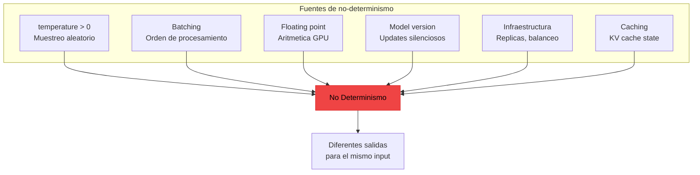
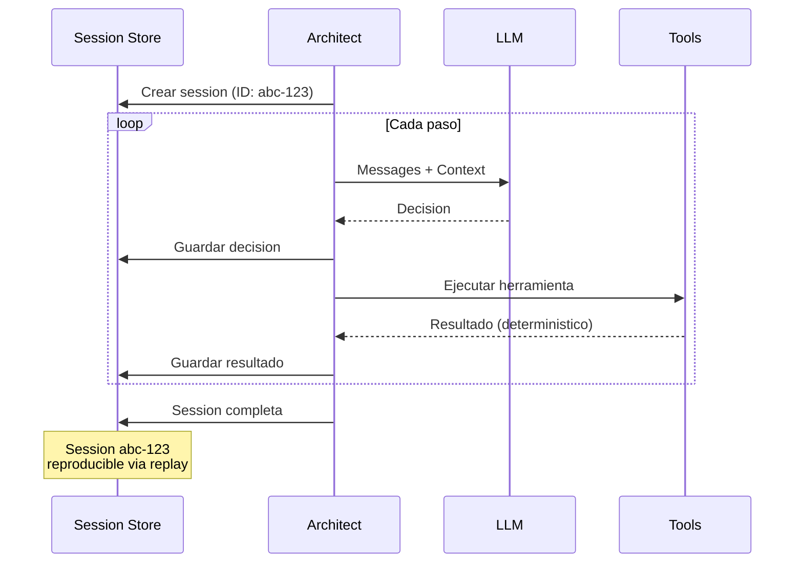
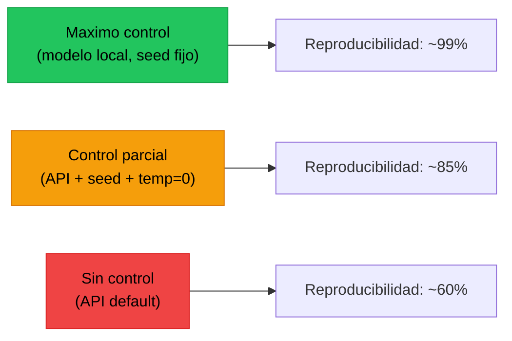

# Reproducibilidad en Sistemas de IA

> [!abstract] Resumen
> La reproducibilidad es uno de los desafios mas fundamentales en sistemas de IA. ==`temperature=0` NO garantiza determinismo== — el batching del servidor, la aritmetica de punto flotante en GPU y las actualizaciones silenciosas del modelo pueden cambiar las salidas. Los seeds ayudan parcialmente pero ==no son garantia entre proveedores==. La verdadera reproducibilidad requiere un enfoque multi-capa: prompt versioning, state snapshots, session tracking y ejecucion determinista de herramientas. Architect aborda esto con auto-save de sesiones y session IDs para tracking. ^resumen

---

## Por que la reproducibilidad es tan dificil



> [!danger] temperature=0 NO es deterministico
> Es el malentendido mas comun. Aun con `temperature=0`, las salidas pueden variar por:
>
> 1. **Batching del servidor**: El proveedor agrupa requests en batches. Diferentes tamanos de batch cambian la aritmetica de atencion
> 2. **Aritmetica de GPU**: Las operaciones de punto flotante no son asociativas en GPU. `(a+b)+c != a+(b+c)` cuando se ejecutan en diferente orden
> 3. **Paralelismo**: Diferentes niveles de paralelismo cambian el orden de acumulacion
> 4. **KV cache**: El estado del cache puede diferir entre replicas
> 5. **Model updates**: El proveedor puede actualizar el modelo sin notificar

---

## El espectro de reproducibilidad

| Nivel | Descripcion | ==Alcanzable?== | Metodo |
|-------|-------------|----------------|--------|
| Bit-exact | Exactamente los mismos bytes | ==Solo local con seed fijo== | llama.cpp con seed |
| Token-exact | Mismos tokens, mismo orden | ==Parcial con temperatura 0 + seed== | API seed param |
| Semantic-equivalent | Mismo significado, diferente redaccion | ==Si, con evaluacion semantica== | Embedding similarity |
| Functionally-equivalent | Mismo resultado funcional | ==Si, con verificacion== | Tests funcionales |
| Outcome-equivalent | Misma tarea resuelta | ==Si, con evals flexibles== | Eval suites |

> [!info] El nivel apropiado depende del caso de uso
> - **Debugging**: Necesitas token-exact para reproducir un bug
> - **Testing**: Semantic-equivalent suele ser suficiente
> - **Evaluacion**: Functionally-equivalent es el estandar
> - **Produccion**: Outcome-equivalent es lo que importa

---

## Seeds: ayuda parcial

### Implementacion por proveedor

| Proveedor | ==Soporte de seed== | API | Notas |
|-----------|-------------------|-----|-------|
| OpenAI | ==Si (param `seed`)== | `seed=42` | Incluye `system_fingerprint` para detectar cambios |
| Anthropic | ==No (solo temperature)== | `temperature=0` | Mayor consistencia pero sin garantia |
| Google | ==Si (param `seed`)== | `seed=42` | Variable entre regiones |
| Mistral | ==Si (param `random_seed`)== | `random_seed=42` | Experimental |
| Local (llama.cpp) | ==Si (control completo)== | `--seed 42` | ==Maximo determinismo posible== |

> [!example]- Ejemplo: Usando seed con verificacion de fingerprint
> ```python
> import openai
> from hashlib import sha256
>
> class ReproducibleLLM:
>     """Wrapper que maximiza reproducibilidad y detecta cambios."""
>
>     def __init__(self, model: str, seed: int = 42):
>         self.client = openai.OpenAI()
>         self.model = model
>         self.seed = seed
>         self.last_fingerprint = None
>
>     def complete(self, messages: list[dict], **kwargs) -> dict:
>         response = self.client.chat.completions.create(
>             model=self.model,
>             messages=messages,
>             temperature=0,
>             seed=self.seed,
>             **kwargs
>         )
>
>         current_fp = response.system_fingerprint
>
>         # Detectar cambio de modelo
>         if self.last_fingerprint and current_fp != self.last_fingerprint:
>             import warnings
>             warnings.warn(
>                 f"System fingerprint cambio: "
>                 f"{self.last_fingerprint} -> {current_fp}. "
>                 f"Los resultados pueden diferir de ejecuciones anteriores."
>             )
>
>         self.last_fingerprint = current_fp
>
>         return {
>             "content": response.choices[0].message.content,
>             "fingerprint": current_fp,
>             "content_hash": sha256(
>                 response.choices[0].message.content.encode()
>             ).hexdigest()[:16],
>         }
>
> # Uso
> llm = ReproducibleLLM(model="gpt-4", seed=42)
> result1 = llm.complete([{"role": "user", "content": "2+2?"}])
> result2 = llm.complete([{"role": "user", "content": "2+2?"}])
>
> # Generalmente iguales, pero NO garantizado
> print(result1["content_hash"] == result2["content_hash"])  # Probablemente True
> print(result1["fingerprint"] == result2["fingerprint"])     # Debe ser True
> ```

> [!warning] Seeds no son portables entre proveedores
> `seed=42` en OpenAI y `seed=42` en Google no producen el mismo output. Los seeds son internos a cada proveedor y modelo. ==No existe un estandar universal de seeds para LLMs==.

---

## Prompt versioning

Los prompts son el "codigo fuente" de los sistemas de IA — deben versionarse con la misma disciplina.

### Estrategias de versionado

```mermaid
graph LR
    subgraph "Estrategia 1: Git puro"
        G1[prompts/system.txt]
        G2[prompts/agent.txt]
        G3[Git history = versiones]
    end

    subgraph "Estrategia 2: Versionado explicito"
        V1[prompts/v1.0/system.txt]
        V2[prompts/v1.1/system.txt]
        V3[prompts/v2.0/system.txt]
    end

    subgraph "Estrategia 3: Config + template"
        C1[config.yaml: prompt_version: 1.1]
        C2[templates/system_{version}.txt]
    end
```

> [!tip] Mejores practicas de prompt versioning
> 1. **Cada cambio de prompt = commit dedicado** con mensaje descriptivo
> 2. **Asociar version de prompt con eval results**: v1.0 tuvo score 0.82, v1.1 tiene 0.87
> 3. **Feature flags para prompts**: Poder cambiar version en runtime sin deploy
> 4. **Rollback sin redeploy**: Cambiar una variable de entorno, no el codigo
> 5. **Diff legible**: Formatear prompts para que los diffs sean claros

### Migracion de prompts

```python
class PromptMigration:
    """Sistema de migracion de prompts con rollback."""

    def __init__(self, prompt_dir: str):
        self.prompt_dir = prompt_dir
        self.versions = self._load_versions()

    def get_active(self) -> str:
        """Retorna el prompt activo."""
        version = os.getenv("PROMPT_VERSION", self._latest())
        return self.versions[version]

    def rollback(self, to_version: str):
        """Rollback a una version anterior."""
        if to_version not in self.versions:
            raise ValueError(f"Version {to_version} no existe")
        os.environ["PROMPT_VERSION"] = to_version
        # Log del rollback para audit trail
        self._log_rollback(to_version)

    def compare(self, v1: str, v2: str) -> dict:
        """Compara dos versiones de prompt."""
        import difflib
        diff = list(difflib.unified_diff(
            self.versions[v1].splitlines(),
            self.versions[v2].splitlines(),
            fromfile=f"v{v1}",
            tofile=f"v{v2}",
        ))
        return {
            "diff": "\n".join(diff),
            "lines_added": sum(1 for l in diff if l.startswith("+")),
            "lines_removed": sum(1 for l in diff if l.startswith("-")),
        }
```

---

## State snapshots

Capturar el estado completo del sistema en un momento dado para poder reproducir exactamente la misma ejecucion.

### Que capturar

| Componente | ==Que guardar== | Formato |
|-----------|-----------------|---------|
| Prompt version | Hash del prompt utilizado | ==String (SHA)== |
| Model identifier | Nombre + version exacta | ==String== |
| System fingerprint | Fingerprint del proveedor | ==String== |
| Messages history | Historial completo de conversacion | ==JSON== |
| Tool results | Resultados de cada herramienta | ==JSON== |
| Configuration | Toda la configuracion del sistema | ==YAML/JSON== |
| Environment | Variables de entorno relevantes | ==Key-value== |
| Timestamp | Momento exacto de la ejecucion | ==ISO 8601== |

> [!example]- Ejemplo: State snapshot completo
> ```python
> from dataclasses import dataclass, asdict
> from datetime import datetime
> import json
> import hashlib
>
> @dataclass
> class AgentStateSnapshot:
>     """Snapshot completo del estado del agente."""
>     session_id: str
>     timestamp: str
>     model: str
>     model_fingerprint: str | None
>     prompt_version: str
>     prompt_hash: str
>     temperature: float
>     seed: int | None
>     messages: list[dict]
>     tool_calls: list[dict]
>     tool_results: list[dict]
>     configuration: dict
>     total_tokens_used: int
>     total_cost_usd: float
>     final_status: str
>
>     def save(self, path: str):
>         """Guarda el snapshot en disco."""
>         with open(path, "w") as f:
>             json.dump(asdict(self), f, indent=2, default=str)
>
>     @classmethod
>     def load(cls, path: str) -> "AgentStateSnapshot":
>         """Carga un snapshot desde disco."""
>         with open(path) as f:
>             data = json.load(f)
>         return cls(**data)
>
>     def content_hash(self) -> str:
>         """Hash del contenido para verificar integridad."""
>         content = json.dumps(asdict(self), sort_keys=True, default=str)
>         return hashlib.sha256(content.encode()).hexdigest()[:16]
>
>     def replay_messages(self) -> list[dict]:
>         """Retorna los mensajes para replay de la sesion."""
>         return self.messages
> ```

---

## El enfoque de architect

[[architect-overview|Architect]] aborda la reproducibilidad con multiples mecanismos:

### Session auto-save

Cada sesion se guarda automaticamente con su historial completo de mensajes. Esto permite:
- Revisar exactamente que hizo el agente
- Reproducir la sesion con el mismo contexto
- Comparar sesiones diferentes para la misma tarea

### Session ID para tracking

Cada sesion tiene un ID unico que permite:
- Rastrear la sesion en logs
- Correlacionar con costos
- Vincular con resultados de evaluacion

### Ejecucion determinista de herramientas

> [!success] Las herramientas de architect son deterministicas
> Mientras que el LLM decide ==que hacer==, la ejecucion de las herramientas es determinista:
> - `read_file("src/auth.py")` siempre retorna el mismo contenido (dado el mismo estado del filesystem)
> - `run_command("pytest")` produce resultado deterministico dado el mismo codigo
> - `edit_file(path, changes)` aplica cambios identicos
>
> Esto significa que si replays los mensajes con las mismas decisiones del LLM, las herramientas produciran los mismos resultados.



---

## Estrategias practicas de reproducibilidad

### Para debugging

> [!tip] Cuando necesitas reproducir un bug
> 1. Obtener el session ID o snapshot de la ejecucion problematica
> 2. Cargar el historial de mensajes exacto
> 3. Verificar el fingerprint del modelo (si cambio, la reproduccion no sera exacta)
> 4. Replayar con el mismo seed y temperature=0
> 5. Si no reproduce, comparar snapshots para identificar la fuente de divergencia

### Para testing

```python
class ReproducibilityTestHelper:
    """Helper para tests que necesitan reproducibilidad."""

    @staticmethod
    def assert_reproducible(
        fn: callable,
        args: dict,
        n_runs: int = 5,
        min_identical_rate: float = 0.8
    ):
        """Verifica que una funcion produce resultados
        reproducibles al menos el X% de las veces."""
        results = []
        for _ in range(n_runs):
            result = fn(**args)
            results.append(result)

        # Contar resultados identicos
        from collections import Counter
        counter = Counter(str(r) for r in results)
        most_common_count = counter.most_common(1)[0][1]
        identical_rate = most_common_count / n_runs

        assert identical_rate >= min_identical_rate, (
            f"Solo {identical_rate:.0%} de {n_runs} ejecuciones "
            f"fueron identicas (minimo: {min_identical_rate:.0%}). "
            f"Distribucion: {dict(counter)}"
        )
```

### Para evaluacion

> [!question] Es posible evaluar reproducibilidad?
> Si, como metrica:
> - Ejecutar la misma tarea N veces
> - Medir la varianza en los resultados
> - Reportar reproducibilidad como `1 - (varianza / max_varianza)`
>
> Un score de 1.0 = perfectamente reproducible. Score de 0.5 = alta variabilidad.

---

## Limites fundamentales de la reproducibilidad

> [!danger] Aceptar lo que no se puede controlar
> Algunos aspectos del no-determinismo estan fuera de nuestro control:
>
> 1. **Actualizaciones del proveedor**: No podemos prevenir que OpenAI/Anthropic actualicen sus modelos
> 2. **Infraestructura**: No controlamos el batching ni el hardware del proveedor
> 3. **Punto flotante**: La aritmetica de GPU tiene no-determinismo inherente
> 4. **Escala**: Mayor escala = mas fuentes de variacion
>
> La estrategia correcta no es buscar determinismo perfecto, sino ==disenar sistemas que funcionen correctamente a pesar del no-determinismo==.

### El espectro de control



---

## Relacion con el ecosistema

La reproducibilidad es el fundamento sobre el que se construye la confianza en todo el ecosistema.

[[intake-overview|Intake]] debe ser reproducible: la misma especificacion procesada dos veces debe producir la misma normalizacion. Como intake es principalmente deterministico (parsing, no LLM), la reproducibilidad deberia ser alta. Cualquier componente de LLM en intake debe documentar su nivel de reproducibilidad.

[[architect-overview|Architect]] aborda la reproducibilidad con session auto-save, session IDs y ejecucion determinista de herramientas. Aunque las decisiones del LLM pueden variar, el tracking completo de la sesion permite diagnostico y comparacion. El sistema de evaluacion (eval) ejecuta multiples runs para compensar la variabilidad.

[[vigil-overview|Vigil]] es completamente deterministico — sus 26 reglas producen el mismo resultado cada vez para el mismo input. Esto lo convierte en un componente de referencia en el ecosistema: ==cuando necesitas un resultado reproducible, vigil lo garantiza==.

[[licit-overview|Licit]] necesita reproducibilidad para auditoria. Si un *evidence bundle* dice que el sistema paso una evaluacion, un auditor debe poder verificarlo. Los snapshots de sesion y los hashes de contenido permiten este tipo de verificacion post-facto.

---

## Enlaces y referencias

> [!quote]- Bibliografia y recursos
> - OpenAI. "Reproducible Outputs." API Reference, 2024. [^1]
> - Narayanan, D. et al. "Challenges in Deploying Machine Learning." MLSys 2020. [^2]
> - Pineau, J. et al. "Improving Reproducibility in Machine Learning Research." JMLR 2021. [^3]
> - Tatman, R. et al. "A Practical Taxonomy of Reproducibility for Machine Learning Research." 2018. [^4]
> - llama.cpp. "Deterministic Generation." Documentation, 2024. [^5]

[^1]: Documentacion oficial de OpenAI sobre el parametro seed y las limitaciones de reproducibilidad.
[^2]: Paper sobre los desafios reales de deployar ML, incluyendo reproducibilidad en produccion.
[^3]: Checklist de reproducibilidad adoptado por las principales conferencias de ML.
[^4]: Taxonomia practica que distingue entre diferentes niveles de reproducibilidad.
[^5]: Documentacion de llama.cpp mostrando como lograr el maximo determinismo con modelos locales.
