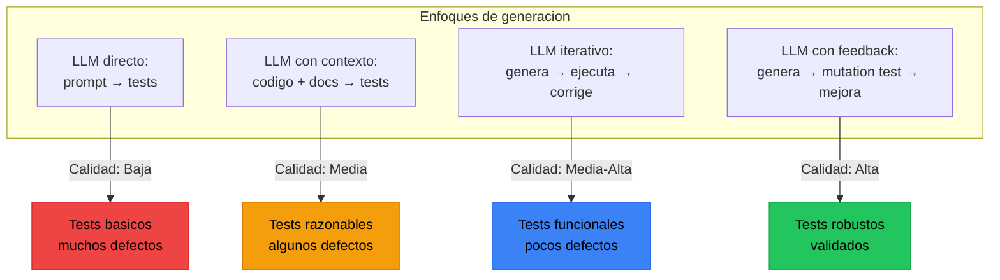
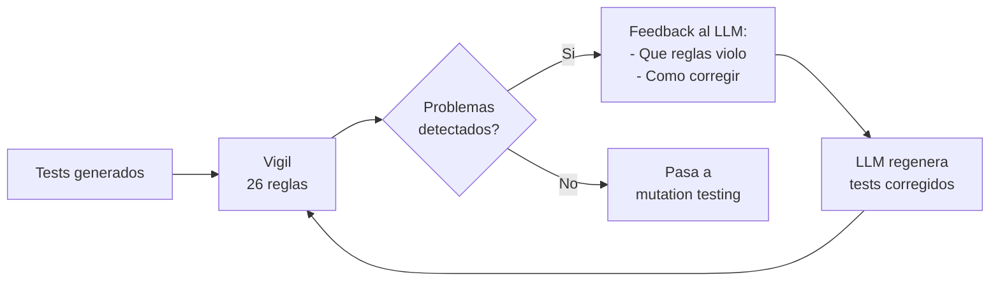
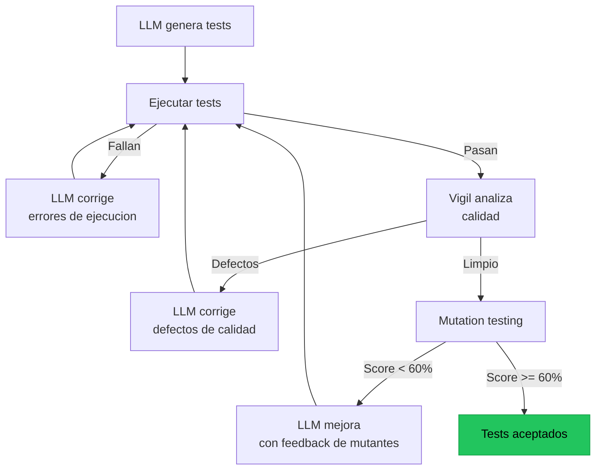

# Generacion Automatica de Tests con IA

> [!abstract] Resumen
> Los LLMs pueden generar tests unitarios, de integracion y de propiedades automaticamente. Sin embargo, la calidad varia enormemente: desde tests robustos hasta ==assertions vacias que siempre pasan==. [[vigil-overview|Vigil]] detecta los problemas mas comunes con sus 26 reglas. Las mejores practicas incluyen ==proveer contexto rico al LLM== (codigo + docstrings + tests existentes), ==especificar tipos de assertion esperados== y ==validar los tests generados con mutation testing==. Architect integra generacion de tests en su flujo usando checks como requisitos verificables. ^resumen

---

## El estado de la generacion automatica de tests



> [!info] La generacion de tests ha mejorado drasticamente
> En 2023, los tests generados por IA eran mayormente inutiles. En 2025, con contexto adecuado y validacion iterativa, un LLM puede generar tests que cubren la mayoria de los caminos de ejecucion. El problema ya no es "puede generar tests?" sino "los tests que genera son significativos?"

---

## Problemas comunes de calidad

### La taxonomia de defectos en tests generados

| Defecto | Descripcion | ==Frecuencia== | Detectado por |
|---------|-------------|---------------|---------------|
| Empty assertion | `assert True`, sin verificacion real | ==Alta== | ==Vigil (regla)== |
| No assertions | Test ejecuta codigo pero no verifica nada | ==Alta== | ==Vigil (regla)== |
| Over-mocking | Todo esta mockeado, no prueba nada real | ==Media== | ==Vigil (regla)== |
| Shallow coverage | Solo prueba el happy path | ==Alta== | Mutation testing |
| Hardcoded values | Valores fijos que causan flakiness | ==Alta== | Review + ejecucion |
| Implementation testing | Prueba la implementacion, no el comportamiento | ==Media== | Review |
| Missing edge cases | Sin tests para null, vacio, limites | ==Alta== | Mutation testing |
| Incorrect expectations | El expected value esta mal | ==Baja== | Ejecucion |

> [!danger] El problema del "test que siempre pasa"
> Un LLM puede generar un test que:
> 1. Se ejecuta sin errores
> 2. Reporta PASS
> 3. Tiene 100% de cobertura de lineas
> 4. ==No detectaria ningun bug si lo hubiese==
>
> Esto es peor que no tener tests porque crea ==falsa confianza==.

### Deteccion con vigil

[[vigil-overview|Vigil]] aplica 26 reglas deterministicas para detectar defectos en tests:



> [!example]- Ejemplo: Vigil detectando defectos en tests generados
> ```
> $ vigil analyze tests/test_generated.py
>
> tests/test_generated.py:15 [CRITICAL] empty-assertion
>   assert True  # No verifica nada
>
> tests/test_generated.py:28 [CRITICAL] no-assertion
>   Funcion test_process_data() no contiene assertions
>
> tests/test_generated.py:42 [WARNING] mocked-everything
>   test_calculate() tiene 4 mocks para 2 lineas de codigo real
>
> tests/test_generated.py:55 [WARNING] shallow-coverage
>   test_validate() solo prueba el caso positivo, falta caso negativo
>
> Summary: 2 critical, 2 warnings, 0 info
> Tests need improvement before acceptance.
> ```

---

## Mejores practicas para generar tests con IA

### 1. Proveer contexto rico

> [!tip] Cuanto mas contexto, mejores tests
> El LLM genera tests mucho mejores cuando tiene:
> - El codigo fuente completo de la funcion/clase
> - Los docstrings y type hints
> - Tests existentes como ejemplo de estilo
> - La estructura del proyecto
> - Dependencias y fixtures disponibles

> [!example]- Ejemplo: Prompt con contexto rico vs pobre
> ```python
> # CONTEXTO POBRE (tests genericos)
> prompt_pobre = "Genera tests para una funcion calculate_discount"
>
> # CONTEXTO RICO (tests especificos y robustos)
> prompt_rico = """Genera tests pytest para la siguiente funcion.
>
> Codigo:
> ```python
> def calculate_discount(price: float, quantity: int, is_member: bool = False) -> float:
>     '''Calcula el precio con descuento.
>
>     Reglas:
>     - 5+ items: 10% descuento
>     - 10+ items: 20% descuento
>     - Miembros: 5% adicional
>     - Precio nunca puede ser negativo
>
>     Args:
>         price: Precio unitario (debe ser >= 0)
>         quantity: Cantidad (debe ser >= 1)
>         is_member: Si es miembro del programa
>
>     Returns:
>         Precio total con descuento aplicado
>
>     Raises:
>         ValueError: Si price < 0 o quantity < 1
>     '''
> ```
>
> Tests existentes en el proyecto usan:
> - pytest con fixtures
> - pytest.raises para excepciones
> - pytest.approx para comparaciones float
> - Nombres descriptivos en espanol
>
> Genera tests que cubran:
> 1. Cada rango de descuento (0-4, 5-9, 10+)
> 2. Boundary values (exactamente 5, exactamente 10)
> 3. Combinacion con membresia
> 4. Inputs invalidos (precio negativo, cantidad 0)
> 5. Edge cases (precio 0, cantidad 1)
>
> NO uses assert True. Cada assertion debe verificar un valor especifico.
> """
> ```

### 2. Especificar tipos de assertion

```python
ASSERTION_GUIDANCE = """
Para cada test, usa assertions apropiadas:
- Valores numericos: pytest.approx(expected, rel=1e-6)
- Excepciones: pytest.raises(ExceptionType, match="mensaje")
- Colecciones: assert len(x) == N, assert item in collection
- Tipos: assert isinstance(result, ExpectedType)
- Propiedades: assert result.field == expected_value

NO uses:
- assert True
- assert result  (sin comparacion)
- assert result is not None (a menos que None sea un caso valido)
"""
```

### 3. Validacion iterativa



---

## Herramientas de generacion de tests

### Copilot Test Generation

Integrado directamente en el IDE, genera tests basados en el contexto del archivo abierto.

| Aspecto | ==Valor== |
|---------|----------|
| Integracion | ==VS Code, JetBrains nativo== |
| Contexto | Archivo actual + imports |
| Calidad tipica | Media (requiere revision) |
| Costo | Incluido en Copilot subscription |
| Frameworks | pytest, jest, JUnit, etc. |

### CodiumAI / Qodo

Herramienta especializada en generacion de tests con analisis de comportamiento.

> [!success] Ventajas de CodiumAI/Qodo
> - Genera tests con analisis previo de comportamientos posibles
> - Sugiere edge cases automaticamente
> - Distingue entre tests unitarios y de comportamiento
> - Integrado con IDE y CI

### Architect como generador de tests

[[architect-overview|Architect]] genera tests como parte de su flujo de desarrollo, no como herramienta separada.

```yaml
# Los checks definen requisitos de testing
checks:
  - name: "Tests de la nueva funcion"
    command: "pytest tests/test_new_feature.py -v"

  - name: "Cobertura minima"
    command: "pytest --cov=src/new_feature --cov-fail-under=90"

  - name: "Type checking"
    command: "mypy src/new_feature.py"
```

El agente:
1. Genera el codigo de produccion
2. Genera los tests que satisfacen los checks
3. Ejecuta los checks (Ralph Loop)
4. Si fallan, corrige y vuelve al paso 2
5. Los post-edit hooks validan tras cada cambio

> [!info] La diferencia de architect
> No es "genera tests para este codigo". Es "genera codigo que pase estos checks, incluyendo tests". Los checks son la ==especificacion==, no un paso posterior. Esto alinea naturalmente la generacion de tests con [[evals-como-producto|eval-driven development]].

---

## Patrones de generacion efectiva

### Patron: Test-First con LLM

```python
# 1. Humano define la interfaz
class UserService:
    def create_user(self, email: str, name: str) -> User: ...
    def get_user(self, user_id: int) -> User | None: ...
    def delete_user(self, user_id: int) -> bool: ...

# 2. LLM genera tests PRIMERO
# (con prompt que incluye la interfaz + requisitos)

# 3. LLM genera implementacion que pase los tests

# 4. Vigil + mutation testing validan la calidad
```

### Patron: Tests por analogia

> [!tip] Proporciona tests existentes como ejemplo
> Si tienes `test_user_service.py` bien escrito, el LLM puede generar `test_order_service.py` siguiendo el mismo patron, estilo y nivel de detalle. Esto produce tests mucho mas consistentes que generar desde cero.

### Patron: Tests de regresion a partir de bugs

```python
REGRESSION_TEST_PROMPT = """Se encontro el siguiente bug en produccion:

Bug: {bug_description}
Archivo afectado: {file_path}
Lineas relevantes: {relevant_code}
Fix aplicado: {fix_diff}

Genera un test de regresion que:
1. FALLA antes del fix (reproduce el bug)
2. PASA despues del fix (verifica la correccion)
3. Previene que el bug reaparezca

El test debe ser especifico al bug, no generico.
Incluye un docstring explicando que bug previene.
"""
```

---

## Metricas de calidad de generacion

| Metrica | Descripcion | ==Objetivo== |
|---------|-------------|-------------|
| Generation success rate | % de tests que compilan y ejecutan | ==> 90%== |
| Vigil pass rate | % de tests sin defectos segun vigil | ==> 85%== |
| Mutation score | % de mutaciones detectadas | ==> 60%== |
| Flaky rate | % de tests intermitentes | ==< 5%== |
| Edge case coverage | % de edge cases cubiertos | ==> 70%== |
| Iteration count | Intentos hasta tests aceptables | ==< 3== |

> [!question] Vale la pena la generacion automatica de tests?
> **Si**, con caveats:
> - Ahorra 60-80% del tiempo de escritura de tests
> - Los tests generados necesitan revision (10-20% del tiempo ahorrado)
> - La calidad mejora enormemente con contexto rico
> - Los defectos son sistematicamente detectables (vigil + mutation)
> - El ROI es positivo si se tiene infraestructura de validacion

---

## Anti-patrones a evitar

> [!failure] Lo que NO hacer con generacion de tests
> 1. **Generar y olvidar**: No revisar los tests generados
> 2. **Confiar en cobertura de lineas**: Alta cobertura != buenos tests
> 3. **No proveer contexto**: El LLM genera tests genericos sin contexto
> 4. **No validar con mutation**: Tests que pasan pueden no detectar bugs
> 5. **No dar feedback**: No usar los errores del LLM para mejorar el prompt
> 6. **Generar en bulk**: Es mejor generar tests incrementalmente
> 7. **Ignorar flakiness**: No ejecutar tests multiples veces para detectar

---

## Relacion con el ecosistema

La generacion automatica de tests es el punto de convergencia entre la creacion de codigo y la verificacion de calidad.

[[intake-overview|Intake]] proporciona los requisitos que informan que tests generar. Si intake normaliza una especificacion que dice "el endpoint debe retornar 404 para IDs inexistentes", esto se traduce directamente en un test de regresion generado automaticamente: `assert response.status_code == 404`.

[[architect-overview|Architect]] integra generacion de tests en su flujo de desarrollo. Los checks definidos en la configuracion actuan como especificaciones de tests: el agente debe generar tests que satisfagan estos checks. Los post-edit hooks validan inmediatamente tras cada cambio, creando un ciclo tight de generacion → validacion → correccion.

[[vigil-overview|Vigil]] es el guardian de calidad de los tests generados. Sus 26 reglas detectan los defectos mas comunes sin necesidad de ejecucion: tests vacios, assert True, over-mocking, ausencia de assertions. Sin vigil, los tests generados por IA pasan desapercibidos con defectos criticos.

[[licit-overview|Licit]] necesita verificar que los tests generados cumplen estandares de compliance. Si la regulacion exige que el software tenga test coverage auditables, los tests generados por IA deben ser tan robustos como los escritos manualmente. Los reportes de vigil y mutation testing se incluyen en *evidence bundles*.

---

## Enlaces y referencias

> [!quote]- Bibliografia y recursos
> - Lemieux, C. et al. "CodaMosa: Escaping Coverage Plateaus in Test Generation with Pre-trained LLMs." ICSE 2023. [^1]
> - Deng, Y. et al. "Large Language Models are Edge-Case Generators." ISSTA 2024. [^2]
> - GitHub. "Copilot Test Generation." Documentation, 2024. [^3]
> - Qodo. "AI-Powered Code Integrity." Documentation, 2024. [^4]
> - Kang, S. et al. "Large Language Models are Few-Shot Testers." ICSE 2023. [^5]

[^1]: Paper que combina LLMs con algoritmos de generacion de tests para superar plateaus de cobertura.
[^2]: Investigacion sobre la capacidad de LLMs para generar edge cases que los humanos omiten.
[^3]: Documentacion oficial de la funcionalidad de generacion de tests de GitHub Copilot.
[^4]: Herramienta lider en generacion de tests con analisis de comportamiento.
[^5]: Estudio seminal sobre el uso de LLMs para generacion de tests con pocos ejemplos.
