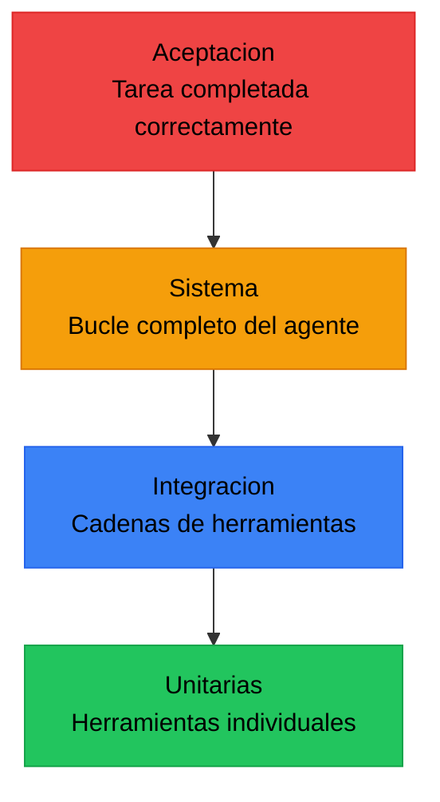
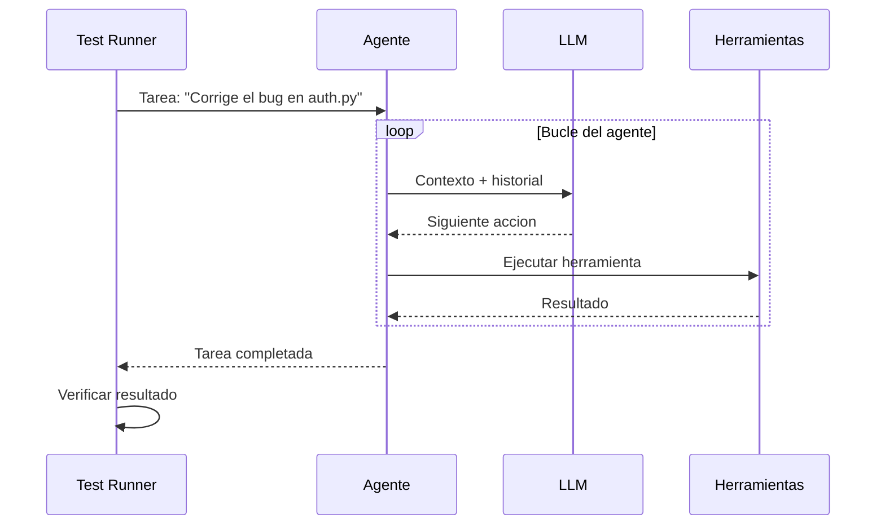
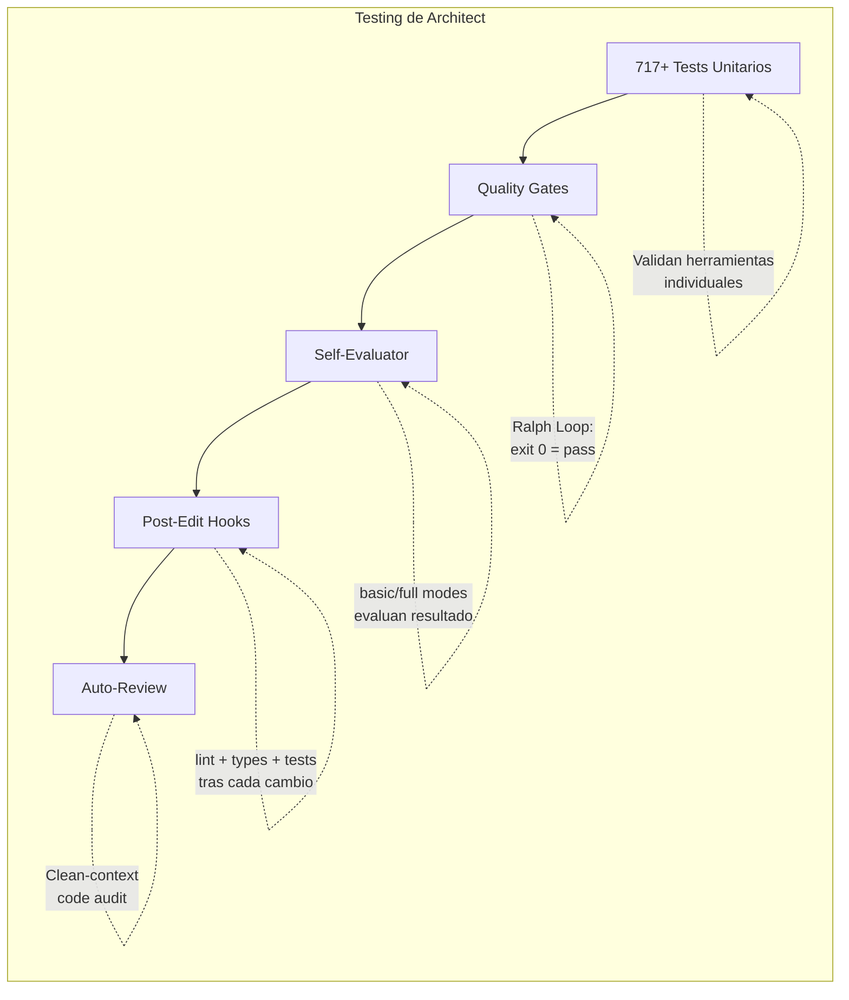

# Testing de Agentes IA

> [!abstract] Resumen
> Un framework completo para probar agentes de IA que abarca desde ==pruebas unitarias de herramientas individuales== hasta ==pruebas de aceptacion del sistema completo==. La piramide de testing para agentes difiere sustancialmente de la piramide clasica: la base son las herramientas, el medio son las cadenas de herramientas, y la cima es el bucle completo del agente. Los desafios principales incluyen ==no-determinismo==, ==costos elevados== y ==tiempos de ejecucion prolongados==. ^resumen

---

## Por que el testing de agentes es diferente

Los agentes de IA no son software convencional. Un agente combina un *LLM* como motor de razonamiento con herramientas externas, memoria y bucles de retroalimentacion. Esto introduce complejidades que el testing tradicional no contempla.

> [!info] Diferencias fundamentales
> - El mismo input puede producir diferentes secuencias de acciones
> - El agente puede tomar caminos validos pero impredecibles hacia la solucion
> - Las herramientas externas introducen dependencias de estado
> - El costo por ejecucion de test puede ser significativo (tokens de API)
> - Los tiempos de ejecucion son ordenes de magnitud mayores

La [[testing-llm-outputs|evaluacion de salidas de LLM]] es solo una pieza del rompecabezas. Un agente completo requiere validar el razonamiento, la seleccion de herramientas, el manejo de errores y la convergencia hacia la solucion.

---

## La piramide de testing para agentes



### Nivel 1: Pruebas unitarias de herramientas

La base de la piramide. Cada herramienta (*tool*) del agente debe probarse de forma aislada con entradas conocidas y salidas esperadas.

| Aspecto | Que probar | Ejemplo |
|---------|-----------|---------|
| ==Entradas validas== | La herramienta procesa correctamente inputs bien formados | `search("python decorators")` retorna resultados |
| ==Entradas invalidas== | Manejo graceful de errores | `search("")` retorna error descriptivo |
| ==Casos limite== | Comportamiento en fronteras | `search("a" * 10000)` no causa crash |
| Timeout | Respuesta dentro de limites | Operacion completa en < 30s |
| Idempotencia | Multiples ejecuciones, mismo resultado | `read_file("x.py")` siempre retorna lo mismo |

> [!example]- Ejemplo: Test unitario de herramienta de busqueda
> ```python
> import pytest
> from agent.tools import SearchTool
>
> class TestSearchTool:
>     """Tests unitarios para la herramienta de busqueda."""
>
>     def setup_method(self):
>         self.tool = SearchTool(index_path="test_fixtures/index")
>
>     def test_busqueda_basica_retorna_resultados(self):
>         resultado = self.tool.execute(query="python decorators")
>         assert len(resultado.items) > 0
>         assert all(hasattr(item, "score") for item in resultado.items)
>
>     def test_busqueda_vacia_retorna_error(self):
>         with pytest.raises(ValidationError, match="query no puede estar vacia"):
>             self.tool.execute(query="")
>
>     def test_busqueda_con_caracteres_especiales(self):
>         resultado = self.tool.execute(query="C++ templates <T>")
>         assert resultado.status == "success"
>
>     def test_resultados_ordenados_por_relevancia(self):
>         resultado = self.tool.execute(query="asyncio event loop")
>         scores = [item.score for item in resultado.items]
>         assert scores == sorted(scores, reverse=True)
>
>     def test_limite_de_resultados_respetado(self):
>         resultado = self.tool.execute(query="python", max_results=5)
>         assert len(resultado.items) <= 5
>
>     def test_timeout_manejado_correctamente(self):
>         with pytest.raises(TimeoutError):
>             self.tool.execute(query="slow_query", timeout=0.001)
> ```

### Nivel 2: Pruebas de integracion de cadenas

Aqui verificamos que las herramientas funcionan correctamente en secuencia, como el agente las usaria. La [[contract-testing-agentes|verificacion de contratos]] entre herramientas es clave.

> [!tip] Patron de prueba de cadena
> Simula la secuencia de llamadas que el agente haria para una tarea especifica:
> 1. Buscar informacion relevante
> 2. Leer archivos identificados
> 3. Modificar codigo
> 4. Ejecutar verificaciones
>
> Verifica que la salida de cada paso es compatible con la entrada del siguiente.

> [!example]- Ejemplo: Test de integracion de cadena de herramientas
> ```python
> class TestToolChainIntegration:
>     """Verifica que las herramientas funcionan en cadena."""
>
>     async def test_cadena_buscar_leer_modificar(self, temp_project):
>         search = SearchTool(index_path=temp_project.index)
>         reader = FileReaderTool(root=temp_project.root)
>         editor = FileEditorTool(root=temp_project.root)
>
>         # Paso 1: Buscar archivos relevantes
>         resultados = search.execute(query="funcion de autenticacion")
>         assert len(resultados.items) > 0
>
>         # Paso 2: Leer el archivo encontrado
>         archivo = resultados.items[0].path
>         contenido = reader.execute(path=archivo)
>         assert "def authenticate" in contenido.text
>
>         # Paso 3: Modificar el archivo
>         nuevo = contenido.text.replace(
>             "def authenticate(user, password):",
>             "def authenticate(user: str, password: str) -> bool:"
>         )
>         resultado_edit = editor.execute(
>             path=archivo,
>             content=nuevo
>         )
>         assert resultado_edit.status == "success"
>
>         # Paso 4: Verificar que el cambio persiste
>         verificacion = reader.execute(path=archivo)
>         assert "-> bool:" in verificacion.text
> ```

### Nivel 3: Pruebas de sistema del bucle completo

El test mas realista: el agente completo recibe una tarea y debe resolverla. Esto es lo que [[benchmarking-agentes|los benchmarks como SWE-bench]] miden.



> [!warning] Cuidado con el costo
> Las pruebas de sistema completo invocan el LLM multiples veces. Un solo test puede costar $0.50-$5.00 dependiendo del modelo y la complejidad. Planifica tu presupuesto de testing.

### Nivel 4: Pruebas de aceptacion

La pregunta final: ==el agente resolvio la tarea correctamente?== Aqui se evalua el resultado, no el proceso.

> [!success] Criterios de aceptacion tipicos
> - El codigo modificado compila sin errores
> - Los tests existentes siguen pasando
> - El nuevo test captura el bug reportado
> - No se introdujeron vulnerabilidades de seguridad
> - La complejidad ciclomatica no aumento significativamente

---

## Estrategias para manejar el no-determinismo

El no-determinismo es el enemigo principal del testing de agentes. La [[testing-llm-outputs|evaluacion de salidas LLM]] cubre las tecnicas para outputs individuales, pero a nivel de agente necesitamos estrategias adicionales.

### Mocking deterministico

Reemplazar el LLM con respuestas predefinidas elimina la variabilidad pero reduce el realismo.

> [!example]- Ejemplo: Mock deterministico del LLM
> ```python
> class MockLLM:
>     """LLM simulado con respuestas predefinidas."""
>
>     def __init__(self, responses: list[str]):
>         self.responses = iter(responses)
>         self.call_count = 0
>
>     async def complete(self, messages, **kwargs):
>         self.call_count += 1
>         try:
>             return next(self.responses)
>         except StopIteration:
>             raise RuntimeError(
>                 f"MockLLM agoto respuestas en llamada {self.call_count}"
>             )
>
> def test_agente_con_mock():
>     mock_llm = MockLLM(responses=[
>         '{"tool": "search", "args": {"query": "bug auth"}}',
>         '{"tool": "read_file", "args": {"path": "auth.py"}}',
>         '{"tool": "edit_file", "args": {"path": "auth.py", "changes": "..."}}',
>         '{"status": "complete", "summary": "Bug corregido"}'
>     ])
>     agent = Agent(llm=mock_llm, tools=real_tools)
>     result = agent.run("Corrige el bug de autenticacion")
>     assert result.status == "complete"
>     assert mock_llm.call_count == 4
> ```

### Testing con golden datasets

Conjuntos curados de tareas con soluciones conocidas. Relacionado con [[regression-testing-ia|regression testing]].

| Dataset | Tamano | Tipo de tarea | Metrica principal |
|---------|--------|---------------|-------------------|
| ==Golden-bugs== | 50 casos | Correccion de bugs | % resueltos correctamente |
| ==Golden-features== | 30 casos | Implementacion | % tests pasan + review |
| ==Golden-refactor== | 20 casos | Refactorizacion | Delta complejidad + tests |

### Snapshot testing

Guardar la traza completa de ejecucion del agente y compararla en ejecuciones futuras. No se exige coincidencia exacta, sino similitud estructural.

> [!question] Cuando usar cada estrategia?
> - **Mock deterministico**: Tests de CI que deben ser rapidos y 100% reproducibles
> - **Golden datasets**: Evaluacion periodica de calidad del agente
> - **Snapshot testing**: Deteccion de regresiones tras cambios en prompts o herramientas
> - **Tests estadisticos**: Validacion de que el agente cumple un umbral de exito (ej. 90% en 20 ejecuciones)

---

## Como architect se prueba a si mismo

[[architect-overview|Architect]] es un caso de estudio unico: un agente de IA con ==717+ tests en su propio codebase==. Su estrategia de testing ilustra los principios de esta nota aplicados a un sistema real.



> [!tip] Leccion de architect
> La clave no es solo tener tests, sino integrarlos en el flujo del agente. Los [[quality-gates|quality gates]] de architect ejecutan verificaciones automaticamente tras cada cambio de codigo, creando un ciclo de retroalimentacion inmediato.

### El Ralph Loop como test runner

El *Ralph Loop* de architect es conceptualmente un test runner dentro del agente:

1. El agente realiza un cambio
2. Se ejecutan los checks definidos (comandos shell)
3. Si `exit 0`, el check pasa; si no, el agente recibe el error
4. El agente itera hasta que todos los checks pasen

Esto convierte cada tarea de desarrollo en un ciclo de ==test-driven development automatizado==.

---

## Diseno de un test suite para agentes

> [!danger] Antipatrones a evitar
> - Probar solo el *happy path* y asumir que el agente manejara errores
> - Usar assertions exactas en outputs de LLM (son fragiles)
> - No tener tests de timeout/presupuesto (el agente podria ejecutarse indefinidamente)
> - Ignorar el testing de herramientas individuales y saltar directo a tests de sistema
> - No versionar los golden datasets junto con el codigo

### Estructura recomendada

```
tests/
  unit/
    tools/           # Test de cada herramienta aislada
    prompts/         # Validacion de formato de prompts
  integration/
    chains/          # Cadenas de herramientas
    contracts/       # Contract tests entre componentes
  system/
    golden/          # Golden dataset tests
    regression/      # Regression tests
  acceptance/
    benchmarks/      # Benchmarks formales
    scenarios/       # Escenarios end-to-end
  fixtures/
    mock_responses/  # Respuestas mock del LLM
    test_projects/   # Proyectos de prueba
```

> [!info] Proporcion recomendada
> - 60% unitarias (rapidas, baratas, deterministicas)
> - 25% integracion (moderadas en costo y tiempo)
> - 10% sistema (costosas pero realistas)
> - 5% aceptacion (las mas costosas, se ejecutan menos frecuentemente)

---

## Metricas de calidad del test suite

| Metrica | Descripcion | ==Umbral recomendado== |
|---------|-------------|----------------------|
| Cobertura de herramientas | % de herramientas con tests unitarios | ==100%== |
| Cobertura de caminos | % de flujos de agente cubiertos | ==80%+== |
| Tasa de flakiness | % de tests que fallan intermitentemente | ==< 5%== |
| Tiempo de ejecucion | Tiempo total del suite completo | ==< 10 min para CI== |
| Costo por ejecucion | Gasto en API de LLM por ejecucion completa | ==< $5 por run== |
| Mutation score | % de mutaciones detectadas | ==60%+== |

La [[flaky-tests-ia|gestion de tests inestables]] es especialmente critica en agentes donde la variabilidad inherente del LLM puede causar falsos positivos.

---

## Relacion con el ecosistema

La relacion entre el testing de agentes y los demas componentes del ecosistema es bidireccional y profunda.

[[intake-overview|Intake]] normaliza especificaciones que pueden incluir criterios de test desde el inicio. Una especificacion bien procesada por intake facilita la generacion automatica de tests de aceptacion: los criterios de exito se convierten directamente en assertions verificables.

[[architect-overview|Architect]] es tanto sujeto como practicante del testing de agentes. Sus 717+ tests demuestran que un agente puede mantener una suite robusta. El *Ralph Loop*, los *post-edit hooks* y el *self-evaluator* son implementaciones concretas de los niveles de la piramide de testing descritos aqui.

[[vigil-overview|Vigil]] complementa el testing dinamico con analisis estatico. Mientras esta nota cubre la ejecucion de tests, vigil con sus ==26 reglas deterministicas== analiza la calidad de los tests generados: detecta tests vacios, `assert True`, ausencia de assertions y over-mocking. La combinacion de ambos enfoques — testing dinamico y analisis estatico — es lo que produce confianza real.

[[licit-overview|Licit]] cierra el ciclo convirtiendo los resultados de testing en evidencia de compliance. Los *evidence bundles* de licit pueden incluir reportes de test suites, metricas de cobertura y resultados de benchmarks como prueba verificable de calidad.

---

## Enlaces y referencias

> [!quote]- Bibliografia y recursos
> - Anthropic. "Building Effective Agents." Anthropic Research Blog, 2024. [^1]
> - SWE-bench Team. "SWE-bench: Can Language Models Resolve Real-World GitHub Issues?" arXiv, 2023. [^2]
> - Microsoft Research. "TaskWeaver: A Code-First Agent Framework." 2023. [^3]
> - Harrison Chase. "Testing LLM Applications." LangChain Blog, 2024. [^4]
> - Shreya Rajpal. "Evaluating LLM Agents." Guardrails AI, 2024. [^5]

[^1]: Referencia fundamental sobre patrones de diseno y testing de agentes de IA.
[^2]: El benchmark mas citado para evaluar agentes de programacion.
[^3]: Framework que incluye patrones robustos de testing para agentes basados en codigo.
[^4]: Guia practica sobre estrategias de testing para aplicaciones basadas en LLM.
[^5]: Perspectiva sobre evaluacion continua de agentes en produccion.
