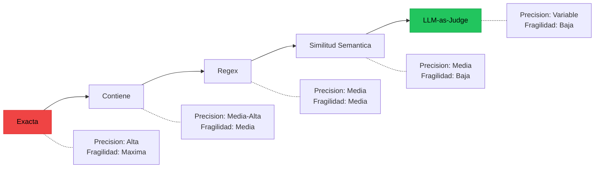
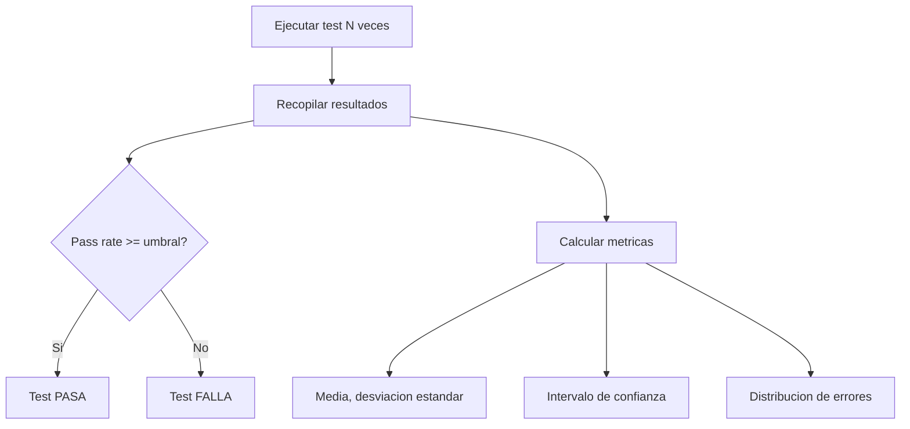

# Testing de Salidas de LLM

> [!abstract] Resumen
> Las salidas de un *LLM* son inherentemente no-deterministicas: el ==mismo prompt puede generar respuestas diferentes== en cada ejecucion. Esto requiere un cambio fundamental en la forma de escribir assertions. Este documento cubre estrategias que van desde ==coincidencia exacta== (rara vez util) hasta ==evaluacion semantica con LLM-as-judge==, pasando por assertions basadas en propiedades, testing estadistico y trucos de determinismo parcial. ^resumen

---

## El problema fundamental

En testing convencional, `assert f(x) == y` es la base. Con LLMs, esto casi nunca funciona. La misma pregunta "Que es Python?" puede producir:

- "Python es un lenguaje de programacion de alto nivel..."
- "Python es un lenguaje interpretado creado por Guido van Rossum..."
- "Se trata de un lenguaje de programacion multiparadigma..."

Todas son correctas. Ninguna coincide exactamente. El [[testing-agentes-ia|testing de agentes]] hereda este problema y lo amplifica.

> [!warning] La trampa de la coincidencia exacta
> Usar `assert output == "respuesta esperada"` con LLMs produce tests ==100% fragiles==. Cualquier cambio de modelo, version de API o incluso el orden de procesamiento en batch puede romper el test sin que haya un problema real.

---

## Espectro de estrategias de assertion



### 1. Coincidencia exacta (*Exact Match*)

Solo util cuando el formato esta completamente restringido.

```python
# Util para outputs estructurados con schema estricto
result = llm.complete("Responde SOLO 'si' o 'no': Es Python tipado?")
assert result.strip().lower() in ["si", "no"]
```

> [!tip] Cuando usar coincidencia exacta
> - Clasificacion binaria (si/no, true/false)
> - Extraccion de valores numericos especificos
> - Outputs restringidos por *constrained decoding*

### 2. Contiene (*Contains*)

Verifica que ciertos elementos aparezcan en la salida sin exigir formato exacto.

```python
result = llm.complete("Explica que es un decorador en Python")
assert "funcion" in result.lower()
assert "envuelve" in result.lower() or "wrapper" in result.lower()
assert "@" in result  # Menciona la sintaxis de decoradores
```

### 3. Expresiones regulares (*Regex*)

Mas flexibles que contains, permiten validar estructura.

> [!example]- Ejemplo: Assertions con regex para output estructurado
> ```python
> import re
>
> def test_llm_genera_json_valido():
>     result = llm.complete(
>         "Genera un JSON con campos 'nombre' (string) y 'edad' (int)"
>     )
>     # Verificar estructura JSON basica
>     pattern = r'\{[^}]*"nombre"\s*:\s*"[^"]+?"[^}]*"edad"\s*:\s*\d+[^}]*\}'
>     assert re.search(pattern, result), f"Output no tiene estructura JSON esperada: {result}"
>
> def test_llm_genera_codigo_con_funcion():
>     result = llm.complete("Escribe una funcion Python que calcule factorial")
>     # Debe definir una funcion
>     assert re.search(r'def \w+\(.*\):', result)
>     # Debe tener un caso base
>     assert re.search(r'if .*(==\s*[01]|<=\s*1)', result)
>     # Debe tener recursion o iteracion
>     has_recursion = re.search(r'return.*\w+\(', result)
>     has_loop = re.search(r'(for|while)\s+', result)
>     assert has_recursion or has_loop
>
> def test_llm_genera_lista_numerada():
>     result = llm.complete("Lista 5 lenguajes de programacion populares")
>     items = re.findall(r'\d+[\.\)]\s*\w+', result)
>     assert len(items) >= 5, f"Solo encontre {len(items)} items"
> ```

### 4. Similitud semantica (*Semantic Similarity*)

Usa embeddings para comparar el significado, no las palabras exactas.

```python
from sentence_transformers import SentenceTransformer
import numpy as np

model = SentenceTransformer('all-MiniLM-L6-v2')

def semantic_similarity(text_a: str, text_b: str) -> float:
    embeddings = model.encode([text_a, text_b])
    similarity = np.dot(embeddings[0], embeddings[1]) / (
        np.linalg.norm(embeddings[0]) * np.linalg.norm(embeddings[1])
    )
    return float(similarity)

def test_respuesta_semanticamente_correcta():
    result = llm.complete("Que es el polimorfismo en OOP?")
    referencia = "El polimorfismo permite que objetos de diferentes clases respondan al mismo mensaje de formas distintas"
    sim = semantic_similarity(result, referencia)
    assert sim > 0.7, f"Similitud semantica {sim:.2f} < 0.7"
```

> [!info] Umbrales de similitud semantica
> - **> 0.9**: Parafraseo muy cercano
> - **0.7 - 0.9**: Mismo tema y concepto
> - **0.5 - 0.7**: Relacionado pero diferente enfoque
> - **< 0.5**: Probablemente incorrecto

### 5. LLM-as-Judge

Usar otro LLM (o el mismo con prompt diferente) para evaluar la calidad de la respuesta.

> [!example]- Ejemplo: LLM como juez de calidad
> ```python
> JUDGE_PROMPT = """Evalua la siguiente respuesta a una pregunta tecnica.
>
> Pregunta: {question}
> Respuesta a evaluar: {answer}
>
> Evalua en estos criterios (1-5 cada uno):
> 1. Correccion factual
> 2. Completitud
> 3. Claridad
> 4. Relevancia
>
> Responde SOLO con un JSON:
> {{"correccion": N, "completitud": N, "claridad": N, "relevancia": N}}
> """
>
> def test_calidad_respuesta_con_llm_judge():
>     question = "Como funciona el garbage collector en Python?"
>     answer = llm.complete(question)
>
>     judgment = judge_llm.complete(
>         JUDGE_PROMPT.format(question=question, answer=answer)
>     )
>     scores = json.loads(judgment)
>
>     assert scores["correccion"] >= 4, "Respuesta factualmente incorrecta"
>     assert scores["completitud"] >= 3, "Respuesta incompleta"
>     assert scores["relevancia"] >= 4, "Respuesta no relevante"
>
>     # Score compuesto
>     avg = sum(scores.values()) / len(scores)
>     assert avg >= 3.5, f"Score promedio {avg:.1f} < 3.5"
> ```

> [!danger] Limitaciones de LLM-as-Judge
> - Sesgo de verbosidad: los jueces LLM tienden a preferir respuestas mas largas
> - Sesgo de posicion: al comparar dos respuestas, tienden a preferir la primera
> - Costo: cada evaluacion requiere una llamada adicional al LLM
> - No-determinismo: el propio juez puede variar en sus evaluaciones
> - Referencia circular: usar un LLM para evaluar un LLM introduce dependencia

---

## Trucos de determinismo

### temperature=0

> [!warning] temperature=0 NO garantiza determinismo
> Incluso con `temperature=0`, los LLMs pueden producir salidas diferentes entre ejecuciones debido a:
> - Diferentes *batching* de requests en el servidor
> - Aritmetica de punto flotante no-deterministica en GPUs
> - Cambios en la infraestructura del proveedor
> - Diferentes versiones del modelo (actualizaciones silenciosas)
>
> Ver [[reproducibilidad-ia]] para un analisis detallado.

### Parametro seed

Algunos proveedores ofrecen un parametro `seed` para mejorar la reproducibilidad:

```python
response = client.chat.completions.create(
    model="gpt-4",
    messages=[{"role": "user", "content": "Hola"}],
    temperature=0,
    seed=42  # Mejora reproducibilidad, NO la garantiza
)
# El fingerprint del sistema ayuda a detectar cambios
print(response.system_fingerprint)
```

| Proveedor | Soporte seed | ==Nivel de determinismo== |
|-----------|-------------|--------------------------|
| OpenAI | Si (seed param) | ==Alto pero no absoluto== |
| Anthropic | No (temperature=0 solamente) | ==Medio-Alto== |
| Google | Si (seed param) | ==Medio== |
| Local (llama.cpp) | Si (seed completo) | ==Muy alto== |

---

## Testing estadistico

Cuando el determinismo es imposible, tratamos las salidas como variables aleatorias.



> [!example]- Ejemplo: Test estadistico con N ejecuciones
> ```python
> from dataclasses import dataclass
> from statistics import mean, stdev
>
> @dataclass
> class StatisticalTestResult:
>     pass_rate: float
>     mean_score: float
>     std_score: float
>     n_runs: int
>     failures: list[str]
>
> def run_statistical_test(
>     prompt: str,
>     evaluator: callable,
>     n_runs: int = 20,
>     pass_threshold: float = 0.85
> ) -> StatisticalTestResult:
>     """Ejecuta un test N veces y evalua estadisticamente."""
>     scores = []
>     failures = []
>
>     for i in range(n_runs):
>         output = llm.complete(prompt)
>         score, reason = evaluator(output)
>         scores.append(score)
>         if score < 0.5:
>             failures.append(f"Run {i}: {reason}")
>
>     result = StatisticalTestResult(
>         pass_rate=sum(1 for s in scores if s >= 0.5) / n_runs,
>         mean_score=mean(scores),
>         std_score=stdev(scores) if len(scores) > 1 else 0,
>         n_runs=n_runs,
>         failures=failures
>     )
>
>     assert result.pass_rate >= pass_threshold, (
>         f"Pass rate {result.pass_rate:.0%} < {pass_threshold:.0%}. "
>         f"Failures: {result.failures[:3]}"
>     )
>     return result
> ```

> [!question] Cuantas ejecuciones son suficientes?
> - **5 ejecuciones**: Deteccion rapida de problemas graves (< 60% pass rate)
> - **20 ejecuciones**: Confianza razonable para CI (intervalos de confianza utiles)
> - **100+ ejecuciones**: Evaluacion exhaustiva para decisiones importantes
> - **Regla practica**: `n >= 1 / (1 - pass_threshold)^2` para detectar violaciones del umbral

---

## Assertions basadas en propiedades

En lugar de verificar el contenido exacto, verificamos ==propiedades que toda respuesta valida debe cumplir==. Conecta directamente con [[property-based-testing-ia|property-based testing]].

### Propiedades comunes para outputs de LLM

| Propiedad | Descripcion | Ejemplo de assertion |
|-----------|-------------|---------------------|
| ==Formato== | La salida tiene la estructura esperada | `json.loads(output)` no lanza excepcion |
| ==Longitud== | Dentro de limites razonables | `100 < len(output) < 5000` |
| ==Tono== | Consistente con las instrucciones | No contiene lenguaje inapropiado |
| ==Consistencia factual== | No se contradice a si misma | Dos partes de la respuesta no se contradicen |
| ==Idioma== | En el idioma solicitado | Detector de idioma confirma espanol |
| ==Tipo== | Output parseable al tipo esperado | Lista tiene >= N elementos |

> [!tip] Assertions de propiedad son mas robustas
> Una assertion como "la respuesta es un JSON valido con campo `items` que es una lista no vacia" sobrevive cambios de modelo, actualizaciones de API y variaciones naturales del LLM. Una assertion exacta no.

---

## Combinando estrategias

La estrategia mas robusta combina multiples niveles de assertion:

```python
def test_generacion_documentacion():
    """Test multi-nivel para generacion de docstrings."""
    code = "def factorial(n): return 1 if n <= 1 else n * factorial(n-1)"
    result = llm.complete(f"Genera un docstring para: {code}")

    # Nivel 1: Formato (deterministico)
    assert '"""' in result or "'''" in result, "No contiene docstring"

    # Nivel 2: Contenido clave (contains)
    lower = result.lower()
    assert "factorial" in lower, "No menciona factorial"
    assert any(w in lower for w in ["param", "arg", "n"]), "No documenta parametros"
    assert any(w in lower for w in ["return", "retorna", "devuelve"]), "No documenta retorno"

    # Nivel 3: Propiedades
    assert len(result) < 500, "Docstring demasiado largo"
    assert len(result) > 20, "Docstring demasiado corto"

    # Nivel 4: Semantica (si los niveles anteriores pasan)
    sim = semantic_similarity(result, "Calcula el factorial de un numero entero")
    assert sim > 0.5, f"Similitud semantica baja: {sim:.2f}"
```

---

## Herramientas especializadas

Los [[evaluation-frameworks|frameworks de evaluacion]] implementan estas estrategias como primitivas reutilizables:

| Framework | Assertions soportadas | ==Integracion CI== |
|-----------|----------------------|-------------------|
| DeepEval | Exacta, contains, semantic, LLM-judge | ==Pytest nativo== |
| Promptfoo | Todas + custom evaluators | ==CLI + GitHub Actions== |
| RAGAS | Semantic + faithfulness + relevancy | ==Python API== |
| Braintrust | Custom scorers + LLM judge | ==SDK + dashboard== |

---

## Relacion con el ecosistema

Las estrategias de testing de salidas de LLM son la base sobre la que se construye todo el ecosistema de calidad.

[[intake-overview|Intake]] produce especificaciones normalizadas que definen los criterios de aceptacion. Estos criterios se traducen directamente en assertions: si la spec dice "el output debe ser JSON con campo X", eso se convierte en una assertion de formato + contenido.

[[architect-overview|Architect]] utiliza estas estrategias internamente en su *self-evaluator*. En modo basico, verifica propiedades simples del output (compilacion, tests pasan). En modo completo, aplica evaluaciones mas sofisticadas que incluyen analisis semantico del cambio realizado versus lo solicitado.

[[vigil-overview|Vigil]] complementa el testing de outputs con analisis estatico del codigo de test. Si un test generado usa `assert True` en lugar de una assertion significativa, vigil lo detecta con sus 26 reglas. Esto es crucial porque ==un LLM puede generar tests que siempre pasan sin verificar nada==.

[[licit-overview|Licit]] consume los resultados de estas evaluaciones como evidencia de compliance. Los scores de LLM-as-judge, las tasas de exito estadisticas y los resultados de assertions se empaquetan en *evidence bundles* que demuestran cumplimiento con estandares de calidad.

---

## Enlaces y referencias

> [!quote]- Bibliografia y recursos
> - OpenAI. "Reproducible Outputs." API Documentation, 2024. [^1]
> - Zheng, L. et al. "Judging LLM-as-a-Judge." NeurIPS 2023. [^2]
> - DeepEval Documentation. "Metrics and Evaluation." 2024. [^3]
> - Confident AI. "A Guide to LLM Evaluation." Blog, 2024. [^4]
> - Braintrust. "Evals are All You Need." 2024. [^5]

[^1]: Documentacion oficial sobre el parametro seed y las limitaciones de reproducibilidad.
[^2]: Paper fundamental sobre el uso de LLMs como jueces y sus sesgos inherentes.
[^3]: Referencia tecnica para implementar assertions con DeepEval.
[^4]: Guia comprensiva sobre evaluacion de outputs de LLM.
[^5]: Perspectiva sobre evaluaciones como pilar del desarrollo de aplicaciones LLM.
