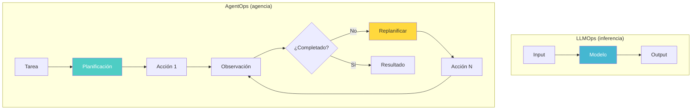
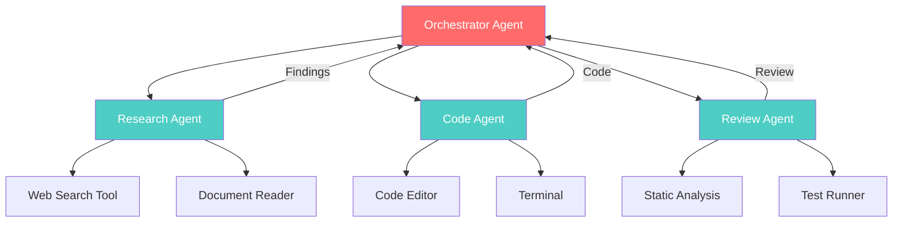
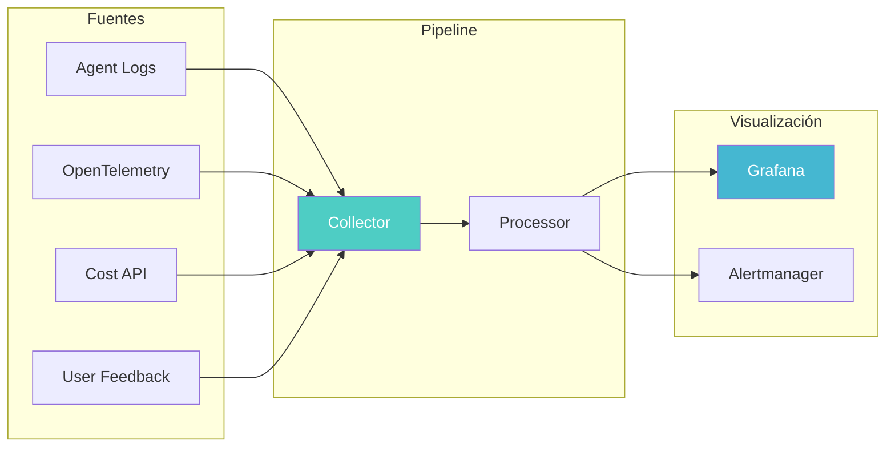
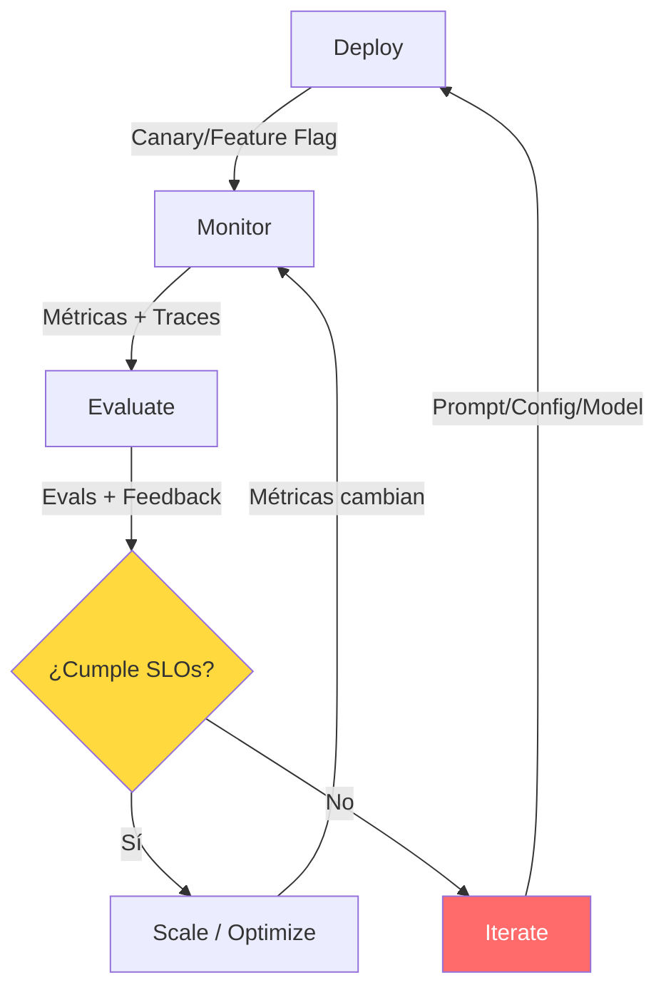
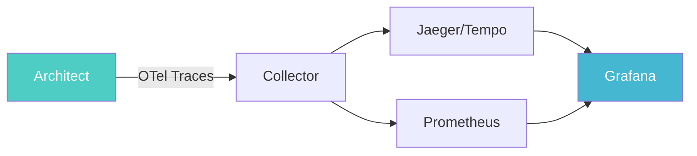

# AgentOps — Operación de Agentes en Producción

> [!abstract] Resumen
> *AgentOps* aborda los desafíos únicos de ==operar agentes de IA en producción==. Cubre patrones de despliegue (agente único, multi-agente, agent-as-a-service), métricas de monitorización (tasa de completitud, coste por tarea, latencia, tasa de error), estrategias de escalado (horizontal y vertical) y el ciclo de vida operativo: deploy, monitor, evaluate, iterate. El soporte de architect para ==gestión de sesiones y OpenTelemetry== proporciona los primitivos necesarios para AgentOps. ^resumen

---

## Qué es AgentOps

*AgentOps* es la disciplina de operar agentes de IA autónomos o semi-autónomos en entornos de producción. Mientras [[llmops|LLMOps]] se centra en la operación de modelos de lenguaje como servicios de inferencia, AgentOps aborda la complejidad adicional de sistemas que ==toman decisiones, ejecutan acciones y mantienen estado==.

> [!warning] Un agente no es un endpoint de inferencia
> Un LLM como servicio recibe input y devuelve output. Un agente:
> - **Planifica** secuencias de acciones
> - **Ejecuta** herramientas y comandos
> - **Observa** resultados y adapta su plan
> - **Mantiene** estado entre interacciones
> - **Puede fallar** de formas impredecibles y catastróficas
>
> Esta diferencia hace que AgentOps requiera prácticas específicas más allá de LLMOps.



---

## Patrones de despliegue

### 1. Agente único (*Single Agent*)

El patrón más simple: un agente que recibe tareas y las ejecuta de forma autónoma.

> [!info] Características del agente único
> - Un proceso/contenedor = un agente
> - Cola de tareas como input (SQS, Redis, RabbitMQ)
> - Estado en base de datos externa
> - Escalado horizontal simple (más instancias del mismo agente)
> - Ejemplo: [[architect-overview|architect]] ejecutando un pipeline

```yaml
# Despliegue de agente único en Kubernetes
apiVersion: apps/v1
kind: Deployment
metadata:
  name: agent-worker
spec:
  replicas: 3
  selector:
    matchLabels:
      app: agent-worker
  template:
    spec:
      containers:
        - name: agent
          image: myorg/agent:v1.2.3
          resources:
            requests:
              memory: "512Mi"
              cpu: "250m"
            limits:
              memory: "1Gi"
              cpu: "500m"
          env:
            - name: ANTHROPIC_API_KEY
              valueFrom:
                secretKeyRef:
                  name: api-keys
                  key: anthropic
            - name: AGENT_MAX_STEPS
              value: "50"
            - name: AGENT_BUDGET_USD
              value: "5.00"
```

### 2. Multi-agente (*Multi-Agent*)

Múltiples agentes especializados que colaboran para resolver tareas complejas.



> [!tip] Consideraciones para multi-agente
> - **Comunicación**: ¿Cómo se pasan información los agentes? (mensajes, estado compartido, artefactos)
> - **Coordinación**: ¿Quién decide el orden de ejecución?
> - **Conflictos**: ¿Qué pasa si dos agentes modifican el mismo recurso?
> - **Costes**: Los costes se multiplican con cada agente activo
> - **Debugging**: Rastrear problemas a través de múltiples agentes es significativamente más difícil

### 3. Agent-as-a-Service

El agente se expone como un servicio con API estandarizada, consumido por otras aplicaciones.

> [!example]- API de Agent-as-a-Service
> ```python
> from fastapi import FastAPI, BackgroundTasks
> from pydantic import BaseModel
> from uuid import uuid4
>
> app = FastAPI()
>
> class TaskRequest(BaseModel):
>     description: str
>     max_steps: int = 50
>     budget_usd: float = 5.0
>     callback_url: str | None = None
>
> class TaskResponse(BaseModel):
>     task_id: str
>     status: str
>     estimated_time_seconds: int
>
> class TaskResult(BaseModel):
>     task_id: str
>     status: str  # completed, failed, partial
>     result: dict | None
>     steps_taken: int
>     cost_usd: float
>     duration_seconds: float
>
> @app.post("/tasks", response_model=TaskResponse)
> async def create_task(request: TaskRequest, bg: BackgroundTasks):
>     task_id = str(uuid4())
>     bg.add_task(execute_agent_task, task_id, request)
>     return TaskResponse(
>         task_id=task_id,
>         status="queued",
>         estimated_time_seconds=120
>     )
>
> @app.get("/tasks/{task_id}", response_model=TaskResult)
> async def get_task(task_id: str):
>     result = await get_task_result(task_id)
>     return result
>
> @app.delete("/tasks/{task_id}")
> async def cancel_task(task_id: str):
>     await cancel_agent_task(task_id)
>     return {"status": "cancelled"}
> ```

---

## Métricas de monitorización

### Métricas operativas

| Métrica | Descripción | ==Umbral típico== | Alerta |
|---|---|---|---|
| Task completion rate | % de tareas completadas exitosamente | ==≥ 85%== | < 70% |
| Cost per task | Coste promedio en USD por tarea | ==< $2.00== | > $5.00 |
| Latency (P50/P95) | Tiempo de respuesta del agente | ==P95 < 60s== | P95 > 120s |
| Error rate | % de tareas que fallan | ==< 5%== | > 15% |
| Steps per task | Pasos promedio para completar | < 20 | > 50 |
| Token usage | Tokens consumidos por tarea | Varía | > 2x baseline |
| Hallucination rate | % de respuestas con alucinaciones | ==< 2%== | > 5% |

### Métricas de negocio

> [!success] Métricas que importan al negocio
> - **ROI del agente**: Valor generado vs coste operativo
> - **Satisfacción del usuario**: NPS/CSAT para interacciones con agentes
> - **Tiempo ahorrado**: Horas humanas sustituidas por el agente
> - **Tasa de escalación**: % de tareas que requieren intervención humana
> - **Calidad de output**: Evaluación de la calidad de los resultados

### Dashboard de monitorización



---

## Escalado de agentes

### Escalado horizontal

Más instancias del mismo agente para manejar más tareas concurrentes.

> [!tip] Cuándo escalar horizontalmente
> - La cola de tareas crece más rápido de lo que se procesan
> - Hay picos predecibles de demanda (ej: horario laboral)
> - Las tareas son independientes entre sí
> - El cuello de botella no es la API del LLM (rate limits)

> [!example]- Horizontal Pod Autoscaler para agentes
> ```yaml
> apiVersion: autoscaling/v2
> kind: HorizontalPodAutoscaler
> metadata:
>   name: agent-worker-hpa
> spec:
>   scaleTargetRef:
>     apiVersion: apps/v1
>     kind: Deployment
>     name: agent-worker
>   minReplicas: 2
>   maxReplicas: 20
>   metrics:
>     - type: External
>       external:
>         metric:
>           name: sqs_queue_length
>           selector:
>             matchLabels:
>               queue: agent-tasks
>         target:
>           type: AverageValue
>           averageValue: "5"  # 5 tareas por pod
>     - type: Resource
>       resource:
>         name: cpu
>         target:
>           type: Utilization
>           averageUtilization: 70
>   behavior:
>     scaleUp:
>       stabilizationWindowSeconds: 60
>       policies:
>         - type: Pods
>           value: 3
>           periodSeconds: 60
>     scaleDown:
>       stabilizationWindowSeconds: 300
>       policies:
>         - type: Percent
>           value: 25
>           periodSeconds: 120
> ```

### Escalado vertical

Usar un modelo más potente para tareas más complejas.

> [!info] Routing de modelo por complejidad
> | Complejidad | Modelo | ==Coste relativo== | Caso de uso |
> |---|---|---|---|
> | Baja | Claude Haiku | ==1x== | Clasificación, extraction |
> | Media | Claude Sonnet | ==5x== | Codificación, análisis |
> | Alta | Claude Opus | ==25x== | Razonamiento complejo |

```python
def select_model(task_complexity: float, urgency: str) -> str:
    """Seleccionar modelo según complejidad y urgencia."""
    if urgency == "critical" or task_complexity > 0.8:
        return "claude-opus-4-20250514"
    elif task_complexity > 0.4:
        return "claude-sonnet-4-20250514"
    else:
        return "claude-haiku"
```

---

## Ciclo de vida operativo

### Deploy → Monitor → Evaluate → Iterate



### Fase 1: Deploy

> [!warning] Principios de despliegue de agentes
> - **Nunca deploy directo a producción**: Usar [[canary-deployments-ia|canary]] o [[feature-flags-ia|feature flags]]
> - **Límites estrictos**: Siempre con budget, timeout y max_steps
> - **Aislamiento**: Agentes en [[containerization-ia|contenedores]] con permisos mínimos
> - **Reversibilidad**: Capacidad de [[rollback-strategies|rollback]] inmediato

### Fase 2: Monitor

Implementar observabilidad completa con *OpenTelemetry* (*OTel*):

> [!example]- Instrumentación con OpenTelemetry
> ```python
> from opentelemetry import trace, metrics
> from opentelemetry.sdk.trace import TracerProvider
> from opentelemetry.sdk.metrics import MeterProvider
> from opentelemetry.exporter.otlp.proto.grpc import (
>     OTLPSpanExporter, OTLPMetricExporter
> )
>
> # Configurar tracer
> tracer_provider = TracerProvider()
> tracer_provider.add_span_processor(
>     BatchSpanProcessor(OTLPSpanExporter())
> )
> trace.set_tracer_provider(tracer_provider)
> tracer = trace.get_tracer("agent-ops")
>
> # Configurar métricas
> meter_provider = MeterProvider()
> metrics.set_meter_provider(meter_provider)
> meter = metrics.get_meter("agent-ops")
>
> # Métricas del agente
> task_counter = meter.create_counter("agent.tasks.total")
> task_duration = meter.create_histogram("agent.task.duration_ms")
> task_cost = meter.create_histogram("agent.task.cost_usd")
> step_counter = meter.create_counter("agent.steps.total")
> error_counter = meter.create_counter("agent.errors.total")
>
> async def execute_task(task):
>     with tracer.start_as_current_span("agent.execute_task") as span:
>         span.set_attribute("task.id", task.id)
>         span.set_attribute("task.type", task.type)
>         span.set_attribute("agent.model", task.model)
>
>         start = time.time()
>         try:
>             result = await agent.run(task)
>             task_counter.add(1, {"status": "success"})
>             span.set_attribute("task.steps", result.steps)
>             span.set_attribute("task.cost_usd", result.cost)
>         except AgentError as e:
>             error_counter.add(1, {"error_type": type(e).__name__})
>             span.set_status(StatusCode.ERROR, str(e))
>             raise
>         finally:
>             duration = (time.time() - start) * 1000
>             task_duration.record(duration)
>             task_cost.record(result.cost if result else 0)
> ```

### Fase 3: Evaluate

La evaluación continua de agentes en producción difiere de la evaluación pre-deploy:

> [!question] ¿Qué evaluar en producción?
> - **Muestreo de tareas**: Evaluar un % de las tareas completadas
> - **Feedback de usuarios**: Ratings directos de la calidad
> - **Comparación A/B**: Dos versiones del agente en paralelo
> - **Regression testing**: ¿Se han degradado capacidades existentes?
> - **Drift detection**: ¿Ha cambiado el patrón de uso?

### Fase 4: Iterate

Iterar sobre el agente basándose en datos de producción.

---

## Gestión de fallos

> [!danger] Modos de fallo de agentes
> Los agentes tienen modos de fallo únicos que no existen en software tradicional:
>
> | Fallo | Descripción | ==Mitigación== |
> |---|---|---|
> | Loop infinito | El agente repite acciones sin progreso | ==Max steps + detección de loop== |
> | Escalada de costes | Cada paso consume más tokens | ==Budget enforcement== |
> | Alucinación activa | El agente ejecuta acciones basadas en información falsa | ==Verificación de precondiciones== |
> | Drift de objetivo | El agente se desvía de la tarea original | ==Goal anchoring en cada paso== |
> | Acción destructiva | El agente ejecuta una acción dañina (rm -rf) | ==Sandboxing + allowlists== |
> | Deadlock | Múltiples agentes se bloquean esperándose mutuamente | ==Timeouts + circuit breakers== |

### Circuit breakers para agentes

> [!example]- Implementación de circuit breaker
> ```python
> from enum import Enum
> from datetime import datetime, timedelta
>
> class CircuitState(Enum):
>     CLOSED = "closed"      # Funcionando normal
>     OPEN = "open"          # Bloqueado
>     HALF_OPEN = "half_open"  # Probando
>
> class AgentCircuitBreaker:
>     def __init__(self, failure_threshold=5, recovery_timeout=300):
>         self.failure_threshold = failure_threshold
>         self.recovery_timeout = recovery_timeout
>         self.state = CircuitState.CLOSED
>         self.failure_count = 0
>         self.last_failure_time = None
>
>     async def execute(self, agent, task):
>         if self.state == CircuitState.OPEN:
>             if self._should_try_recovery():
>                 self.state = CircuitState.HALF_OPEN
>             else:
>                 raise CircuitOpenError(
>                     f"Agent circuit breaker open. "
>                     f"Recovery in {self._time_to_recovery()}s"
>                 )
>
>         try:
>             result = await agent.run(task)
>             self._on_success()
>             return result
>         except AgentError as e:
>             self._on_failure()
>             raise
>
>     def _on_success(self):
>         self.failure_count = 0
>         self.state = CircuitState.CLOSED
>
>     def _on_failure(self):
>         self.failure_count += 1
>         self.last_failure_time = datetime.now()
>         if self.failure_count >= self.failure_threshold:
>             self.state = CircuitState.OPEN
> ```

---

## Architect y AgentOps

[[architect-overview|Architect]] proporciona primitivos nativos para AgentOps:

### Gestión de sesiones

Cada ejecución de architect es una sesión con:
- **ID único** para trazabilidad
- **Estado persistente** que sobrevive a interrupciones
- **Auto-save** para recuperación ante crashes
- **Historial completo** de acciones y decisiones

### OpenTelemetry

Architect emite trazas *OpenTelemetry* que permiten integración con el stack de observabilidad existente:



### Worktrees para aislamiento

Architect usa *git worktrees* para aislamiento de ejecuciones:
- `.architect-ralph-worktree`: Para el *Ralph Loop* (iteración autónoma)
- `.architect-parallel-N`: Para ejecuciones paralelas

Esto es un patrón de AgentOps: ==cada instancia del agente trabaja en un entorno aislado== sin interferir con otras. Ver [[git-workflows-ia]] para detalles.

---

## SLOs para agentes

> [!success] Service Level Objectives recomendados
> | SLO | Objetivo | ==Mínimo aceptable== |
> |---|---|---|
> | Disponibilidad | 99.5% | 99.0% |
> | Tasa de completitud | 90% | ==85%== |
> | Latencia P95 | < 60s | < 120s |
> | Coste por tarea | < $1.00 | ==< $3.00== |
> | Tasa de error | < 3% | < 10% |
> | Tasa de escalación humana | < 10% | < 20% |

---

## Relación con el ecosistema

AgentOps es la disciplina operativa que gobierna cómo todas las herramientas del ecosistema se ejecutan en producción:

- **[[intake-overview|Intake]]**: Cuando intake genera especificaciones desde issues en CI, opera como un agente que necesita monitorización AgentOps — tasa de parseo correcto, coste por spec, latencia
- **[[architect-overview|Architect]]**: Es el caso de uso principal de AgentOps del ecosistema: agente autónomo con sesiones, cost tracking, OpenTelemetry, worktrees para aislamiento y checkpoints para recovery
- **[[vigil-overview|Vigil]]**: Vigil monitoriza la seguridad de los agentes en producción como parte del stack de observabilidad AgentOps — escaneando continuamente por vulnerabilidades
- **[[licit-overview|Licit]]**: Licit garantiza que las operaciones de los agentes cumplan con regulaciones, un requisito fundamental cuando los agentes toman decisiones autónomas en producción

---

## Enlaces y referencias

> [!quote]- Bibliografía y recursos
> - AgentOps.ai. "Agent Monitoring and Observability Platform." 2024. [^1]
> - Anthropic. "Building reliable AI agents." 2024. [^2]
> - OpenTelemetry. "Semantic Conventions for AI Systems." 2024. [^3]
> - LangChain. "LangSmith: Agent Tracing and Evaluation." 2024. [^4]
> - Google. "Best practices for deploying AI agents." Cloud Architecture, 2024. [^5]

[^1]: Plataforma específica para monitorización de agentes con soporte para múltiples frameworks
[^2]: Guía de Anthropic sobre construcción de agentes fiables en producción
[^3]: Convenciones semánticas de OpenTelemetry para sistemas de IA — base para instrumentación estandarizada
[^4]: LangSmith como herramienta de tracing y evaluación para agentes basados en LangChain
[^5]: Mejores prácticas de Google Cloud para despliegue de agentes de IA
