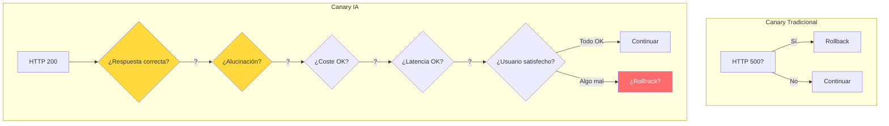
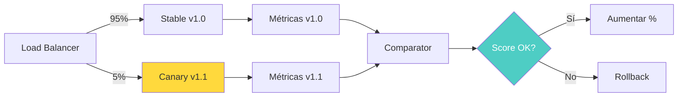
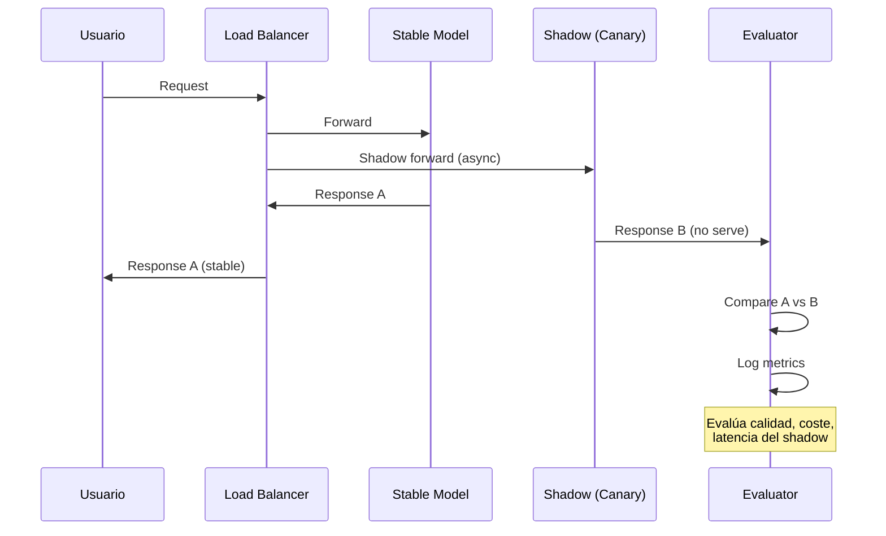
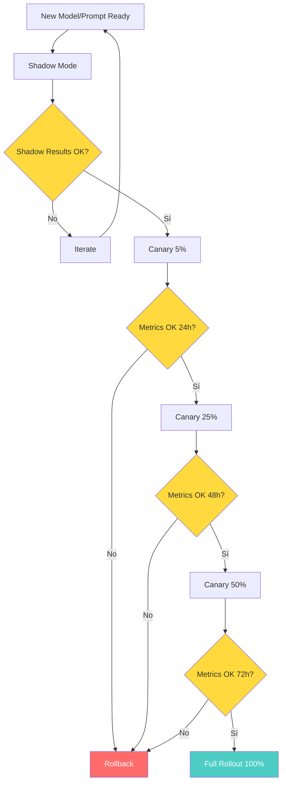

# Canary Deployments para Sistemas de IA

> [!abstract] Resumen
> Los *canary deployments* para IA enfrentan un desafío particular: ==la calidad de la IA es más difícil de medir que un HTTP 500==. Las métricas canary para IA incluyen tasa de completitud de tareas, satisfacción del usuario, coste por query y ==tasa de alucinación==. Este documento cubre estrategias de división de tráfico, triggers de rollback automático y el ==shadow mode== (ejecutar el nuevo modelo en paralelo, comparar outputs sin servir al usuario). ^resumen

---

## El desafío de canary en IA

En despliegues canary tradicionales, las métricas de éxito son claras: tasa de error HTTP, latencia, CPU usage. En sistemas de IA, el concepto de "error" es mucho más difuso.

> [!warning] ¿Cuándo "falla" un sistema de IA?
> - Un HTTP 200 con una respuesta alucinada es un fallo invisible
> - Una respuesta correcta pero lenta puede ser aceptable para unos e inaceptable para otros
> - La calidad puede degradarse gradualmente sin triggear alertas
> - El coste puede dispararse sin que la calidad cambie
> - Un modelo puede funcionar bien para el 95% de queries y fallar catastróficamente para el 5%



---

## Métricas canary para IA

### Métricas primarias

| Métrica | Definición | ==Umbral canary== | Método de medición |
|---|---|---|---|
| Task completion rate | % tareas completadas exitosamente | ==≥ baseline - 3%== | Logs + feedback |
| User satisfaction | NPS/CSAT de interacciones | ≥ baseline - 5pts | Encuestas inline |
| Cost per query | Coste promedio por request | ==≤ baseline + 20%== | Token counting |
| Hallucination rate | % de respuestas con info falsa | ==≤ baseline + 1%== | Eval automática |
| Latency P95 | Latencia del percentil 95 | ≤ baseline + 30% | APM |

### Métricas secundarias

> [!info] Métricas de soporte para decisiones canary
> - **Token efficiency**: Tokens usados por respuesta equivalente
> - **Retry rate**: Frecuencia de reintentos del usuario
> - **Escalation rate**: Transferencias a humano
> - **Context utilization**: Uso efectivo del contexto RAG
> - **Guardrail trigger rate**: Frecuencia de activación de guardrails

### Composite score

> [!tip] Composite canary score para IA
> Combinar múltiples métricas en un score único facilita la decisión de rollout/rollback:
>
> ```python
> def calculate_canary_score(metrics: dict) -> float:
>     """Score compuesto para decisión canary. 0.0 = rollback, 1.0 = proceed."""
>     weights = {
>         "task_completion_rate": 0.30,
>         "user_satisfaction": 0.25,
>         "hallucination_rate": 0.20,  # Invertido: menor es mejor
>         "cost_efficiency": 0.15,
>         "latency_score": 0.10
>     }
>
>     score = 0.0
>     for metric, weight in weights.items():
>         if metric == "hallucination_rate":
>             # Invertir: 0% alucinación = 1.0
>             score += weight * (1.0 - metrics[metric])
>         else:
>             score += weight * metrics[metric]
>
>     return score
> ```

---

## Estrategias de división de tráfico

### 1. Percentage-based routing

La estrategia más simple: enviar un porcentaje fijo del tráfico al canary.



### 2. User-segment routing

Dirigir el canary a segmentos específicos de usuarios.

> [!example]- Routing por segmentos
> ```python
> class CanaryRouter:
>     """Router canary con segmentación de usuarios."""
>
>     def __init__(self, canary_config: dict):
>         self.config = canary_config
>
>     def route(self, request: Request) -> str:
>         """Decidir si usar canary o stable."""
>         user = request.user
>
>         # Fase 1: Solo equipo interno
>         if self.config["phase"] == 1:
>             if user.is_internal:
>                 return "canary"
>             return "stable"
>
>         # Fase 2: Equipo interno + beta testers
>         elif self.config["phase"] == 2:
>             if user.is_internal or user.is_beta:
>                 return "canary"
>             return "stable"
>
>         # Fase 3: Porcentaje de usuarios free
>         elif self.config["phase"] == 3:
>             if user.is_internal or user.is_beta:
>                 return "canary"
>             if user.plan == "free" and self._in_percentage(user, 25):
>                 return "canary"
>             return "stable"
>
>         # Fase 4: Todos menos enterprise
>         elif self.config["phase"] == 4:
>             if user.plan == "enterprise":
>                 return "stable"
>             return "canary"
>
>         # Fase 5: General availability
>         return "canary"
>
>     def _in_percentage(self, user, pct: int) -> bool:
>         """Asignación determinística por user_id."""
>         import hashlib
>         h = hashlib.sha256(user.id.encode()).hexdigest()[:8]
>         return (int(h, 16) % 100) < pct
> ```

### 3. Query-complexity routing

Enviar queries simples al canary primero, luego progresivamente más complejas.

| Fase | Complejidad | % tráfico | ==Duración== |
|---|---|---|---|
| 1 | Queries simples (< 100 tokens) | 10% | ==24h== |
| 2 | Queries medias (100-500 tokens) | 25% | ==48h== |
| 3 | Queries complejas (> 500 tokens) | 50% | ==72h== |
| 4 | Todas las queries | 100% | Permanente |

---

## Shadow mode

El *shadow mode* es la estrategia más segura para evaluar un nuevo modelo o prompt: ejecutar la versión nueva en paralelo con la actual, ==comparar outputs sin servir el resultado nuevo al usuario==.

> [!success] Ventajas del shadow mode
> - **Zero risk**: El usuario siempre recibe la respuesta del modelo estable
> - **Datos reales**: Evaluación con tráfico de producción real
> - **Comparación directa**: Output nuevo vs output estable para el mismo input
> - **Sin sesgo**: El usuario no influye en la evaluación (no sabe que hay alternativa)



### Implementación de shadow mode

> [!example]- Shadow mode con comparación asíncrona
> ```python
> import asyncio
> from dataclasses import dataclass
>
> @dataclass
> class ShadowResult:
>     stable_response: str
>     shadow_response: str
>     stable_latency_ms: float
>     shadow_latency_ms: float
>     stable_cost_usd: float
>     shadow_cost_usd: float
>     similarity_score: float
>     quality_comparison: str  # "shadow_better", "stable_better", "equal"
>
> class ShadowModeExecutor:
>     """Ejecuta modelo shadow en paralelo sin afectar al usuario."""
>
>     def __init__(self, stable_model: str, shadow_model: str):
>         self.stable_model = stable_model
>         self.shadow_model = shadow_model
>         self.results: list[ShadowResult] = []
>
>     async def execute(self, request: str) -> str:
>         """Ejecutar ambos modelos, servir solo stable."""
>         # Ejecutar en paralelo
>         stable_task = asyncio.create_task(
>             self._call_model(self.stable_model, request)
>         )
>         shadow_task = asyncio.create_task(
>             self._call_model(self.shadow_model, request)
>         )
>
>         # El usuario recibe stable inmediatamente
>         stable_result = await stable_task
>
>         # Shadow se procesa en background
>         asyncio.create_task(
>             self._process_shadow(stable_result, shadow_task, request)
>         )
>
>         return stable_result.text
>
>     async def _process_shadow(self, stable, shadow_task, request):
>         """Procesar y comparar resultado shadow."""
>         try:
>             shadow_result = await asyncio.wait_for(
>                 shadow_task, timeout=30
>             )
>             comparison = await self._compare(stable, shadow_result)
>             self.results.append(comparison)
>             await self._log_comparison(comparison)
>         except asyncio.TimeoutError:
>             await self._log_shadow_timeout(request)
>
>     async def _compare(self, stable, shadow) -> ShadowResult:
>         """Comparar resultados stable vs shadow."""
>         similarity = await compute_similarity(
>             stable.text, shadow.text
>         )
>         quality = await judge_quality(stable.text, shadow.text)
>         return ShadowResult(
>             stable_response=stable.text,
>             shadow_response=shadow.text,
>             stable_latency_ms=stable.latency,
>             shadow_latency_ms=shadow.latency,
>             stable_cost_usd=stable.cost,
>             shadow_cost_usd=shadow.cost,
>             similarity_score=similarity,
>             quality_comparison=quality
>         )
>
>     def summary(self) -> dict:
>         """Resumen de la comparación shadow."""
>         total = len(self.results)
>         shadow_better = sum(
>             1 for r in self.results
>             if r.quality_comparison == "shadow_better"
>         )
>         return {
>             "total_comparisons": total,
>             "shadow_win_rate": shadow_better / total if total > 0 else 0,
>             "avg_cost_delta": sum(
>                 r.shadow_cost_usd - r.stable_cost_usd
>                 for r in self.results
>             ) / total if total > 0 else 0,
>             "avg_similarity": sum(
>                 r.similarity_score for r in self.results
>             ) / total if total > 0 else 0
>         }
> ```

### Cuándo pasar de shadow a canary

> [!question] Criterios para promover de shadow a canary
> 1. **Win rate > 50%**: El shadow produce mejores respuestas más de la mitad del tiempo
> 2. **Coste ≤ 120%**: El shadow no cuesta más del 20% extra
> 3. **Latencia ≤ 130%**: El shadow no es más del 30% más lento
> 4. **Sin regresiones**: No hay categorías de queries donde el shadow es significativamente peor
> 5. **Suficiente muestra**: Al menos 1000 comparaciones

---

## Triggers de rollback automático

### Definición de triggers

> [!danger] Triggers de rollback automático
> El canary debe revertirse automáticamente cuando:
>
> | Trigger | ==Umbral== | Ventana |
> |---|---|---|
> | Error rate | ==> baseline + 5%== | 5 minutos |
> | Hallucination rate | > baseline + 2% | 15 minutos |
> | Cost per query | ==> baseline × 2== | 30 minutos |
> | Latency P95 | > baseline + 50% | 10 minutos |
> | User complaints | > 3 en 1 hora | 1 hora |
> | Guardrail triggers | ==> baseline × 3== | 15 minutos |

### Implementación de rollback automático

> [!example]- Controller de rollback canary
> ```python
> import time
> from datetime import datetime, timedelta
> from enum import Enum
>
> class CanaryState(Enum):
>     ACTIVE = "active"
>     ROLLING_BACK = "rolling_back"
>     ROLLED_BACK = "rolled_back"
>     PROMOTED = "promoted"
>
> class CanaryController:
>     """Controller para gestión automática de canary deployments de IA."""
>
>     def __init__(self, config: dict):
>         self.config = config
>         self.state = CanaryState.ACTIVE
>         self.start_time = datetime.now()
>         self.metrics_window: list[dict] = []
>
>     def check_health(self, current_metrics: dict, baseline_metrics: dict):
>         """Verificar salud del canary y decidir acción."""
>         if self.state != CanaryState.ACTIVE:
>             return
>
>         # Check error rate
>         if current_metrics["error_rate"] > (
>             baseline_metrics["error_rate"] + 0.05
>         ):
>             self._trigger_rollback("Error rate exceeded threshold")
>             return
>
>         # Check hallucination rate
>         if current_metrics["hallucination_rate"] > (
>             baseline_metrics["hallucination_rate"] + 0.02
>         ):
>             self._trigger_rollback("Hallucination rate exceeded")
>             return
>
>         # Check cost
>         if current_metrics["cost_per_query"] > (
>             baseline_metrics["cost_per_query"] * 2
>         ):
>             self._trigger_rollback("Cost per query doubled")
>             return
>
>         # Check latency
>         if current_metrics["latency_p95"] > (
>             baseline_metrics["latency_p95"] * 1.5
>         ):
>             self._trigger_rollback("Latency P95 exceeded 150%")
>             return
>
>     def _trigger_rollback(self, reason: str):
>         """Ejecutar rollback automático."""
>         self.state = CanaryState.ROLLING_BACK
>         self._send_alert(f"Canary rollback triggered: {reason}")
>         self._set_traffic_to_stable(100)
>         self.state = CanaryState.ROLLED_BACK
>
>     def _send_alert(self, message: str):
>         # Slack, PagerDuty, etc.
>         pass
>
>     def _set_traffic_to_stable(self, percentage: int):
>         # Actualizar load balancer / feature flag
>         pass
> ```

---

## Canary deployment workflow completo



---

## Herramientas para canary IA

| Herramienta | Tipo | ==Fortaleza para IA== |
|---|---|---|
| Argo Rollouts | K8s native | ==Progressive delivery== |
| Flagger | K8s native | Integración con Istio/Linkerd |
| LaunchDarkly | SaaS | ==Feature flag + canary== |
| Harness | SaaS | Pipeline + verification |
| Custom | Propio | ==Control total sobre métricas IA== |

> [!tip] Para la mayoría de equipos de IA
> La combinación de [[feature-flags-ia|feature flags]] (para routing) + monitorización custom (para métricas IA) es más práctica que herramientas de canary genéricas que no entienden métricas de IA.

---

## Relación con el ecosistema

Los canary deployments son la estrategia de despliegue que conecta CI/CD con producción segura:

- **[[intake-overview|Intake]]**: Cambios en cómo intake parsea issues pueden desplegarse via canary — midiendo la calidad de las specs generadas contra la versión anterior
- **[[architect-overview|Architect]]**: Cambios en el modelo o configuración de architect en CI se despliegan primero en shadow mode, comparando reportes JSON de ambas versiones, antes de canary gradual
- **[[vigil-overview|Vigil]]**: Vigil monitoriza que el canary no introduce vulnerabilidades de seguridad nuevas — escaneo continuo de los outputs del modelo canary
- **[[licit-overview|Licit]]**: Licit verifica que la versión canary mantiene compliance regulatorio, especialmente relevante cuando se cambia de proveedor de modelo ([[multi-region-ai]])

---

## Enlaces y referencias

> [!quote]- Bibliografía y recursos
> - Sato, Danilo. "Canary Release." martinfowler.com, 2014. [^1]
> - Argo Project. "Argo Rollouts - Progressive Delivery." CNCF, 2024. [^2]
> - Google SRE. "Canarying Releases." Site Reliability Engineering, 2016. [^3]
> - Netflix. "Automated Canary Analysis at Netflix." 2018. [^4]
> - Anthropic. "Safe deployment practices for AI systems." 2024. [^5]

[^1]: Definición canónica de canary release por Danilo Sato en el sitio de Martin Fowler
[^2]: Documentación de Argo Rollouts para progressive delivery en Kubernetes
[^3]: Capítulo de Google SRE sobre prácticas de canary release a escala
[^4]: Paper de Netflix sobre análisis automatizado de canary deployments (Kayenta)
[^5]: Recomendaciones de Anthropic sobre despliegue seguro de sistemas de IA
