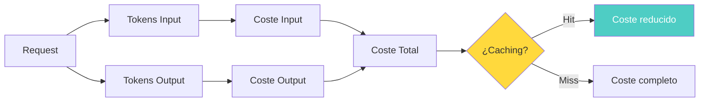
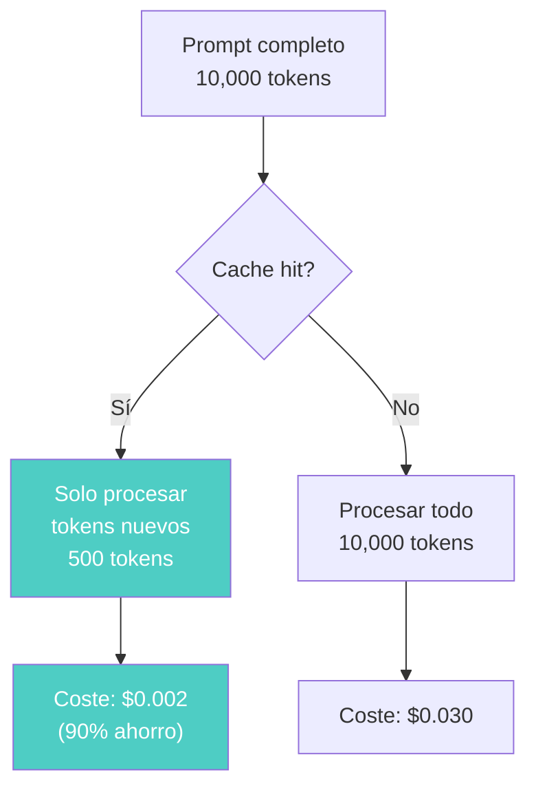
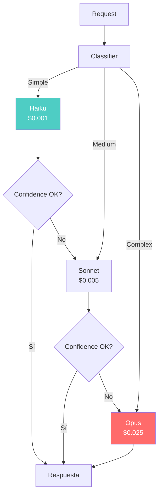
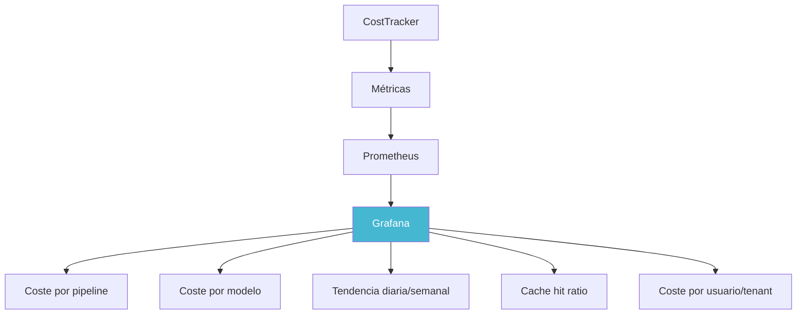

# Optimización de Costes para IA en Producción

> [!abstract] Resumen
> La optimización de costes en sistemas de IA abarca múltiples estrategias: ==prompt caching== (architect soporta caching de Anthropic y OpenAI), ==semantic caching==, model routing (modelo barato primero, caro si necesario), batching, ==optimización de tokens== (prompts más cortos), límites de output tokens. Architect implementa un `CostTracker` por paso y el flag `--budget` para enforcement de presupuesto. Se incluye comparación de costes entre proveedores. ^resumen

---

## Por qué los costes de IA son diferentes

En infraestructura tradicional, los costes son predecibles: instancias con precio por hora, storage por GB/mes. En sistemas de IA con LLMs, ==cada request tiene un coste variable== que depende del tamaño del input, el output generado y el modelo usado.

> [!danger] Los costes de IA pueden escalar exponencialmente
> - Un prompt de 1000 tokens con output de 500 tokens cuesta ~$0.005 con Sonnet
> - Un agente que ejecuta 20 pasos con contexto acumulativo puede costar ==~$1-5 por tarea==
> - 10,000 tareas/día × $2/tarea = ==$20,000/día==
> - Sin control, un loop infinito de un agente puede consumir ==cientos de dólares en minutos==



---

## Comparación de costes entre proveedores

### Precios por millón de tokens (aproximados, 2025)

| Modelo | Input/MTok | Output/MTok | ==Coste relativo== | Uso recomendado |
|---|---|---|---|---|
| Claude 3.5 Haiku | $0.80 | $4.00 | ==1x (base)== | Clasificación, extraction |
| Claude Sonnet 4 | $3.00 | $15.00 | ==~4x== | Código, análisis |
| Claude Opus 4 | $15.00 | $75.00 | ==~19x== | Razonamiento complejo |
| GPT-4o | $2.50 | $10.00 | ~3x | General purpose |
| GPT-4o-mini | $0.15 | $0.60 | ==~0.2x== | Tareas simples |
| Llama 3.1 70B (self) | $0.00* | $0.00* | GPU cost | Privacy-sensitive |

> [!info] *Self-hosted tiene coste de GPU
> El coste de self-hosting Llama 70B en GPU A100 es ~$3-4/hora, lo que equivale a $0.50-1.00/MTok dependiendo del throughput. Es más barato solo a alto volumen (>1M tokens/hora).

---

## Estrategia 1: Prompt Caching

### Cómo funciona el prompt caching

*Prompt caching* permite reutilizar el procesamiento de porciones del prompt que no cambian entre requests, reduciendo tanto coste como latencia.

> [!success] Architect soporta prompt caching
> Architect soporta caching tanto de Anthropic como de OpenAI:
> - **Anthropic**: Cache de prefijos de prompt (system prompt, instrucciones fijas)
> - **OpenAI**: Cache automático de prefijos similares
> - **Ahorro**: ==Hasta 90% de reducción en coste de tokens cacheados==
> - **Latencia**: Reducción de latencia proporcional al ratio de cache



### Patrones de caching efectivos

> [!tip] Maximizar cache hits
> 1. **System prompt estable**: Mantener el system prompt idéntico entre requests
> 2. **Instrucciones fijas primero**: Poner instrucciones estáticas al inicio del prompt
> 3. **Contexto variable al final**: Datos dinámicos después del contenido cacheable
> 4. **Cache warming**: Pre-cargar caches con prompts frecuentes
> 5. **Monitorizar cache ratio**: Rastrear hits/misses ([[agentops]])

> [!example]- Estructura de prompt optimizada para caching
> ```python
> # MAL: Contenido dinámico al inicio rompe el cache
> prompt_bad = f"""
> El usuario {user_name} pregunta sobre {topic}.
>
> Eres un asistente experto en programación.
> Sigue estas instrucciones detalladas...
> [2000 tokens de instrucciones]
> """
>
> # BIEN: Contenido estático al inicio, dinámico al final
> prompt_good = f"""
> Eres un asistente experto en programación.
> Sigue estas instrucciones detalladas...
> [2000 tokens de instrucciones — CACHEABLES]
>
> ---
> Contexto del usuario:
> Nombre: {user_name}
> Pregunta sobre: {topic}
> """
> # Los primeros 2000+ tokens se cachean, solo se procesan los dinámicos
> ```

---

## Estrategia 2: Semantic Caching

El *semantic caching* va más allá del cache exacto: ==cachea respuestas para queries semánticamente similares==.

> [!info] Cómo funciona el semantic caching
> 1. Calcular embedding de la query
> 2. Buscar queries similares en cache (similitud coseno > umbral)
> 3. Si hay hit, devolver respuesta cacheada
> 4. Si no, llamar al LLM y cachear respuesta

> [!example]- Implementación de semantic cache
> ```python
> import numpy as np
> from typing import Optional
>
> class SemanticCache:
>     """Cache semántico para respuestas de LLM."""
>
>     def __init__(self, embedding_model, similarity_threshold=0.95,
>                  max_entries=10000, ttl_seconds=3600):
>         self.embedding_model = embedding_model
>         self.threshold = similarity_threshold
>         self.max_entries = max_entries
>         self.ttl_seconds = ttl_seconds
>         self.cache: list[dict] = []
>
>     async def get(self, query: str) -> Optional[str]:
>         """Buscar respuesta en cache semántico."""
>         query_embedding = await self.embedding_model.embed(query)
>
>         best_match = None
>         best_similarity = 0.0
>
>         for entry in self.cache:
>             if self._is_expired(entry):
>                 continue
>
>             similarity = self._cosine_similarity(
>                 query_embedding, entry["embedding"]
>             )
>
>             if similarity > best_similarity:
>                 best_similarity = similarity
>                 best_match = entry
>
>         if best_match and best_similarity >= self.threshold:
>             best_match["hits"] += 1
>             return best_match["response"]
>
>         return None
>
>     async def put(self, query: str, response: str):
>         """Almacenar respuesta en cache."""
>         embedding = await self.embedding_model.embed(query)
>
>         self.cache.append({
>             "query": query,
>             "embedding": embedding,
>             "response": response,
>             "created_at": time.time(),
>             "hits": 0
>         })
>
>         if len(self.cache) > self.max_entries:
>             self._evict()
>
>     def _cosine_similarity(self, a, b) -> float:
>         return float(np.dot(a, b) / (np.linalg.norm(a) * np.linalg.norm(b)))
>
>     def _evict(self):
>         """Evictar entradas menos usadas y expiradas."""
>         self.cache = [e for e in self.cache if not self._is_expired(e)]
>         self.cache.sort(key=lambda e: e["hits"], reverse=True)
>         self.cache = self.cache[:self.max_entries]
>
>     def stats(self) -> dict:
>         total_hits = sum(e["hits"] for e in self.cache)
>         return {
>             "entries": len(self.cache),
>             "total_hits": total_hits,
>             "estimated_savings_usd": total_hits * 0.01  # ~$0.01 por hit
>         }
> ```

> [!warning] Riesgos del semantic caching
> - **Stale responses**: Las respuestas cacheadas pueden desactualizarse
> - **False positives**: Queries "similares" pero con intención diferente
> - **Context sensitivity**: La misma query puede requerir respuestas diferentes según contexto
> - **Cache poisoning**: Una respuesta incorrecta cacheada afecta múltiples usuarios

---

## Estrategia 3: Model Routing

Usar el modelo más barato que pueda resolver la tarea adecuadamente.

> [!tip] Patrón: Modelo barato primero, caro si necesario
> ```
> Query → Haiku (barato) → ¿Confianza alta? → Sí → Servir
>                                            → No → Sonnet (medio)
>                                                   → ¿Confianza alta? → Sí → Servir
>                                                                       → No → Opus (caro)
> ```



> [!example]- Implementación de model router
> ```python
> class ModelRouter:
>     """Router que selecciona modelo óptimo por coste/calidad."""
>
>     MODELS = {
>         "cheap": {"name": "claude-haiku", "cost_per_1k": 0.00025},
>         "medium": {"name": "claude-sonnet-4-20250514", "cost_per_1k": 0.003},
>         "expensive": {"name": "claude-opus-4-20250514", "cost_per_1k": 0.015},
>     }
>
>     def __init__(self, confidence_threshold=0.85):
>         self.threshold = confidence_threshold
>
>     async def route(self, query: str, context: dict = None) -> dict:
>         """Intentar con modelo barato primero, escalar si falta confianza."""
>
>         # Clasificar complejidad
>         complexity = await self._classify_complexity(query)
>
>         # Elegir modelo inicial
>         if complexity == "simple":
>             tiers = ["cheap", "medium", "expensive"]
>         elif complexity == "medium":
>             tiers = ["medium", "expensive"]
>         else:
>             tiers = ["expensive"]
>
>         for tier in tiers:
>             model = self.MODELS[tier]
>             response = await call_model(model["name"], query)
>
>             if response.confidence >= self.threshold:
>                 return {
>                     "response": response.text,
>                     "model_used": model["name"],
>                     "tier": tier,
>                     "cost": response.token_count * model["cost_per_1k"] / 1000,
>                     "escalated": tier != tiers[0]
>                 }
>
>         # Devolver último resultado aunque no tenga alta confianza
>         return {
>             "response": response.text,
>             "model_used": self.MODELS["expensive"]["name"],
>             "tier": "expensive",
>             "cost": response.token_count * self.MODELS["expensive"]["cost_per_1k"] / 1000,
>             "low_confidence": True
>         }
> ```

---

## Estrategia 4: Batching

Agrupar múltiples requests en una sola llamada al LLM para reducir overhead y potencialmente costes.

> [!info] Cuándo usar batching
> - Múltiples items a procesar con el mismo prompt
> - Tareas de clasificación/extraction sobre listas
> - Generación de embeddings (batch APIs más baratas)
> - Evaluaciones en batch ([[cicd-para-ia]])

---

## Estrategia 5: Optimización de tokens

### Prompts más cortos

> [!tip] Técnicas para reducir tokens de input
> | Técnica | ==Ahorro estimado== | Impacto en calidad |
> |---|---|---|
> | Eliminar verbosidad | ==10-30%== | Neutro/positivo |
> | Comprimir ejemplos | 20-40% | Leve |
> | Usar few-shot selectivo | ==30-50%== | Variable |
> | Structured output format | 10-20% | Neutro |
> | Referenciar en lugar de incluir | ==40-70%== | Depende de RAG |

### Output más corto

> [!example]- Limitar tokens de output
> ```python
> # Sin límite: el modelo puede generar 4000+ tokens
> response = await client.messages.create(
>     model="claude-sonnet-4-20250514",
>     max_tokens=4096,
>     messages=[{"role": "user", "content": prompt}]
> )
>
> # Con límite ajustado: forzar concisión
> response = await client.messages.create(
>     model="claude-sonnet-4-20250514",
>     max_tokens=500,  # Limitar output
>     system="Respond concisely. Maximum 3 paragraphs.",
>     messages=[{"role": "user", "content": prompt}]
> )
> # Ahorro: hasta 80% en tokens de output
> ```

### Structured output para eficiencia

Pedir al modelo que responda en formato estructurado (JSON) en lugar de prosa reduce tokens de output y facilita el procesamiento.

---

## CostTracker de architect

[[architect-overview|Architect]] implementa un `CostTracker` que registra el coste detallado de cada paso del pipeline.

> [!success] Funcionalidades del CostTracker
> - Coste por paso del pipeline
> - Coste acumulado de la sesión
> - Desglose por modelo usado
> - Tokens de input vs output
> - ==Ahorro por prompt caching==
> - Presupuesto restante (`--budget`)

### Estructura del reporte de costes

```json
{
  "session": {
    "id": "sess_abc123",
    "pipeline": "build-feature",
    "started_at": "2025-06-01T10:00:00Z",
    "duration_seconds": 245
  },
  "cost_summary": {
    "total_cost_usd": 1.23,
    "total_tokens": 45000,
    "input_tokens": 32000,
    "output_tokens": 13000,
    "cached_tokens": 15000,
    "cache_savings_usd": 0.38,
    "budget_used_percent": 24.6,
    "budget_remaining_usd": 3.77
  },
  "by_step": [
    {
      "step": "analyze",
      "model": "claude-sonnet-4-20250514",
      "cost_usd": 0.18,
      "tokens": { "input": 3400, "output": 1200, "cached": 2800 }
    },
    {
      "step": "implement",
      "model": "claude-sonnet-4-20250514",
      "cost_usd": 0.72,
      "tokens": { "input": 18000, "output": 8500, "cached": 8000 }
    },
    {
      "step": "test",
      "model": "claude-sonnet-4-20250514",
      "cost_usd": 0.33,
      "tokens": { "input": 10600, "output": 3300, "cached": 4200 }
    }
  ],
  "by_model": {
    "claude-sonnet-4-20250514": {
      "requests": 3,
      "total_cost_usd": 1.23,
      "avg_cost_per_request": 0.41
    }
  }
}
```

### Budget enforcement

El flag `--budget` de architect establece un límite duro de coste:

```bash
# Establecer presupuesto de $5
architect run pipeline.yaml --budget 5.00 --mode yolo

# Architect monitoreará costes en cada paso:
# Step 1: $0.18 (budget: $4.82 remaining)
# Step 2: $0.72 (budget: $4.10 remaining)
# Step 3: $0.33 (budget: $3.77 remaining)
# ...
# Si budget se agota → exit code 5 (TIMEOUT)
```

> [!danger] Sin `--budget`, un pipeline puede consumir costes ilimitados
> Siempre usar `--budget` en CI/CD ([[cicd-para-ia]]) para prevenir fugas de costes.

---

## Dashboard de costes



> [!question] Métricas de coste a monitorizar
> - **Coste por tarea**: ¿Cuánto cuesta una tarea promedio?
> - **Coste por usuario/tenant**: ¿Quién consume más?
> - **Cache hit ratio**: ¿Qué porcentaje de requests se cachea?
> - **Modelo distribution**: ¿Cuánto se usa cada modelo?
> - **Trend**: ¿Los costes están subiendo o bajando?
> - **Budget utilization**: ¿Qué porcentaje del presupuesto se usa?

---

## Relación con el ecosistema

La optimización de costes es una preocupación transversal que afecta a todo el ecosistema:

- **[[intake-overview|Intake]]**: Optimizar los prompts de intake para parsear issues consume menos tokens — usar Haiku para parsing simple, Sonnet solo para specs complejas
- **[[architect-overview|Architect]]**: El `CostTracker` de architect y el flag `--budget` son la implementación central de control de costes, con prompt caching de Anthropic/OpenAI reduciendo costes hasta 90%
- **[[vigil-overview|Vigil]]**: Vigil como scanner no consume tokens de LLM directamente, pero su formato SARIF evita re-escaneos innecesarios, ahorrando compute
- **[[licit-overview|Licit]]**: Los reportes de compliance de licit deben incluir información de costes — cuánto cuesta la operación del sistema IA para auditoría financiera

---

## Enlaces y referencias

> [!quote]- Bibliografía y recursos
> - Anthropic. "Prompt Caching with Claude." 2024. [^1]
> - OpenAI. "Prompt Caching for GPT Models." 2024. [^2]
> - a16z. "The Cost of AI: Understanding LLM Economics." 2024. [^3]
> - Langfuse. "LLM Cost Tracking and Analytics." 2024. [^4]
> - Martian. "Model Router: Intelligent LLM Routing." 2024. [^5]

[^1]: Documentación de Anthropic sobre prompt caching, base de la implementación en architect
[^2]: Documentación de OpenAI sobre su sistema de prompt caching
[^3]: Análisis de a16z sobre la economía de los LLMs y tendencias de precios
[^4]: Langfuse como herramienta de tracking de costes de LLM con analytics
[^5]: Martian como ejemplo de routing inteligente de modelos para optimización de costes
