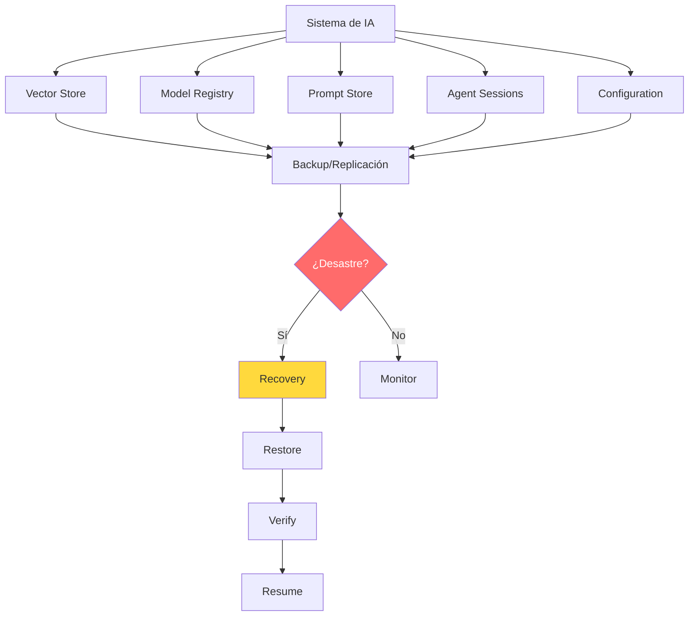
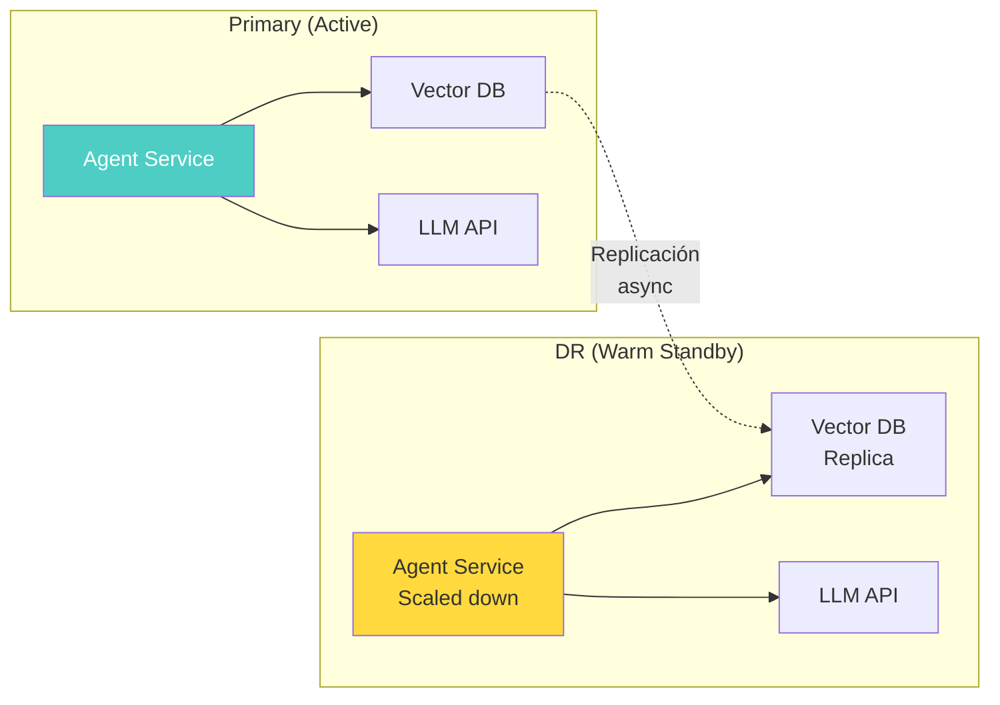
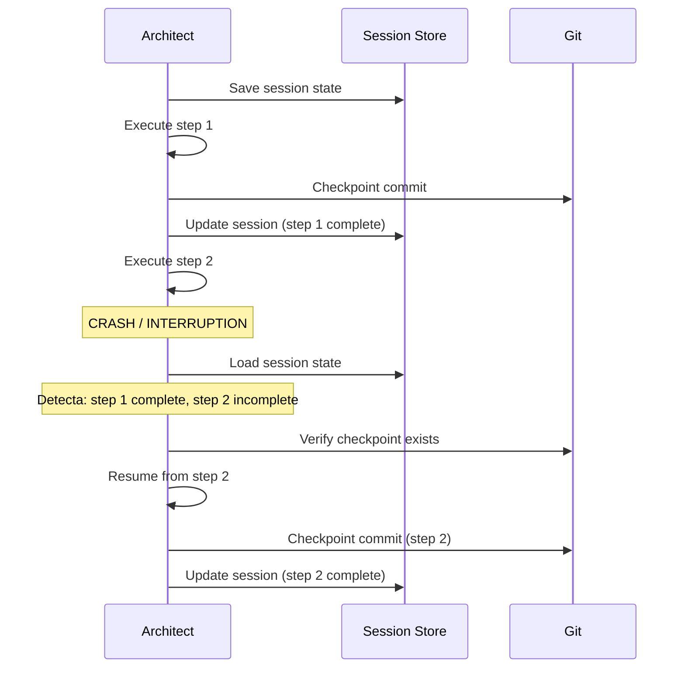

# Disaster Recovery para Sistemas de IA

> [!abstract] Resumen
> La recuperación ante desastres (*Disaster Recovery*, DR) para sistemas de IA debe considerar artefactos únicos: ==vector stores, model checkpoints, versiones de prompts, estado de agentes (sesiones) y configuración==. Este documento cubre RTO/RPO para sistemas de IA, estrategias de recovery (warm standby, pilot light, multi-region active-active), ==backup de vector stores== (snapshot, export/import, replicación), y la recuperación de sesiones de architect con auto-save. ^resumen

---

## Qué hace diferente al DR para IA

Los sistemas de IA tienen artefactos y dependencias que no existen en software tradicional, lo que complica tanto el backup como la recuperación.

> [!warning] Artefactos únicos que proteger
> | Artefacto | Tamaño típico | ==Criticidad== | Frecuencia de cambio |
> |---|---|---|---|
> | Vector stores | GB-TB | ==Muy alta== | Continua |
> | Model checkpoints | GB-cientos de GB | Alta | Semanal |
> | Prompt versions | KB-MB | ==Crítica== | Diaria |
> | Agent state (sesiones) | MB-GB | Media | ==Continua== |
> | Configuración | KB | Crítica | Semanal |
> | Eval datasets | MB-GB | Alta | Mensual |
> | Training data | GB-TB | Muy alta | Variable |



---

## RTO y RPO para sistemas de IA

### Definiciones

> [!info] RTO y RPO
> - **RTO** (*Recovery Time Objective*): ==Tiempo máximo aceptable para restaurar el servicio==
> - **RPO** (*Recovery Point Objective*): ==Cantidad máxima de datos que se puede perder==

### RTO/RPO por componente

| Componente | ==RTO recomendado== | ==RPO recomendado== | Justificación |
|---|---|---|---|
| LLM API access | ==< 1 minuto== | N/A (stateless) | Fallback a otro proveedor |
| Vector store | < 30 minutos | ==< 1 hora== | Snapshots horarios |
| Prompt store | < 5 minutos | ==< 0 (Git)== | Versionado en Git |
| Agent sessions | < 15 minutos | < 5 minutos | ==Auto-save de architect== |
| Model registry | < 1 hora | < 24 horas | Modelos no cambian frecuentemente |
| Configuration | < 5 minutos | < 0 (Git) | Versionado en Git |
| Monitoring | < 30 minutos | < 1 hora | Reconstruible desde métricas |

> [!danger] El RTO de un sistema de IA puede ser largo
> A diferencia de un servicio web que se restaura arrancando contenedores, un sistema de IA puede necesitar:
> - Reindexar un vector store (horas)
> - Descargar y cargar un modelo (minutos-horas)
> - Recalentar caches (minutos)
> - Verificar evaluaciones (minutos)

---

## Qué respaldar

### 1. Vector stores

> [!danger] El vector store es el activo más difícil de recuperar
> - Contiene embeddings que pueden tomar horas en regenerar
> - El tamaño puede ser de gigabytes o terabytes
> - Si se cambió el modelo de embedding, los backups no son directamente restaurables
> - La consistencia entre el vector store y los documentos fuente es crítica

#### Estrategias de backup para vector stores

| Estrategia | ==Velocidad== | Complejidad | RPO | Coste |
|---|---|---|---|---|
| Snapshot periódico | ==Rápido== | Baja | Hours | Bajo |
| Export/Import | Lento | Media | Variable | ==Medio== |
| Replicación continua | ==Tiempo real== | Alta | ==~0== | Alto |
| Dual-write | Tiempo real | Alta | ~0 | ==2x storage== |

> [!example]- Backup de Qdrant con snapshot
> ```python
> import httpx
> from datetime import datetime
> from pathlib import Path
>
> class VectorStoreBackup:
>     """Gestión de backups para Qdrant vector store."""
>
>     def __init__(self, qdrant_url: str, backup_dir: str):
>         self.url = qdrant_url
>         self.backup_dir = Path(backup_dir)
>         self.backup_dir.mkdir(parents=True, exist_ok=True)
>
>     async def create_snapshot(self, collection: str) -> str:
>         """Crear snapshot de una colección."""
>         async with httpx.AsyncClient() as client:
>             response = await client.post(
>                 f"{self.url}/collections/{collection}/snapshots"
>             )
>             response.raise_for_status()
>             snapshot_name = response.json()["result"]["name"]
>
>             # Descargar snapshot
>             download = await client.get(
>                 f"{self.url}/collections/{collection}/snapshots/{snapshot_name}"
>             )
>             backup_path = (
>                 self.backup_dir /
>                 f"{collection}_{datetime.now().strftime('%Y%m%d_%H%M%S')}.snapshot"
>             )
>             backup_path.write_bytes(download.content)
>
>             return str(backup_path)
>
>     async def restore_snapshot(self, collection: str,
>                                snapshot_path: str):
>         """Restaurar colección desde snapshot."""
>         async with httpx.AsyncClient() as client:
>             # Subir snapshot
>             with open(snapshot_path, "rb") as f:
>                 response = await client.post(
>                     f"{self.url}/collections/{collection}/snapshots/upload",
>                     files={"snapshot": f}
>                 )
>                 response.raise_for_status()
>
>     async def verify_restore(self, collection: str) -> dict:
>         """Verificar que la restauración es correcta."""
>         async with httpx.AsyncClient() as client:
>             response = await client.get(
>                 f"{self.url}/collections/{collection}"
>             )
>             info = response.json()["result"]
>             return {
>                 "collection": collection,
>                 "points_count": info["points_count"],
>                 "status": info["status"],
>                 "vectors_count": info.get("vectors_count", 0)
>             }
>
>     async def backup_all_collections(self) -> list[str]:
>         """Backup de todas las colecciones."""
>         async with httpx.AsyncClient() as client:
>             response = await client.get(f"{self.url}/collections")
>             collections = response.json()["result"]["collections"]
>
>         backups = []
>         for col in collections:
>             path = await self.create_snapshot(col["name"])
>             backups.append(path)
>
>         return backups
> ```

### 2. Model checkpoints

> [!tip] Backup de model checkpoints
> - Almacenar en object storage (S3, GCS) con versionado
> - Etiquetar con metadata: fecha, métricas, dataset de entrenamiento
> - Retener al menos las últimas 3 versiones
> - Para modelos self-hosted: incluir configuración de serving

### 3. Prompt versions

Los prompts versionados en Git ([[prompt-versioning]]) tienen RPO ~0 gracias al versionado distribuido de Git.

```bash
# Los prompts están en Git — backup distribuido natural
git push origin main  # Primary
git push backup main  # Secondary
git push dr main      # DR site
```

### 4. Agent state (sesiones)

[[architect-overview|Architect]] implementa *auto-save* que persiste el estado de la sesión automáticamente.

> [!success] Auto-save de architect para DR
> - Cada paso del pipeline persiste su estado
> - Los checkpoints son commits Git que sobreviven a crashes
> - La sesión puede reanudarse con `architect run --resume`
> - El CostTracker mantiene contabilidad de gastos acumulados

### 5. Configuración

> [!info] Backup de configuración
> - Configuración en Git: RPO ~0
> - Secrets en vault (HashiCorp, AWS Secrets Manager): Replicación cross-region
> - Feature flags ([[feature-flags-ia]]): Exportar estado regularmente
> - Configuración de [[infrastructure-as-code-ia|IaC]]: En Git, aplicable vía terraform/pulumi

---

## Estrategias de recovery

### 1. Warm Standby

Un entorno secundario que se mantiene parcialmente activo, listo para asumir tráfico con mínima configuración.



> [!info] Warm standby — Características
> | Aspecto | ==Valor== |
> |---|---|
> | RTO | ==15-30 minutos== |
> | RPO | ==Minutos (replicación async)== |
> | Coste | ~30-50% del primary |
> | Complejidad | Media |

### 2. Pilot Light

Solo los componentes de datos se mantienen replicados. El compute se provisiona bajo demanda.

> [!tip] Pilot light para IA
> - Vector DB replica: siempre activa
> - Agent containers: ==se crean bajo demanda (IaC)==
> - LLM API: stateless, solo necesita API keys
> - Monitorización: se despliega con el compute

| Aspecto | ==Valor== |
|---|---|
| RTO | ==30-60 minutos== |
| RPO | Minutos (replicación async) |
| Coste | ==~15-25% del primary== |
| Complejidad | Media-Alta |

### 3. Multi-region Active-Active

Ambas regiones procesan tráfico simultáneamente. Ver [[multi-region-ai]] para detalles.

> [!warning] Active-active con IA es complejo
> - **Consistencia de vector stores**: ¿Cómo sincronizar embeddings en tiempo real?
> - **Session affinity**: ¿Un agente puede reanudar sesión en otra región?
> - **Coste**: 2x infraestructura + overhead de sincronización
> - **LLM availability**: No todos los modelos están en todas las regiones

---

## Plan de DR para sistemas de IA

### Runbook de recovery

> [!example]- Runbook de DR paso a paso
> ```markdown
> # Runbook: Disaster Recovery para Sistema IA
>
> ## 1. Evaluar el desastre
> - [ ] Identificar componentes afectados
> - [ ] Evaluar pérdida de datos (RPO actual)
> - [ ] Comunicar a stakeholders
>
> ## 2. Activar DR site
> - [ ] Verificar que DR site está accesible
> - [ ] Verificar estado de réplicas de vector store
> - [ ] Verificar acceso a LLM APIs desde DR site
>
> ## 3. Restaurar datos
> - [ ] Vector store: verificar réplica o restaurar snapshot
>   ```bash
>   python scripts/dr/restore_vector_store.py \
>     --snapshot latest \
>     --target dr-qdrant.internal:6333 \
>     --verify
>   ```
> - [ ] Configuración: aplicar desde Git
>   ```bash
>   cd infra/
>   terraform workspace select dr
>   terraform apply -auto-approve
>   ```
> - [ ] Prompts: pull desde Git
>   ```bash
>   git clone --depth 1 git@github.com:org/prompts.git
>   ```
>
> ## 4. Arrancar servicios
> - [ ] Escalar agentes en DR
>   ```bash
>   kubectl scale deployment ai-agent --replicas=5 -n dr
>   ```
> - [ ] Verificar health checks
>   ```bash
>   kubectl get pods -n dr -l app=ai-agent
>   ```
> - [ ] Redirigir tráfico
>   ```bash
>   # Actualizar DNS/Load Balancer
>   aws route53 change-resource-record-sets \
>     --hosted-zone-id Z123 \
>     --change-batch file://dr-dns-switch.json
>   ```
>
> ## 5. Verificar funcionamiento
> - [ ] Ejecutar smoke tests
> - [ ] Verificar eval scores
> - [ ] Confirmar costes bajo control
> - [ ] Verificar monitorización activa
>
> ## 6. Comunicar resolución
> - [ ] Notificar a stakeholders
> - [ ] Registrar en incident log
> - [ ] Programar post-mortem
> ```

### Testing del plan de DR

> [!danger] Un plan de DR no testeado no es un plan de DR
> Frecuencia recomendada de DR drills para sistemas de IA:
>
> | Drill | ==Frecuencia== | Qué probar |
> |---|---|---|
> | Failover de LLM API | ==Mensual== | Cambio de proveedor (Anthropic → OpenAI) |
> | Restore de vector store | ==Trimestral== | Snapshot restore + verification |
> | Full DR failover | ==Semestral== | Failover completo a DR site |
> | Session recovery | ==Mensual== | Resume de sesión architect post-crash |
> | Prompt rollback | ==Mensual== | Git revert + deploy + eval |

---

## Recuperación de sesiones de architect

[[architect-overview|Architect]] implementa auto-save que permite recuperar sesiones interrumpidas.

### Cómo funciona auto-save



### Recuperación post-crash

```bash
# Architect detecta sesión interrumpida
architect run pipeline.yaml --resume

# Output:
# Detected interrupted session: sess_abc123
# Last checkpoint: step-2-implement (commit def456)
# Resuming from step 3: write-tests
# ...
```

> [!success] Beneficios del auto-save para DR
> - **Zero manual intervention**: La recuperación es automática
> - **No re-execution cost**: Los pasos completados no se re-ejecutan ([[cost-optimization]])
> - **Git-based**: Los checkpoints son commits Git que sobreviven a cualquier fallo del proceso
> - **Budget preservation**: El CostTracker mantiene el coste acumulado correcto

---

## Escenarios de desastre específicos de IA

### Escenario 1: Proveedor de LLM caído

> [!question] ¿Qué pasa si Anthropic API está caída?
> - **Inmediato**: Activar fallback a otro proveedor vía feature flag ([[feature-flags-ia]])
> - **Corto plazo**: Usar modelo self-hosted si disponible
> - **Último recurso**: Degradar a respuestas cacheadas

### Escenario 2: Vector store corrupto

- Restaurar desde último snapshot
- Reindexar documentos desde fuentes originales
- Verificar consistencia con eval suite

### Escenario 3: Prompt comprometido

- Revertir via Git ([[prompt-versioning]])
- Activar guardrails máximos vía feature flag
- Ejecutar vigil scan en modo estricto ([[vigil-overview]])

### Escenario 4: Fuga de costes

- Activar kill switch de costes ([[feature-flags-ia]])
- Investigar sesiones con coste anormal
- Aplicar budget enforcement ([[cost-optimization]])

---

## Relación con el ecosistema

La recuperación ante desastres protege la operación continua de todo el ecosistema:

- **[[intake-overview|Intake]]**: Los datos de intake (specs generadas, mappings issue-spec) se respaldan en Git, con RPO ~0 gracias al versionado distribuido
- **[[architect-overview|Architect]]**: El auto-save de architect y sus checkpoint commits proporcionan recovery nativo — una sesión interrumpida se reanuda automáticamente desde el último checkpoint
- **[[vigil-overview|Vigil]]**: Los resultados de escaneos de vigil (SARIF) se almacenan como artefactos CI, recreables desde el código fuente — no necesitan backup especial
- **[[licit-overview|Licit]]**: Los bundles de evidencia de licit son artefactos de compliance que legalmente deben respaldarse — incluir en la política de backup con retención según regulación aplicable

---

## Enlaces y referencias

> [!quote]- Bibliografía y recursos
> - AWS. "Disaster Recovery of Workloads on AWS." Well-Architected Framework, 2024. [^1]
> - Google. "Disaster Recovery Planning Guide." Cloud Architecture, 2024. [^2]
> - Nygard, Michael. "Release It!" Pragmatic Bookshelf, 2018. [^3]
> - Qdrant. "Snapshots and Backup." Documentation, 2024. [^4]
> - Anthropic. "Architect Session Recovery." 2025. [^5]

[^1]: Guía de AWS sobre DR que define los patrones de warm standby, pilot light y active-active
[^2]: Guía de Google Cloud sobre planificación de DR con consideraciones de RPO/RTO
[^3]: Libro referencia sobre resiliencia de sistemas en producción
[^4]: Documentación de Qdrant sobre snapshots y backup de vector stores
[^5]: Documentación de architect sobre recuperación de sesiones interrumpidas
