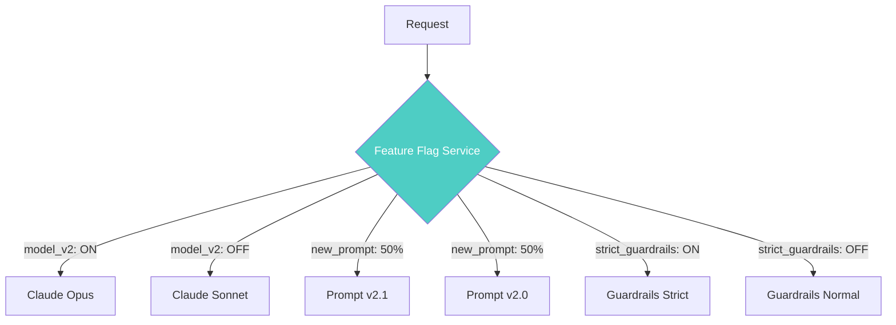
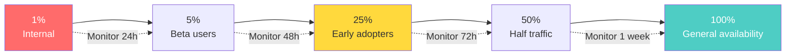
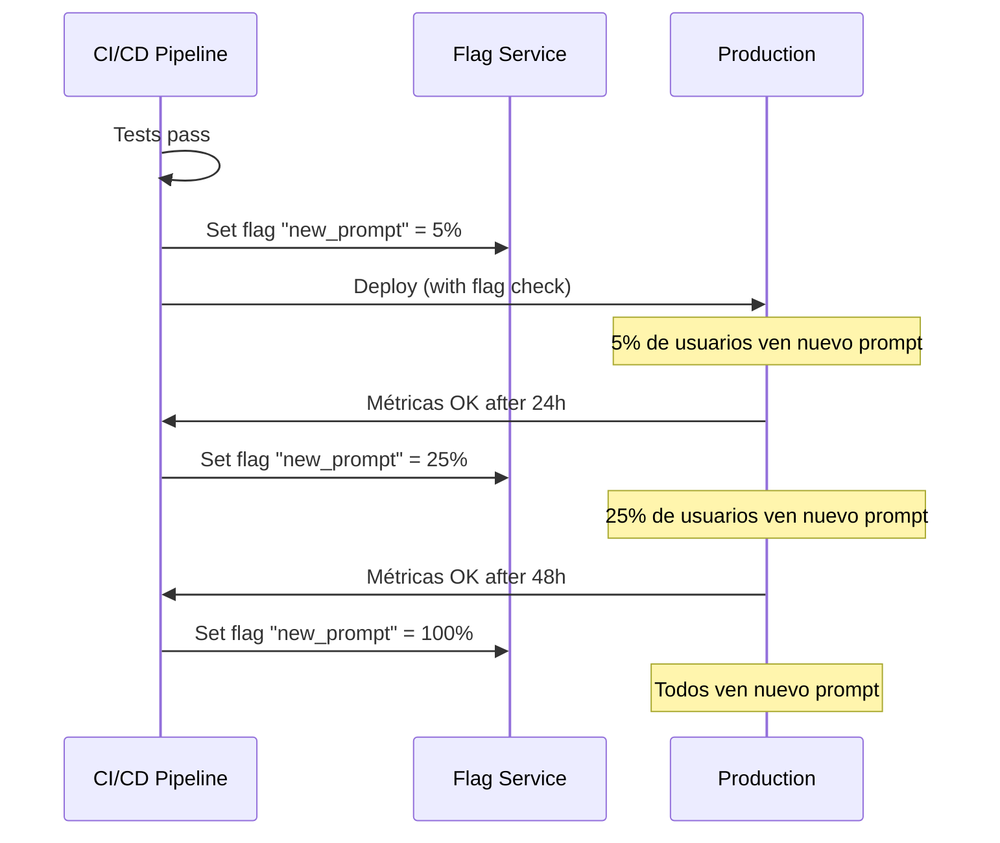

# Feature Flags para Sistemas de IA

> [!abstract] Resumen
> Los *feature flags* (*feature toggles*) son esenciales para gestionar sistemas de IA en producción. Permiten controlar ==qué modelo se usa, qué versión del prompt se ejecuta, cómo se configura el RAG, qué capacidades tiene el agente y cuán estrictos son los guardrails== — todo sin despliegues. Este documento cubre qué flagear en IA, herramientas (LaunchDarkly, Unleash, Flagsmith), rollout gradual de cambios de modelo, A/B testing via flags y kill switches para features de IA. ^resumen

---

## Por qué feature flags son críticos para IA

En software tradicional, los *feature flags* controlan la visibilidad de funcionalidades. En sistemas de IA, su importancia se multiplica porque ==los cambios en modelos, prompts y configuración pueden tener efectos impredecibles== que no se detectan completamente en testing.

> [!warning] Sin feature flags, cada cambio de IA es un todo-o-nada
> - Cambiar de Claude Sonnet a Claude Opus → afecta a todos los usuarios
> - Modificar un prompt de sistema → puede degradar casos edge
> - Activar una nueva herramienta del agente → puede causar fallos inesperados
> - Aumentar la temperatura → puede generar alucinaciones
>
> Los feature flags permiten hacer estos cambios de forma ==gradual, reversible y medible==.



---

## Qué flagear en sistemas de IA

### 1. Selección de modelo

El flag más impactante: controlar qué modelo se usa para cada funcionalidad.

| Flag | Valores | ==Uso== |
|---|---|---|
| `model_chat` | `claude-sonnet`, `claude-opus` | ==Modelo para chat== |
| `model_code` | `claude-sonnet`, `claude-opus` | Modelo para generación de código |
| `model_embed` | `text-embedding-3-small`, `large` | Modelo de embeddings |
| `model_fallback` | `true`, `false` | ==Activar modelo de respaldo== |

> [!example]- Implementación de flag de modelo
> ```python
> from feature_flags import get_flag
>
> class ModelSelector:
>     """Selecciona modelo basándose en feature flags."""
>
>     def get_model(self, task_type: str, user_id: str) -> str:
>         """Obtener modelo para una tarea y usuario."""
>         flag_name = f"model_{task_type}"
>         model = get_flag(
>             flag_name,
>             default="claude-sonnet-4-20250514",
>             context={"user_id": user_id}
>         )
>         return model
>
>     def get_model_config(self, task_type: str, user_id: str) -> dict:
>         """Obtener configuración completa del modelo."""
>         model = self.get_model(task_type, user_id)
>         temperature = get_flag(
>             f"temperature_{task_type}",
>             default=0.7,
>             context={"user_id": user_id}
>         )
>         max_tokens = get_flag(
>             f"max_tokens_{task_type}",
>             default=4096,
>             context={"user_id": user_id}
>         )
>         return {
>             "model": model,
>             "temperature": temperature,
>             "max_tokens": max_tokens
>         }
> ```

### 2. Versiones de prompt

Controlar qué versión del prompt se sirve a cada segmento de usuarios. Ver [[prompt-versioning]] para estrategias de versionado.

> [!tip] Flags para prompts
> ```python
> # Flag con variantes de prompt
> prompt_version = get_flag(
>     "system_prompt_version",
>     default="v2.0",
>     context={"user_id": user_id, "plan": user_plan}
> )
>
> # Cargar prompt correspondiente
> prompt = load_prompt(f"system_prompt_{prompt_version}.md")
> ```

### 3. Configuración de RAG

*Retrieval-Augmented Generation* tiene múltiples parámetros que se benefician de flags:

| Parámetro RAG | Flag | ==Valores típicos== |
|---|---|---|
| Número de chunks | `rag_top_k` | ==3, 5, 10== |
| Umbral de similitud | `rag_threshold` | 0.7, 0.8, 0.9 |
| Modelo de reranking | `rag_reranker` | `none`, `cohere`, `bge` |
| Tamaño de chunk | `rag_chunk_size` | ==512, 1024, 2048== |
| Estrategia de búsqueda | `rag_strategy` | `semantic`, `hybrid`, `keyword` |

### 4. Capacidades del agente

Controlar qué herramientas y acciones están disponibles para el agente.

> [!danger] Kill switches para capacidades peligrosas
> Algunas capacidades del agente deben tener kill switches instantáneos:
> - `agent_can_write_files`: ¿Puede modificar archivos?
> - `agent_can_execute_code`: ¿Puede ejecutar código?
> - `agent_can_access_network`: ¿Puede hacer requests HTTP?
> - `agent_can_modify_db`: ¿Puede escribir en base de datos?
> - `agent_max_steps`: Límite de pasos por tarea

### 5. Estrictez de guardrails

> [!info] Niveles de guardrails vía flags
> ```python
> guardrail_level = get_flag(
>     "guardrail_strictness",
>     default="standard",
>     context={"user_id": user_id}
> )
>
> GUARDRAIL_CONFIGS = {
>     "relaxed": {
>         "content_filter": "light",
>         "pii_detection": False,
>         "max_output_length": 10000,
>         "blocked_topics": ["violence"]
>     },
>     "standard": {
>         "content_filter": "moderate",
>         "pii_detection": True,
>         "max_output_length": 5000,
>         "blocked_topics": ["violence", "self-harm"]
>     },
>     "strict": {
>         "content_filter": "strict",
>         "pii_detection": True,
>         "max_output_length": 2000,
>         "blocked_topics": ["violence", "self-harm", "medical", "legal"]
>     }
> }
> ```

---

## Herramientas de feature flags

### LaunchDarkly

> [!tip] LaunchDarkly para IA
> - Evaluación del lado del servidor con baja latencia
> - Segmentos de usuarios para rollout gradual
> - A/B testing integrado con métricas
> - SDK para Python, Node.js, Go, etc.
> - ==Enterprise-grade con SLA==

### Unleash

> [!info] Unleash — open-source
> - Self-hosted, control total
> - Estrategias de activación: porcentaje, userID, IP, custom
> - API REST para integración
> - UI de administración
> - ==Gratuito para uso básico==

### Flagsmith

> [!info] Flagsmith — open-source con SaaS
> - Feature flags + Remote config
> - Segmentos y entornos
> - Analytics integrado
> - Self-hosted o SaaS
> - ==API first, buen DX==

### Comparativa

| Herramienta | Tipo | ==Coste== | A/B Test | Segmentos | Self-hosted |
|---|---|---|---|---|---|
| LaunchDarkly | SaaS | ==$$== | Sí | Avanzados | No |
| Unleash | Open-source | ==Gratis== | Básico | Sí | Sí |
| Flagsmith | Híbrido | ==Freemium== | Sí | Sí | Sí |
| PostHog | Open-source | Freemium | ==Sí== | Sí | Sí |
| Custom | Propio | Dev time | Manual | Custom | Sí |

### Implementación custom minimalista

> [!example]- Feature flag service simple
> ```python
> import json
> import hashlib
> from dataclasses import dataclass
> from typing import Any
> from pathlib import Path
>
> @dataclass
> class FlagConfig:
>     name: str
>     enabled: bool
>     percentage: float = 100.0
>     variants: dict[str, Any] = None
>     conditions: dict[str, Any] = None
>
> class FeatureFlagService:
>     """Servicio de feature flags minimalista para IA."""
>
>     def __init__(self, config_path: str = "flags.json"):
>         self.config_path = Path(config_path)
>         self._flags: dict[str, FlagConfig] = {}
>         self._load_config()
>
>     def _load_config(self):
>         """Cargar configuración desde JSON."""
>         if self.config_path.exists():
>             data = json.loads(self.config_path.read_text())
>             for name, config in data.items():
>                 self._flags[name] = FlagConfig(name=name, **config)
>
>     def is_enabled(self, flag_name: str, context: dict = None) -> bool:
>         """Evaluar si un flag está activo para un contexto."""
>         flag = self._flags.get(flag_name)
>         if not flag:
>             return False
>         if not flag.enabled:
>             return False
>         if flag.percentage < 100:
>             return self._in_percentage(flag_name, context, flag.percentage)
>         return True
>
>     def get_variant(self, flag_name: str, context: dict = None,
>                     default: Any = None) -> Any:
>         """Obtener el valor/variante de un flag."""
>         flag = self._flags.get(flag_name)
>         if not flag or not flag.enabled:
>             return default
>         if flag.variants and context:
>             user_id = context.get("user_id", "anonymous")
>             bucket = self._hash_bucket(flag_name, user_id)
>             for variant, config in flag.variants.items():
>                 if bucket < config.get("percentage", 0):
>                     return variant
>                 bucket -= config.get("percentage", 0)
>         return default
>
>     def _in_percentage(self, flag: str, context: dict,
>                        pct: float) -> bool:
>         """Deterministic percentage check usando hash."""
>         user_id = (context or {}).get("user_id", "anonymous")
>         bucket = self._hash_bucket(flag, user_id)
>         return bucket < pct
>
>     def _hash_bucket(self, flag: str, user_id: str) -> float:
>         """Hash determinístico para asignación consistente."""
>         key = f"{flag}:{user_id}"
>         h = hashlib.sha256(key.encode()).hexdigest()[:8]
>         return (int(h, 16) % 10000) / 100
> ```

---

## Rollout gradual de cambios de modelo

### Estrategia de rollout



> [!warning] Métricas a monitorizar durante rollout
> En cada fase del rollout, verificar:
> - **Tasa de error**: ¿Aumentan los errores?
> - **Latencia**: ¿El nuevo modelo es más lento?
> - **Coste**: ¿El coste por request cambia significativamente?
> - **Calidad**: ¿Las evaluaciones mantienen el score? ([[agentops]])
> - **Feedback**: ¿Los usuarios reportan problemas?

### Ejemplo de rollout de modelo

```json
{
  "model_upgrade_v2": {
    "enabled": true,
    "variants": {
      "claude-sonnet-4-20250514": {"percentage": 90},
      "claude-opus-4-20250514": {"percentage": 10}
    },
    "rollout_schedule": {
      "2025-06-01": {"claude-opus-4-20250514": 10},
      "2025-06-03": {"claude-opus-4-20250514": 25},
      "2025-06-07": {"claude-opus-4-20250514": 50},
      "2025-06-14": {"claude-opus-4-20250514": 100}
    }
  }
}
```

---

## A/B testing via flags

Los feature flags habilitan A/B testing nativo para sistemas de IA.

> [!question] ¿Qué se puede A/B testear en IA?
> - **Modelos**: Claude Sonnet vs Claude Opus para una tarea
> - **Prompts**: Dos versiones del mismo prompt ([[prompt-versioning]])
> - **Configuración**: Diferentes temperaturas, top_p, max_tokens
> - **RAG**: Diferentes estrategias de retrieval
> - **Guardrails**: Niveles de estrictez
> - **UI**: Cómo se presenta la respuesta del agente

### Diseño de A/B test para IA

> [!example]- A/B test de prompt con análisis estadístico
> ```python
> from dataclasses import dataclass
> from scipy import stats
> import numpy as np
>
> @dataclass
> class ABTestConfig:
>     name: str
>     control_flag_value: str
>     treatment_flag_value: str
>     flag_name: str
>     metric_name: str
>     min_sample_size: int = 1000
>     confidence_level: float = 0.95
>
> class AIABTest:
>     """A/B testing para componentes de IA."""
>
>     def __init__(self, config: ABTestConfig):
>         self.config = config
>         self.control_metrics: list[float] = []
>         self.treatment_metrics: list[float] = []
>
>     def record_metric(self, variant: str, value: float):
>         if variant == self.config.control_flag_value:
>             self.control_metrics.append(value)
>         elif variant == self.config.treatment_flag_value:
>             self.treatment_metrics.append(value)
>
>     def analyze(self) -> dict:
>         if len(self.control_metrics) < self.config.min_sample_size:
>             return {"status": "insufficient_data"}
>
>         control = np.array(self.control_metrics)
>         treatment = np.array(self.treatment_metrics)
>
>         t_stat, p_value = stats.ttest_ind(control, treatment)
>         effect_size = (treatment.mean() - control.mean()) / control.std()
>
>         return {
>             "status": "complete",
>             "control_mean": float(control.mean()),
>             "treatment_mean": float(treatment.mean()),
>             "p_value": float(p_value),
>             "significant": p_value < (1 - self.config.confidence_level),
>             "effect_size": float(effect_size),
>             "recommendation": self._recommend(p_value, effect_size)
>         }
>
>     def _recommend(self, p_value, effect_size) -> str:
>         if p_value > 0.05:
>             return "No significant difference. Keep control."
>         elif effect_size > 0.2:
>             return "Treatment is significantly better. Roll out."
>         elif effect_size < -0.2:
>             return "Treatment is significantly worse. Revert."
>         else:
>             return "Small effect. Consider cost/complexity tradeoff."
> ```

---

## Kill switches para IA

> [!danger] Kill switches son obligatorios para features de IA
> Un *kill switch* es un feature flag que puede desactivar instantáneamente una feature de IA sin necesidad de deploy. Son la primera línea de defensa ante comportamiento inesperado.

### Kill switches recomendados

| Kill Switch | ==Efecto== | Cuándo activar |
|---|---|---|
| `ai_enabled` | ==Desactiva toda la IA== | Incidente crítico |
| `agent_autonomous` | Desactiva acciones autónomas | Agente destructivo |
| `model_external` | Bloquea llamadas a APIs externas | Proveedor comprometido |
| `guardrails_override` | ==Fuerza guardrails máximos== | Contenido problemático |
| `cost_circuit_breaker` | Bloquea requests si coste > umbral | ==Fuga de costes== |

### Implementación de kill switch

```python
# Verificar kill switch antes de cada request
def process_request(request):
    # Kill switch global
    if not get_flag("ai_enabled"):
        return fallback_response("AI temporarily unavailable")

    # Kill switch de costes
    if get_flag("cost_circuit_breaker"):
        daily_cost = get_daily_cost()
        if daily_cost > get_flag("cost_daily_limit", default=100):
            return fallback_response("Daily cost limit reached")

    # Procesar normalmente
    return agent.process(request)
```

---

## Integración con CI/CD

Los feature flags se integran con el pipeline de CI/CD ([[cicd-para-ia]]) para automatizar rollouts.



---

## Relación con el ecosistema

Los feature flags son el mecanismo de control de riesgo que conecta despliegue con operación:

- **[[intake-overview|Intake]]**: Los flags pueden controlar qué capabilities de intake están activas — por ejemplo, desactivar la generación automática de specs si la calidad baja
- **[[architect-overview|Architect]]**: Los flags permiten controlar qué modelo usa architect en CI, cambiar entre `--budget` limits, o activar/desactivar capacidades como el Ralph Loop
- **[[vigil-overview|Vigil]]**: Los flags controlan el nivel de estrictez del escaneo de vigil — más permisivo en desarrollo, más estricto en producción
- **[[licit-overview|Licit]]**: Licit puede verificar que los flags de IA cumplen con requisitos regulatorios — por ejemplo, que features de IA en la EU tienen guardrails apropiados

---

## Enlaces y referencias

> [!quote]- Bibliografía y recursos
> - Hodgson, Pete. "Feature Toggles (aka Feature Flags)." martinfowler.com, 2017. [^1]
> - LaunchDarkly. "Feature Management for AI/ML Systems." 2024. [^2]
> - Unleash. "Unleash Documentation." 2024. [^3]
> - Flagsmith. "AI Feature Flag Patterns." 2024. [^4]
> - Sato, Danilo. "Canary Releases and Feature Flags." ThoughtWorks Technology Radar, 2023. [^5]

[^1]: Artículo fundacional de Martin Fowler sobre feature toggles, base conceptual para la aplicación en IA
[^2]: Documentación de LaunchDarkly sobre gestión de features para sistemas ML/AI
[^3]: Documentación oficial de Unleash, la alternativa open-source más madura
[^4]: Patrones específicos de Flagsmith para flags en sistemas de IA
[^5]: Análisis de ThoughtWorks sobre la relación entre canary releases y feature flags
