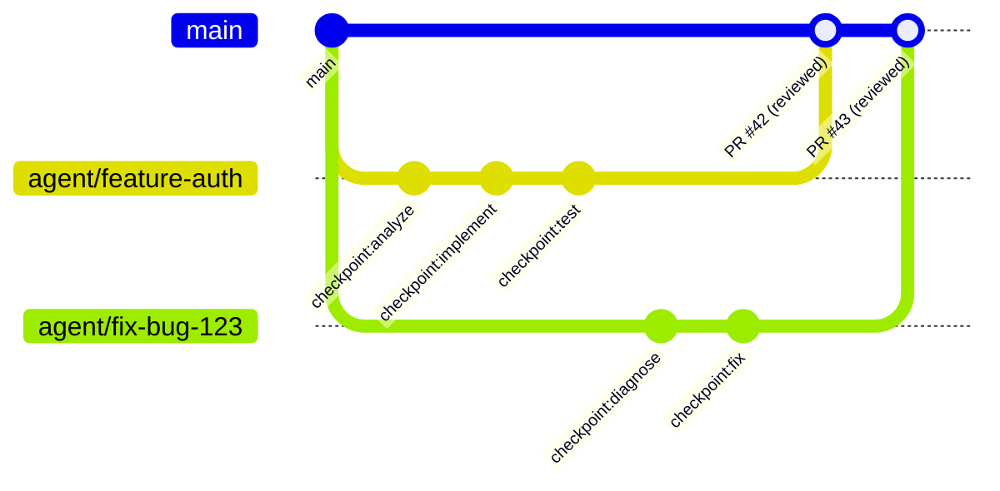
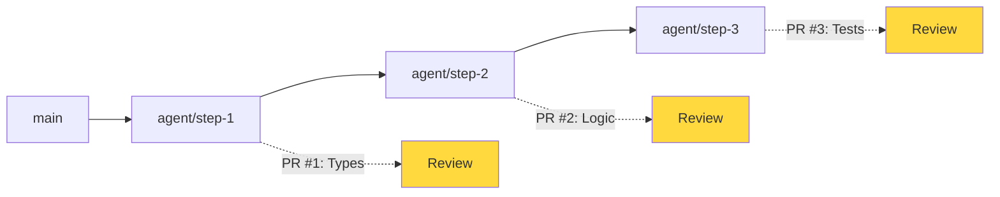
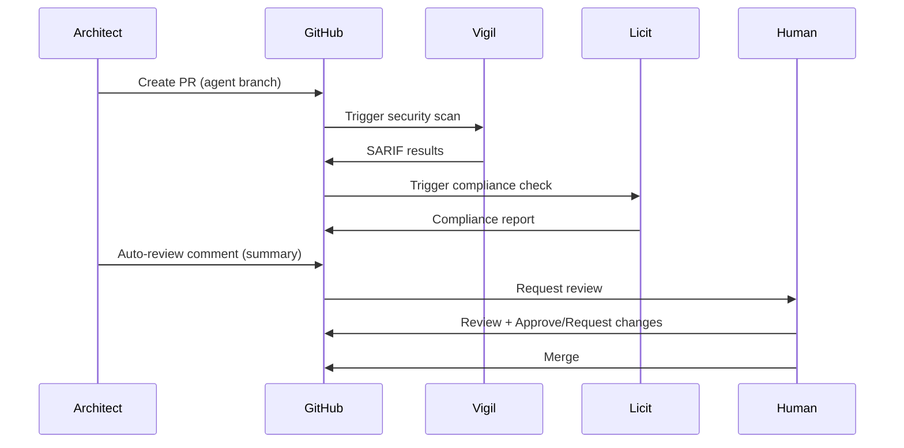

# Git Workflows para Desarrollo Asistido por IA

> [!abstract] Resumen
> Los *git workflows* para desarrollo asistido por IA requieren adaptaciones fundamentales: ==estrategias de branching cuando agentes escriben código==, el enfoque de worktrees de architect (`.architect-ralph-worktree` para Ralph Loop, `.architect-parallel-N` para ejecuciones paralelas), ==commits de checkpoint con prefijo `architect:checkpoint:step-name`==, atribución de código (humano vs IA con proveniencia [[licit-overview|licit]]), y flujos de PR con auto-review. ^resumen

---

## Por qué los workflows Git tradicionales no bastan

Los workflows Git estándar (*Git Flow*, *GitHub Flow*, *Trunk-based*) asumen que los commits son creados por humanos con intención deliberada. Cuando agentes de IA generan código, aparecen nuevos desafíos.

> [!warning] Desafíos de agentes escribiendo código
> - **Volumen de commits**: Un agente puede generar decenas de commits en minutos
> - **Atribución**: ¿Quién es "el autor" de código generado por IA?
> - **Calidad variable**: No todos los commits de un agente tienen la misma calidad
> - **Conflictos**: Múltiples agentes pueden modificar los mismos archivos
> - **Reversibilidad**: Necesidad de revertir lotes de commits de agentes
> - **Auditoría**: Regulaciones requieren distinguir código humano vs IA ([[licit-overview|licit]])

---

## Estrategias de branching para IA

### Patrón 1: Agent Branch

Cada tarea asignada a un agente vive en su propia branch.



> [!tip] Convenciones de naming para agent branches
> ```
> agent/<task-type>/<description>
> agent/feature/auth-module
> agent/fix/issue-123
> agent/refactor/database-layer
> agent/docs/api-reference
> ```

### Patrón 2: Worktree Isolation (architect)

[[architect-overview|Architect]] usa *git worktrees* para aislar ejecuciones sin crear branches adicionales en el repositorio principal.

> [!info] Git worktrees de architect
> Un *git worktree* es un directorio de trabajo adicional vinculado al mismo repositorio. Architect crea worktrees automáticamente:
>
> | Worktree | Ubicación | ==Uso== |
> |---|---|---|
> | Ralph Loop | `.architect-ralph-worktree` | ==Iteración autónoma== |
> | Parallel N | `.architect-parallel-N` | ==Ejecuciones concurrentes== |

```bash
# Lo que architect hace internamente
git worktree add .architect-ralph-worktree -b architect/ralph-session-abc123

# Para ejecuciones paralelas
git worktree add .architect-parallel-1 -b architect/parallel-1-task-xyz
git worktree add .architect-parallel-2 -b architect/parallel-2-task-xyz
git worktree add .architect-parallel-3 -b architect/parallel-3-task-xyz
```

> [!example]- Flujo completo del Ralph Loop con worktree
> ```bash
> # 1. Architect crea el worktree
> git worktree add .architect-ralph-worktree -b architect/ralph-$(date +%s)
> cd .architect-ralph-worktree
>
> # 2. Ejecuta las tareas en aislamiento
> # El agente trabaja aquí sin afectar el working tree principal
>
> # 3. Genera checkpoints (commits)
> git add -A
> git commit -m "architect:checkpoint:step-1-analyze"
> # ... más trabajo ...
> git add -A
> git commit -m "architect:checkpoint:step-2-implement"
> # ... más trabajo ...
> git add -A
> git commit -m "architect:checkpoint:step-3-test"
>
> # 4. Si el Ralph Loop completa exitosamente
> cd ..
> git merge .architect-ralph-worktree --no-ff \
>   -m "feat: implement auth module (architect ralph loop)"
>
> # 5. Limpieza
> git worktree remove .architect-ralph-worktree
> git branch -d architect/ralph-$(date +%s)
> ```

### Patrón 3: Stacked PRs con agentes

Para tareas grandes, los agentes crean una cadena de PRs pequeños y revisables.



---

## Checkpoint commits

Los *checkpoint commits* son commits especiales que architect crea durante la ejecución de un pipeline. Sirven como puntos de restauración y para trazabilidad.

### Formato del mensaje de commit

```
architect:checkpoint:<step-name>

<descripción detallada del paso>

Session: <session-id>
Pipeline: <pipeline-name>
Step: <step-number>/<total-steps>
Cost: $<cost-usd>
Model: <model-used>
```

> [!danger] Los checkpoints NO son commits finales
> Los checkpoint commits son puntos intermedios de trabajo. Antes de merge a main:
> 1. **Squash** los checkpoints en commits semánticos
> 2. **Rewrite** los mensajes de commit para que sean descriptivos
> 3. **Review** todo el cambio como una unidad
> 4. **Verify** que el pipeline de CI pasa sobre el resultado final

### Uso de checkpoints para rollback

Los checkpoints permiten volver a cualquier punto intermedio de la ejecución del agente:

```bash
# Ver todos los checkpoints de una sesión
git log --oneline --grep="architect:checkpoint"

# Ejemplo de output:
# a1b2c3d architect:checkpoint:step-3-test
# e4f5g6h architect:checkpoint:step-2-implement
# i7j8k9l architect:checkpoint:step-1-analyze

# Rollback al paso 2
git reset --hard e4f5g6h

# Continuar desde el paso 2
architect run pipeline.yaml --from-step step-2-implement
```

Ver [[rollback-strategies]] para estrategias completas de rollback.

---

## Atribución de código: humano vs IA

### El problema de la proveniencia

> [!question] ¿Quién es el autor del código generado por IA?
> - **Legal**: La titularidad del código generado por IA es debatida jurídicamente
> - **Compliance**: Regulaciones como el EU AI Act exigen transparencia sobre contenido generado por IA
> - **Auditoría**: Las organizaciones necesitan saber qué porcentaje de su código es IA
> - **Calidad**: El código IA puede requerir revisión diferente al código humano

### Tracking con git trailers

> [!tip] Convención de trailers para atribución
> ```
> feat: implement authentication module
>
> Implemented JWT-based authentication with refresh tokens.
>
> Generated-By: architect v2.1.0
> Model: claude-sonnet-4-20250514
> Session: sess_abc123
> Human-Reviewed-By: @developer
> Confidence: high
> Co-Authored-By: Claude <noreply@anthropic.com>
> ```

### Proveniencia con licit

[[licit-overview|Licit]] proporciona capacidades de proveniencia (*provenance*) para rastrear el origen del código:

> [!example]- Registro de proveniencia con licit
> ```yaml
> # .licit/provenance.yaml
> provenance:
>   tracking:
>     enabled: true
>     granularity: commit  # commit, file, or function
>
>   categories:
>     human:
>       label: "Human-authored"
>       requires_review: false
>     ai-assisted:
>       label: "AI-assisted (human edited)"
>       requires_review: true
>     ai-generated:
>       label: "AI-generated"
>       requires_review: true
>       requires_human_approval: true
>
>   rules:
>     - pattern: "architect:checkpoint:*"
>       category: ai-generated
>     - pattern: "Co-Authored-By: Claude*"
>       category: ai-assisted
>
>   reporting:
>     include_in_sbom: true
>     include_in_pr: true
>     format: spdx  # SPDX for software provenance
> ```

### Métricas de atribución

| Métrica | Descripción | ==Importancia== |
|---|---|---|
| % código IA | Porcentaje de LOC generadas por IA | ==Compliance regulatorio== |
| % código revisado | Código IA que ha pasado review humano | Calidad |
| Tasa de modificación | Cuánto se modifica el código IA post-review | ==Indicador de calidad del agente== |
| Retención | % de código IA que sobrevive 6+ meses | Calidad a largo plazo |

---

## Flujos de PR con auto-review

### PR creado por agente con auto-review



### Contenido del auto-review comment

> [!example]- Template de PR comment de architect
> ```markdown
> ## Architect Build Report
>
> ### Summary
> - **Pipeline**: `build-feature.yaml`
> - **Session**: `sess_abc123`
> - **Steps completed**: 5/5
> - **Total cost**: $1.23
> - **Duration**: 4m 32s
>
> ### Changes
> | File | Action | Lines |
> |------|--------|-------|
> | `src/auth/jwt.ts` | Created | +145 |
> | `src/auth/middleware.ts` | Created | +78 |
> | `tests/auth/jwt.test.ts` | Created | +210 |
> | `src/types/auth.ts` | Modified | +23, -5 |
>
> ### Checkpoints
> 1. ✅ `analyze` — Analyzed requirements from spec
> 2. ✅ `implement` — Implemented JWT auth module
> 3. ✅ `test` — Created test suite (18 tests, all passing)
> 4. ✅ `lint` — Fixed 3 lint issues
> 5. ✅ `docs` — Updated API documentation
>
> ### Security (vigil)
> - 🟢 No vulnerabilities found
> - 🟢 No prompt injection risks
>
> ### Compliance (licit)
> - 🟢 All provenance tracked
> - 🟢 License compatible
> - ⚠️ AI-generated code requires human review
>
> ### Cost Breakdown
> | Step | Model | Tokens | Cost |
> |------|-------|--------|------|
> | analyze | sonnet | 4,200 | $0.18 |
> | implement | sonnet | 12,500 | $0.52 |
> | test | sonnet | 8,300 | $0.35 |
> | lint | haiku | 1,200 | $0.02 |
> | docs | haiku | 3,800 | $0.16 |
> ```

### Políticas de merge para código de agentes

> [!warning] Políticas recomendadas
> 1. **Siempre requerir review humano** para código generado por IA
> 2. **Squash merge** para consolidar checkpoints en commits semánticos
> 3. **CI obligatorio**: Todos los checks deben pasar (vigil, licit, tests)
> 4. **Auto-merge solo** para cambios triviales (typos, formatting)
> 5. **Branch protection**: No permitir push directo a main desde agentes

```yaml
# .github/branch-protection.yml (ejemplo conceptual)
main:
  required_reviews: 1
  required_status_checks:
    - "vigil-scan"
    - "licit-compliance"
    - "tests"
    - "architect-eval"
  dismiss_stale_reviews: true
  require_code_owner_reviews: true
  restrictions:
    # Los agentes NO pueden hacer push directo a main
    block_users:
      - "architect-bot"
```

---

## Manejo de conflictos con agentes

> [!danger] Conflictos son más frecuentes con agentes
> Cuando múltiples agentes trabajan en paralelo (usando `.architect-parallel-N` worktrees), los conflictos son inevitables.

### Estrategias de prevención

1. **File locking**: Reservar archivos antes de que el agente los modifique
2. **Task partitioning**: Asignar archivos/módulos exclusivos a cada agente
3. **Sequential execution**: Ejecutar tareas dependientes en secuencia
4. **Rebase continuo**: El agente hace rebase frecuente contra main

### Resolución automatizada

> [!example]- Script de resolución de conflictos
> ```bash
> #!/bin/bash
> # resolve-agent-conflicts.sh
>
> WORKTREE=$1
> BASE_BRANCH=${2:-main}
>
> cd "$WORKTREE"
>
> # Intentar rebase
> if git rebase "$BASE_BRANCH" 2>/dev/null; then
>     echo "Rebase successful, no conflicts"
>     exit 0
> fi
>
> # Si hay conflictos, abortar y usar merge
> git rebase --abort
>
> # Intentar merge con estrategia
> if git merge "$BASE_BRANCH" -X theirs 2>/dev/null; then
>     echo "Merge successful with 'theirs' strategy"
>     # Verificar que los tests siguen pasando
>     if npm test 2>/dev/null; then
>         echo "Tests pass after merge"
>         exit 0
>     else
>         echo "Tests fail after merge, manual resolution needed"
>         git merge --abort
>         exit 1
>     fi
> fi
>
> echo "Automatic resolution failed, manual intervention required"
> exit 1
> ```

---

## Hooks de Git para IA

> [!tip] Hooks recomendados para workflows con agentes

### Pre-commit: Validar atribución

```bash
#!/bin/bash
# .git/hooks/pre-commit
# Verificar que commits de agentes incluyen trailers de atribución

if git log -1 --format="%B" | grep -q "architect:checkpoint"; then
    if ! git log -1 --format="%B" | grep -q "Generated-By:"; then
        echo "ERROR: Agent commits must include Generated-By trailer"
        exit 1
    fi
fi
```

### Pre-push: Verificar proveniencia

```bash
#!/bin/bash
# .git/hooks/pre-push
# Verificar proveniencia antes de push

if command -v licit &> /dev/null; then
    licit verify --provenance --since HEAD~10
    if [ $? -ne 0 ]; then
        echo "ERROR: Provenance verification failed"
        exit 1
    fi
fi
```

---

## Relación con el ecosistema

Los workflows Git son el tejido conectivo que integra todas las herramientas del ecosistema:

- **[[intake-overview|Intake]]**: Intake puede crear branches automáticamente desde issues, alimentando el workflow de agentes con tareas estructuradas que se transforman en agent branches
- **[[architect-overview|Architect]]**: Architect implementa el workflow Git más sofisticado del ecosistema: worktrees para aislamiento, checkpoint commits con prefijo estandarizado, y reportes como comentarios de PR
- **[[vigil-overview|Vigil]]**: Vigil se integra en el workflow Git como check obligatorio en PRs, escaneando el código generado por agentes en la branch antes del merge
- **[[licit-overview|Licit]]**: Licit verifica la proveniencia del código en cada commit, distinguiendo contribuciones humanas de IA y asegurando compliance regulatorio en el workflow de merge

---

## Enlaces y referencias

> [!quote]- Bibliografía y recursos
> - GitHub. "Git Worktrees Documentation." 2024. [^1]
> - Atlassian. "Comparing Git Workflows." 2024. [^2]
> - Anthropic. "Architect Git Integration Guide." 2025. [^3]
> - SPDX. "Software Provenance Specification." 2024. [^4]
> - Linux Foundation. "AI Code Attribution Best Practices." 2024. [^5]

[^1]: Documentación oficial de git worktrees, fundamento de la estrategia de aislamiento de architect
[^2]: Comparativa de workflows Git que sirve como baseline para las adaptaciones de IA
[^3]: Guía oficial de architect sobre integración con Git, incluyendo worktrees y checkpoints
[^4]: Especificación SPDX para proveniencia de software, adaptable a código generado por IA
[^5]: Mejores prácticas emergentes para atribución de código generado por IA en proyectos open-source
