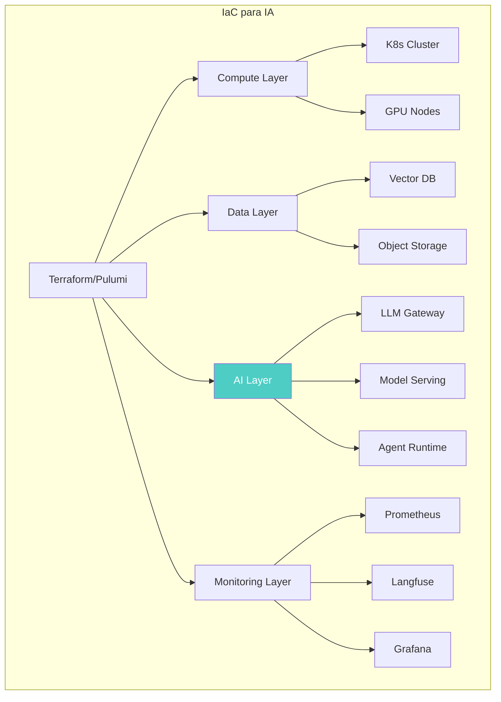
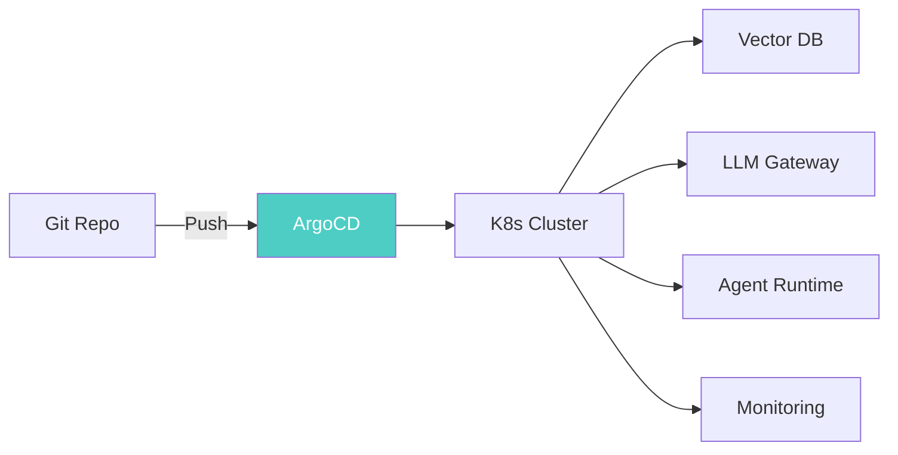

# Infrastructure as Code para IA

> [!abstract] Resumen
> *Infrastructure as Code* (*IaC*) para sistemas de IA requiere módulos específicos para: ==configuración de APIs de LLM==, aprovisionamiento de vector databases, instancias GPU, stacks de monitorización. Se cubren módulos Terraform para infraestructura IA, ==Pulumi con Python para IaC AI-native==, operadores Kubernetes para model serving (KServe, Seldon) y Helm charts para infraestructura IA completa. ^resumen

---

## IaC tradicional vs IaC para IA

La *Infrastructure as Code* para sistemas de IA extiende los principios de IaC tradicional con componentes específicos del stack de IA.

> [!info] Componentes de infraestructura específicos de IA
> | Componente | IaC tradicional | ==IaC para IA== |
> |---|---|---|
> | Compute | VMs, containers | VMs, containers + ==GPU instances== |
> | Storage | S3, EBS, databases | S3 + ==vector databases== + model registry |
> | Networking | VPC, subnets, LB | VPC + ==LLM API gateways== |
> | Secrets | API keys, DB passwords | + ==LLM provider API keys== |
> | Monitoring | Prometheus, Grafana | + ==LLM observability== (Langfuse) |
> | Config | App config | + ==prompt config, model config== |



---

## Módulos Terraform para IA

### Módulo: LLM API Configuration

> [!example]- Terraform module para configuración de LLM APIs
> ```hcl
> # modules/llm-api/main.tf
>
> variable "providers" {
>   description = "LLM providers to configure"
>   type = map(object({
>     api_key_secret_name = string
>     base_url           = optional(string)
>     rate_limit_rpm     = optional(number, 60)
>     budget_monthly_usd = optional(number, 500)
>     models             = list(string)
>   }))
> }
>
> # Secret management para API keys
> resource "aws_secretsmanager_secret" "llm_api_keys" {
>   for_each = var.providers
>   name     = "llm/${each.key}/api-key"
>
>   tags = {
>     Provider    = each.key
>     ManagedBy   = "terraform"
>     Component   = "llm-infrastructure"
>   }
> }
>
> # API Gateway para LLM proxy
> resource "aws_apigatewayv2_api" "llm_gateway" {
>   name          = "llm-gateway"
>   protocol_type = "HTTP"
>   description   = "Gateway proxy for LLM API calls"
>
>   cors_configuration {
>     allow_origins = ["*"]
>     allow_methods = ["POST"]
>     allow_headers = ["Content-Type", "Authorization"]
>   }
> }
>
> # Rate limiting
> resource "aws_apigatewayv2_route" "llm_route" {
>   for_each = var.providers
>
>   api_id    = aws_apigatewayv2_api.llm_gateway.id
>   route_key = "POST /v1/${each.key}/{proxy+}"
>   target    = "integrations/${aws_apigatewayv2_integration.llm[each.key].id}"
> }
>
> # CloudWatch alarms para costes
> resource "aws_cloudwatch_metric_alarm" "llm_cost_alarm" {
>   for_each = var.providers
>
>   alarm_name          = "llm-cost-${each.key}-high"
>   comparison_operator = "GreaterThanThreshold"
>   evaluation_periods  = 1
>   metric_name         = "EstimatedCharges"
>   namespace           = "LLM/Costs"
>   period              = 86400
>   statistic           = "Maximum"
>   threshold           = each.value.budget_monthly_usd
>
>   alarm_actions = [aws_sns_topic.alerts.arn]
>
>   dimensions = {
>     Provider = each.key
>   }
> }
>
> output "gateway_url" {
>   value = aws_apigatewayv2_api.llm_gateway.api_endpoint
> }
> ```

### Módulo: Vector Database

> [!example]- Terraform module para vector database
> ```hcl
> # modules/vector-db/main.tf
>
> variable "engine" {
>   description = "Vector database engine"
>   type        = string
>   default     = "pgvector"
>   validation {
>     condition     = contains(["pgvector", "qdrant", "weaviate", "pinecone"], var.engine)
>     error_message = "Engine must be one of: pgvector, qdrant, weaviate, pinecone"
>   }
> }
>
> variable "instance_class" {
>   description = "Instance class for vector DB"
>   type        = string
>   default     = "db.r6g.large"
> }
>
> variable "storage_gb" {
>   description = "Storage in GB"
>   type        = number
>   default     = 100
> }
>
> variable "backup_retention_days" {
>   description = "Backup retention period"
>   type        = number
>   default     = 7
> }
>
> # pgvector on RDS
> resource "aws_db_instance" "vector_db" {
>   count = var.engine == "pgvector" ? 1 : 0
>
>   identifier     = "vector-db-pgvector"
>   engine         = "postgres"
>   engine_version = "16.1"
>   instance_class = var.instance_class
>
>   allocated_storage     = var.storage_gb
>   max_allocated_storage = var.storage_gb * 2
>
>   db_name  = "vectors"
>   username = "vectoradmin"
>   password = random_password.db_password.result
>
>   backup_retention_period = var.backup_retention_days
>   multi_az               = true
>   storage_encrypted      = true
>
>   parameter_group_name = aws_db_parameter_group.pgvector[0].name
>
>   tags = {
>     Component = "vector-database"
>     Engine    = "pgvector"
>   }
> }
>
> resource "aws_db_parameter_group" "pgvector" {
>   count  = var.engine == "pgvector" ? 1 : 0
>   name   = "pgvector-params"
>   family = "postgres16"
>
>   parameter {
>     name  = "shared_preload_libraries"
>     value = "vector"
>   }
> }
>
> # Qdrant on ECS
> resource "aws_ecs_service" "qdrant" {
>   count = var.engine == "qdrant" ? 1 : 0
>
>   name            = "qdrant"
>   cluster         = var.ecs_cluster_id
>   task_definition = aws_ecs_task_definition.qdrant[0].arn
>   desired_count   = 2
>
>   load_balancer {
>     target_group_arn = aws_lb_target_group.qdrant[0].arn
>     container_name   = "qdrant"
>     container_port   = 6333
>   }
> }
> ```

### Módulo: GPU Instances

> [!warning] Consideraciones para GPU instances
> - Las GPUs son ==significativamente más caras== que CPUs
> - Disponibilidad limitada en ciertas regiones ([[multi-region-ai]])
> - Usar spot instances para inferencia batch (ahorro 60-90%)
> - Reserved instances para inferencia online con tráfico predecible
> - Auto-scaling basado en cola de tareas, no en CPU

| Instance Type | GPU | VRAM | ==Caso de uso== | Coste/hora (aprox) |
|---|---|---|---|---|
| g5.xlarge | A10G | 24GB | ==Inferencia== | $1.01 |
| g5.2xlarge | A10G | 24GB | Inferencia + fine-tuning ligero | $1.21 |
| p4d.24xlarge | 8x A100 | 320GB | ==Entrenamiento== | $32.77 |
| inf2.xlarge | Inferentia2 | 32GB | ==Inferencia optimizada AWS== | $0.76 |

---

## Pulumi con Python para IaC AI-native

*Pulumi* permite escribir IaC en Python, lo que resulta natural para equipos de IA que ya trabajan en Python.

> [!tip] Por qué Pulumi para equipos de IA
> - **Mismo lenguaje**: Python para IaC y para código de IA
> - **Tipado**: Type hints y autocompletado
> - **Lógica compleja**: Loops, condicionales, funciones nativas
> - **Testing**: pytest para tests de infraestructura
> - **Reutilización**: Clases y herencia para módulos

> [!example]- Stack Pulumi para infraestructura IA
> ```python
> import pulumi
> import pulumi_aws as aws
> import pulumi_kubernetes as k8s
>
> class AIInfrastructure(pulumi.ComponentResource):
>     """Infraestructura completa para sistema de IA."""
>
>     def __init__(self, name: str, config: dict, opts=None):
>         super().__init__("custom:ai:Infrastructure", name, {}, opts)
>
>         # Vector Database
>         self.vector_db = self._create_vector_db(config["vector_db"])
>
>         # LLM Gateway
>         self.llm_gateway = self._create_llm_gateway(config["llm"])
>
>         # Monitoring Stack
>         self.monitoring = self._create_monitoring(config["monitoring"])
>
>         # Agent Runtime
>         self.agent_runtime = self._create_agent_runtime(config["agent"])
>
>         self.register_outputs({
>             "vector_db_endpoint": self.vector_db.endpoint,
>             "gateway_url": self.llm_gateway.url,
>             "grafana_url": self.monitoring.grafana_url,
>         })
>
>     def _create_vector_db(self, config):
>         return aws.rds.Instance(
>             "vector-db",
>             engine="postgres",
>             engine_version="16.1",
>             instance_class=config.get("instance_class", "db.r6g.large"),
>             allocated_storage=config.get("storage_gb", 100),
>             db_name="vectors",
>             username="vectoradmin",
>             password=pulumi.Config().require_secret("db_password"),
>             multi_az=True,
>             storage_encrypted=True,
>             backup_retention_period=7,
>             opts=pulumi.ResourceOptions(parent=self)
>         )
>
>     def _create_llm_gateway(self, config):
>         # Namespace para LLM gateway
>         ns = k8s.core.v1.Namespace(
>             "llm-gateway",
>             metadata={"name": "llm-gateway"},
>             opts=pulumi.ResourceOptions(parent=self)
>         )
>
>         # Deploy LiteLLM proxy
>         return k8s.apps.v1.Deployment(
>             "litellm-proxy",
>             metadata={"namespace": ns.metadata.name},
>             spec={
>                 "replicas": config.get("replicas", 2),
>                 "selector": {"matchLabels": {"app": "litellm"}},
>                 "template": {
>                     "metadata": {"labels": {"app": "litellm"}},
>                     "spec": {
>                         "containers": [{
>                             "name": "litellm",
>                             "image": "ghcr.io/berriai/litellm:latest",
>                             "ports": [{"containerPort": 4000}],
>                             "envFrom": [{
>                                 "secretRef": {"name": "llm-api-keys"}
>                             }]
>                         }]
>                     }
>                 }
>             },
>             opts=pulumi.ResourceOptions(parent=self)
>         )
>
>     def _create_monitoring(self, config):
>         # Langfuse para LLM observability
>         pass
>
>     def _create_agent_runtime(self, config):
>         # Runtime para agentes
>         pass
>
> # Instanciar
> config = {
>     "vector_db": {"instance_class": "db.r6g.large", "storage_gb": 200},
>     "llm": {"replicas": 3},
>     "monitoring": {"retention_days": 30},
>     "agent": {"max_concurrent": 10}
> }
>
> infra = AIInfrastructure("prod-ai", config)
>
> pulumi.export("vector_db_endpoint", infra.vector_db.endpoint)
> ```

---

## Kubernetes Operators para Model Serving

### KServe

*KServe* es el estándar de facto para serving de modelos en Kubernetes.

> [!info] KServe — Modelo como servicio en K8s
> - Serverless inference con scale-to-zero
> - Soporte para múltiples frameworks (PyTorch, TensorFlow, ONNX)
> - Canary deployment nativo ([[canary-deployments-ia]])
> - Transformer pipeline (pre/post procesamiento)
> - ==GPU scheduling automático==

```yaml
# InferenceService de KServe
apiVersion: serving.kserve.io/v1beta1
kind: InferenceService
metadata:
  name: sentiment-model
spec:
  predictor:
    model:
      modelFormat:
        name: pytorch
      storageUri: "s3://models/sentiment/v2.1"
      resources:
        limits:
          nvidia.com/gpu: 1
          memory: "8Gi"
        requests:
          memory: "4Gi"
    minReplicas: 1
    maxReplicas: 5
    scaleTarget: 10
    scaleMetric: concurrency
  transformer:
    containers:
      - name: preprocessor
        image: myorg/preprocessor:v1
        resources:
          requests:
            memory: "512Mi"
```

### Seldon Core

*Seldon Core* ofrece capacidades similares con énfasis en grafos de inferencia complejos.

> [!tip] KServe vs Seldon
> | Aspecto | KServe | ==Seldon Core== |
> |---|---|---|
> | Complejidad | Más simple | ==Más features== |
> | Grafos | Pipeline lineal | ==Grafos complejos== |
> | Scale-to-zero | Nativo | Con Knative |
> | A/B Testing | Canary | ==Multi-armed bandit== |
> | Comunidad | CNCF | Seldon |

---

## Helm Charts para infraestructura IA

### Chart: AI Platform

> [!example]- Helm chart para plataforma de IA completa
> ```yaml
> # charts/ai-platform/values.yaml
>
> global:
>   environment: production
>   domain: ai.mycompany.com
>
> vectordb:
>   enabled: true
>   engine: qdrant
>   replicas: 3
>   storage:
>     size: 100Gi
>     class: gp3
>   resources:
>     requests:
>       memory: 4Gi
>       cpu: 2
>     limits:
>       memory: 8Gi
>       cpu: 4
>
> llmGateway:
>   enabled: true
>   image: ghcr.io/berriai/litellm:latest
>   replicas: 2
>   config:
>     providers:
>       - name: anthropic
>         models: ["claude-sonnet-4-20250514", "claude-opus-4-20250514"]
>       - name: openai
>         models: ["gpt-4o", "gpt-4o-mini"]
>     defaultModel: claude-sonnet-4-20250514
>     rateLimiting:
>       enabled: true
>       requestsPerMinute: 100
>     caching:
>       enabled: true
>       backend: redis
>       ttlSeconds: 3600
>
> monitoring:
>   langfuse:
>     enabled: true
>     replicas: 1
>     postgres:
>       size: 50Gi
>   prometheus:
>     enabled: true
>     retention: 30d
>   grafana:
>     enabled: true
>     dashboards:
>       - llm-metrics
>       - agent-ops
>       - cost-tracking
>
> agentRuntime:
>   enabled: true
>   replicas: 3
>   maxConcurrentTasks: 10
>   budgetPerTaskUsd: 5.00
>   resources:
>     requests:
>       memory: 1Gi
>       cpu: 500m
>     limits:
>       memory: 2Gi
>       cpu: 1
> ```

---

## Patrones de IaC para IA

### Patrón: Environment Parity

> [!warning] Paridad de entornos para IA
> Los entornos de dev, staging y prod deben ser lo más similares posible, pero con diferencias controladas:
>
> | Componente | Dev | Staging | ==Prod== |
> |---|---|---|---|
> | LLM Model | Haiku (barato) | Sonnet | ==Sonnet/Opus== |
> | Vector DB | Local (SQLite) | Single-node | ==Cluster HA== |
> | GPU | Ninguna | Spot | ==Reserved/On-demand== |
> | Monitoring | Local | Full stack | ==Full stack + alertas== |
> | Budget | $1/día | $10/día | ==$100+/día== |

### Patrón: Gitops para IA

Toda la configuración de infraestructura IA vive en Git y se aplica automáticamente via ArgoCD o Flux:



---

## Relación con el ecosistema

La IaC proporciona la base sobre la que todo el ecosistema opera:

- **[[intake-overview|Intake]]**: La infraestructura de intake (LLM API access, storage para specs) se aprovisiona via IaC, garantizando reproducibilidad entre entornos
- **[[architect-overview|Architect]]**: El runtime de architect en CI necesita infraestructura específica (API keys, GPU para modelos locales, storage para worktrees) que se define en IaC
- **[[vigil-overview|Vigil]]**: La infraestructura de vigil (scanner instances, SARIF storage, integración con GitHub Advanced Security) se aprovisiona como parte del stack de seguridad en IaC
- **[[licit-overview|Licit]]**: Los requisitos de compliance de licit (data residency, encryption, audit logs) se implementan como políticas en los módulos de IaC ([[multi-region-ai]])

---

## Enlaces y referencias

> [!quote]- Bibliografía y recursos
> - HashiCorp. "Terraform AWS Provider Documentation." 2024. [^1]
> - Pulumi. "Infrastructure as Code with Python." 2024. [^2]
> - KServe. "Model Serving on Kubernetes." CNCF, 2024. [^3]
> - Seldon. "Seldon Core Documentation." 2024. [^4]
> - Helm. "Chart Development Guide." CNCF, 2024. [^5]

[^1]: Documentación del provider AWS de Terraform, base para los módulos de infraestructura IA
[^2]: Guía de Pulumi para IaC con Python, especialmente relevante para equipos de IA
[^3]: Documentación de KServe para serving de modelos en Kubernetes
[^4]: Documentación de Seldon Core como alternativa para grafos de inferencia complejos
[^5]: Guía de desarrollo de Helm charts para empaquetado de infraestructura Kubernetes
