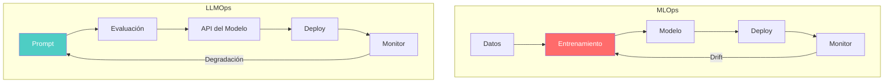
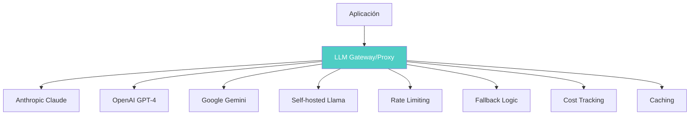
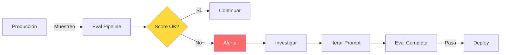

# LLMOps — Operaciones para Large Language Models

> [!abstract] Resumen
> *LLMOps* es la ==evolución de MLOps para Large Language Models==. Lo que cambia: normalmente ==no hay loop de entrenamiento==, se gestiona el prompt en lugar del modelo, el desarrollo está ==dirigido por evaluaciones== (*eval-driven development*), y el seguimiento de costes es crítico por modelo de pago por token. El stack de LLMOps incluye versionado de prompts, frameworks de evaluación, observabilidad, gateway/proxy y guardrails. Architect encarna estos principios con sesiones, cost tracking, evals y reportes. ^resumen

---

## De MLOps a LLMOps

Mientras [[mlops-overview|MLOps]] se centra en el ciclo de vida completo de modelos entrenados — desde la gestión de datos hasta el reentrenamiento — *LLMOps* opera sobre una premisa diferente: el modelo ya está entrenado y se accede vía API.



> [!warning] Cambios fundamentales
> El shift de MLOps a LLMOps no es solo terminológico. Cambia:
> - **El artefacto principal**: De modelo entrenado a ==prompt + configuración==
> - **El loop de iteración**: De reentrenamiento a refinamiento de prompts
> - **La estructura de costes**: De GPU/hora a ==tokens consumidos==
> - **La evaluación**: De métricas numéricas a evaluación de ==calidad textual==
> - **La cadena de suministro**: De control total a ==dependencia de proveedores==

---

## Qué cambia respecto a MLOps

### 1. Sin loop de entrenamiento (normalmente)

En LLMOps estándar no se entrena el modelo. Se usa un modelo pre-entrenado (Claude, GPT-4, Llama) vía API o self-hosted. Excepciones:

> [!info] Excepciones donde sí hay entrenamiento
> - *Fine-tuning*: Ajuste del modelo con datos propios
> - *RLHF/DPO*: Alineamiento con preferencias humanas
> - *LoRA/QLoRA*: Adaptación eficiente con pocos parámetros
> - *Distillation*: Crear modelos más pequeños desde uno grande
>
> Pero incluso en estos casos, el prompt sigue siendo el artefacto operativo principal.

### 2. Gestión de prompts en lugar de modelos

El prompt es código que afecta directamente al comportamiento del sistema. Debe versionarse, testearse y desplegarse con el mismo rigor que cualquier otro artefacto. Ver [[prompt-versioning]] para estrategias detalladas.

| MLOps | ==LLMOps== |
|---|---|
| `model.pkl` → Model Registry | `prompt.yaml` → ==Prompt Registry== |
| Hiperparámetros | Temperature, top_p, max_tokens |
| Feature engineering | ==Prompt engineering== |
| Training data versioning | ==Prompt version + eval data versioning== |
| A/B test de modelos | A/B test de ==prompts== |

### 3. Desarrollo dirigido por evaluaciones

> [!tip] Eval-Driven Development
> En LLMOps, las evaluaciones (*evals*) son el equivalente a los tests en desarrollo de software:
> 1. **Definir** el comportamiento esperado (eval cases)
> 2. **Ejecutar** el prompt contra los eval cases
> 3. **Medir** la calidad con métricas definidas
> 4. **Iterar** el prompt hasta cumplir umbrales
> 5. **Desplegar** solo si las evals pasan

> [!example]- Suite de evaluación para LLMOps
> ```python
> # evals/eval_suite.py
> from dataclasses import dataclass
> from typing import Callable
>
> @dataclass
> class EvalCase:
>     name: str
>     input: str
>     expected: str | None = None
>     criteria: list[str] = None
>     max_tokens: int = 500
>
> @dataclass
> class EvalResult:
>     case: EvalCase
>     output: str
>     scores: dict[str, float]
>     passed: bool
>     cost_usd: float
>     latency_ms: float
>
> class EvalSuite:
>     def __init__(self, name: str, threshold: float = 0.8):
>         self.name = name
>         self.threshold = threshold
>         self.cases: list[EvalCase] = []
>         self.judges: list[Callable] = []
>
>     def add_case(self, case: EvalCase):
>         self.cases.append(case)
>
>     def add_judge(self, judge: Callable):
>         self.judges.append(judge)
>
>     async def run(self, prompt_template: str, model: str) -> list[EvalResult]:
>         results = []
>         for case in self.cases:
>             prompt = prompt_template.format(input=case.input)
>             output = await call_model(model, prompt, case.max_tokens)
>
>             scores = {}
>             for judge in self.judges:
>                 score = await judge(case, output)
>                 scores[judge.__name__] = score
>
>             avg_score = sum(scores.values()) / len(scores)
>             results.append(EvalResult(
>                 case=case,
>                 output=output,
>                 scores=scores,
>                 passed=avg_score >= self.threshold,
>                 cost_usd=calculate_cost(prompt, output, model),
>                 latency_ms=get_latency()
>             ))
>
>         return results
>
>     def summary(self, results: list[EvalResult]) -> dict:
>         passed = sum(1 for r in results if r.passed)
>         total_cost = sum(r.cost_usd for r in results)
>         avg_latency = sum(r.latency_ms for r in results) / len(results)
>         return {
>             "suite": self.name,
>             "total": len(results),
>             "passed": passed,
>             "pass_rate": passed / len(results),
>             "total_cost_usd": total_cost,
>             "avg_latency_ms": avg_latency
>         }
> ```

### 4. Seguimiento de costes

A diferencia de MLOps donde el coste principal es el compute de GPU, en LLMOps ==cada request tiene un coste directo en tokens==.

> [!danger] Costes descontrolados en LLMOps
> Un prompt mal diseñado puede multiplicar costes x10:
> - Prompt largo + output largo = más tokens = más coste
> - Reintentos sin backoff = coste duplicado
> - Sin cache = recalcular respuestas idénticas
> - Sin límites = un loop puede consumir presupuesto completo
>
> Ver [[cost-optimization]] para estrategias de mitigación.

### 5. Gestión de proveedores



---

## El stack de LLMOps

### 1. Versionado de prompts (*Prompt Versioning*)

> [!tip] Herramientas de versionado de prompts
> | Herramienta | Enfoque | ==Fortaleza== |
> |---|---|---|
> | Git (archivos) | Prompts como código | ==Control total== |
> | Langfuse | Database-backed | UI de gestión |
> | Braintrust | Evals integradas | ==Eval + versioning== |
> | PromptLayer | Logging + versioning | Observabilidad |
> | Pezzo | Open-source | Self-hosted |

Ver [[prompt-versioning]] para estrategias en profundidad.

### 2. Frameworks de evaluación

Los frameworks de evaluación son la columna vertebral de LLMOps. Permiten medir la calidad de las respuestas de forma sistemática.

> [!example]- Configuración de evaluación con Braintrust
> ```typescript
> import { Eval } from "braintrust";
>
> Eval("mi-agente-qa", {
>   data: () => [
>     {
>       input: "¿Cuál es la capital de Francia?",
>       expected: "París"
>     },
>     {
>       input: "Explica la fotosíntesis en 2 frases",
>       expected: null, // Evaluación por criterios, no exact match
>       metadata: { criteria: ["accuracy", "conciseness"] }
>     }
>   ],
>   task: async (input) => {
>     const response = await callAgent(input);
>     return response.text;
>   },
>   scores: [
>     Factuality,      // ¿Es factualmente correcto?
>     Relevance,       // ¿Es relevante a la pregunta?
>     Conciseness,     // ¿Es conciso?
>     Safety           // ¿Es seguro?
>   ]
> });
> ```

### 3. Observabilidad

La observabilidad en LLMOps va más allá del logging tradicional. Se necesita rastrear cada interacción con el modelo.

| Señal | Qué monitorizar | ==Herramientas== |
|---|---|---|
| Traces | Cadena completa de llamadas | ==Langfuse, Langsmith, Arize== |
| Métricas | Latencia, tokens, coste | Prometheus, Datadog |
| Logs | Inputs/outputs del modelo | ELK, Loki |
| Feedback | Valoraciones de usuarios | Custom, Langfuse |

### 4. Gateway/Proxy

El *LLM Gateway* es un componente central que actúa como intermediario entre la aplicación y los proveedores de LLM.

> [!info] Funciones del LLM Gateway
> - **Rate limiting**: Control de requests por segundo/minuto
> - **Fallback**: Si un proveedor falla, usar otro automáticamente
> - **Load balancing**: Distribuir carga entre múltiples API keys
> - **Caching**: Cache semántico de respuestas similares
> - **Cost tracking**: Contabilizar tokens y costes por tenant/proyecto
> - **Guardrails**: Filtrado de contenido antes/después del modelo

### 5. Guardrails

Los *guardrails* son validaciones que se ejecutan antes y después de cada llamada al modelo para garantizar seguridad y calidad. [[vigil-overview|Vigil]] proporciona capacidades de guardrails en el ecosistema.

---

## Cómo architect encarna los principios de LLMOps

[[architect-overview|Architect]] implementa nativamente varios principios de LLMOps:

### Sesiones y estado

> [!success] Gestión de sesiones en architect
> - Cada ejecución de architect es una sesión con ID único
> - Las sesiones capturan todo el contexto: prompts, respuestas, costes
> - Auto-save permite recuperación ante crashes ([[disaster-recovery-ia]])
> - El historial de sesiones es rastreable para auditoría

### Cost Tracking

Architect implementa un `CostTracker` que registra el coste por paso del pipeline.

> [!example]- CostTracker por paso
> ```json
> {
>   "session_id": "sess_abc123",
>   "pipeline": "build-feature",
>   "steps": [
>     {
>       "name": "analyze-requirements",
>       "model": "claude-sonnet-4-20250514",
>       "input_tokens": 3420,
>       "output_tokens": 1250,
>       "cost_usd": 0.0189,
>       "cached_tokens": 1200,
>       "cache_savings_usd": 0.0036
>     },
>     {
>       "name": "generate-code",
>       "model": "claude-sonnet-4-20250514",
>       "input_tokens": 8900,
>       "output_tokens": 4500,
>       "cost_usd": 0.0585,
>       "cached_tokens": 3420,
>       "cache_savings_usd": 0.0103
>     }
>   ],
>   "total_cost_usd": 0.0774,
>   "total_savings_usd": 0.0139,
>   "budget_remaining_usd": 4.9226
> }
> ```

### Evaluaciones y reportes

Architect genera reportes en múltiples formatos:

| Formato | Uso | ==Integración== |
|---|---|---|
| JSON | Procesamiento automatizado | ==CI/CD pipelines== |
| Markdown | Documentación humana | Obsidian, wikis |
| GitHub PR Comment | Revisión de código | ==Pull requests== |

### Control de presupuesto

El flag `--budget` de architect implementa el principio de LLMOps de control de costes:

```bash
# Limitar el coste total de la sesión a $5
architect run pipeline.yaml --budget 5.00 --mode yolo

# Si se alcanza el presupuesto, architect termina con exit code 5 (TIMEOUT)
```

### Prompt caching

Architect soporta *prompt caching* tanto de Anthropic como de OpenAI, reduciendo costes y latencia en prompts repetitivos. Ver [[cost-optimization]] para detalles.

---

## Herramientas específicas de LLMOps

> [!tip] Stack recomendado por escenario
>
> **Startup / equipo pequeño:**
> - Prompts en Git + evaluaciones con pytest
> - Langfuse (open-source) para observabilidad
> - architect con `--budget` para control de costes
>
> **Empresa / equipo grande:**
> - Braintrust para eval + versioning
> - LiteLLM como proxy/gateway
> - Datadog/Arize para observabilidad enterprise
> - licit para compliance regulatorio

### Tabla comparativa de herramientas

| Categoría | Herramienta | Tipo | ==Caso de uso principal== |
|---|---|---|---|
| Eval | Braintrust | SaaS | ==Eval-driven development== |
| Eval | DeepEval | Open-source | Testing en CI |
| Observabilidad | Langfuse | Open-source | ==Tracing + prompts== |
| Observabilidad | Langsmith | SaaS | Ecosistema LangChain |
| Observabilidad | Arize Phoenix | Open-source | ==Análisis de traces== |
| Gateway | LiteLLM | Open-source | ==Multi-provider proxy== |
| Gateway | Portkey | SaaS | Enterprise gateway |
| Guardrails | Guardrails AI | Open-source | Validación de output |
| Guardrails | NeMo Guardrails | Open-source | ==NVIDIA ecosystem== |

---

## Patrones de LLMOps en producción

### Patrón: Evaluación continua



### Patrón: Fallback de proveedores

> [!warning] Resiliencia multi-proveedor
> Depender de un solo proveedor de LLM es un *single point of failure*. Un patrón robusto:
> 1. Intento primario: Claude (Anthropic)
> 2. Fallback 1: GPT-4 (OpenAI) — si Anthropic falla
> 3. Fallback 2: Llama self-hosted — si ambos fallan
> 4. Degradación: Respuesta cacheada o mensaje de error amigable

### Patrón: Cost-aware routing

Dirigir requests al modelo más barato que pueda manejar la tarea:

```python
def route_request(task_complexity: str, budget_remaining: float):
    if task_complexity == "simple" or budget_remaining < 1.0:
        return "claude-haiku"  # Barato y rápido
    elif task_complexity == "medium":
        return "claude-sonnet"  # Balance coste/calidad
    else:
        return "claude-opus"  # Máxima calidad
```

---

## Relación con el ecosistema

LLMOps proporciona el marco operativo para todas las herramientas del ecosistema cuando operan sobre LLMs:

- **[[intake-overview|Intake]]**: Opera como componente LLMOps al generar especificaciones desde issues en CI — su uso de LLMs para parsear lenguaje natural requiere prompt versioning y eval
- **[[architect-overview|Architect]]**: Es la implementación más directa de principios LLMOps del ecosistema: sesiones con cost tracking, prompt caching, reportes estructurados y budget enforcement con `--budget`
- **[[vigil-overview|Vigil]]**: Actúa como guardrail en el stack de LLMOps, escaneando prompts y configuraciones por vulnerabilidades antes del despliegue
- **[[licit-overview|Licit]]**: Añade la capa de compliance que LLMOps requiere para operación regulada — verificación de proveniencia y cumplimiento normativo

---

## Enlaces y referencias

> [!quote]- Bibliografía y recursos
> - Shankar, V. et al. "Operationalizing Machine Learning: An Interview Study." USENIX, 2022. [^1]
> - Anthropic. "Building production LLM applications." 2024. [^2]
> - a16z. "Emerging Architectures for LLM Applications." 2023. [^3]
> - Langfuse Documentation. "LLMOps with Langfuse." 2024. [^4]
> - Braintrust. "Eval-Driven Development." 2024. [^5]

[^1]: Estudio empírico sobre los retos de poner ML en producción, precursor de LLMOps
[^2]: Guía de Anthropic sobre construcción de aplicaciones LLM en producción
[^3]: Análisis de a16z sobre arquitecturas emergentes para aplicaciones LLM
[^4]: Documentación de Langfuse como plataforma open-source de LLMOps
[^5]: Artículo fundacional sobre desarrollo dirigido por evaluaciones para LLMs
